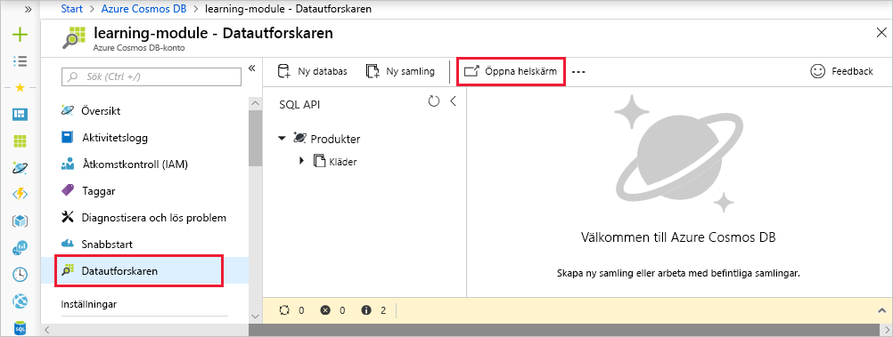
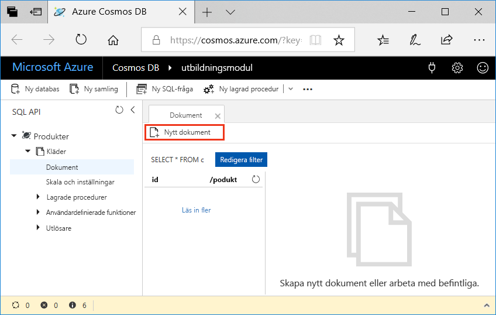
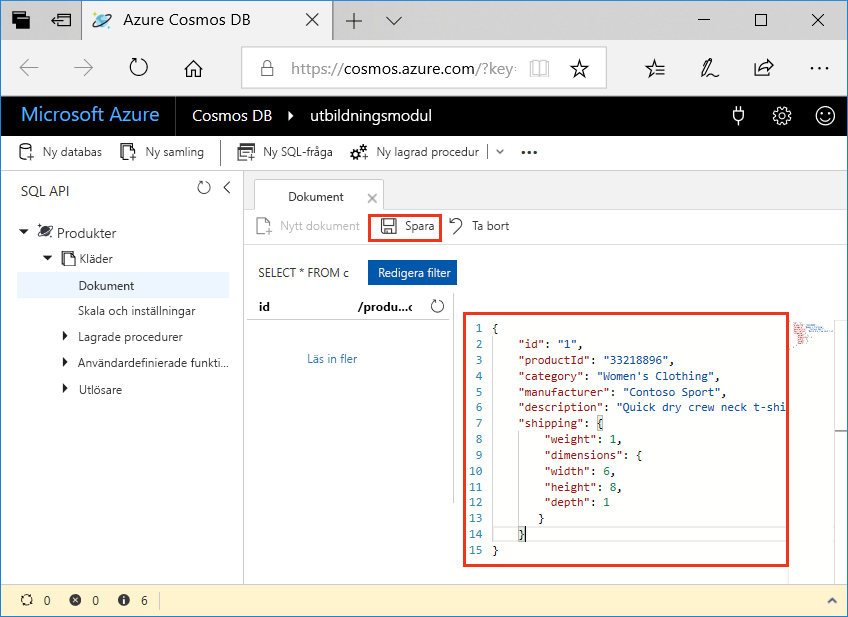

<span data-ttu-id="d6319-101">Att lägga till data i din Azure Cosmos DB-databas är enkelt.</span><span class="sxs-lookup"><span data-stu-id="d6319-101">Adding data to your Azure Cosmos DB database is simple.</span></span> <span data-ttu-id="d6319-102">Öppna Azure Portal, navigera till databasen och använd Datautforskaren till att lägga till JSON-dokument i databasen.</span><span class="sxs-lookup"><span data-stu-id="d6319-102">You open the Azure portal, navigate to your database, and use the Data Explorer to add JSON documents to the database.</span></span> <span data-ttu-id="d6319-103">Det finns mer avancerade sätt att lägga till data, men vi börjar här eftersom Datautforskaren är ett bra verktyg för att bekanta sig med de egenskaper och funktioner som tillhandahålls av Azure Cosmos DB.</span><span class="sxs-lookup"><span data-stu-id="d6319-103">There are more advanced ways to add data, but we'll start here because the Data Explorer is a great tool to get you acquainted with the inner workings and functionality provided by Azure Cosmos DB.</span></span>

## <a name="what-is-the-data-explorer"></a><span data-ttu-id="d6319-104">Vad är Datautforskaren?</span><span class="sxs-lookup"><span data-stu-id="d6319-104">What is the Data Explorer?</span></span>
<span data-ttu-id="d6319-105">Datautforskaren i Azure Cosmos DB är ett verktyg som ingår i Azure-portalen som används för att hantera data som lagras i en Azure Cosmos DB.</span><span class="sxs-lookup"><span data-stu-id="d6319-105">The Azure Cosmos DB Data Explorer is a tool included in the Azure portal that is used to manage data stored in an Azure Cosmos DB.</span></span> <span data-ttu-id="d6319-106">Det har ett användargränssnitt för visning och navigering av datasamlingar samt för redigering av dokument i databasen, frågekörning mot data samt för att skapa och köra lagrade procedurer.</span><span class="sxs-lookup"><span data-stu-id="d6319-106">It provides a UI for viewing and navigating data collections, as well as for editing documents within the database, querying data, and creating and running stored procedures.</span></span>

## <a name="add-data-using-the-data-explorer"></a><span data-ttu-id="d6319-107">Lägga till data med Datautforskaren</span><span class="sxs-lookup"><span data-stu-id="d6319-107">Add data using the Data Explorer</span></span>

1. <span data-ttu-id="d6319-108">Logga in på [Azure Portal för Sandbox](https://portal.azure.com/learn.docs.microsoft.com?azure-portal=true) med samma konto som du aktiverade sandbox-miljön med.</span><span class="sxs-lookup"><span data-stu-id="d6319-108">Sign into the [Azure portal for sandbox](https://portal.azure.com/learn.docs.microsoft.com?azure-portal=true) using the same account you activated the sandbox with.</span></span>

    > [!IMPORTANT]
    > <span data-ttu-id="d6319-109">Logga in på Azure Portal och sandbox-miljön med samma konto.</span><span class="sxs-lookup"><span data-stu-id="d6319-109">Login to the Azure portal and the sandbox with the same account.</span></span>
    >
    > <span data-ttu-id="d6319-110">Logga in på Azure Portal med länken ovan för att se till att du är ansluten till sandbox-miljön som ger åtkomst till en Concierge-prenumeration.</span><span class="sxs-lookup"><span data-stu-id="d6319-110">Login to the Azure portal using the link above to ensure you are connected to the sandbox, which provides access to a Concierge Subscription.</span></span>

1. <span data-ttu-id="d6319-111">Klicka på **Alla tjänster** > **Databaser** > **Azure Cosmos DB**.</span><span class="sxs-lookup"><span data-stu-id="d6319-111">Click **All services** > **Databases** > **Azure Cosmos DB**.</span></span> <span data-ttu-id="d6319-112">Välj ditt konto, klicka på **Datautforskaren** och klicka sedan på **Öppna i helskärmsläge**.</span><span class="sxs-lookup"><span data-stu-id="d6319-112">Then select your account, click **Data Explorer**, and then click **Open Full Screen**.</span></span>

   

2. <span data-ttu-id="d6319-114">I rutan **Öppna i helskärmsläge** klickar du på **Öppna**.</span><span class="sxs-lookup"><span data-stu-id="d6319-114">In the **Open Full Screen** box, click **Open**.</span></span>

    <span data-ttu-id="d6319-115">Webbläsaren visar den nya Datautforskaren i helskärm, vilket ger dig mer utrymme och en dedikerad miljö för att arbeta med databasen.</span><span class="sxs-lookup"><span data-stu-id="d6319-115">The web browser displays the new full-screen Data Explorer, which gives you more space and a dedicated environment for working with your database.</span></span>

3. <span data-ttu-id="d6319-116">För att skapa ett nytt JSON-dokument går du till SQL API-fönsterrutan, expanderar **Kläder**, klickar på **Dokument** och sedan på **Nytt dokument**.</span><span class="sxs-lookup"><span data-stu-id="d6319-116">To create a new JSON document, in the SQL API pane, expand **Clothing**, click **Documents**, then click **New Document**.</span></span>

   

4. <span data-ttu-id="d6319-118">Lägg nu till ett dokument i samlingen med följande struktur.</span><span class="sxs-lookup"><span data-stu-id="d6319-118">Now, add a document to the collection with the following structure.</span></span> <span data-ttu-id="d6319-119">Det är bara att kopiera och klistra in följande kod i fliken **Dokument** så att det befintliga innehållet överskrivs:</span><span class="sxs-lookup"><span data-stu-id="d6319-119">Just copy and paste the following code into the **Documents** tab, overwriting the current content:</span></span>

     ```json
    {
        "id": "1",
        "productId": "33218896",
        "category": "Women's Clothing",
        "manufacturer": "Contoso Sport",
        "description": "Quick dry crew neck t-shirt",
        "price": "14.99",
        "shipping": {
            "weight": 1,
            "dimensions": {
            "width": 6,
            "height": 8,
            "depth": 1
           }
        }
    }
     ```

5. <span data-ttu-id="d6319-120">När du har lagt till JSON på fliken **Dokument** klickar du på **Spara**.</span><span class="sxs-lookup"><span data-stu-id="d6319-120">Once you've added the JSON to the **Documents** tab, click **Save**.</span></span>

    

6. <span data-ttu-id="d6319-122">Skapa och spara ett dokument till genom att klicka på **Nytt dokument** igen, kopiera följande JSON-objekt till Datautforskaren och klicka på **Spara**.</span><span class="sxs-lookup"><span data-stu-id="d6319-122">Create and save one more document clicking **New Document** again, and copying the following JSON object into Data Explorer and clicking **Save**.</span></span>

     ```json
    {
        "id": "2",
        "productId": "33218897",
        "category": "Women's Outerwear",
        "manufacturer": "Contoso",
        "description": "Black wool pea-coat",
        "price": "49.99",
        "shipping": {
            "weight": 2,
            "dimensions": {
            "width": 8,
            "height": 11,
            "depth": 3
           }
        }
    }
     ```

7. <span data-ttu-id="d6319-123">Bekräfta att dokumenten har sparats genom att klicka på **Dokument** i den vänstra menyn.</span><span class="sxs-lookup"><span data-stu-id="d6319-123">Confirm the documents have been saved by clicking **Documents** on the left-hand menu.</span></span>

    <span data-ttu-id="d6319-124">Datautforskaren visar de två dokumenten på fliken **Dokument**.</span><span class="sxs-lookup"><span data-stu-id="d6319-124">Data Explorer displays the two documents in the **Documents** tab.</span></span>

<span data-ttu-id="d6319-125">I den här enheten har du med hjälp av Datautforskaren lagt till två dokument i databasen, som vart och ett representerar en produkt i din produktkatalog.</span><span class="sxs-lookup"><span data-stu-id="d6319-125">In this unit, you added two documents, each representing a product in your product catalog, to your database by using the Data Explorer.</span></span> <span data-ttu-id="d6319-126">Datautforskaren är ett bra sätt att skapa dokument, ändra dokument och komma igång med Azure Cosmos DB.</span><span class="sxs-lookup"><span data-stu-id="d6319-126">The Data Explorer is a good way to create documents, modify documents, and get started with Azure Cosmos DB.</span></span>
