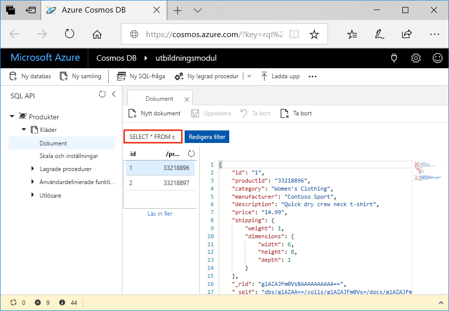
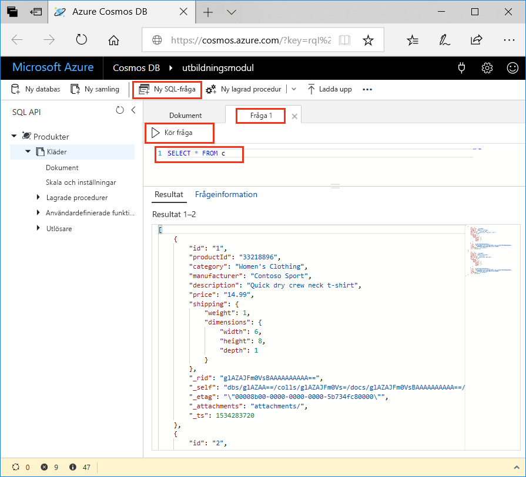
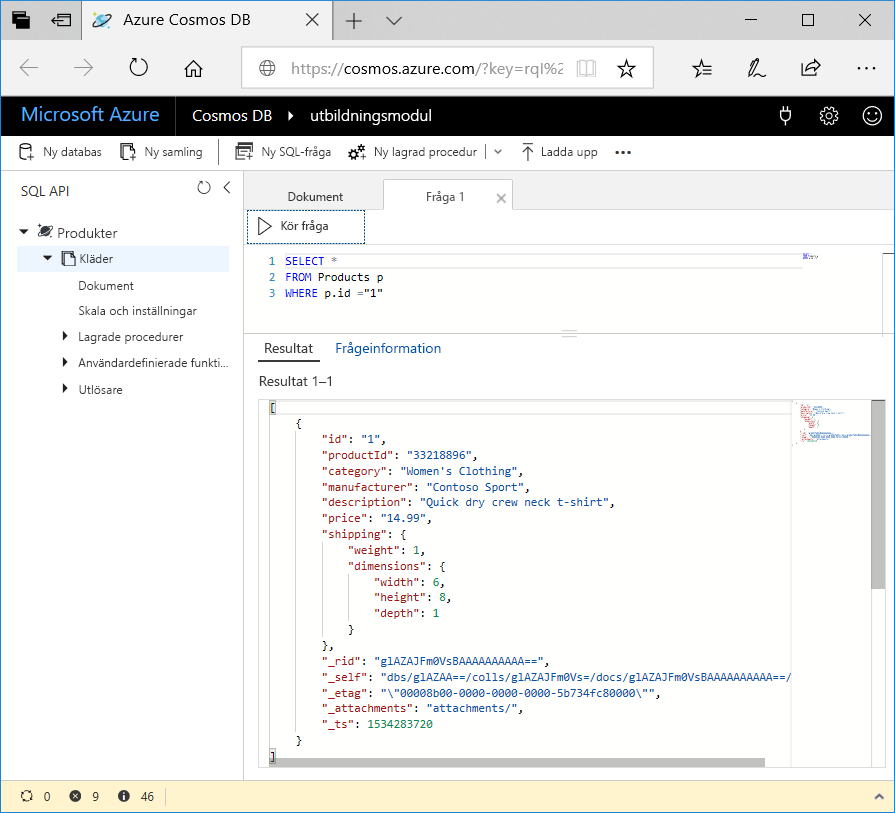

<span data-ttu-id="c5af9-101">Nu när du har lärt dig om vilka typer av frågor du kan skapa ska vi använda Datautforskaren i Azure-portalen för att hämta och filtrera dina produktdata.</span><span class="sxs-lookup"><span data-stu-id="c5af9-101">Now that you've learned about what kinds of queries you can create, let's use the Data Explorer in the Azure portal to retrieve and filter your product data.</span></span>

<span data-ttu-id="c5af9-102">Observera i fönstret för Datautforskaren att frågan på fliken **Dokument** som standard är inställd på `SELECT * FROM c` enligt vad som visas på följande bild.</span><span class="sxs-lookup"><span data-stu-id="c5af9-102">In your Data Explorer window, note that by default, the query on the **Document** tab is set to `SELECT * FROM c` as shown in the following image.</span></span> <span data-ttu-id="c5af9-103">Den här standardfrågan hämtar och visar alla dokument i samlingen.</span><span class="sxs-lookup"><span data-stu-id="c5af9-103">This default query retrieves and displays all documents in the collection.</span></span>



## <a name="create-a-new-query"></a><span data-ttu-id="c5af9-105">Skapa en ny fråga</span><span class="sxs-lookup"><span data-stu-id="c5af9-105">Create a new query</span></span>

1. <span data-ttu-id="c5af9-106">I datautforskaren klickar du på fliken **Ny SQL-fråga**.</span><span class="sxs-lookup"><span data-stu-id="c5af9-106">In Data Explorer, click **New SQL Query**.</span></span> <span data-ttu-id="c5af9-107">Observera att standardfrågan för fliken för nya **Fråga 1** åter är `SELECT * from c`, vilket returnerar alla dokument i samlingen.</span><span class="sxs-lookup"><span data-stu-id="c5af9-107">Note that the default query on the new  **Query 1** tab is again `SELECT * from c`, which will return all documents in the collection.</span></span> 

1. <span data-ttu-id="c5af9-108">Klicka på **Kör fråga**.</span><span class="sxs-lookup"><span data-stu-id="c5af9-108">Click **Execute Query**.</span></span> <span data-ttu-id="c5af9-109">Frågan returnerar alla resultat i databasen.</span><span class="sxs-lookup"><span data-stu-id="c5af9-109">This query returns all results in the database.</span></span>

    

2. <span data-ttu-id="c5af9-111">Nu ska vi köra några av frågorna som diskuterades i föregående kursdel.</span><span class="sxs-lookup"><span data-stu-id="c5af9-111">Now, let's run some of the queries discussed in the previous unit.</span></span> <span data-ttu-id="c5af9-112">Ta bort `SELECT * from c` på frågefliken, kopiera och klistra in följande fråga och klicka sedan på **Kör fråga**:</span><span class="sxs-lookup"><span data-stu-id="c5af9-112">On the query tab, delete `SELECT * from c`, copy and paste the following query, and then click **Execute Query**:</span></span>

    ```sql
    SELECT * 
    FROM Products p 
    WHERE p.id ="1"
    ```

    <span data-ttu-id="c5af9-113">Resultaten returnerar produkten vars `productId` är 1.</span><span class="sxs-lookup"><span data-stu-id="c5af9-113">The results return the product whose `productId` is 1.</span></span>

    

3. <span data-ttu-id="c5af9-115">Ta bort den föregående frågan, kopiera och klistra in följande fråga, och klicka på **Kör fråga**.</span><span class="sxs-lookup"><span data-stu-id="c5af9-115">Delete the previous query, copy and paste the following query, and click **Execute Query**.</span></span> <span data-ttu-id="c5af9-116">Den här frågan returnerar pris, beskrivning och produkt-ID för alla produkter, ordnade efter pris i stigande ordning.</span><span class="sxs-lookup"><span data-stu-id="c5af9-116">This query returns the price, description, and product ID for all products, ordered by price, in ascending order.</span></span>
 
    ```sql
    SELECT p.price, p.description, p.productId 
    FROM Products p 
    ORDER BY p.price ASC
    ```

## <a name="summary"></a><span data-ttu-id="c5af9-117">Sammanfattning</span><span class="sxs-lookup"><span data-stu-id="c5af9-117">Summary</span></span>

<span data-ttu-id="c5af9-118">Nu har du slutfört några grundläggande frågor på dina data i Azure Cosmos DB.</span><span class="sxs-lookup"><span data-stu-id="c5af9-118">You have now completed some basic queries on your data in Azure Cosmos DB.</span></span> 