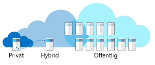

Anta att du arbetar på ett hälso- och sjukvårdsföretag.Imagine you work at a healthcare company. Du har äldre system, affärssystem och framtida planer för nya system.You have legacy systems, line of business systems, and future plans for new systems. Du har hört att det finns fördelar med att använda molntjänster.You've heard there are advantages to using cloud computing. Hur väljer du den bästa distributionsmodellen för olika lösningar? Ska det vara offentligt moln, privat moln eller hybridmoln?How do you choose the best deployment model for different solutions: public, private, or hybrid cloud?

## Vad är molntjänster?What is cloud computing?

Molntjänster innebär etableringen av tjänster och program på begäran via Internet.Cloud computing is the provisioning of services and applications on demand over the internet. Servrar, program, data och andra resurser tillhandahålls som en tjänst.Servers, applications, data, and other resources are provided as a service. 

För användaren är informationen om tjänsterna abstrakt.To the user, the details of the services are abstracted. Du kan snabbt etablera beräkningsresurser och använda tjänsten med minimal hantering.You can quickly provision computing resources and use the service with minimal management. Det är fel att tro att molntjänster är ett datacenter som är tillgängligt via Internet.You shouldn't think of cloud computing as a datacenter available through the internet. Molntjänster använder virtualisering, maskinvara och automatiserade processer för att kunna erbjuda en självbetjäningsupplevelse till kunder som liknar ett offentligt verktyg.Cloud computing uses virtualization, commodity hardware, and automated processes to provide a self-service user experience to customers similar to a public utility.

Det finns tre distributionsmodeller för molntjänster: offentliga moln, privata moln och hybridmoln.There are three deployment models for cloud computing: public cloud, private cloud, and hybrid cloud. Följande illustration visar en översikt över de här distributionsmodellerna.The following illustration shows an overview of these deployment models.

!!!!!! Video TC-008 platshållare !!!Video TC-008 placeholder !!! 

> [!VIDEO https://channel9.msdn.com/Series/History/The-History-of-Microsoft-1995/player]

## Offentligt molnPublic cloud

Offentliga moln är det vanligaste sättet att distribuera molntjänster på.Public clouds are the most common way of deploying cloud computing. Tjänsterna erbjuds via offentligt Internet och är tillgängliga för alla som vill köpa dem.Services are offered over the public internet and available to anyone who wants to purchase them. Molnresurser, till exempel servrar och lagring, ägs och drivs av en extern molntjänstleverantör och tillhandahålls via Internet.The cloud resources such as servers and storage are owned and operated by a third-party cloud service provider and delivered over the internet. Tjänster kan erbjudas utan kostnad eller mot en avgift på begäran, vilket innebär att kunderna betalar per användning för de CPU-cykler, det lagringsutrymme eller den bandbredd de nyttjar.Services may be free or sold on demand, allowing customers to pay only per usage for the CPU cycles, storage, or bandwidth they consume. Microsoft Azure är ett exempel på ett offentligt moln.Microsoft Azure is an example of a public cloud. 

Låt oss anta att din arbetsplats behöver en registreringswebbplats.Let's imagine your healthcare company needs an enrollment website. Webbplatsen behöver kunna skalas och vara dynamisk när registreringen når höga nivåer vid olika tidpunkter under året.The site needs to scale and be responsive during peak enrollment various times during the year. Dina kunder får åtkomst till webbplatsen från globala platser.Your customers access the site from global locations. Du kan använda det offentliga molnet för att automatiskt skala upp när du behöver möta efterfrågan vid registreringstoppar.You can use the public cloud to automatically scale up to meet demand at peak enrollment. När trafiken är låg kan webbplatsen skalas ned för att spara kostnader.When site traffic is low, your site can scale down to save costs. Webbplatsen är dynamisk vid höga nivåer och du betalar bara för fler resurser när de behövs.Your site is responsive at peak demand, and you only pay for more resources when needed. Du kan också distribuera din webbplats i olika geografiska områden för att förbättra tillförlitligheten och svarstiderna.You can also deploy your website in multiple geographic regions to increase reliability and responsiveness.

Under utvecklingen av din webbplats vill utvecklarna skapa flera utvecklingsmiljöer för att påskynda utvecklingsprocessen.During the development of your website, developers want to create multiple development environments to speed their development process. Utvecklarna kan använda det offentliga molnet för att snabbt etablera virtuella datorer i begränsade miljöer för att utveckla en lösning.Developers can use the public cloud to quickly provision virtual machines for sandboxed environments to develop a solution. När utvecklarna inte behöver miljön längre kan de ta bort den.When the developers no longer need an environment, they can delete it.

### Varför ska man använda ett offentligt moln?Why public cloud?

Offentliga moln kan distribueras snabbare än en lokal infrastruktur och med en nästan oändligt skalbar plattform.Public clouds can be deployed faster than on-premises infrastructures and with an almost infinitely scalable platform. Samtliga anställda på ett företag kan använda samma program från valfritt kontor eller avdelning och med en valfri enhet så länge de kan ansluta till Internet.Every employee of a company can use the same application from any office or branch using their device of choice as long as they can access the internet. 

Exempel på varför du bör använda ett offentligt moln:Examples of why you would use public cloud:

- **Användning av tjänsten på begäran eller med prenumeration:** Med en modell på begäran eller en prenumerationsmodell betalar du för den del av processorn, lagringen och andra resurser som du använder eller reserverar.**Service consumption through on-demand or subscription model:** The on-demand or subscription model allows you to pay for the portion of CPU, storage, and other resources that you use or reserve.
- **Ingen inledande investering av maskinvara:** Inget krav på att köpa, hantera och underhålla lokal maskinvara och infrastruktur.**No up-front investment of hardware:** No requirement to purchase, manage, and maintain on-premises hardware and application infrastructure. Molntjänstleverantören har ansvar för all hantering och underhåll av systemet.The cloud service provider is held responsible for all management and maintenance of the system. 
- **Automatisering:** Etablera resurser snabbt i infrastrukturen med hjälp av en webbportal, skript eller via automatisering.**Automation:** Quickly provision infrastructure resources using a web portal, scripts, or via automation. 
- **Geografisk spridning:** Lagra data nära dina användare eller på önskade platser utan att behöva underhålla dina egna datacenter.**Geographic dispersity:** Store data near your users, or in desired locations without having to maintain your own datacenters.
- **Minskat maskinvaruunderhåll:** Internetleverantören ansvarar för maskinvaruunderhållet.**Reduced hardware maintenance:** The service provider is responsible for hardware maintenance.

## Privat molnPrivate cloud

Ett privat moln består av beräkningsresurser som uteslutande används av användare från ett företag eller organisation.A private cloud consists of computing resources used exclusively by users from one business or organization. Det kan finnas fysiskt i organisationens lokala datacenter eller hanteras av en tredje part.It can be physically located at your organization’s on-site datacenter, or it can be hosted by a third-party service provider. Det privata molnet är inte ett annat namn på ett traditionellt lokalt datacenter.The term private cloud should not be considered a rebranding of traditional on-premises datacenters. Ett privat moln använder den lokala infrastrukturen och tjänster för att tillhandahålla liknande fördelar som det offentliga molnet.A private cloud uses on-premises infrastructure and services to provide similar benefits of the public cloud. Det använder en abstraktionsplattform för att tillhandahålla *molnliknande* tjänster, till exempel Kubernetes-kluster eller en komplett molnmiljö som Azure Stack.It uses an abstraction platform to provide *cloud-like* services such as Kubernetes clusters or a complete cloud environment like Azure Stack. Organisationen är ansvarig för inköp, konfiguration och underhåll av maskinvara.The organization is responsible for the purchase, configuration, and maintenance of the hardware. Kommunikationen mellan systemen sker vanligtvis i nätverksinfrastrukturen som företaget äger och underhåller.Communication between the systems is usually on the network infrastructure that the business owns and maintains. Det kan exempelvis vara ett privat internt nätverk eller en dedikerad fiberoptisk anslutning mellan byggnader.For example, a private internal network or a dedicated fiber optic connection between buildings.

Anta att du arbetar på sjuk- och hälsovårdsföretaget och du har ett program som används i ett av dina datacenter.Imagine you work at healthcare company and you have an application that is in use at one of your datacenters. Driftmiljön kan inte replikeras i det offentliga molnet.The operating environment can't be replicated in the public cloud. Du har fått ett nytt krav om att komma åt data på ett annat av dina datacenter.You have a new requirement to access data at another one of your datacenters. Den databas som innehåller datan måste vara kvar på den andra platsen på grund av juridiska skäl.The database containing the data needs to remain at the other site because of regulatory compliance. Det här scenariot är ett privat moln.This scenario is a private cloud. Organisationen har två datacentra.You have two datacenters your organization owns. Du kan använda en offentlig moln-VPN via Internet för att ansluta dina datacentra.You could use a public cloud VPN over the internet to connect the datacenters. Dock anses scenariot vara ett privat moln, eftersom lösningen är privat i organisationen.However, the scenario would be considered a private cloud since the solution is private to the organization.

### Varför ska man använda ett privat moln?Why private cloud?

Ett privat moln kan ge mer flexibilitet åt en organisation.A private cloud can provide more flexibility to an organization. Organisationen kan anpassa molnmiljön för att uppfylla specifika affärsbehov.Your organization can customize its cloud environment to meet specific business needs. Eftersom resurserna inte delas med andra går det att ha höga kontroll- och säkerhetsnivåer.Since resources are not shared with others, high levels of control and security are possible. Med privata moln kan man dessutom få både skalbarhet och effektivitet.Also, private clouds can provide a level of scalability and efficiency.

Exempel på varför du bör använda ett privat moln:Examples of why you would use private cloud:

- **Befintlig miljö:** En befintlig driftsmiljö som inte kan replikeras i det offentliga molnet.**Pre-existing environment:** An existing operating environment that can't be replicated in the public cloud. En stor investering i maskinvara och anställda med lösningskompetens.A large investment in hardware and employees with solution expertise. En stor organisation kan välja att anpassa sina beräkningsresurser.A large organization may choose to commoditize their computing resources.
- **Äldre program:** Verksamhetskritiska äldre program som det inte är enkelt att flytta fysiskt.**Legacy applications:** Business-critical legacy applications that can't easily be physically relocated.
- **Datasuveränitet och säkerhet:** Politiska gränser och juridiska krav kan styra var datan ska finnas fysiskt.**Data sovereignty and security:** Political borders and legal requirements may dictate where data can physically exist.
- **Regelefterlevnad/certifiering:** PCI- eller HIPAA-efterlevnad.**Regulatory compliance / certification:**  PCI or HIPAA compliance. Certifierat lokalt datacenter.Certified on-premises datacenter.

## HybridmolnHybrid cloud

Ett hybridmoln är en beräkningsmiljö som kombinerar ett offentligt moln och ett privat moln genom att data och program kan delas.A hybrid cloud is a computing environment that combines a public cloud and a private cloud by allowing data and applications to be shared between them. När beräknings- och databehandlingsefterfrågan varierar ger hybridmolntjänsterna företaget möjlighet att enkelt skala sina lokala infrastruktur till det offentliga molnet – utan att datacentra från tredje part får tillgång till samtliga data.When computing and processing demand fluctuates, hybrid cloud computing gives businesses the ability to seamlessly scale their on-premises infrastructure up to the public cloud to handle any overflow - without giving third-party datacenters access to the entirety of their data. Företagen får flexibilitet och beräkningskraft från det offentliga molnet för grundläggande och icke-känsliga beräkningsuppgifter, samtidigt som verksamhetskritiska program och data finns kvar lokalt bakom företagets brandvägg.Organizations gain the flexibility and computing power of the public cloud for basic and non-sensitive computing tasks, while keeping business-critical applications and data on-premises, safely behind a company firewall.

Med ett hybridmoln kan man eliminera behovet av att göra direkta investeringar i maskinvara för att hantera tillfälliga trafiktoppar.Using a hybrid cloud helps eliminate the need to make up-front capital expenditures to handle short-term spikes in demand. Man får även flexibilitet att hantera vilka resurser som ska vara lokala och vilka resurser som ska finnas i molnet.It also has the flexibility to manage which resources are local versus resources in the cloud. Företagen betalar bara för resurser som de använder i stället för att behöva köpa in, programmera och underhålla extraresurser och utrustning som kanske inte ens används under långa tidsperioder.Companies pay only for resources they temporarily use instead of having to purchase, program, and maintain additional resources and equipment that could remain idle over long periods of time. Integrering sker vanligtvis via en säker VPN mellan molnleverantörer som Azure och lokala datacentra.Integration is generally through a secure VPN between cloud providers like Azure and on-premises datacenters.

Anta att du arbetar på sjuk- och hälsovårdsföretaget och du har ett program där kunderna kan få åtkomst till sin hälsoinformation.Imagine you work at healthcare company and you have an application where customers can access their healthcare information. Det finns ett regelverk som kräver att datan ska finnas på en fysisk plats.A regulation requires that the data needs to remain at a physical location. Kundwebbplatsen måste kunna vara dynamisk för de olika globala användarna.The customer website needs to be responsive to their many global users.  En lösning kan därför vara att databasen hanteras på ett lokalt datacenter och webbplatsen finns i det offentliga molnet.As a solution, the database could be hosted in an on-premises datacenter and the website could be hosted in the public cloud. En VPN-anslutning används mellan det lokala datacentrat och det offentliga molnet.A VPN is used between the on-premises datacenter and the public cloud. Det här scenariot kan anses vara ett hybridmoln.This scenario would be considered a hybrid cloud.

### Varför ska man använda hybridmoln?Why hybrid cloud?

Med hybridmoln kan din organisation styra och underhålla en privat infrastruktur för känsliga tillgångar.Hybrid cloud allows your organization to control and maintain a private infrastructure for sensitive assets. Det ger dig även flexibilitet att använda fler resurser i det offentliga molnet när du behöver dem.It also gives you the flexibility to take advantage of additional resources in the public cloud when you need them. Med möjligheten att skala till det offentliga molnet betalar du för extra databehandlingskraft enbart när det behövs.With the ability to scale to the public cloud, you pay for extra computing power only when needed. Det kan också underlätta övergången till molnet.It can also ease transitioning to the cloud. Du kan migrera gradvis genom att fasa in arbetsbelastningar över tid.You can migrate gradually by phasing in workloads over time.

Exempel på varför du bör använda hybridmoln:Examples of why you would use hybrid cloud:

- **Befintlig maskinvaruinvestering:** Verksamheten kräver att du använder en befintlig driftsmiljö och maskinvara.**Existing hardware investment:** Business reasons require that you use an existing operating environment and hardware.
- **Juridiska krav:** Regelverk kräver att data ska finnas på en fysisk plats.**Regulatory requirements:** Regulation requires that the data needs to remain at a physical location.
- **Unik driftsmiljö:** Det offentliga molnet kan inte replikera en äldre driftsmiljö.**Unique operating environment:** Public cloud can't replicate a legacy operating environment.
- **Migrering:**: Flytta arbetsbelastningar till molnet över tid.**Migration:** Move workloads to the cloud over time.
