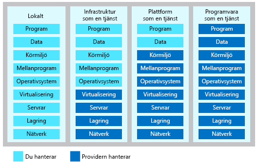

Databehandlingsresurser i molnet levereras som tre olika tjänstmodeller.Cloud computing resources are delivered using three different service models.

- Med **infrastruktur som en tjänst (IaaS)** får du en infrastruktur för omedelbar databehandling som du kan etablera och hantera via internet.**Infrastructure-as-a-service (IaaS)** provides instant computing infrastructure that you can provision and managed over the Internet.
- Med **plattform som en tjänst (PaaS)** får du färdiga utvecklings- och distributionsmiljöer som du kan använda till att leverera egna molntjänster.**Platform as a service (PaaS)** provides ready-made development and deployment environments that you can use to deliver your own cloud services.
- **Programvara som en tjänst (SaaS)** levererar program över internet som en webbaserad tjänst.**Software as a service (SaaS)** delivers applications over the Internet as a web-based service.

När du väljer tjänstmodell ska du fundera på vem som ska ansvara för databehandlingsresursen.When choosing a service model, consider which party should be responsible for the computing resource. I ditt scenario kan du bestämma du hur ansvar du själv vill ha för administrationen.Based on your scenario, you can decide how much shared management responsibility you want.

## IaaSIaaS

Infrastruktur som en tjänst är en infrastruktur för omedelbar databehandling som du etablerar och hanterar via internet.Infrastructure as a service is an instant computing infrastructure, provisioned and managed over the Internet. Med IaaS kan du snabbt skala om resurser för att möta efterfrågan och du betalar bara för det du använder.IaaS enables you to quickly scale resources to meet demand and only pay for what you use. Med IaaS slipper du kostnaderna och besväret med att köpa och hantera egna fysiska servrar och annan infrastruktur i datacentret.IaaS avoids the expense and complexity of buying and managing your own physical servers and other datacenter infrastructure. Varje resurs erbjuds som en separat tjänstkomponent och du *hyr* resursen så länge du behöver den.Each resource is offered as a separate service component, and you *rent* the resource as long as you need it. IaaS är därför mycket flexibelt.As a result, IaaS is very flexible. Du kan etablera vanlig infrastruktur som virtuella datorer, lagring, virtuella undernät, brandväggar och VPN när du ska skapa din lösning.You can provision common infrastructure such as VMs, storage, virtual subnets, firewalls, and VPN's to build a solution. Du behöver inte hantera några fysiska servrar eller enheter.You don't need to manage physical servers and appliances. Du ansvarar dock för konfiguration och administration av komponenterna.However, you are responsible for direct management configuring and managing the components. Du måste till exempel konfigurera brandväggar, uppdatera de virtuella datorernas operativsystem, uppdatera databashanteringssystem och körningsmiljöer.For example, configuring firewalls, updating VM OS's, updating DBMS's, and runtimes.

### Vanliga scenarierCommon scenarios 

Anta att ditt hälsovårdsföretag måste köra en viss version av ett program.Let's imagine your healthcare company has a need to run a special version of desktop software. Programmet stöds bara i en viss version av ett operativsystem och du behöver bara en användare och en licens.The software is only supported on a specific version of an operating system and only one user and license is required. Du kan skapa en virtuell dator med den programvara som behövs.You can create a virtual machine with the required software. Användaren kan ansluta till den virtuella datorn och använda programmet via Fjärrskrivbord.The user can use remote deskop to connect to the virtual machine to use the software.

Vi tänker oss ett annat scenario.Let's imagine another scenario. Dina utvecklingsteam behöver flera unika utvecklingsmiljöer.Your development teams need several unique development environments. Genom utvecklingscykeln måste de testa olika versioner av produkten.Through the development cycle, they need to test various versions of the product. Utvecklarna kan etablera miljöer när det behövs.The developers can provision environments when needed. När en miljö inte längre behövs kan den enkelt tas bort.When an environment is no longer needed, it can be easily deleted.

Här är några andra vanliga scenarier:Some other common scenarios include:

**Driva webbplatser:** Om du vill ha bättre kontroll över driften av en webbplats kan det vara bättre att köra webbplatsen med IaaS istället för med en traditionell värdtjänst.**Website hosting:** If you want more control of hosting a website, running websites using IaaS may be a better option than traditional web hosting.

**Webbappar:** Med IaaS får du all infrastruktur du behöver för att hantera webbappar, som lagring, webb- och programservrar samt nätverksresurser.**Web apps:** IaaS provides all the infrastructure to support web apps, including storage, web and application servers, and networking resources. Organisationer kan snabbt distribuera webbappar med IaaS och enkelt skala om infrastrukturen när efterfrågan på appen ändras.Organizations can quickly deploy web apps on IaaS and easily scale infrastructure up and down when demand for the apps is unpredictable.

**Lagring, säkerhetskopiering och återställning:** Lagringshantering kan vara komplex och kräva stora kapitalinvesteringar, och du behöver kompetent personal som hanterar dina data så att du uppfyller olika juridiska krav.**Storage, backup, and recovery:** Storage management can be complex requiring a large capital investment and skilled staff to manage data and meet legal and compliance requirements. Med IaaS blir det enklare att hantera planering, administration, ändringar i efterfrågan och ökande lagringsbehov.IaaS can help simplify planning, managment, unpredictable demand, and steadily growing storage needs.

**Databehandling med höga prestanda:** Om du har en arbetsbelastning som kräver databehandling med höga prestanda kan du köra arbetsbelastningen i molnet och undvika direktkostnaden för maskinvara, och endast betala för användningen när den behövs.**High-performance computing:** If you have a workload that requires high-performance computing, you can run the workload in the cloud avoiding the up-front cost of the hardware and only pay for the usage when needed. 

**Analys av stordata:** Om du har stora datamängder som kan innehålla viktiga mönster, trender och associationer så kan IaaS kan ge dig tillräcklig beräkningskraft för att bearbeta dina data och hitta dem.**Big data analysis:** If you have large data sets that contain potentially valuable patterns, trends, and associations, IaaS can provide the processing power to mine data sets to locate patterns.

### FördelarAdvantages

**Undvik kapitalutgifter och minska dina löpande kostnader:** Med IaaS slipper du startkostnaden för att konfigurera och hantera ett lokalt datacenter, så det här är ett prisvärt alternativ för nystartade företag och företag som testar nya idéer.**Eliminates capital expense and reduces ongoing cost:** IaaS sidesteps the upfront expense of setting up and managing an on-site datacenter, making it an economical option for start-ups and businesses testing new ideas. När du har bestämt dig för att lansera en ny produkt eller starta ett initiativ kan du ha infrastrukturen som behövs redo på bara några minuter eller timmar, snarare än de dagar eller veckor det skulle ta att konfigurera allt internt.As soon as you’ve decided to launch a new product or initiative, the necessary computing infrastructure can be ready in minutes or hours, rather than the days or weeks—and sometimes months—it could take to set up internally.

**Förbättra verksamhetens kontinuitet och haveriberedskap:** Det kan vara dyrt med hög tillgänglighet, verksamhetskontinuitet och haveriberedskap eftersom du behöver en hel del teknik och personal.**Improves business continuity and disaster recovery:** Achieving high availability, business continuity, and disaster recovery is expensive, since it requires a significant amount of technology and staff. Med rätt servicenivåavtal (SLA) kan IaaS minska de här kostnaderna och ge dig tillgång till program och data som vanligt vid ett haveri eller avbrott.But with the right service level agreement (SLA) in place, IaaS can reduce this cost and access applications and data as usual during a disaster or outage.

**Svara snabbare på ändrade förhållanden i verksamheten:** Med IaaS kan du snabbt skala om resurser när efterfrågan på programmet ändras, till exempel under storhelger, och sedan spara pengar genom att skala ned dem igen när aktiviteten minskar.**Respond quicker to shifting business conditions:** IaaS enables you to quickly scale up resources to accommodate spikes in demand for your application— during the holidays, for example—then scale resources back down again when activity decreases to save money. Eftersom du inte behöver konfigurera infrastrukturen innan du kan utveckla och leverera appar får du ut dem till användarna snabbare med IaaS.Because you don’t need to first set up the infrastructure before you can develop and deliver apps, you can get them to users faster with IaaS.

**Förbättra stabiliteten, tillförlitligheten och möjligheten till stöd:** Med IaaS behöver du inte underhålla eller uppgradera programvara och maskinvara eller felsöka problem med utrustningen.**Increase stability, reliability, and supportability:** With IaaS there’s no need to maintain and upgrade software and hardware or troubleshoot equipment problems. Med rätt avtal ser tjänstprovidern till att din infrastruktur är tillförlitlig och uppfyller serviceavtalen.With the appropriate agreement in place, the service provider assures that your infrastructure is reliable and meets SLAs.

## PaaSPaaS

Plattform som en tjänst är en komplett miljö för utveckling och distribution i molnet.Platform as a service is a complete development and deployment environment in the cloud. Med PaaS kan du skapa och distribuera allt från enkla molnbaserade appar till avancerade, molnkompatibla företagsprogram.With PaaS, you can to build and deploy everything from simple cloud-based apps to sophisticated, cloud-enabled enterprise applications. Du köper resurserna från en molntjänstprovider enligt modellen betala per användning, och du har tillgång till dem via en säker internetanslutning.You purchase the resources from a cloud service provider on a pay-as-you-go basis and access them over a secure Internet connection. Precis som med IaaS så omfattar PaaS infrastruktur som servrar, lagring och nätverk.Like IaaS, PaaS includes infrastructure such as servers, storage, and networking. Dessutom kan även mellanprogram, utvecklingsverktyg och andra tjänster omfattas.In addition, it also includes middleware, development tools, and other services. PaaS har stöd för hela livscykeln för webbappar: skapande, testning, distribution, hantering och uppdatering.PaaS supports the complete web application lifecycle: building, testing, deploying, managing, and updating. Med PaaS behöver du inte hantera programvarulicenser, mellanprogram eller tjänsternas infrastruktur.PaaS removes the need to manage software licenses, middleware, and infrastructure of the services. I stället hanterar du de program och tjänster du utvecklar, medan molntjänstprovidern vanligtvis hanterar allt annat.You manage the applications and services you develop, and the cloud service provider typically manages everything else.

### Vanliga scenarierCommon scenarios

Låt oss anta att ditt hälsovårdsföretag behöver en webbplats för att beskriva en produkt.Let's imagine your healthcare company needs a website to describe a product. Utvecklarna vill använda PHP.Your developers want to use PHP. Med PaaS kan utvecklarna *skapa en webbapp*.Using PaaS, your developers have the option to *create a web app*. Detaljerna i infrastrukturen, som att skapa en virtuell dator, installera en webbserver och installera mellanprogram döljs via abstraktioner.The infrastructure details such as creating a virtual machine, installing a web server, and installing middleware are abstracted away. Du behöver inte bry dig om vilket operativsystem appen körs i eller vilken fysisk maskinvara som krävs.You don't need to care what operating system it runs on or what physical hardware is required. Utvecklarna distribuerar filerna för webbplatsen till molnet och webbplats är tillgänglig på internet.Your developers deploy the website files to the cloud and your website is available on the Interenet.

Vi tänker oss ett annat scenario.Let's imagine another scenario. Ditt företag behöver en SQL-databas till dataanalysen i ett visst projekt.Your company needs a SQL database to support data analysts for a special project. Du har inte den infrastruktur som behövs för det här.You don't have infrastructure to accomodate the request. Du kan snabbt etablera en SQL Server-instans i molnet som uppfyller behoven i projektet.You can quickly provision a SQL Server in the cloud that meets the need of the project. Dataanalytikerna kan ansluta till servern.The data analyts can connect to the server or. SQL Server-databasen tillhandahålls som en tjänst.The SQL Server database is provided as a service. Därför behöver du inte bekymra dig om uppdateringar, säkerhetsuppdateringar eller optimering av den fysiska lagringen för läsning och skrivning.Therefore, you don't worry about updates, security patches, or optimizing physical storage for reads and writes.

Här är några andra vanliga scenarier:Some other common scenarios include:

**Utvecklingsramverk:** Med PaaS får du ett ramverk som utvecklare kan bygga vidare på när de ska skapa eller anpassa molnbaserade program.**Development framework:** PaaS provides a framework that developers can build upon to develop or customize cloud-based applications. Ungefär som när du skapar ett Excel-makro så kan utvecklare skapa program med hjälp av inbyggda programkomponenter.Similar to the way you create an Excel macro, PaaS lets developers create applications using built-in software components. Molnfunktioner som skalbarhet, hög tillgänglighet och flera klientorganisationer ingår vilket innebär mindre kodning för utvecklarna.Cloud features such as scalability, high-availability, and multi-tenant capability are included, reducing the amount of coding that developers must do.

**Analys eller business intelligence:** Analysverktyg tillhandahålls som en tjänst och gör att du kan analysera och utvinna data.**Analytics or business intelligence:** Analysis tools provided as a service allow you to analyze and mine data. Organisationer kan hitta insikter och mönster som ger bättre prognoser, beslut kring produktutvecklingen, avkastning på investeringar och andra affärsbeslut.Organizations can find insights and patterns to predict outcomes to improve forecasting, product design decisions, investment returns, and other business decisions.

### FördelarAdvantages

Eftersom infrastrukturen levereras som en tjänst så har PaaS ungefär samma fördelar som IaaS.By delivering infrastructure as a service, PaaS has similar advantages as IaaS. Funktionerna som mellanprogram, utvecklingsverktyg och andra affärsverktyg ger dock ytterligare fördelar:But its additional features including middleware, development tools, and other business tools provide additional advantages:

**Kortare utvecklingstider:** PaaS-utvecklingsverktygen kan korta ned utvecklingstiden för nya program.**Reduced development time:** PaaS development tools can reduce development time for new applications. Utvecklare kan använda förkodade programkomponenter som är inbyggda i plattformen, som komponenter för arbetsflöden, katalogtjänster, säkerhetsfunktioner och sökning.Developers can use pre-coded application components built into the platform, such as workflow, directory services, security features, and search. Med PaaS-komponenter kan utvecklingsteamet göra mer utan att du behöver anställa personal med rätt kompetens.Platform as a service components can give your development team new capabilities without you needing to add staff having the required skills.

**Utveckla för flera plattformar:** En del tjänstproviders erbjuder utvecklingsalternativ för flera plattformar, som stationära datorer, mobila enheter och webbläsare, så att det går snabbare att utveckla plattformsoberoende appar.**Develop for multiple platforms:** Some service providers give you development options for multiple platforms, such as desktop, mobile devices, and browsers making cross-platform apps quicker and easier to develop.

**Använd avancerade verktyg till låg kostnad:** I modellen med betalning per användning kan individer och organisationer använda avancerade utvecklingsprogram samt verktyg för business intelligence och analys, som de inte skulle ha råd att köpa in direkt.**Use sophisticated tools affordably:** A pay-as-you-go model makes it possible for individuals or organizations to use sophisticated development software and business intelligence and analytics tools that they could not afford to purchase outright.

**Stöd för geografiskt utspridda utvecklingsteam:** Eftersom utvecklingsmiljön är tillgänglig via internet kan utvecklingsteamen samarbeta i projekt även när de befinner sig på olika platser.**Support geographically distributed development teams:** Because the development environment is accessed over the Internet, development teams can work together on projects even when team members are in remote locations.

**Hantera programmets livscykel effektivt:** Med PaaS får du alla funktioner du behöver för programmets hela livscykel: du kan skapa, testa, distribuera, hantera och uppdatera det i samma integrerade miljö.**Efficiently manage the application lifecycle:** PaaS provides all of the capabilities that you need to support the complete web application lifecycle: building, testing, deploying, managing, and updating within the same integrated environment.

## SaaSSaaS

Med programvara som en tjänst kan användarna ansluta till och använda molnbaserade appar via internet.Software as a service allows users to connect to and use cloud-based apps over the Internet. Vanliga exempel är e-post, kalendrar och kontorsverktyg som Microsoft Office 365.Common examples are email, calendaring, and office tools such as Microsoft Office 365. Med SaaS får du en komplett programvarulösning som du köper från en molntjänstprovider enligt modellen betala per användning.SaaS provides a complete software solution that you purchase on a pay-as-you-go basis from a cloud service provider. Du *hyr* användningen av ett program för din organisation.You *rent* the use of an application for your organization. Användarna ansluter till tjänsten via internet, vanligtvis med en webbläsare.Your users connect to the service over the Internet, usually with a web browser. Infrastruktur, mellanprogram, appens programvara och appdata ligger i tjänstproviderns datacenter.All of the underlying infrastructure, middleware, app software, and app data are located in the service provider’s data center. Tjänstprovidern hanterar både maskinvara och programvara, och med rätt serviceavtal ser du till att appen och dina data både är tillgängliga och skyddade.The service provider manages the hardware and software, and with the appropriate service agreement, will ensure the availability and the security of the app and your data as well. Med SaaS kan din organisation snabbt komma igång och köra en app till en minimal startkostnad.SaaS allows your organization to get quickly up and running with an app at minimal upfront cost.

Om du har använt en webbaserad e-posttjänst, som Outlook, Hotmail eller Yahoo!If you’ve used a web-based email service such as Outlook, Hotmail, or Yahoo! Mail så har du redan använt en typ av SaaS.Mail, then you’ve already used a form of SaaS. Med de här tjänsterna loggar du in på ditt konto via internet, ofta med en webbläsare.With these services, you log into your account over the Internet, often from a web browser. E-postprogramvaran ligger i tjänstproviderns nätverk och där lagras även dina meddelanden.The email software is located on the service provider’s network, and your messages are stored there as well. Du kan komma åt din e-post och lagrade meddelanden från en webbläsare på valfri dator eller internetansluten enhet.You can access your email and stored messages from a web browser on any computer or Internet-connected device.

### Vanliga scenarierCommon scenarios

Låt oss anta att ditt hälsovårdsföretag behöver en CRM-lösning (Customer Relationship Management) för säljteamet.Let's imagine your healthcare company requires a customer relationship management (CRM) solution for its sales team. Teamet arbetar globalt.The team is global. Du kan använda en SaaS CRM-provider och snabbt implementera en lösning för organisationens säljteam.You can use a SaaS CRM provider to quickly implement a solution to your organization's sales team.

Du kan hyra produktivitetsappar för e-post, samarbete och kalenderfunktioner, eller avancerade affärsprogram som lösningar för CRM, resursplanering och dokumenthantering.For organizational use, you can rent productivity apps, such as email, collaboration, and calendaring; and sophisticated business applications such as customer relationship management (CRM), enterprise resource planning (ERP), and document management. Du betalar för användningen av apparna genom en prenumeration eller enligt användningsnivån.You pay for the use of these apps by subscription or according to the level of use.

### FördelarAdvantages

**Få tillgång till avancerade program:** När du ska ge användarna tillgång till SaaS-appar behöver du inte köpa, installera, uppdatera eller underhålla någon maskinvara, programvara eller några mellanprogram.**Gain access to sophisticated applications:** To provide SaaS apps to users, you don’t need to purchase, install, update, or maintain any hardware, middleware, or software. Med SaaS kan organisationer som inte har råd att köpa in, driftsätta och hantera infrastrukturen som behövs också få tillgång till avancerade företagsprogram som ERP- och CRM-lösningar.SaaS makes even sophisticated enterprise applications, such as ERP and CRM, affordable for organizations that lack the resources to buy, deploy, and manage the required infrastructure and software themselves.
Betala bara för det du använder.Pay only for what you use. Du spara också pengar eftersom SaaS-tjänsten automatiskt skalas upp och ned med användningsnivån.You also save money because the SaaS service automatically scales up and down according to the level of usage.

**Använd kostnadsfri klientprogramvara:** Användarna kan köra de flesta SaaS-appar direkt i sina webbläsare utan att behöva ladda ned och installera någon programvara.**Use free client software:** Users can run most SaaS apps directly from their web browser without needing to download and install any software. Du behöver inte köpa in eller distribuera någon klientprogramvaran till användarna.You don't need to purchase or deploy client software for your users.

**Gör enkelt personalen mer mobil:** Användarna kommer åt SaaS-appar och data från valfri internetansluten dator eller mobil enhet.**Mobilize your workforce easily:** Users can access SaaS apps and data from any Internet-connected computer or mobile device. Tjänstprovidern hanterar leveransen av tjänsten till enheterna.The service provider focuses on the delivery of the service to devices.

**Använd appdata var du än befinner dig:** Eftersom data lagras i molnet kan användarna komma åt sin information från valfri internetansluten dator eller mobil enhet.**Access app data from anywhere:** With data stored in the cloud, users can access their information from any Internet-connected computer or mobile device. När appdata lagras i molnet går heller inga data förlorade om en dator eller enhet skulle gå sönder.And when app data is stored in the cloud, no data is lost if a user’s computer or device fails.