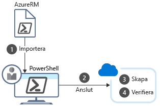

<span data-ttu-id="3cd65-101">I PowerShell kan du skriva kommandon och köra dem direkt.</span><span class="sxs-lookup"><span data-stu-id="3cd65-101">PowerShell lets you write commands and execute them immediately.</span></span> <span data-ttu-id="3cd65-102">Detta kallas för **interaktivt läge**.</span><span class="sxs-lookup"><span data-stu-id="3cd65-102">This is known as **interactive mode**.</span></span>

<span data-ttu-id="3cd65-103">Kom ihåg att huvudmålet i CRM-exemplet Customer Relationship Management) är att skapa tre testmiljöer med virtuella datorer.</span><span class="sxs-lookup"><span data-stu-id="3cd65-103">Recall that the overall goal in the Customer Relationship Management (CRM) example is to create three test environments containing VMs.</span></span> <span data-ttu-id="3cd65-104">Du kommer att använda resursgrupper för att se till att de virtuella datorerna är uppdelade i separata miljöer: en för enhetstestning, en för integrationstestning och en för acceptanstestning.</span><span class="sxs-lookup"><span data-stu-id="3cd65-104">You will use resource groups to ensure the VMs are organized into separate environments: one for unit testing, one for integration testing, and one for acceptance testing.</span></span> <span data-ttu-id="3cd65-105">Du behöver bara skapa resursgrupperna en gång, vilket gör det interaktiva läget för PowerShell till ett bra val.</span><span class="sxs-lookup"><span data-stu-id="3cd65-105">You only need to create the resource groups once, which means using the interactive mode of PowerShell is a good choice.</span></span>

<span data-ttu-id="3cd65-106">När du anger ett kommando i PowerShell matchar den till en _cmdlet_ som sedan utför den begärda åtgärden.</span><span class="sxs-lookup"><span data-stu-id="3cd65-106">When you type a command into PowerShell, it matches it to a _cmdlet_ which then performs the requested action.</span></span> <span data-ttu-id="3cd65-107">Vi ska gå igenom några vanliga kommandon som du kan använda och sedan titta på hur du installerar Azure-stöd för PowerShell.</span><span class="sxs-lookup"><span data-stu-id="3cd65-107">We're going to look at some of the common commands you can use, and then look at installing the Azure support for PowerShell.</span></span>

## <a name="what-are-powershell-cmdlets"></a><span data-ttu-id="3cd65-108">Vad är PowerShell-cmdletar?</span><span class="sxs-lookup"><span data-stu-id="3cd65-108">What are PowerShell cmdlets?</span></span>
<span data-ttu-id="3cd65-109">Ett PowerShell-kommando kallas för en **cmdlet** (uttalas ”command-let”).</span><span class="sxs-lookup"><span data-stu-id="3cd65-109">A PowerShell command is called a **cmdlet** (pronounced "command-let").</span></span> <span data-ttu-id="3cd65-110">En cmdlet är ett kommando som manipulerar en enskild funktion.</span><span class="sxs-lookup"><span data-stu-id="3cd65-110">A cmdlet is a command that manipulates a single feature.</span></span> <span data-ttu-id="3cd65-111">Termen **cmdlet** är tänkt att avse ett ”litet kommando”.</span><span class="sxs-lookup"><span data-stu-id="3cd65-111">The term **cmdlet** is intended to imply "small command".</span></span> <span data-ttu-id="3cd65-112">Enligt konventionen uppmuntras de som skriver cmdletar att hålla dem enkla med ett enda syfte.</span><span class="sxs-lookup"><span data-stu-id="3cd65-112">By convention, cmdlet authors are encouraged to keep cmdlets simple and single-purpose.</span></span>

<span data-ttu-id="3cd65-113">PowerShell-grundprodukten levereras med cmdletar för funktioner som sessioner och bakgrundsjobb.</span><span class="sxs-lookup"><span data-stu-id="3cd65-113">The base PowerShell product ships with cmdlets that work with features such as sessions and background jobs.</span></span> <span data-ttu-id="3cd65-114">Du lägger till moduler i PowerShell-installationen för att hämta cmdletar som manipulerar andra funktioner.</span><span class="sxs-lookup"><span data-stu-id="3cd65-114">You add modules to your PowerShell installation to get cmdlets that manipulate other features.</span></span> <span data-ttu-id="3cd65-115">Det finns till exempel moduler från tredje part för att arbeta med ftp, administrera operativsystemet, använda filsystemet och så vidare.</span><span class="sxs-lookup"><span data-stu-id="3cd65-115">For example, there are third-party modules to work with ftp, administer your operating system, access the file system, and so on.</span></span>

<span data-ttu-id="3cd65-116">Cmdletar följer en namngivningskonvention med verb-substantiv, till exempel **Get-Process**, **Format-Table** eller **Start-Service**.</span><span class="sxs-lookup"><span data-stu-id="3cd65-116">Cmdlets follow a verb-noun naming convention; for example, **Get-Process**, **Format-Table**, and **Start-Service**.</span></span> <span data-ttu-id="3cd65-117">Dessutom finns en konvention för valet av verb: ”get” för att hämta data, ”set” för att infoga eller uppdatera data, ”format” för att formatera data, ”out” för att skicka utdata till ett mål och så vidare.</span><span class="sxs-lookup"><span data-stu-id="3cd65-117">There is also a convention for verb choice: "get" to retrieve data, "set" to insert or update data, "format" to format data, "out" to direct output to a destination, and so on.</span></span>

<span data-ttu-id="3cd65-118">De som skriver cmdletar uppmanas att inkludera en hjälpfil för varje cmdlet.</span><span class="sxs-lookup"><span data-stu-id="3cd65-118">Cmdlet authors are encouraged to include a help file for each cmdlet.</span></span> <span data-ttu-id="3cd65-119">Cmdleten **Get-Help** visar hjälpfilen för en cmdlet.</span><span class="sxs-lookup"><span data-stu-id="3cd65-119">The **Get-Help** cmdlet displays the help file for any cmdlet.</span></span> <span data-ttu-id="3cd65-120">Vi kan till exempel få hjälp om cmdleten `Get-ChildItem` med följande uttryck:</span><span class="sxs-lookup"><span data-stu-id="3cd65-120">For example, we could get help on the `Get-ChildItem` cmdlet with the following statement:</span></span>

```powershell
Get-Help Get-ChildItem -detailed
```

## <a name="what-is-a-powershell-module"></a><span data-ttu-id="3cd65-121">Vad är en PowerShell-modul?</span><span class="sxs-lookup"><span data-stu-id="3cd65-121">What is a PowerShell module?</span></span>

<span data-ttu-id="3cd65-122">Cmdletar levereras i _moduler_.</span><span class="sxs-lookup"><span data-stu-id="3cd65-122">Cmdlets are shipped in _modules_.</span></span> <span data-ttu-id="3cd65-123">En PowerShell-modul är en DLL-fil som innehåller kod för att behandla varje tillgänglig cmdlet.</span><span class="sxs-lookup"><span data-stu-id="3cd65-123">A PowerShell Module is a DLL that includes the code to proces each available cmdlet.</span></span> <span data-ttu-id="3cd65-124">Du läser in cmdletar i PowerShell genom att läsa in den modul som de finns i.</span><span class="sxs-lookup"><span data-stu-id="3cd65-124">You load cmdlets into PowerShell by loading the module they are contained in.</span></span> <span data-ttu-id="3cd65-125">Du kan hämta en lista över inlästa moduler med kommandot `Get-Module`:</span><span class="sxs-lookup"><span data-stu-id="3cd65-125">You can get a list of loaded modules using the `Get-Module` command:</span></span>

```powershell
Get-Module
```

<span data-ttu-id="3cd65-126">Utdata blir ungefär så här:</span><span class="sxs-lookup"><span data-stu-id="3cd65-126">This will output something like:</span></span>

```output
ModuleType Version    Name                                ExportedCommands
---------- -------    ----                                ----------------
Manifest   3.1.0.0    Microsoft.PowerShell.Management     {Add-Computer, Add-Content, Checkpoint-Computer, Clear-Con...
Manifest   3.1.0.0    Microsoft.PowerShell.Utility        {Add-Member, Add-Type, Clear-Variable, Compare-Object...}
Binary     1.0.0.1    PackageManagement                   {Find-Package, Find-PackageProvider, Get-Package, Get-Pack...
Script     1.0.0.1    PowerShellGet                       {Find-Command, Find-DscResource, Find-Module, Find-RoleCap...
Script     2.0.0      PSReadline                          {Get-PSReadLineKeyHandler, Get-PSReadLineOption, Remove-PS...
```

## <a name="what-is-azurerm"></a><span data-ttu-id="3cd65-127">Vad är AzureRM?</span><span class="sxs-lookup"><span data-stu-id="3cd65-127">What is AzureRM?</span></span>
<span data-ttu-id="3cd65-128">**AzureRM** är det formella namnet på Azure PowerShell-modulen som innehåller cmdletar för arbete med Azure-funktioner (**RM** i namnet står för **Resource Manager**).</span><span class="sxs-lookup"><span data-stu-id="3cd65-128">**AzureRM** is the formal name for the Azure PowerShell module containing cmdlets to work with Azure features (the **RM** in the name stands for **Resource Manager**).</span></span> <span data-ttu-id="3cd65-129">Den innehåller hundratals cmdletar som gör att du kan styra nästan alla aspekter av varje Azure-resurs.</span><span class="sxs-lookup"><span data-stu-id="3cd65-129">It contains hundreds of cmdlets that let you control nearly every aspect of every Azure resource.</span></span> <span data-ttu-id="3cd65-130">Du kan arbeta med resursgrupper, lagring, virtuella datorer, Azure Active Directory, containrar, maskininlärning och så vidare.</span><span class="sxs-lookup"><span data-stu-id="3cd65-130">You can work with resource groups, storage, virtual machines, Azure Active Directory, containers, machine learning, and so on.</span></span> <span data-ttu-id="3cd65-131">Denna modul är en komponent med öppen källkod som [finns på GitHub](https://github.com/Azure/azure-powershell).</span><span class="sxs-lookup"><span data-stu-id="3cd65-131">This module is an open source component [available on GitHub](https://github.com/Azure/azure-powershell).</span></span>

> [!NOTE]
> <span data-ttu-id="3cd65-132">Azure PowerShell-modulen är en valfri installation – cmdletarna är inte tillgängliga förrän du importerar modulen.</span><span class="sxs-lookup"><span data-stu-id="3cd65-132">The Azure PowerShell module is an optional install - the cmdlets aren't available until you import the module.</span></span>

### <a name="install-the-azurerm-module"></a><span data-ttu-id="3cd65-133">Installera AzureRM-modulen</span><span class="sxs-lookup"><span data-stu-id="3cd65-133">Install the AzureRM module</span></span>

<span data-ttu-id="3cd65-134">AzureRM-modulen är tillgänglig från en global lagringsplats som kallas PowerShell-galleriet.</span><span class="sxs-lookup"><span data-stu-id="3cd65-134">The AzureRM module is available from a global repository called the PowerShell Gallery.</span></span> <span data-ttu-id="3cd65-135">Du kan installera modulen på din lokala dator via kommandot `Install-Module`.</span><span class="sxs-lookup"><span data-stu-id="3cd65-135">You can install the module onto your local machine through the `Install-Module` command.</span></span> <span data-ttu-id="3cd65-136">Du behöver ha ett upphöjt PowerShell för att installera moduler från PowerShell-galleriet.</span><span class="sxs-lookup"><span data-stu-id="3cd65-136">You need an elevated PowerShell shell to install modules from the PowerShell Gallery.</span></span> 

<span data-ttu-id="3cd65-137">::: zone pivot="windows"</span><span class="sxs-lookup"><span data-stu-id="3cd65-137">::: zone pivot="windows"</span></span>

<span data-ttu-id="3cd65-138">För att installera den senaste Azure PowerShell-modulen kör du följande kommandon:</span><span class="sxs-lookup"><span data-stu-id="3cd65-138">To install the latest Azure PowerShell module, run the following commands:</span></span>

1. <span data-ttu-id="3cd65-139">Öppna **Start-menyn** och skriv **Windows PowerShell**.</span><span class="sxs-lookup"><span data-stu-id="3cd65-139">Open the **Start** menu and type **Windows PowerShell**.</span></span>

1. <span data-ttu-id="3cd65-140">Högerklicka på ikonen för **Windows PowerShell** och välj **Kör som administratör**.</span><span class="sxs-lookup"><span data-stu-id="3cd65-140">Right-click the **Windows PowerShell** icon and select **Run as administrator**.</span></span>

1. <span data-ttu-id="3cd65-141">I dialogrutan **User Account Control** väljer du **Ja**.</span><span class="sxs-lookup"><span data-stu-id="3cd65-141">In the **User Account Control** dialog, select **Yes**.</span></span>

1. <span data-ttu-id="3cd65-142">Ange följande kommando och tryck på Enter:</span><span class="sxs-lookup"><span data-stu-id="3cd65-142">Type the following command, and then press Enter:</span></span>

    ```powershell
    Install-Module -Name AzureRM
    ```

<span data-ttu-id="3cd65-143">Detta installerar modulen för alla användare som standard (styrs av omfångsparametern).</span><span class="sxs-lookup"><span data-stu-id="3cd65-143">This installs the module for all users by default (controlled by the scope parameter).</span></span> 

<span data-ttu-id="3cd65-144">Kommandot är beroende av NuGet för att hämta komponenter. Beroende på vilken version av NuGet du har installerat kan du få en uppmaning om att ladda ned och installera den senaste versionen av NuGet.</span><span class="sxs-lookup"><span data-stu-id="3cd65-144">The command relies on NuGet to retrieve components, depending on the version of NuGet you have installed you might get a prompt to download and install the latest version of NuGet.</span></span>

```output
NuGet provider is required to continue
PowerShellGet requires NuGet provider version '2.8.5.201' or newer to interact with NuGet-based repositories. The NuGet
 provider must be available in 'C:\Program Files (x86)\PackageManagement\ProviderAssemblies' or
'C:\Users\<username>\AppData\Local\PackageManagement\ProviderAssemblies'. You can also install the NuGet provider by running
'Install-PackageProvider -Name NuGet -MinimumVersion 2.8.5.201 -Force'. Do you want PowerShellGet to install and import
 the NuGet provider now?
```

<span data-ttu-id="3cd65-145">Som standard konfigureras inte PowerShell-galleriet som en betrodd lagringsplats för PowerShellGet.</span><span class="sxs-lookup"><span data-stu-id="3cd65-145">By default, the PowerShell gallery isn't configured as a trusted repository for PowerShellGet.</span></span> <span data-ttu-id="3cd65-146">Första gången du använder PSGallery visas följande meddelande:</span><span class="sxs-lookup"><span data-stu-id="3cd65-146">The first time you use the PSGallery you see the following prompt:</span></span>

```output
You are installing the modules from an untrusted repository. If you trust this repository, change its
InstallationPolicy value by running the Set-PSRepository cmdlet. Are you sure you want to install the modules from
'PSGallery'?
```

#### <a name="script-execution-failed"></a><span data-ttu-id="3cd65-147">Skriptkörningen misslyckades</span><span class="sxs-lookup"><span data-stu-id="3cd65-147">Script execution failed</span></span>
<span data-ttu-id="3cd65-148">Beroende på din säkerhetskonfiguration kan `Import-Module` misslyckas med något som liknar följande.</span><span class="sxs-lookup"><span data-stu-id="3cd65-148">Depending on your security configuration, `Import-Module` might fail with something like the following.</span></span>

```output
import-module : File C:\Program Files (x86)\WindowsPowerShell\Modules\azurerm\6.8.1\AzureRM.psm1 cannot be loaded
because running scripts is disabled on this system. For more information, see about_Execution_Policies at
https:/go.microsoft.com/fwlink/?LinkID=135170.
At line:1 char:1
+ import-module azurerm
+ ~~~~~~~~~~~~~~~~~~~~~
    + CategoryInfo          : SecurityError: (:) [Import-Module], PSSecurityException
    + FullyQualifiedErrorId : UnauthorizedAccess,Microsoft.PowerShell.Commands.ImportModuleCommand
```

<span data-ttu-id="3cd65-149">Detta betyder vanligen att körningsprincipen är ”begränsad”, vilket innebär att du inte kan köra moduler som du laddar ned från en extern källa – inklusive PowerShell-galleriet.</span><span class="sxs-lookup"><span data-stu-id="3cd65-149">This normally indicates that the execution policy is "restricted", meaning you can't execute modules you download from an external source - including the PowerShell gallery.</span></span> <span data-ttu-id="3cd65-150">Du kan kontrollera om så är fallet genom att köra kommandot `Get-ExecutionPolicy`.</span><span class="sxs-lookup"><span data-stu-id="3cd65-150">You can check whether this is the case by executing the command `Get-ExecutionPolicy`.</span></span> <span data-ttu-id="3cd65-151">Om det returnerar ”Restricted” (begränsad) gör du följande:</span><span class="sxs-lookup"><span data-stu-id="3cd65-151">If it returns "Restricted", then do the following:</span></span>

1. <span data-ttu-id="3cd65-152">Öppna en upphöjd PowerShell-kommandotolk.</span><span class="sxs-lookup"><span data-stu-id="3cd65-152">Open an elevated PowerShell command prompt.</span></span>
1. <span data-ttu-id="3cd65-153">Använd cmdleten `SetExecutionPolicy` för att ändra principen till ”RemoteSigned”:</span><span class="sxs-lookup"><span data-stu-id="3cd65-153">Use the `SetExecutionPolicy` cmdlet to change the policy to "RemoteSigned":</span></span>

```powershell
Set-ExecutionPolicy RemoteSigned
```

<span data-ttu-id="3cd65-154">Du uppmanas att ange behörighet:</span><span class="sxs-lookup"><span data-stu-id="3cd65-154">This will prompt you for permission:</span></span>

```output
The execution policy helps protect you from scripts that you do not trust. Changing the execution policy might expose
you to the security risks described in the about_Execution_Policies help topic at
https:/go.microsoft.com/fwlink/?LinkID=135170. Do you want to change the execution policy?
[Y] Yes  [A] Yes to All  [N] No  [L] No to All  [S] Suspend  [?] Help (default is "N"): Y
```

<span data-ttu-id="3cd65-155">Sedan bör du kunna använda `Import-Module` för att läsa in cmdletarna.</span><span class="sxs-lookup"><span data-stu-id="3cd65-155">You should then be able to use `Import-Module` to load the cmdlets.</span></span>

<span data-ttu-id="3cd65-156">:::zone-end</span><span class="sxs-lookup"><span data-stu-id="3cd65-156">:::zone-end</span></span>

<span data-ttu-id="3cd65-157">::: zone pivot="linux,macos"</span><span class="sxs-lookup"><span data-stu-id="3cd65-157">::: zone pivot="linux,macos"</span></span>

<span data-ttu-id="3cd65-158">Vi använder samma kommandon för att installera Azure PowerShell på antingen Linux eller macOS.</span><span class="sxs-lookup"><span data-stu-id="3cd65-158">We use the same commands to install the Azure PowerShell on either Linux or macOS.</span></span>

1. <span data-ttu-id="3cd65-159">I en terminal skriver du följande kommando för att starta PowerShell Core med utökad behörighet.</span><span class="sxs-lookup"><span data-stu-id="3cd65-159">In a terminal, type the following command to launch PowerShell Core with elevated privileges.</span></span>

    ```bash
    sudo pwsh
    ```

1. <span data-ttu-id="3cd65-160">Kör följande kommando i Azure PowerShell-kommandotolken för att installera Azure PowerShell.</span><span class="sxs-lookup"><span data-stu-id="3cd65-160">Run the following command at the PowerShell Core prompt to install Azure PowerShell.</span></span>

    ```powershell
    Install-Module AzureRM.NetCore
    ```

1. <span data-ttu-id="3cd65-161">Om du blir tillfrågad om huruvida du litar på moduler från **PSGallery** svarar du **Ja** eller **Ja till alla**.</span><span class="sxs-lookup"><span data-stu-id="3cd65-161">If you are asked whether you trust modules from **PSGallery**, answer **Yes** or **Yes to All**.</span></span>

<span data-ttu-id="3cd65-162">:::zone-end</span><span class="sxs-lookup"><span data-stu-id="3cd65-162">:::zone-end</span></span>

### <a name="update-a-module"></a><span data-ttu-id="3cd65-163">Uppdatera en modul</span><span class="sxs-lookup"><span data-stu-id="3cd65-163">Update a module</span></span>

<span data-ttu-id="3cd65-164">Om du får en eller ett felmeddelande som anger att en version av Azure PowerShell-modulen redan är installerad kan du uppdatera till den _senaste_ versionen genom att köra kommandot:</span><span class="sxs-lookup"><span data-stu-id="3cd65-164">If you get a warning or error message indicating that a version of the Azure PowerShell module is already installed, you can update to the _latest_ version by issuing the command:</span></span>

<span data-ttu-id="3cd65-165">:::zone pivot="windows"</span><span class="sxs-lookup"><span data-stu-id="3cd65-165">:::zone pivot="windows"</span></span>

```powershell
Update-Module -Name AzureRM
```

<span data-ttu-id="3cd65-166">:::zone-end</span><span class="sxs-lookup"><span data-stu-id="3cd65-166">:::zone-end</span></span>

<span data-ttu-id="3cd65-167">::: zone pivot="linux,macos"</span><span class="sxs-lookup"><span data-stu-id="3cd65-167">::: zone pivot="linux,macos"</span></span>

```powershell
Update-Module -Name AzureRM.NetCore
```

<span data-ttu-id="3cd65-168">:::zone-end</span><span class="sxs-lookup"><span data-stu-id="3cd65-168">:::zone-end</span></span>

<span data-ttu-id="3cd65-169">Precis som för kommandot `Install-Module` ska du svara **Ja** eller **Ja till alla** när du blir uppmanad att lita på modulen.</span><span class="sxs-lookup"><span data-stu-id="3cd65-169">As with the `Install-Module` command, answer **Yes** or **Yes to All** when prompted to trust the module.</span></span> <span data-ttu-id="3cd65-170">Du kan även använda kommandot `Update-Module` för att installera om en modul om du har problem med den.</span><span class="sxs-lookup"><span data-stu-id="3cd65-170">You can also use the `Update-Module` command to re-install a module if you are having trouble with it.</span></span>

## <a name="example-how-to-create-a-resource-group-with-azure-powershell"></a><span data-ttu-id="3cd65-171">Exempel: Så skapar du en resursgrupp med Azure PowerShell</span><span class="sxs-lookup"><span data-stu-id="3cd65-171">Example: How to create a resource group with Azure PowerShell</span></span>
<span data-ttu-id="3cd65-172">När Azure-modulen har lästs in kan du börja arbeta med Azure.</span><span class="sxs-lookup"><span data-stu-id="3cd65-172">Once you have the Azure module loaded, you can begin working with Azure.</span></span> <span data-ttu-id="3cd65-173">Vi utför en vanlig uppgift – skapa en resursgrupp.</span><span class="sxs-lookup"><span data-stu-id="3cd65-173">Let's do a common task - create a Resource Group.</span></span> <span data-ttu-id="3cd65-174">Som du vet använder vi resursgrupper för att administrera relaterade resurser tillsammans.</span><span class="sxs-lookup"><span data-stu-id="3cd65-174">As you know, we use resource groups to administer related resources together.</span></span> <span data-ttu-id="3cd65-175">Att skapa en ny resursgrupp är en av de första uppgifterna som du gör när du startar en ny Azure-lösning.</span><span class="sxs-lookup"><span data-stu-id="3cd65-175">Creating a new resource group is one of the first tasks you'll do when starting a new Azure solution.</span></span>

<span data-ttu-id="3cd65-176">Det finns fyra steg som vi behöver utföra:</span><span class="sxs-lookup"><span data-stu-id="3cd65-176">There are four steps we need to perform:</span></span>

1. <span data-ttu-id="3cd65-177">Importera Azure-cmdletarna.</span><span class="sxs-lookup"><span data-stu-id="3cd65-177">Import the Azure cmdlets.</span></span>

1. <span data-ttu-id="3cd65-178">Ansluta till Azure-prenumerationen.</span><span class="sxs-lookup"><span data-stu-id="3cd65-178">Connect to your Azure subscription.</span></span>

1. <span data-ttu-id="3cd65-179">Skapa resursgruppen.</span><span class="sxs-lookup"><span data-stu-id="3cd65-179">Create the resource group.</span></span>

1. <span data-ttu-id="3cd65-180">Kontrollera att resursgruppen skapades korrekt (se nedan).</span><span class="sxs-lookup"><span data-stu-id="3cd65-180">Verify that creation was successful (see below).</span></span>

<span data-ttu-id="3cd65-181">Följande illustration visar en översikt över dessa steg.</span><span class="sxs-lookup"><span data-stu-id="3cd65-181">The following illustration shows an overview of these steps.</span></span>



<span data-ttu-id="3cd65-183">Varje steg motsvarar en specifik cmdlet.</span><span class="sxs-lookup"><span data-stu-id="3cd65-183">Each step corresponds to a different cmdlet.</span></span>

### <a name="import-the-azure-cmdlets"></a><span data-ttu-id="3cd65-184">Importera Azure-cmdletarna</span><span class="sxs-lookup"><span data-stu-id="3cd65-184">Import the Azure cmdlets</span></span>
<span data-ttu-id="3cd65-185">Vid starten läser PowerShell som standard bara in de viktigaste cmdletarna.</span><span class="sxs-lookup"><span data-stu-id="3cd65-185">At startup, PowerShell loads only the core cmdlets by default.</span></span> <span data-ttu-id="3cd65-186">Det innebär att de cmdletar du behöver till att arbeta med Azure inte är inlästa.</span><span class="sxs-lookup"><span data-stu-id="3cd65-186">This means the cmdlets you need to work with Azure won't be loaded.</span></span> <span data-ttu-id="3cd65-187">Det säkraste sättet att läsa in de cmdletar du behöver är att importera dem manuellt i början av PowerShell-sessionen.</span><span class="sxs-lookup"><span data-stu-id="3cd65-187">The most reliable way to load the cmdlets you need is to import them manually at the start of your PowerShell session.</span></span>

<span data-ttu-id="3cd65-188">Du använder cmdleten **Import-Module** till att läsa in moduler.</span><span class="sxs-lookup"><span data-stu-id="3cd65-188">You use the **Import-Module** cmdlet to load modules.</span></span> <span data-ttu-id="3cd65-189">Den här cmdleten har många parametrar för att kunna hantera olika situationer.</span><span class="sxs-lookup"><span data-stu-id="3cd65-189">This cmdlet has many parameters to handle a variety of situations.</span></span> <span data-ttu-id="3cd65-190">Den kan till exempel läsa in flera moduler, en viss modulversion, en del av en modul och så vidare.</span><span class="sxs-lookup"><span data-stu-id="3cd65-190">For example, it can load multiple modules, a specific module version, part of a module, and so on.</span></span>

<span data-ttu-id="3cd65-191">Till exempel kan vi läsa in alla cmdletar för AzureRM med hjälp av följande kommando **i en upphöjd PowerShell-session**:</span><span class="sxs-lookup"><span data-stu-id="3cd65-191">For example, we can load all the cmdlets for AzureRM with the following command **in an elevated PowerShell session**:</span></span>

<span data-ttu-id="3cd65-192">:::zone pivot="windows"</span><span class="sxs-lookup"><span data-stu-id="3cd65-192">:::zone pivot="windows"</span></span>

```powershell
Import-Module AzureRM
```

<span data-ttu-id="3cd65-193">:::zone-end</span><span class="sxs-lookup"><span data-stu-id="3cd65-193">:::zone-end</span></span>

<span data-ttu-id="3cd65-194">::: zone pivot="linux,macos"</span><span class="sxs-lookup"><span data-stu-id="3cd65-194">::: zone pivot="linux,macos"</span></span>

```powershell
Import-Module AzureRM.NetCore
```

<span data-ttu-id="3cd65-195">:::zone-end</span><span class="sxs-lookup"><span data-stu-id="3cd65-195">:::zone-end</span></span>

> [!TIP]
> <span data-ttu-id="3cd65-196">Om du märker att du jobbar med Azure PowerShell ofta finns det två sätt att automatisera modulinläsningen.</span><span class="sxs-lookup"><span data-stu-id="3cd65-196">If you find that you work with Azure PowerShell frequently, there are two ways you can automate the module-loading process.</span></span> <span data-ttu-id="3cd65-197">Du kan lägga till en post i din PowerShell-profil för import av Azure-moduler vid starten, eller så kan du använda den senaste versionen av PowerShell som läser in tillhörande modul automatiskt när du använder en cmdlet.</span><span class="sxs-lookup"><span data-stu-id="3cd65-197">You can add an entry to your PowerShell profile to import the Azure module at startup or use the latest versions of PowerShell, which loads the containing module automatically when you use a cmdlet.</span></span>

### <a name="connect"></a><span data-ttu-id="3cd65-198">Ansluta</span><span class="sxs-lookup"><span data-stu-id="3cd65-198">Connect</span></span>
<span data-ttu-id="3cd65-199">När du arbetar med en lokal installation av Azure PowerShell måste du autentisera dig innan du kan köra Azure-kommandon.</span><span class="sxs-lookup"><span data-stu-id="3cd65-199">When you are working with a local install of Azure PowerShell, you will need to authenticate before you can execute Azure commands.</span></span> <span data-ttu-id="3cd65-200">Cmdleten **Connect-AzureRmAccount** frågar efter dina Azure-autentiseringsuppgifter och ansluter sedan till din Azure-prenumeration.</span><span class="sxs-lookup"><span data-stu-id="3cd65-200">The **Connect-AzureRmAccount** cmdlet prompts for your Azure credentials and then connects to your Azure subscription.</span></span> <span data-ttu-id="3cd65-201">Den har många valfria parametrar, men om du bara behöver en interaktiv prompt behövs inga parametrar:</span><span class="sxs-lookup"><span data-stu-id="3cd65-201">It has many optional parameters, but if all you need is an interactive prompt, no parameters are needed:</span></span>

```powershell
Connect-AzureRmAccount
```

<span data-ttu-id="3cd65-202">Du måste upprepa de här stegen för varje ny PowerShell-session som du startar eftersom den här modulen inte är en del av den grundläggande uppsättningen.</span><span class="sxs-lookup"><span data-stu-id="3cd65-202">You'll need to repeat these steps for every new PowerShell session you start since this module is not part of the core set.</span></span>


### <a name="working-with-subscriptions"></a><span data-ttu-id="3cd65-203">Arbeta med prenumerationer</span><span class="sxs-lookup"><span data-stu-id="3cd65-203">Working with subscriptions</span></span>
<span data-ttu-id="3cd65-204">Om du är nybörjare på Azure har du förmodligen bara en enda prenumeration.</span><span class="sxs-lookup"><span data-stu-id="3cd65-204">If you are new to Azure, you probably only have a single subscription.</span></span> <span data-ttu-id="3cd65-205">Men om du har använt Azure ett tag har du kanske skapat flera Azure-prenumerationer.</span><span class="sxs-lookup"><span data-stu-id="3cd65-205">But if you have been using Azure for a while, you may have created multiple Azure subscriptions.</span></span> <span data-ttu-id="3cd65-206">Du kan konfigurera Azure PowerShell för att köra kommandon mot en viss prenumeration.</span><span class="sxs-lookup"><span data-stu-id="3cd65-206">You can configure Azure PowerShell to execute commands against a particular subscription.</span></span>

<span data-ttu-id="3cd65-207">Du kan bara finnas i en prenumeration i taget.</span><span class="sxs-lookup"><span data-stu-id="3cd65-207">You can only be in one subscription at a time.</span></span> <span data-ttu-id="3cd65-208">Använd cmdleten `Get-AzureRmContext` för att avgöra vilken prenumeration som är aktiv.</span><span class="sxs-lookup"><span data-stu-id="3cd65-208">Use the `Get-AzureRmContext` cmdlet to determine which subscription is active.</span></span> <span data-ttu-id="3cd65-209">Du kan ändra om det inte är korrekt.</span><span class="sxs-lookup"><span data-stu-id="3cd65-209">If it's not the correct one, you can change it.</span></span>

1. <span data-ttu-id="3cd65-210">Hämta en lista över alla prenumerationsnamn i ditt konto med kommandot `Get-AzureRmSubscription`.</span><span class="sxs-lookup"><span data-stu-id="3cd65-210">Get a list of all subscription names in your account with the `Get-AzureRmSubscription` command.</span></span> 

2. <span data-ttu-id="3cd65-211">Ändra prenumerationen genom att skicka namnet på den som ska väljas.</span><span class="sxs-lookup"><span data-stu-id="3cd65-211">Change the subscription by passing the name of the one to select.</span></span>

```powershell
Select-AzureRmSubscription -Subscription "Visual Studio Enterprise"
```

### <a name="get-a-list-of-all-resource-groups"></a><span data-ttu-id="3cd65-212">Hämta en lista över alla resursgrupper</span><span class="sxs-lookup"><span data-stu-id="3cd65-212">Get a list of all Resource Groups</span></span>

<span data-ttu-id="3cd65-213">Du kan hämta en lista över alla resursgrupper i den aktiva prenumerationen:</span><span class="sxs-lookup"><span data-stu-id="3cd65-213">You can retrieve a list of all Resource Groups in the active subscription:</span></span>

```powershell
Get-AzureRmResourceGroup
```

<span data-ttu-id="3cd65-214">Du kan få en tydligare vy om du skickar utdata från `Get-AzureRmResourceGroup` till cmdleten `Format-Table` med ett lodstreck ”|”.</span><span class="sxs-lookup"><span data-stu-id="3cd65-214">To get a more concise view, you can send the output from the `Get-AzureRmResourceGroup` to the `Format-Table` cmdlet using a pipe '|'.</span></span>

```powershell
Get-AzureRmResourceGroup | Format-Table
```

<span data-ttu-id="3cd65-215">Utdata blir ungefär så här:</span><span class="sxs-lookup"><span data-stu-id="3cd65-215">This will output something like:</span></span>

```output
ResourceGroupName                  Location       ProvisioningState Tags TagsTable ResourceId
-----------------                  --------       ----------------- ---- --------- ----------
cloud-shell-storage-southcentralus southcentralus Succeeded                        /subscriptions/xxxxxxxx-d3ce-4172...
ExerciseResources                  eastus         Succeeded                        /subscriptions/xxxxxxxx-d3ce-4172...
```

### <a name="create-a-resource-group"></a><span data-ttu-id="3cd65-216">Skapa en resursgrupp</span><span class="sxs-lookup"><span data-stu-id="3cd65-216">Create a Resource Group</span></span>

<span data-ttu-id="3cd65-217">När du skapar resurser i Azure kommer du alltid att placera dem i en resursgrupp för hanteringsändamål.</span><span class="sxs-lookup"><span data-stu-id="3cd65-217">As you know, when you are creating resources in Azure, you will always place them into a resource group for management purposes.</span></span> <span data-ttu-id="3cd65-218">En resursgrupp är ofta en av de första sakerna som du skapar när du startar ett nytt program.</span><span class="sxs-lookup"><span data-stu-id="3cd65-218">A resource group is often one of the first things you will create when starting a new application.</span></span>

<span data-ttu-id="3cd65-219">Du kan skapa resursgrupper med cmdleten `New-AzureRmResourceGroup`.</span><span class="sxs-lookup"><span data-stu-id="3cd65-219">You can create resource groups with the `New-AzureRmResourceGroup` cmdlet.</span></span> <span data-ttu-id="3cd65-220">Du måste ange ett namn och en plats.</span><span class="sxs-lookup"><span data-stu-id="3cd65-220">You must specify a name and location.</span></span> <span data-ttu-id="3cd65-221">Namnet måste vara unikt inom prenumerationen.</span><span class="sxs-lookup"><span data-stu-id="3cd65-221">The name must be unique within your subscription.</span></span> <span data-ttu-id="3cd65-222">Platsen avgör var metadata för resursgruppen lagras (det här kan vara viktigt när det gäller regelefterlevnad).</span><span class="sxs-lookup"><span data-stu-id="3cd65-222">The location determines where the metadata for your resource group will be stored (which may be important to you for compliance reasons).</span></span> <span data-ttu-id="3cd65-223">Du anger platsen med strängar som ”USA, västra”, ”Europa, norra” eller ”Indien, västra”.</span><span class="sxs-lookup"><span data-stu-id="3cd65-223">You use strings like "West US", "North Europe", or "West India" to specify the location.</span></span> <span data-ttu-id="3cd65-224">Som de flesta Azure-cmdletar har `New-AzureRmResourceGroup` många valfria parametrar, men den grundläggande syntaxen är:</span><span class="sxs-lookup"><span data-stu-id="3cd65-224">As with most of the Azure cmdlets, `New-AzureRmResourceGroup` has many optional parameters; however, the core syntax is:</span></span>

```powershell
New-AzureRmResourceGroup -Name <name> -Location <location>
```

> [!NOTE]
> <span data-ttu-id="3cd65-225">Kom ihåg att vi kommer att arbeta i den sandbox-miljön i Azure som skapar en resursgrupp åt dig.</span><span class="sxs-lookup"><span data-stu-id="3cd65-225">Remember, we will be working in the Azure sandbox which creates the Resource Group for you.</span></span> <span data-ttu-id="3cd65-226">Kommandot ovan skulle användas om du arbetade i din egen prenumeration.</span><span class="sxs-lookup"><span data-stu-id="3cd65-226">The above command would be used if you work in your own subscription.</span></span>

### <a name="verify-the-resources"></a><span data-ttu-id="3cd65-227">Verifiera resurserna</span><span class="sxs-lookup"><span data-stu-id="3cd65-227">Verify the resources</span></span>
<span data-ttu-id="3cd65-228">`Get-AzureRmResource` visar en lista över dina Azure-resurser.</span><span class="sxs-lookup"><span data-stu-id="3cd65-228">The `Get-AzureRmResource` lists your Azure resources.</span></span> <span data-ttu-id="3cd65-229">Det här är användbart när du ska kontrollera att resursgruppen har skapats.</span><span class="sxs-lookup"><span data-stu-id="3cd65-229">This is useful here to verify whether creation of the resource group was successful.</span></span>

```powershell
Get-AzureRmResource
```

<span data-ttu-id="3cd65-230">Som med kommandot `Get-AzureRmResourceGroup` kan du få en tydligare vy via cmdleten `Format-Table`.</span><span class="sxs-lookup"><span data-stu-id="3cd65-230">Like the `Get-AzureRmResourceGroup` command, you can get a more concise view through the `Format-Table` cmdlet.</span></span> <span data-ttu-id="3cd65-231">Här använder vi en förkortad version, `ft`:</span><span class="sxs-lookup"><span data-stu-id="3cd65-231">Here we will use a shorthand version `ft`:</span></span>

```powershell
Get-AzureRmResource | ft
```

<span data-ttu-id="3cd65-232">Du kan även filtrera det till specifika resursgrupper för att bara lista resurser som är associerade med de grupperna:</span><span class="sxs-lookup"><span data-stu-id="3cd65-232">You can also filter it to specific resource groups to only list resources associated with that group:</span></span>

```powershell
Get-AzureRmResource -ResourceGroup ExerciseResources
```

### <a name="creating-an-azure-virtual-machine"></a><span data-ttu-id="3cd65-233">Skapa en virtuell Azure-dator</span><span class="sxs-lookup"><span data-stu-id="3cd65-233">Creating an Azure Virtual Machine</span></span>

<span data-ttu-id="3cd65-234">En annan gemensam uppgift som kan göras med PowerShell är att skapa virtuella datorer.</span><span class="sxs-lookup"><span data-stu-id="3cd65-234">Another common task that could be done with PowerShell is to create VMs.</span></span>

<span data-ttu-id="3cd65-235">I Azure PowerShell kan du använda cmdleten `New-AzureRmVm` till att skapa en virtuell dator.</span><span class="sxs-lookup"><span data-stu-id="3cd65-235">Azure PowerShell provides the `New-AzureRmVm` cmdlet to create a virtual machine.</span></span> <span data-ttu-id="3cd65-236">Cmdleten har många parametrar för att hantera det stora antalet konfigurationsinställningar för virtuella datorer.</span><span class="sxs-lookup"><span data-stu-id="3cd65-236">The cmdlet has many parameters to let it handle the large number of VM configuration settings.</span></span> <span data-ttu-id="3cd65-237">De flesta av parametrarna har rimliga standardvärden, så vi behöver bara ange fem saker:</span><span class="sxs-lookup"><span data-stu-id="3cd65-237">Most of the parameters have reasonable default values so we only need to specify five things:</span></span>

- <span data-ttu-id="3cd65-238">**ResourceGroupName**: resursgruppen som den nya virtuella datorn ska placeras i.</span><span class="sxs-lookup"><span data-stu-id="3cd65-238">**ResourceGroupName**: The resource group into which the new VM will be placed.</span></span>
- <span data-ttu-id="3cd65-239">**Name**: namnet på den virtuella datorn i Azure.</span><span class="sxs-lookup"><span data-stu-id="3cd65-239">**Name**: The name of the VM in Azure.</span></span>
- <span data-ttu-id="3cd65-240">**Location**: den geografiska plats där den virtuella datorn ska etableras.</span><span class="sxs-lookup"><span data-stu-id="3cd65-240">**Location**: Geographic location where the VM will be provisioned.</span></span>
- <span data-ttu-id="3cd65-241">**Credential**: ett objekt som innehåller användarnamnet och lösenordet för den virtuella datorns administratörskonto.</span><span class="sxs-lookup"><span data-stu-id="3cd65-241">**Credential**: An object containing the username and password for the VM admin account.</span></span> <span data-ttu-id="3cd65-242">Vi använder cdmleten `Get-Credential`.</span><span class="sxs-lookup"><span data-stu-id="3cd65-242">We will use the `Get-Credential` cmdlet.</span></span> <span data-ttu-id="3cd65-243">Denna cmdlet frågar efter ett användarnamn och ett lösenord och paketerar dem i ett autentiseringsuppgiftsobjekt.</span><span class="sxs-lookup"><span data-stu-id="3cd65-243">This cmdlet will prompt for a username and password and package it into a credential object.</span></span>
- <span data-ttu-id="3cd65-244">**Avbildning**: den operativsystemavbildning som ska användas för den virtuella datorn.</span><span class="sxs-lookup"><span data-stu-id="3cd65-244">**Image**: The operating system image to use for the VM.</span></span> <span data-ttu-id="3cd65-245">Det här är ofta en Linux-distribution eller en Windows Server.</span><span class="sxs-lookup"><span data-stu-id="3cd65-245">This is often a Linux distribution, or Windows Server.</span></span>

```powershell
   New-AzureRmVm 
       -ResourceGroupName <resource group name> 
       -Name <machine name> 
       -Credential <credentials object> 
       -Location <location> 
       -Image <image name>
```

<span data-ttu-id="3cd65-246">Du kan ange dessa parametrar direkt till cmdleten enligt ovan.</span><span class="sxs-lookup"><span data-stu-id="3cd65-246">You can supply these parameters directly to the cmdlet as shown above.</span></span> <span data-ttu-id="3cd65-247">Det går även att använda andra cmdletar för att konfigurera den virtuella datorn, till exempel `Set-AzureRmVMOperatingSystem`, `Set-AzureRmVMSourceImage`, `Add-AzureRmVMNetworkInterface` och `Set-AzureRmVMOSDisk`.</span><span class="sxs-lookup"><span data-stu-id="3cd65-247">Alternatively, other cmdlets can be used to configure the virtual machine, such as `Set-AzureRmVMOperatingSystem`, `Set-AzureRmVMSourceImage`, `Add-AzureRmVMNetworkInterface`, and `Set-AzureRmVMOSDisk`.</span></span>

<span data-ttu-id="3cd65-248">Här är ett exempel som kopplar ihop cmdleten `Get-Credential` med parametern `-Credential`:</span><span class="sxs-lookup"><span data-stu-id="3cd65-248">Here's an example that strings the `Get-Credential` cmdlet together with the `-Credential` parameter:</span></span>

```powershell
New-AzureRmVM -Name MyVm -ResourceGroupName ExerciseResources -Credential (Get-Credential) ...
```

<span data-ttu-id="3cd65-249">Suffixet `AzureRmVM` är specifikt för VM-baserade kommandon i PowerShell.</span><span class="sxs-lookup"><span data-stu-id="3cd65-249">The `AzureRmVM` suffix is specific to VM-based commands in PowerShell.</span></span> <span data-ttu-id="3cd65-250">Det finns flera andra som du kan använda:</span><span class="sxs-lookup"><span data-stu-id="3cd65-250">There are several others you can use:</span></span>

| <span data-ttu-id="3cd65-251">Kommando</span><span class="sxs-lookup"><span data-stu-id="3cd65-251">Command</span></span> | <span data-ttu-id="3cd65-252">Beskrivning</span><span class="sxs-lookup"><span data-stu-id="3cd65-252">Description</span></span> |
|---------|-------------|
| `Remove-AzureRmVM` | <span data-ttu-id="3cd65-253">Tar bort en virtuell Azure-dator.</span><span class="sxs-lookup"><span data-stu-id="3cd65-253">Deletes an Azure VM.</span></span> |
| `Start-AzureRmVM` | <span data-ttu-id="3cd65-254">Startar en stoppad virtuell dator.</span><span class="sxs-lookup"><span data-stu-id="3cd65-254">Start a stopped VM.</span></span> |
| `Stop-AzureRmVM` | <span data-ttu-id="3cd65-255">Stoppar en virtuell dator som körs.</span><span class="sxs-lookup"><span data-stu-id="3cd65-255">Stop a running VM.</span></span> |
| `Restart-AzureRmVM` | <span data-ttu-id="3cd65-256">Startar om en virtuell dator.</span><span class="sxs-lookup"><span data-stu-id="3cd65-256">Restart a VM.</span></span> |
| `Update-AzureRmVM` | <span data-ttu-id="3cd65-257">Uppdaterar konfigurationen för en virtuell dator.</span><span class="sxs-lookup"><span data-stu-id="3cd65-257">Updates the configuration for a VM.</span></span> |

#### <a name="example-getting-the-information-for-a-vm"></a><span data-ttu-id="3cd65-258">Exempel: hämta informationen för en virtuell dator</span><span class="sxs-lookup"><span data-stu-id="3cd65-258">Example: getting the information for a VM</span></span>

<span data-ttu-id="3cd65-259">Du kan lista de virtuella datorerna i din prenumeration med kommandot `Get-AzureRmVM -Status`.</span><span class="sxs-lookup"><span data-stu-id="3cd65-259">You can list the VMs in your subscription with the `Get-AzureRmVM -Status` command.</span></span> <span data-ttu-id="3cd65-260">Detta kan även ange en virtuell dator med egenskapen `-Name`.</span><span class="sxs-lookup"><span data-stu-id="3cd65-260">This can also specify a VM with the `-Name` property.</span></span> <span data-ttu-id="3cd65-261">Här tilldelar vi den till en PowerShell-variabel:</span><span class="sxs-lookup"><span data-stu-id="3cd65-261">Here we assign it to a PowerShell variable:</span></span>

```powershell
$vm = Get-AzureRmVM  -Name MyVM -ResourceGroupName ExerciseResources
```

<span data-ttu-id="3cd65-262">Det intressanta är att det här är ett _objekt_ som du kan interagera med.</span><span class="sxs-lookup"><span data-stu-id="3cd65-262">The interesting thing is this is an _object_ you can interact with.</span></span> <span data-ttu-id="3cd65-263">Exempelvis kan du göra ändringar på objektet och sedan skicka tillbaka ändringarna till Azure med kommandot `Update-AzureRmVM`:</span><span class="sxs-lookup"><span data-stu-id="3cd65-263">For example, you can take that object, make changes and then push changes back to Azure with the `Update-AzureRmVM` command:</span></span>

```powershell
$ResourceGroupName = "ExerciseResources"
$vm = Get-AzureRmVM  -Name MyVM -ResourceGroupName $ResourceGroupName
$vm.HardwareProfile.vmSize = "Standard_DS3_v2"

Update-AzureRmVM -ResourceGroupName $ResourceGroupName  -VM $vm
```

<span data-ttu-id="3cd65-264">Det interaktiva läget i PowerShell passar för engångsuppgifter.</span><span class="sxs-lookup"><span data-stu-id="3cd65-264">PowerShell's interactive mode is appropriate for one-off tasks.</span></span> <span data-ttu-id="3cd65-265">I vårt exempel använder vi troligtvis samma resursgrupp i hela projektet, så det är rimligt att skapa den interaktivt.</span><span class="sxs-lookup"><span data-stu-id="3cd65-265">In our example, we'll likely use the same resource group for the lifetime of the project, which means creating it interactively is reasonable.</span></span> <span data-ttu-id="3cd65-266">Det interaktiva läget är ofta snabbare och enklare än att skriva och köra ett skript för den här sortens uppgift.</span><span class="sxs-lookup"><span data-stu-id="3cd65-266">Interactive mode is often quicker and easier for this task than writing a script and executing that script exactly once.</span></span>