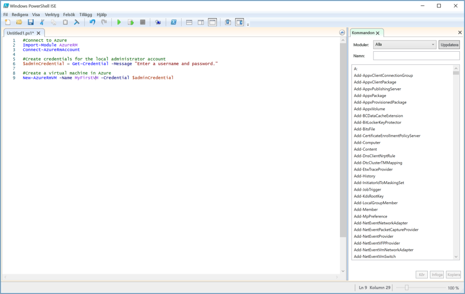

<span data-ttu-id="260a5-101">Komplexa och repetitiva aktiviteter kan ofta kräva mycket administration.</span><span class="sxs-lookup"><span data-stu-id="260a5-101">Complex or repetitive tasks often take a great deal of administrative time.</span></span> <span data-ttu-id="260a5-102">Organisationer vill gärna automatisera sådana uppgifter för att minska kostnaderna och undvika fel.</span><span class="sxs-lookup"><span data-stu-id="260a5-102">Organizations prefer to automate these tasks to reduce costs and avoid errors.</span></span>

<span data-ttu-id="260a5-103">Det här är viktigt i CRM-exemplet (Customer Relationship Management).</span><span class="sxs-lookup"><span data-stu-id="260a5-103">This is important in the Customer Relationship Management (CRM) company example.</span></span> <span data-ttu-id="260a5-104">Där får du testa din programvara på flera virtuella Linux-datorer (VM) som du tar bort och återskapar upprepade gånger.</span><span class="sxs-lookup"><span data-stu-id="260a5-104">There, you test your software on multiple Linux Virtual Machines (VMs) that you need to continuously delete and recreate.</span></span> <span data-ttu-id="260a5-105">Det är en bra idé att skapa de virtuella datorerna automatiskt med ett PowerShell-skript.</span><span class="sxs-lookup"><span data-stu-id="260a5-105">You want to use a PowerShell script to automate the creation of the VMs.</span></span>

<span data-ttu-id="260a5-106">Förutom grundåtgärden att skapa en virtuell dator finns ytterligare några krav på skriptet.</span><span class="sxs-lookup"><span data-stu-id="260a5-106">Beyond the core operation of creating a VM you have a few additional requirements for your script.</span></span> 
- <span data-ttu-id="260a5-107">Du kommer att skapa flera virtuella datorer, så det är bra att placera åtgärden i en loop</span><span class="sxs-lookup"><span data-stu-id="260a5-107">You will create multiple VMs, so you want to put the creation inside a loop</span></span>
- <span data-ttu-id="260a5-108">Du skapar de virtuella datorerna i tre olika resursgrupper, så namnet på resursgruppen bör överföras till skriptet som en parameter</span><span class="sxs-lookup"><span data-stu-id="260a5-108">You need to create VMs in three different resource groups, so the name of the resource group should be passed to the script as a parameter</span></span>

<span data-ttu-id="260a5-109">I det här avsnittet visas hur du skriver och kör ett Azure PowerShell-skript som uppfyller de här kraven.</span><span class="sxs-lookup"><span data-stu-id="260a5-109">In this section, you will see how to write and execute an Azure PowerShell script that meets these requirements.</span></span>

## <a name="what-is-a-powershell-script"></a><span data-ttu-id="260a5-110">Vad är ett PowerShell-skript?</span><span class="sxs-lookup"><span data-stu-id="260a5-110">What is a PowerShell script?</span></span>
<span data-ttu-id="260a5-111">Ett PowerShell-skript är en textfil som innehåller kommandon och styrelement.</span><span class="sxs-lookup"><span data-stu-id="260a5-111">A PowerShell script is a text file containing commands and control constructs.</span></span> <span data-ttu-id="260a5-112">Kommandona anropar cmdletar.</span><span class="sxs-lookup"><span data-stu-id="260a5-112">The commands are invocations of cmdlets.</span></span> <span data-ttu-id="260a5-113">Styrelementen är programkonstruktioner som loopar, variabler, parametrar, kommentarer och annat som finns i PowerShell.</span><span class="sxs-lookup"><span data-stu-id="260a5-113">The control constructs are programming features like loops, variables, parameters, comments, etc. supplied by PowerShell.</span></span>

<span data-ttu-id="260a5-114">PowerShell-skriptfiler har filtillägget **.ps1**.</span><span class="sxs-lookup"><span data-stu-id="260a5-114">PowerShell script files have a **.ps1** file extension.</span></span> <span data-ttu-id="260a5-115">Du kan skapa och spara de här filerna i valfri textredigerare.</span><span class="sxs-lookup"><span data-stu-id="260a5-115">You can create and save these files with any text editor.</span></span> 

> [!TIP]
> <span data-ttu-id="260a5-116">Om du skriver PowerShell-skript i Windows kan du använda Windows integrerade skriptmiljö för PowerShell (ISE).</span><span class="sxs-lookup"><span data-stu-id="260a5-116">If you’re writing PowerShell scripts under Windows, you can use the Windows PowerShell Integrated Scripting Environment (ISE).</span></span> <span data-ttu-id="260a5-117">Den här redigeraren har funktioner som syntaxfärgning och en lista med tillgängliga cmdletar.</span><span class="sxs-lookup"><span data-stu-id="260a5-117">This editor provides features such as syntax coloring and a list of available cmdlets.</span></span>
>
<span data-ttu-id="260a5-118">I följande bild visas Windows PowerShell Integrated Scripting Environment (ISE) med ett exempelskript som ansluter till Azure och skapar en virtuell dator.</span><span class="sxs-lookup"><span data-stu-id="260a5-118">The following screenshot shows the Windows PowerShell Integrated Scripting Environment (ISE) with a sample script to connect to Azure and create a virtual machine in Azure.</span></span>

>

<span data-ttu-id="260a5-120">När du har skrivit skriptet kör du det från PowerShell-kommandoraden genom att skriva en punkt och ett bakstreck följt av namnet på filen:</span><span class="sxs-lookup"><span data-stu-id="260a5-120">Once you have written the script, execute it from the PowerShell command line by passing the name of the file preceded by a dot and a backslash:</span></span>

```powershell
.\myScript.ps1
```

## <a name="powershell-techniques"></a><span data-ttu-id="260a5-121">PowerShell-tekniker</span><span class="sxs-lookup"><span data-stu-id="260a5-121">PowerShell techniques</span></span>
<span data-ttu-id="260a5-122">PowerShell har många funktioner som finns i vanliga programmeringsspråk.</span><span class="sxs-lookup"><span data-stu-id="260a5-122">PowerShell has many features found in typical programming languages.</span></span> <span data-ttu-id="260a5-123">Du kan definiera variabler, använda grenar och loopar, inhämta kommandoradsparametrar, skriva funktioner, lägga till kommentarer och så vidare.</span><span class="sxs-lookup"><span data-stu-id="260a5-123">You can define variables, use branches and loops, capture command-line parameters, write functions, add comments, and so on.</span></span> <span data-ttu-id="260a5-124">Vi kommer att använda tre funktioner i vårt skript: variabler, loopar och parametrar.</span><span class="sxs-lookup"><span data-stu-id="260a5-124">We will need three features for our script: variables, loops, and parameters.</span></span>

### <a name="variables"></a><span data-ttu-id="260a5-125">Variabler</span><span class="sxs-lookup"><span data-stu-id="260a5-125">Variables</span></span>
<span data-ttu-id="260a5-126">PowerShell har stöd för variabler.</span><span class="sxs-lookup"><span data-stu-id="260a5-126">PowerShell supports variables.</span></span> <span data-ttu-id="260a5-127">Använd **$** för att deklarera en variabel och **=** för att tilldela ett värde.</span><span class="sxs-lookup"><span data-stu-id="260a5-127">Use **$** to declare a variable and **=** to assign a value.</span></span> <span data-ttu-id="260a5-128">Exempel:</span><span class="sxs-lookup"><span data-stu-id="260a5-128">For example:</span></span>

```powershell
$loc = "East US"
$iterations = 3
```

<span data-ttu-id="260a5-129">Variabler kan innehålla objekt.</span><span class="sxs-lookup"><span data-stu-id="260a5-129">Variables can hold objects.</span></span> <span data-ttu-id="260a5-130">Följande definition anger exempelvis variabeln **adminCredential** till objektet som returneras av cmdleten **Get-Credential**.</span><span class="sxs-lookup"><span data-stu-id="260a5-130">For example, the following definition sets the **adminCredential** variable to the object returned by the **Get-Credential** cmdlet.</span></span>

```powershell
$adminCredential = Get-Credential
```

<span data-ttu-id="260a5-131">Du kan komma åt värdet som lagras i en variabel genom att använda prefixet **$** och variabelns namn som i exemplet nedan:</span><span class="sxs-lookup"><span data-stu-id="260a5-131">To obtain the value stored in a variable, use the **$** prefix and its name as shown below:</span></span> 

```powershell
$loc = "East US"
New-AzureRmResourceGroup -Name "MyResourceGroup" -Location $loc
```

### <a name="loops"></a><span data-ttu-id="260a5-132">Loopar</span><span class="sxs-lookup"><span data-stu-id="260a5-132">Loops</span></span>
<span data-ttu-id="260a5-133">PowerShell har flera loopar: **For**, **Do...While**, **For...Each** och så vidare.</span><span class="sxs-lookup"><span data-stu-id="260a5-133">PowerShell has several loops: **For**, **Do...While**, **For...Each**, and so on.</span></span> <span data-ttu-id="260a5-134">**For**-loopen passar bäst för våra behov eftersom vi ska köra en cmdlet ett visst antal gånger.</span><span class="sxs-lookup"><span data-stu-id="260a5-134">The **For** loop is the best match for our needs because we will execute a cmdlet a fixed number of times.</span></span>

<span data-ttu-id="260a5-135">Den huvudsakliga syntaxen visas nedan. Exemplet körs i två iterationer och skriver ut värdet för **i** varje gång.</span><span class="sxs-lookup"><span data-stu-id="260a5-135">The core syntax is shown below; the example runs for two iterations and prints the value of **i** each time.</span></span> <span data-ttu-id="260a5-136">Jämförelseoperatorerna skrivs som **-lt** för ”mindre än”, **-le** för ”mindre än eller lika med”, **eq** för ”lika med”, **ne** för ”inte lika med” och så vidare.</span><span class="sxs-lookup"><span data-stu-id="260a5-136">The comparison operators are written **-lt** for "less than", **-le** for "less than or equal", **eq** for "equal", **ne** for "not equal", etc.</span></span>

```powershell
For ($i = 1; $i -lt 3; $i++)
{
    $i
}
```

### <a name="parameters"></a><span data-ttu-id="260a5-137">Parametrar</span><span class="sxs-lookup"><span data-stu-id="260a5-137">Parameters</span></span>
<span data-ttu-id="260a5-138">När du kör ett skript kan du skicka argument på kommandoraden.</span><span class="sxs-lookup"><span data-stu-id="260a5-138">When you execute a script, you can pass arguments on the command line.</span></span> <span data-ttu-id="260a5-139">Du kan ange namn för varje parameter så att deras värden kan användas i skriptet.</span><span class="sxs-lookup"><span data-stu-id="260a5-139">You can provide names for each parameter to help the script extract the values.</span></span> <span data-ttu-id="260a5-140">Exempel:</span><span class="sxs-lookup"><span data-stu-id="260a5-140">For example:</span></span>

```powershell
.\setupEnvironment.ps1 -size 5 -location "East US"
```

<span data-ttu-id="260a5-141">I skriptet tar du värdena och gör dem till variabler.</span><span class="sxs-lookup"><span data-stu-id="260a5-141">Inside the script, you capture the values into variables.</span></span> <span data-ttu-id="260a5-142">I det här exemplet matchas parametrarna med hjälp av namnen:</span><span class="sxs-lookup"><span data-stu-id="260a5-142">In this example, the parameters are matched by name:</span></span>

```powershell
param([string]$location, [int]$size)
```

<span data-ttu-id="260a5-143">Du kan utelämna namnen på kommandoraden.</span><span class="sxs-lookup"><span data-stu-id="260a5-143">You can omit the names from the command line.</span></span> <span data-ttu-id="260a5-144">Exempel:</span><span class="sxs-lookup"><span data-stu-id="260a5-144">For example:</span></span>

```powershell
.\setupEnvironment.ps1 5 "East US"
```

<span data-ttu-id="260a5-145">När parametrarna inte har namn används deras placering till matchning i skriptet:</span><span class="sxs-lookup"><span data-stu-id="260a5-145">Inside the script, you rely on position for matching when the parameters are unnamed:</span></span>

```powershell
param([int]$size, [string]$location)
```

## <a name="how-to-create-a-linux-virtual-machine"></a><span data-ttu-id="260a5-146">Skapa en virtuell Linux-dator</span><span class="sxs-lookup"><span data-stu-id="260a5-146">How to create a Linux Virtual Machine</span></span>
<span data-ttu-id="260a5-147">I Azure PowerShell kan du använda cmdleten **New-AzureRmVm** till att skapa en virtuell dator.</span><span class="sxs-lookup"><span data-stu-id="260a5-147">Azure PowerShell provides the **New-AzureRmVm** cmdlet to create a Virtual Machine.</span></span> <span data-ttu-id="260a5-148">Cmdleten har många parametrar för alla konfigurationsinställningar för virtuella datorer.</span><span class="sxs-lookup"><span data-stu-id="260a5-148">The cmdlet has many parameters to let it handle the large number of VM configuration settings.</span></span> <span data-ttu-id="260a5-149">De flesta av parametrarna har rimliga standardvärden, så vi behöver bara ange fem saker:</span><span class="sxs-lookup"><span data-stu-id="260a5-149">Most of the parameters have reasonable default values so we only need to specify five things:</span></span>

- <span data-ttu-id="260a5-150">**ResourceGroupName**: resursgruppen som den nya virtuella datorn ska placeras i.</span><span class="sxs-lookup"><span data-stu-id="260a5-150">**ResourceGroupName**: The resource group into which the new VM will be placed.</span></span>
- <span data-ttu-id="260a5-151">**Name**: namnet på den virtuella datorn i Azure.</span><span class="sxs-lookup"><span data-stu-id="260a5-151">**Name**: The name of the VM in Azure.</span></span>
- <span data-ttu-id="260a5-152">**Location**: den geografiska plats där den virtuella datorn ska etableras.</span><span class="sxs-lookup"><span data-stu-id="260a5-152">**Location**: Geographic location where the VM will be provisioned.</span></span>
- <span data-ttu-id="260a5-153">**Credential**: ett objekt som innehåller användarnamn och lösenord för den virtuella datorns administratörskonto.</span><span class="sxs-lookup"><span data-stu-id="260a5-153">**Credential**: An object containing the username and password for the VM admin account.</span></span> <span data-ttu-id="260a5-154">Vi använder cmdleten **Get-Credential** till att fråga efter användarnamn och lösenord.</span><span class="sxs-lookup"><span data-stu-id="260a5-154">We will use the **Get-Credential** The cmdlet to prompt for a username and password.</span></span> <span data-ttu-id="260a5-155">**Get-Credential** placerar användarnamnet och lösenordet i ett credential-objekt som returneras som resultat.</span><span class="sxs-lookup"><span data-stu-id="260a5-155">**Get-Credential** packages the username and password into a credential object, which it returns as its result.</span></span>
- <span data-ttu-id="260a5-156">**Image**: identiteten för operativsystemet som ska användas i den virtuella datorn.</span><span class="sxs-lookup"><span data-stu-id="260a5-156">**Image**: Identity of the operating system to use for the VM.</span></span> <span data-ttu-id="260a5-157">Vi använder ”UbuntuLTS”.</span><span class="sxs-lookup"><span data-stu-id="260a5-157">We will use "UbuntuLTS".</span></span>

<span data-ttu-id="260a5-158">Syntaxen för cmdleten visas nedan:</span><span class="sxs-lookup"><span data-stu-id="260a5-158">The syntax for the cmdlet is shown below:</span></span>

```powershell
   New-AzureRmVm 
       -ResourceGroupName <resource group name> 
       -Name <machine name> 
       -Credential <credentials object> 
       -Location <location> 
       -Image <image name>
```

## <a name="summary"></a><span data-ttu-id="260a5-159">Sammanfattning</span><span class="sxs-lookup"><span data-stu-id="260a5-159">Summary</span></span>
<span data-ttu-id="260a5-160">I PowerShell och Azure PowerShell har du alla verktyg du behöver för att automatisera Azure.</span><span class="sxs-lookup"><span data-stu-id="260a5-160">The combination of PowerShell and Azure PowerShell gives you all the tools you need to automate Azure.</span></span> <span data-ttu-id="260a5-161">I vårt CRM-exempel kommer vi att kunna skapa flera virtuella Linux-datorer. Vi använder en parameter som gör skriptet generellt och en loop som gör att vi inte behöver upprepa koden.</span><span class="sxs-lookup"><span data-stu-id="260a5-161">In our CRM example, we will be able to create multiple Linux VMs using a parameter to keep the script generic and a loop to avoid repeated code.</span></span> <span data-ttu-id="260a5-162">Det innebär att en åtgärd som tidigare var komplicerad nu kan köras i ett enda steg.</span><span class="sxs-lookup"><span data-stu-id="260a5-162">This means that a formerly complex operation can now be executed in a single step.</span></span>