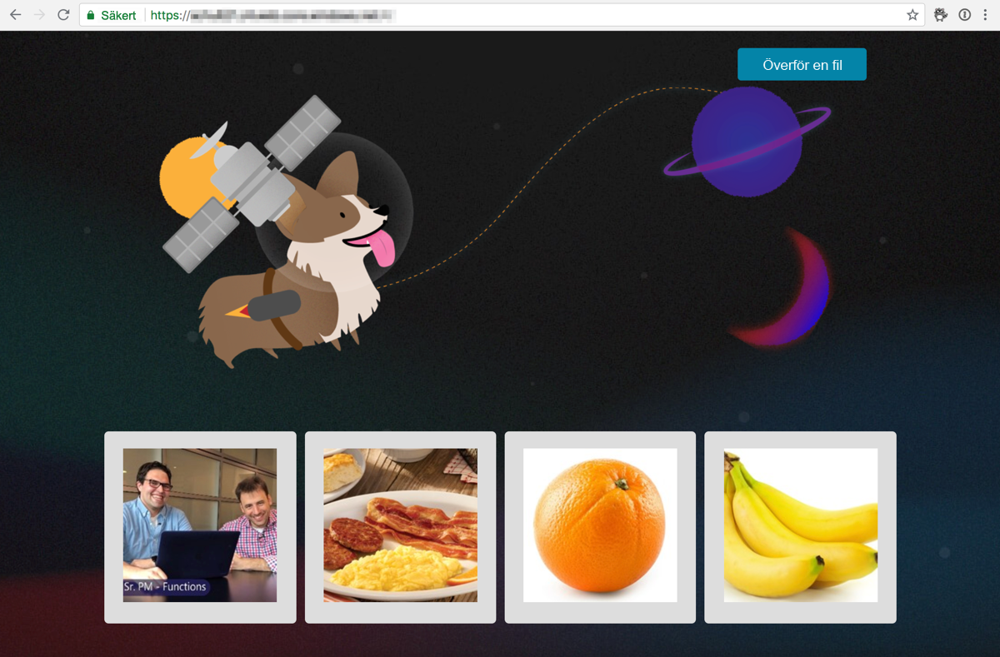
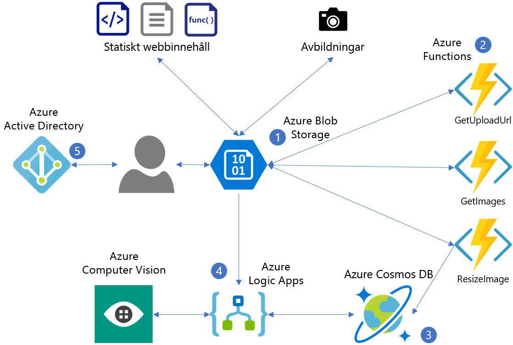
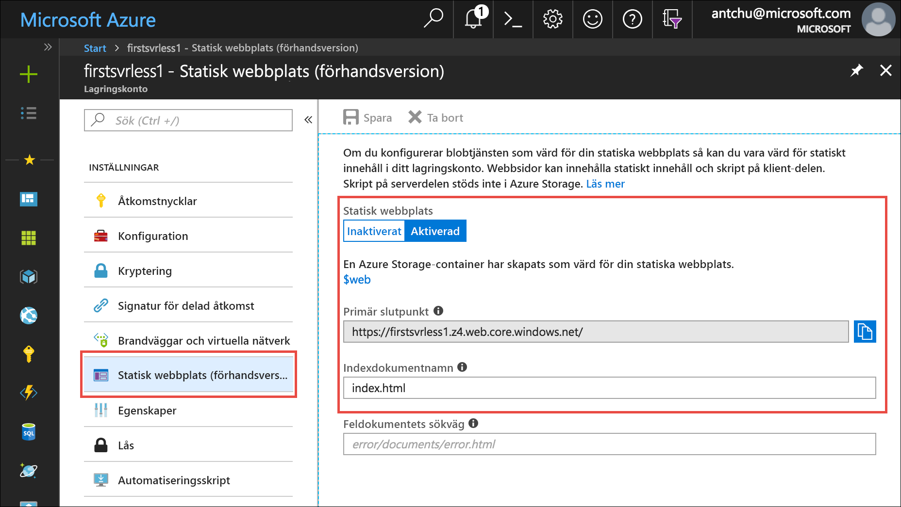
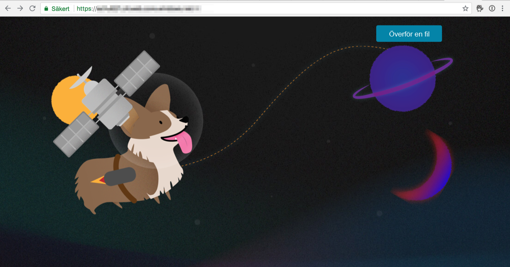

I den här modulen ska du distribuera ett enkelt webbprogram som visar ett HTML-baserad användargränssnitt. En serverlös funktion gör att programmet kan ladda upp bilder och automatiskt generera beskrivande bildtexter.



I följande diagram visas de Azure-tjänster som används av programmet.



1. Azure Blob Storage hanterar statiskt webbinnehåll (HTML, CSS och JS) och lagrar bilder.
2. Azure Functions hanterar uppladdning, storleksändring och metadatalagring för bilder.
3. Azure Cosmos DB lagrar bildmetadata.
4. Azure Logic Apps hämtar bildtexter från API för visuellt innehåll i Cognitive Services.
5. Azure Active Directory hanterar användarautentisering.

Azure Blob Storage är en tjänst med extremt hög skalbarhet för lagring av statiska filer till låg kostnad. I den här modulen använder du Blob Storage för statiskt innehåll (till exempel HTML, JavaScript eller CSS) för en webbapp som du skapar.

## <a name="create-an-azure-storage-account"></a>Skapa ett Azure Storage-konto
<!---TODO: Update for sandbox?--->

Ett Azure Storage-konto är en Azure-resurs där du kan lagra tabeller, köer, filer, blobbar (objekt) och VM-diskar.

1. Välj knappen **Enter focus mode** (Använd fokusläge) för att starta Azure Cloud Shell (Bash). Knappen finns längst upp till höger eller längst ned på sidan, beroende på hur stort ditt webbläsarfönster är. I fokusläge dockas Cloud Shell-fönstret till höger i webbläsarfönstret, så att du enkelt kan köra kommandona som beskrivs i självstudien.

1. I Azure är en resursgrupp en container med relaterade Azure-resurser som underlättar hanteringen. Skapa en ny resursgrupp med namnet **first-serverless-app**.

    ```azurecli
    az group create -n first-serverless-app -l westcentralus
    ```

1. Det statiska innehållet (HTML-, CSS- och JavaScript-filer) för den här självstudiekursen finns i Blob Storage. För Blob Storage krävs ett lagringskonto. Skapa ett lagringskonto (generell användning v2; GPv2) i resursgruppen. Ersätt `<storage account name>` med ett unikt namn.

    ```azurecli
    az storage account create -n <storage account name> -g first-serverless-app --kind StorageV2 -l westcentralus --https-only true --sku Standard_LRS
    ```
    
1. Använd sökfältet överst i [Azure Portal](https://portal.azure.com/?azure-portal=true) för att leta rätt på det lagringskonto som du just skapade. Öppna kontot.

1. Välj **Statisk webbplats (förhandsversion)** i det vänstra navigeringsfönstret för att konfigurera en container för lagring av statiskt webbplatsinnehåll.
    - Välj **Aktiverad** för att aktivera en statisk webbplats.
    - Ange **index.html** som namn på indexdokumentet. I fältet står det redan *index.html* med grått teckensnitt, men det är bara exempeltext. Du måste ändå ange **index.html** i fältet.
    - Klicka på **Spara**.
    
    

1. Spara den **primära slutpunkten** på en plats som du enkelt kan kopiera den från när du går igenom självstudien. Denna slutpunkt är webbadressen för ditt webbprogram.

## <a name="upload-the-web-application"></a>Ladda upp webbprogrammet

1. Källfilerna för programmet som du skapar i den här självstudien finns på en [GitHub-lagringsplats](https://github.com/Azure-Samples/functions-first-serverless-web-application). Gå till din hemkatalog i Cloud Shell och klona lagringsplatsen.

    ```azurecli
    cd ~
    git clone https://github.com/Azure-Samples/functions-first-serverless-web-application
    ```

    Lagringsplatsen klonas till `/home/<username>/functions-first-serverless-web-application`.

1. Webbprogrammet på klientsidan finns i mappen **www** och skapas med hjälp av JavaScript-ramverket Vue.js. Växla till mappen **www** och kör **npm**-kommandon för att installera programmets beroenden och skapa programmet. Det sista av kommandona kan ta flera minuter att slutföra.

    ```azurecli
    cd ~/functions-first-serverless-web-application/www
    npm install
    npm run generate
    ```

    Programmet genereras i mappen **dist**.

1. Ändra aktuell katalog till mappen **dist** och ladda upp programmet till blobcontainern **$web**.

    ```azurecli
    cd dist
    az storage blob upload-batch -s . -d \$web --account-name <storage account name>
    ```

1. Visa programmet genom att öppna den primära slutpunktswebbadressen för den statiska webbplatsen i en webbläsare.

    


## <a name="summary"></a>Sammanfattning

I den här kursdelen har du skapat en resursgrupp med namnet **first-serverless-app** som innehåller ett lagringskonto. En blob-container med namnet **$web** i lagringskontot lagrar webbappens statiska innehåll och gör innehållet offentligt tillgängligt. I nästa avsnitt lär du dig använda en serverlös funktion för att ladda upp bilder till Blob Storage från det här webbprogrammet.