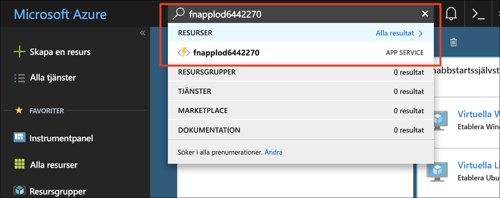
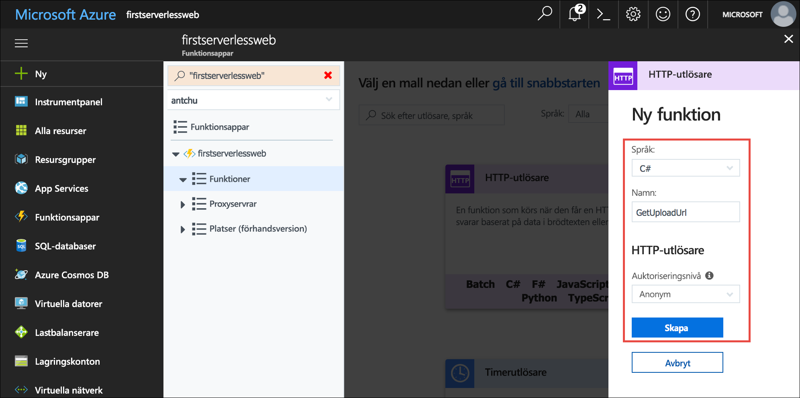
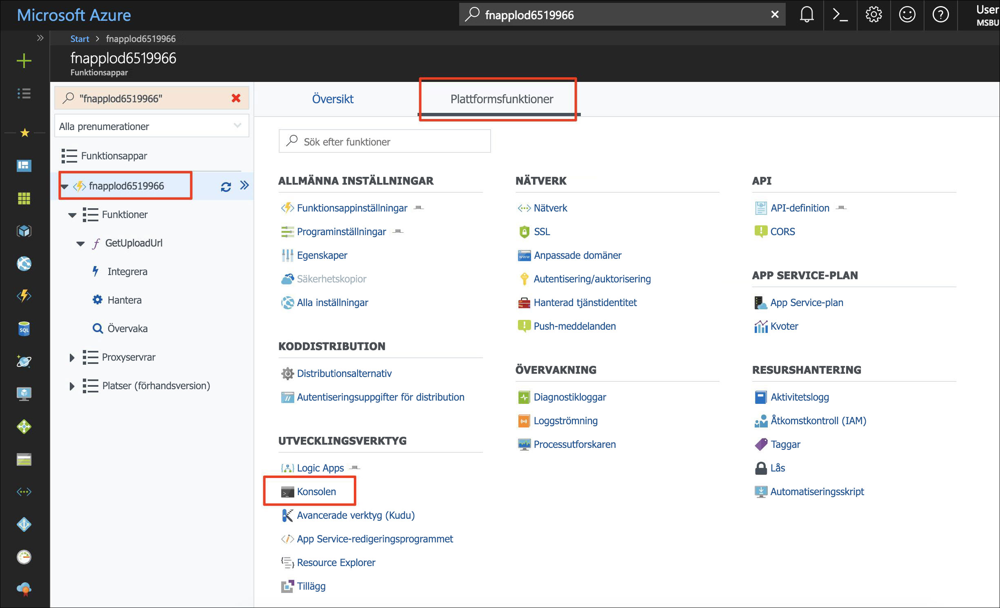
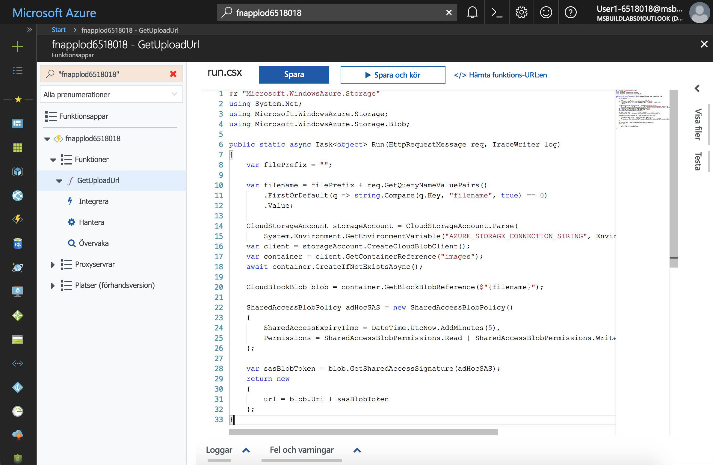
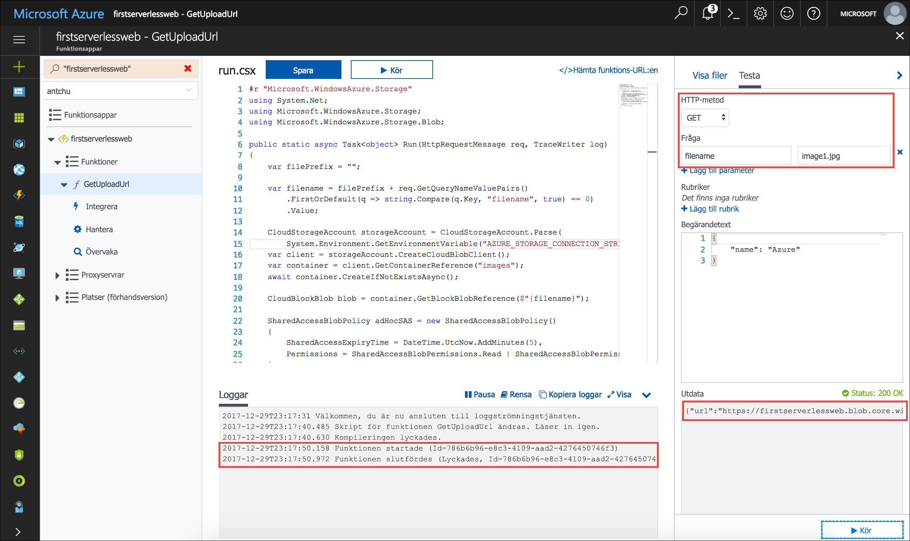
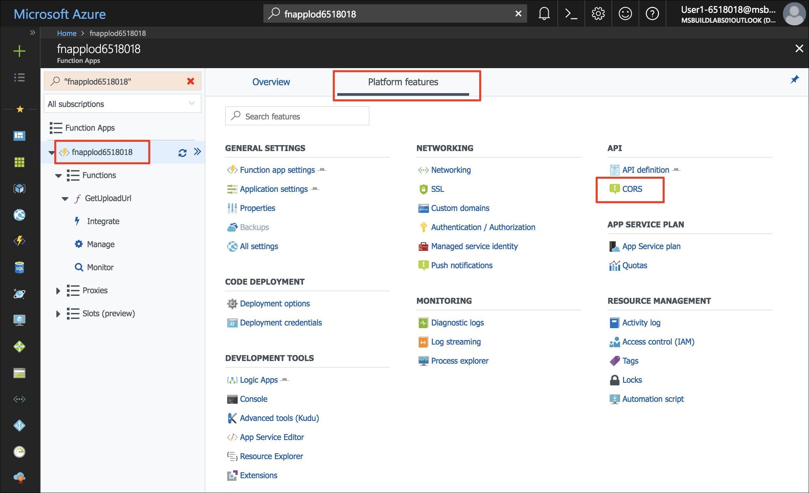
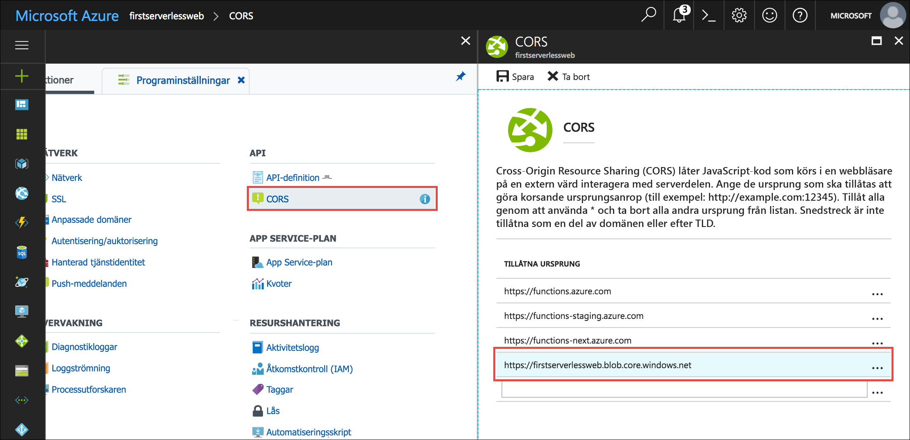

<span data-ttu-id="da750-101">Programmet som du skapar är ett fotogalleri.</span><span class="sxs-lookup"><span data-stu-id="da750-101">The application you're building is a photo gallery.</span></span> <span data-ttu-id="da750-102">Programmet använder JavaScript på klientsidan för att anropa API:er för uppladdning och visning av bilder.</span><span class="sxs-lookup"><span data-stu-id="da750-102">It uses client-side JavaScript to call APIs to upload and display images.</span></span> <span data-ttu-id="da750-103">I den här övningen skapar du ett API med hjälp av en serverlös funktion som genererar en tidsbegränsad URL för uppladdning av en bild.</span><span class="sxs-lookup"><span data-stu-id="da750-103">In this unit, you will create an API using a serverless function that generates a time-limited URL to upload an image.</span></span> <span data-ttu-id="da750-104">Webbprogrammet använder denna URL för att ladda upp en avbildning till Blob Storage med hjälp av [REST-API:et för Blob Storage](https://docs.microsoft.com/rest/api/storageservices/blob-service-rest-api).</span><span class="sxs-lookup"><span data-stu-id="da750-104">The web application uses this URL to upload an image to Blob storage using the [Blob storage REST API](https://docs.microsoft.com/rest/api/storageservices/blob-service-rest-api).</span></span>

## <a name="create-a-blob-storage-container-for-images"></a><span data-ttu-id="da750-105">Skapa en Blob Storage-container för bilder</span><span class="sxs-lookup"><span data-stu-id="da750-105">Create a Blob storage container for images</span></span>

<span data-ttu-id="da750-106">Programmet kräver en separat lagringscontainer för att ladda upp och lagra bilder.</span><span class="sxs-lookup"><span data-stu-id="da750-106">The application requires a separate storage container to upload and host images.</span></span>

1. <span data-ttu-id="da750-107">Kontrollera att du fortfarande är inloggad i Azure Cloud Shell (Bash).</span><span class="sxs-lookup"><span data-stu-id="da750-107">Ensure that you're still signed in to Azure Cloud Shell (Bash).</span></span> <span data-ttu-id="da750-108">Om inte, väljer du **Enter focus mode** (Växla till fokusläge) för att öppna ett Cloud Shell-fönster.</span><span class="sxs-lookup"><span data-stu-id="da750-108">If not, select **Enter focus mode** to open a Cloud Shell window.</span></span>

1.  <span data-ttu-id="da750-109">Skapa en ny container med namnet **images** (bilder) i ditt lagringskonto med offentlig åtkomst till alla blobbar.</span><span class="sxs-lookup"><span data-stu-id="da750-109">Create a new container in your Storage account named **images** in your Storage account with public access to all blobs.</span></span>

    ```azurecli
    az storage container create -n images --account-name <storage account name> --public-access blob
    ```

## <a name="create-an-azure-functions-app"></a><span data-ttu-id="da750-110">Skapa en Azure Functions-app</span><span class="sxs-lookup"><span data-stu-id="da750-110">Create an Azure Functions app</span></span>

<span data-ttu-id="da750-111">Med tjänsten Azure Functions kan du köra serverlösa funktioner.</span><span class="sxs-lookup"><span data-stu-id="da750-111">Azure Functions is a service for running serverless functions.</span></span> <span data-ttu-id="da750-112">En serverlös funktion kan utlösas (anropas) av händelser som till exempel en HTTP-begäran eller när en blobb skapas i en lagringscontainer.</span><span class="sxs-lookup"><span data-stu-id="da750-112">A serverless function can be triggered (called) by events, such as an HTTP request, or when a blob is created in a storage container.</span></span>

<span data-ttu-id="da750-113">En Azure Functions-app är en container för en eller flera serverlösa funktioner.</span><span class="sxs-lookup"><span data-stu-id="da750-113">An Azure Functions app is a container for one or more serverless functions.</span></span>

- <span data-ttu-id="da750-114">Skapa en ny Azure Functions-app med ett unikt namn i resursgruppen som du skapade tidigare med namnet **first-serverless-app**.</span><span class="sxs-lookup"><span data-stu-id="da750-114">Create a new Functions app with a unique name in the **first-serverless-app** resource group that you created earlier.</span></span> <span data-ttu-id="da750-115">Ett lagringskonto krävs för Azure Functions-appar.</span><span class="sxs-lookup"><span data-stu-id="da750-115">Functions apps require a Storage account.</span></span> <span data-ttu-id="da750-116">I den här övningen använder du det befintliga lagringskonto som du skapade i den senaste övningen.</span><span class="sxs-lookup"><span data-stu-id="da750-116">In this unit, you will use the existing storage account you created in the last unit.</span></span>

    ```azurecli
    az functionapp create -n <function app name> -g first-serverless-app -s <storage account name> -c westcentralus
    ```

## <a name="create-an-http-triggered-serverless-function"></a><span data-ttu-id="da750-117">Skapa en HTTP-utlöst serverlös funktion</span><span class="sxs-lookup"><span data-stu-id="da750-117">Create an HTTP-triggered serverless function</span></span>

<span data-ttu-id="da750-118">Webbappen för fotogalleriet skickar en HTTP-begäran till den serverlösa funktionen för att generera en tidsbegränsad URL för säker uppladdning av en bild till Blob Storage.</span><span class="sxs-lookup"><span data-stu-id="da750-118">To securely upload an image to Blob storage, the photo gallery web app makes an HTTP request to the serverless function to generate a time-limited URL.</span></span> <span data-ttu-id="da750-119">Funktionen utlöses av en HTTP-begäran och använder Azure Storage SDK för att generera och returnera den säkra URL:en.</span><span class="sxs-lookup"><span data-stu-id="da750-119">The function is triggered by an HTTP request and uses the Azure Storage SDK to generate and return the secure URL.</span></span>

1. <span data-ttu-id="da750-120">När Functions-appen har skapats kan du söka efter den på [Azure Portal](https://portal.azure.com/?azure-portal=true) med hjälp av **sökrutan**.</span><span class="sxs-lookup"><span data-stu-id="da750-120">After the Functions app is created, search for it in the [Azure portal](https://portal.azure.com/?azure-portal=true) using the **Search** box.</span></span> <span data-ttu-id="da750-121">Klicka på appen för att öppna den.</span><span class="sxs-lookup"><span data-stu-id="da750-121">Click on the app to open it.</span></span>

    

1. <span data-ttu-id="da750-123">I Functions-appfönstrets vänstra navigeringsfönster pekar du på **Functions** och klickar på plustecknet (+) för att skapa en ny serverlös funktion.</span><span class="sxs-lookup"><span data-stu-id="da750-123">In the left navigation of the Functions app window, point to **Functions** and click the plus sign (+) to create a new serverless function.</span></span>

    

1. <span data-ttu-id="da750-125">Klicka på **Anpassad funktion** för att visa en lista med funktionsmallar.</span><span class="sxs-lookup"><span data-stu-id="da750-125">Click **Custom function** to see a list of function templates.</span></span>

1. <span data-ttu-id="da750-126">Leta rätt på mallen **HttpTrigger** och klicka på C# eller JavaScript.</span><span class="sxs-lookup"><span data-stu-id="da750-126">Find the **HttpTrigger** template and click C# or JavaScript.</span></span>

1. <span data-ttu-id="da750-127">Använd dessa värden för att skapa en funktion som genererar en blobbuppladdnings-URL:</span><span class="sxs-lookup"><span data-stu-id="da750-127">Use the following values to create a function that generates a blob upload URL:</span></span>

    | <span data-ttu-id="da750-128">Inställning</span><span class="sxs-lookup"><span data-stu-id="da750-128">Setting</span></span>      |  <span data-ttu-id="da750-129">Föreslaget värde</span><span class="sxs-lookup"><span data-stu-id="da750-129">Suggested value</span></span>   | <span data-ttu-id="da750-130">Beskrivning</span><span class="sxs-lookup"><span data-stu-id="da750-130">Description</span></span>                                        |
    | --- | --- | ---|
    | <span data-ttu-id="da750-131">**Språk**</span><span class="sxs-lookup"><span data-stu-id="da750-131">**Language**</span></span> | <span data-ttu-id="da750-132">C# eller JavaScript</span><span class="sxs-lookup"><span data-stu-id="da750-132">C# or JavaScript</span></span> | <span data-ttu-id="da750-133">Välj det språk som du vill använda.</span><span class="sxs-lookup"><span data-stu-id="da750-133">Select the language that you want to use.</span></span> |
    | <span data-ttu-id="da750-134">**Namnge din funktion**</span><span class="sxs-lookup"><span data-stu-id="da750-134">**Name your function**</span></span> | <span data-ttu-id="da750-135">GetUploadUrl</span><span class="sxs-lookup"><span data-stu-id="da750-135">GetUploadUrl</span></span> | <span data-ttu-id="da750-136">Ange det här namnet exakt så som det visas så att programmet kan identifiera funktionen.</span><span class="sxs-lookup"><span data-stu-id="da750-136">Enter this name exactly as shown, so the application can discover the function.</span></span> |
    | <span data-ttu-id="da750-137">**Auktoriseringsnivå**</span><span class="sxs-lookup"><span data-stu-id="da750-137">**Authorization level**</span></span> | <span data-ttu-id="da750-138">Anonym</span><span class="sxs-lookup"><span data-stu-id="da750-138">Anonymous</span></span> | <span data-ttu-id="da750-139">Gör funktionen offentligt tillgänglig.</span><span class="sxs-lookup"><span data-stu-id="da750-139">Allows the function to be accessed publicly.</span></span> |

    

1. <span data-ttu-id="da750-141">Klicka på **Skapa** för att skapa funktionen.</span><span class="sxs-lookup"><span data-stu-id="da750-141">Click **Create** to create the function.</span></span>

<span data-ttu-id="da750-142">::: zone pivot="csharp"</span><span class="sxs-lookup"><span data-stu-id="da750-142">::: zone pivot="csharp"</span></span>
1. <span data-ttu-id="da750-143">(C#) När funktionens källkod visas ersätter du allt innehåll i **run.csx**-filen med innehållet i filen [**csharp/GetUploadUrl/run.csx**](https://raw.githubusercontent.com/Azure-Samples/functions-first-serverless-web-application/master/csharp/GetUploadUrl/run.csx).</span><span class="sxs-lookup"><span data-stu-id="da750-143">(C#) When the function's source code appears, replace all of the content in the **run.csx** file with the content in the [**csharp/GetUploadUrl/run.csx**](https://raw.githubusercontent.com/Azure-Samples/functions-first-serverless-web-application/master/csharp/GetUploadUrl/run.csx) file.</span></span>

<span data-ttu-id="da750-144">::: zone-end</span><span class="sxs-lookup"><span data-stu-id="da750-144">::: zone-end</span></span>

<span data-ttu-id="da750-145">::: zone pivot="javascript"</span><span class="sxs-lookup"><span data-stu-id="da750-145">::: zone pivot="javascript"</span></span>
1. <span data-ttu-id="da750-146">(JavaScript) Den här funktionen kräver `azure-storage`-paketet från npm.</span><span class="sxs-lookup"><span data-stu-id="da750-146">(JavaScript) This function requires the `azure-storage` package from npm.</span></span> <span data-ttu-id="da750-147">Paketet genererar den SAS-token (signatur för delad åtkomst) som krävs för att skapa den säkra URL:en.</span><span class="sxs-lookup"><span data-stu-id="da750-147">The package generates the shared access signature (SAS) token that's required to build the secure URL.</span></span> <span data-ttu-id="da750-148">Installera npm-paketet genom att klicka på Functions-appen i det vänstra navigeringsfönstret och klicka på **Plattformsfunktioner**.</span><span class="sxs-lookup"><span data-stu-id="da750-148">To install the npm package, click on the Functions app on the left navigation and click **Platform features**.</span></span>

1. <span data-ttu-id="da750-149">(JavaScript) Öppna ett konsolfönster genom att klicka på **Konsol**.</span><span class="sxs-lookup"><span data-stu-id="da750-149">(JavaScript) Click **Console** to reveal a console window.</span></span>

    

1. <span data-ttu-id="da750-151">(JavaScript) Kontrollera att den aktuella katalogen är **d:\home\site\wwwroot** genom att köra kommandot `cd d:\home\site\wwwroot`.</span><span class="sxs-lookup"><span data-stu-id="da750-151">(JavaScript) Ensure the current directory is **d:\home\site\wwwroot** by running the command `cd d:\home\site\wwwroot`.</span></span>

1. <span data-ttu-id="da750-152">(JavaScript) Kör kommandot `npm init -y` för att skapa en tom **package.json**-fil.</span><span class="sxs-lookup"><span data-stu-id="da750-152">(JavaScript) Run the command `npm init -y` to create an empty **package.json** file.</span></span>

1. <span data-ttu-id="da750-153">(JavaScript) Kör kommandot `npm install --save azure-storage` i konsolen för att installera paketet.</span><span class="sxs-lookup"><span data-stu-id="da750-153">(JavaScript) To install the package, run the command `npm install --save azure-storage` in the console.</span></span> <span data-ttu-id="da750-154">Spara paketet som **package.json**.</span><span class="sxs-lookup"><span data-stu-id="da750-154">Save the package as **package.json**.</span></span> <span data-ttu-id="da750-155">Det kan ta några minuter att slutföra åtgärden.</span><span class="sxs-lookup"><span data-stu-id="da750-155">It may take a few minutes to complete the operation.</span></span>

1. <span data-ttu-id="da750-156">(JavaScript) Klicka på funktionen (**GetUploadUrl**) i det vänstra navigeringsfönstret för att visa funktionen.</span><span class="sxs-lookup"><span data-stu-id="da750-156">(JavaScript) Click on the function (**GetUploadUrl**) in the left navigation to reveal the function.</span></span> <span data-ttu-id="da750-157">Byt ut hela innehållet i filen **index.js** med innehållet i filen [**javascript/GetUploadUrl/index.js**](https://raw.githubusercontent.com/Azure-Samples/functions-first-serverless-web-application/master/javascript/GetUploadUrl/index.js).</span><span class="sxs-lookup"><span data-stu-id="da750-157">Replace all of the content in the **index.js** file with the content in the [**javascript/GetUploadUrl/index.js**](https://raw.githubusercontent.com/Azure-Samples/functions-first-serverless-web-application/master/javascript/GetUploadUrl/index.js) file.</span></span>

    

<span data-ttu-id="da750-159">::: zone-end</span><span class="sxs-lookup"><span data-stu-id="da750-159">::: zone-end</span></span>

1. <span data-ttu-id="da750-160">Klicka på **Loggar** under kodfönstret för att expandera loggpanelen.</span><span class="sxs-lookup"><span data-stu-id="da750-160">Click **Logs** below the code window to expand the logs panel.</span></span>

1. <span data-ttu-id="da750-161">Klicka på **Spara**.</span><span class="sxs-lookup"><span data-stu-id="da750-161">Click **Save**.</span></span> <span data-ttu-id="da750-162">Granska loggpanelen för att bekräfta att funktionen har kompilerats.</span><span class="sxs-lookup"><span data-stu-id="da750-162">Check the logs panel to ensure the function is successfully compiled.</span></span>

<span data-ttu-id="da750-163">Funktionen genererar en SAS-URL (signatur för delad åtkomst) som används för att ladda upp en fil till Blob Storage.</span><span class="sxs-lookup"><span data-stu-id="da750-163">The function generates a shared access signature (SAS) URL that's used to upload a file to Blob storage.</span></span> <span data-ttu-id="da750-164">SAS-URL:en är giltig under en kort tid och tillåter bara uppladdning av en enda fil.</span><span class="sxs-lookup"><span data-stu-id="da750-164">The SAS URL is valid for a short time and only allows a single file to be uploaded.</span></span> <span data-ttu-id="da750-165">Läs dokumentationen för Blob Storage om du vill veta mer om [hur du använder signaturer för delad åtkomst](https://docs.microsoft.com/azure/storage/common/storage-dotnet-shared-access-signature-part-1).</span><span class="sxs-lookup"><span data-stu-id="da750-165">Consult the Blob storage documentation for more information on [how to use shared access signatures](https://docs.microsoft.com/azure/storage/common/storage-dotnet-shared-access-signature-part-1).</span></span>


## <a name="add-an-environment-variable-for-the-storage-connection-string"></a><span data-ttu-id="da750-166">Lägg till en miljövariabel för anslutningssträngen för lagring</span><span class="sxs-lookup"><span data-stu-id="da750-166">Add an environment variable for the storage connection string</span></span>

<span data-ttu-id="da750-167">Funktionen som du har skapat behöver en anslutningssträng för lagringskontot för att kunna generera SAS-URL:en.</span><span class="sxs-lookup"><span data-stu-id="da750-167">The function that you created requires a connection string for the Storage account so that it can generate the SAS URL.</span></span> <span data-ttu-id="da750-168">I stället för att hårdkoda anslutningssträngen i funktionens kod kan du lagra den som en programinställning.</span><span class="sxs-lookup"><span data-stu-id="da750-168">Instead of hardcoding the connection string in the function body, it can be stored as an application setting.</span></span> <span data-ttu-id="da750-169">Alla funktioner i Functions-appen kan komma åt programinställningar som miljövariabler.</span><span class="sxs-lookup"><span data-stu-id="da750-169">Application settings are accessible as environment variables by all functions in the Functions app.</span></span>

1. <span data-ttu-id="da750-170">Hämta anslutningssträngen för lagringskontot från Cloud Shell och spara den i en bash-variabel med namnet **STORAGE_CONNECTION_STRING**.</span><span class="sxs-lookup"><span data-stu-id="da750-170">In Cloud Shell, query the Storage account connection string and save it to a Bash variable named **STORAGE_CONNECTION_STRING**.</span></span>

    ```azurecli
    export STORAGE_CONNECTION_STRING=$(az storage account show-connection-string -n <storage account name> -g first-serverless-app --query "connectionString" --output tsv)
    ```

    <span data-ttu-id="da750-171">Bekräfta att variabeln är korrekt angiven.</span><span class="sxs-lookup"><span data-stu-id="da750-171">Confirm the variable is set successfully.</span></span>

    ```azurecli
    echo $STORAGE_CONNECTION_STRING
    ```

1. <span data-ttu-id="da750-172">Skapa en ny programinställning med namnet **AZURE_STORAGE_CONNECTION_STRING** genom att använda värdet som sparades i föregående steg.</span><span class="sxs-lookup"><span data-stu-id="da750-172">Create a new application setting named **AZURE_STORAGE_CONNECTION_STRING** using the value saved from the previous step.</span></span>

    ```azurecli
    az functionapp config appsettings set -n <function app name> -g first-serverless-app --settings AZURE_STORAGE_CONNECTION_STRING=$STORAGE_CONNECTION_STRING -o table
    ```

    <span data-ttu-id="da750-173">Bekräfta att kommandots utdata innehåller den nya programinställningen med rätt värde.</span><span class="sxs-lookup"><span data-stu-id="da750-173">Confirm that the command's output contains the new application setting with the correct value.</span></span>


## <a name="test-the-serverless-function"></a><span data-ttu-id="da750-174">Testa den serverlösa funktionen</span><span class="sxs-lookup"><span data-stu-id="da750-174">Test the serverless function</span></span>

<span data-ttu-id="da750-175">Förutom att skapa och redigera funktioner innehåller Azure Portal även ett inbyggt verktyg för att testa funktioner.</span><span class="sxs-lookup"><span data-stu-id="da750-175">In addition to creating and editing functions, the Azure portal also provides a built-in tool for testing functions.</span></span>

1. <span data-ttu-id="da750-176">Testa den serverlösa HTTP-funktionen genom att klicka på fliken **Testa** till höger om kodfönstret för att expandera testpanelen.</span><span class="sxs-lookup"><span data-stu-id="da750-176">To test the HTTP serverless function, on the right of the code window, click on the **Test** tab to expand the test panel.</span></span>

1. <span data-ttu-id="da750-177">Ändra **Http-metoden** till **GET**.</span><span class="sxs-lookup"><span data-stu-id="da750-177">Change the **Http method** to **GET**.</span></span>

1. <span data-ttu-id="da750-178">Under **Fråga** klickar du på **Lägg till parameter** och lägger till följande parameter:</span><span class="sxs-lookup"><span data-stu-id="da750-178">Under **Query**, click **Add parameter** and add the following parameter:</span></span>

    | <span data-ttu-id="da750-179">Namn</span><span class="sxs-lookup"><span data-stu-id="da750-179">Name</span></span>      |  <span data-ttu-id="da750-180">Värde</span><span class="sxs-lookup"><span data-stu-id="da750-180">Value</span></span>   | 
    | --- | --- |
    | <span data-ttu-id="da750-181">**filename**</span><span class="sxs-lookup"><span data-stu-id="da750-181">**filename**</span></span> | <span data-ttu-id="da750-182">image1.jpg</span><span class="sxs-lookup"><span data-stu-id="da750-182">image1.jpg</span></span> |

1. <span data-ttu-id="da750-183">Klicka på **Kör** på testpanelen för att skicka en HTTP-begäran till funktionen.</span><span class="sxs-lookup"><span data-stu-id="da750-183">In the test panel, click **Run** to send an HTTP request to the function.</span></span>

1. <span data-ttu-id="da750-184">Funktionen returnerar en uppladdnings-URL.</span><span class="sxs-lookup"><span data-stu-id="da750-184">The function returns an upload URL in the output.</span></span> <span data-ttu-id="da750-185">Funktionskörningen visas på loggpanelen.</span><span class="sxs-lookup"><span data-stu-id="da750-185">The function execution appears in the Logs panel.</span></span>

    


## <a name="configure-cors-in-the-functions-app"></a><span data-ttu-id="da750-187">Konfigurera CORS i Functions-appen</span><span class="sxs-lookup"><span data-stu-id="da750-187">Configure CORS in the Functions app</span></span>

<span data-ttu-id="da750-188">Eftersom funktionens klientdel finns i Blob Storage har den ett annat domännamn än Azure Functions-appen.</span><span class="sxs-lookup"><span data-stu-id="da750-188">Because the function front end is hosted in Blob storage, it has a different domain name than the Azure Functions app.</span></span> <span data-ttu-id="da750-189">För att JavaScript-koden på klientsidan ska kunna anropa funktionen som du har skapat måste Functions-appen konfigureras för CORS (Cross-Origin Resource Sharing).</span><span class="sxs-lookup"><span data-stu-id="da750-189">For the client-side JavaScript to successfully call the function that you created, the Functions app has to be configured for cross-origin resource sharing (CORS).</span></span>

1. <span data-ttu-id="da750-190">Klicka på namnet på Functions-appen i det vänstra navigeringsfältet i Functions-appens fönster.</span><span class="sxs-lookup"><span data-stu-id="da750-190">In the left navigation of the Functions app window, click on the name of your Functions app.</span></span>

1. <span data-ttu-id="da750-191">Visa en lista med avancerade funktioner genom att klicka på **Plattformsfunktioner**.</span><span class="sxs-lookup"><span data-stu-id="da750-191">Click on **Platform features** to view a list of advanced features.</span></span>

1. <span data-ttu-id="da750-192">Klicka på **CORS** under **API**.</span><span class="sxs-lookup"><span data-stu-id="da750-192">Under **API**, click **CORS**.</span></span>

    

1. <span data-ttu-id="da750-194">Lägg till tillåtna ursprung för program-URL:en från den föregående modulen, men utelämna det avslutande snedstrecket (/).</span><span class="sxs-lookup"><span data-stu-id="da750-194">Add an allow origin for the application URL from the previous module and omit the trailing slash (/).</span></span> <span data-ttu-id="da750-195">Till exempel: `https://firstserverlessweb.z4.web.core.windows.net`.</span><span class="sxs-lookup"><span data-stu-id="da750-195">For example: `https://firstserverlessweb.z4.web.core.windows.net`.</span></span>

    

1. <span data-ttu-id="da750-197">Klicka på **Spara**.</span><span class="sxs-lookup"><span data-stu-id="da750-197">Click **Save**.</span></span>

<span data-ttu-id="da750-198">::: zone pivot="csharp"</span><span class="sxs-lookup"><span data-stu-id="da750-198">::: zone pivot="csharp"</span></span>
1. <span data-ttu-id="da750-199">(C#) Gå tillbaka till funktionen `GetUploadUrl` och välj fliken **Integrera**.</span><span class="sxs-lookup"><span data-stu-id="da750-199">(C#) Navigate back to the `GetUploadUrl` function and select the **Integrate** tab.</span></span>

1. <span data-ttu-id="da750-200">(C#) Välj **OPTIONS** under **Utvalda HTTP-metoder**.</span><span class="sxs-lookup"><span data-stu-id="da750-200">(C#) Under **Selected HTTP methods**, select **OPTIONS**.</span></span>

    <span data-ttu-id="da750-201">**GET**, **POST** och **OPTIONS** bör vara markerade.</span><span class="sxs-lookup"><span data-stu-id="da750-201">**GET**, **POST**, and **OPTIONS** should all be selected.</span></span> <span data-ttu-id="da750-202">CORS använder **OPTIONS**-metoden, som inte är markerad som standard för C#-funktioner.</span><span class="sxs-lookup"><span data-stu-id="da750-202">CORS uses the **OPTIONS** method, which isn't selected by default for C# functions.</span></span>  

1. <span data-ttu-id="da750-203">(C#) Klicka på **Spara**.</span><span class="sxs-lookup"><span data-stu-id="da750-203">(C#) Click **Save**.</span></span>

<span data-ttu-id="da750-204">::: zone-end</span><span class="sxs-lookup"><span data-stu-id="da750-204">::: zone-end</span></span>

1. <span data-ttu-id="da750-205">Navigera till Functions-appen från Azure Portal.</span><span class="sxs-lookup"><span data-stu-id="da750-205">Still in the Azure portal, navigate to the Functions app.</span></span> <span data-ttu-id="da750-206">Välj fliken **Översikt**. Klicka på **Starta om** för att se till att ändringarna för CORS har tillämpats.</span><span class="sxs-lookup"><span data-stu-id="da750-206">Select the **Overview** tab. Click **Restart** to make sure that the changes for CORS take effect.</span></span>

## <a name="configure-cors-in-the-storage-account"></a><span data-ttu-id="da750-207">Konfigurera CORS i lagringskontot</span><span class="sxs-lookup"><span data-stu-id="da750-207">Configure CORS in the Storage account</span></span>

<span data-ttu-id="da750-208">Eftersom Functions-appen även gör JavaScript-anrop till Blob Storage för filuppladdning måste du även konfigurera lagringskontot för CORS.</span><span class="sxs-lookup"><span data-stu-id="da750-208">Because the Functions app also makes client-side JavaScript calls to Blob storage to upload files, you have to configure the Storage account for CORS.</span></span>

- <span data-ttu-id="da750-209">Kör följande kommando för att tillåta att alla ursprung laddar upp filer till lagringskontot:</span><span class="sxs-lookup"><span data-stu-id="da750-209">Run the following command to allow all origins to upload files to the Storage account:</span></span>

    ```azurecli
    az storage cors add --methods OPTIONS PUT --origins '*' --exposed-headers '*' --allowed-headers '*' --services b --account-name <storage account name>
    ```


## <a name="modify-the-web-app-to-upload-images"></a><span data-ttu-id="da750-210">Ändra webbappen för att ladda upp bilder</span><span class="sxs-lookup"><span data-stu-id="da750-210">Modify the web app to upload images</span></span>

<span data-ttu-id="da750-211">Webbappen hämtar inställningar från en fil med namnet **settings.js**.</span><span class="sxs-lookup"><span data-stu-id="da750-211">The web app retrieves settings from a file named **settings.js**.</span></span> <span data-ttu-id="da750-212">Skapa filen med hjälp av Cloud Shell i de följande stegen.</span><span class="sxs-lookup"><span data-stu-id="da750-212">In the following steps, you create the file using Cloud Shell.</span></span> <span data-ttu-id="da750-213">Ange `window.apiBaseUrl` till URL:en för Functions-appen och `window.blobBaseUrl` till URL:en för Azure Blob Storage-slutpunkten.</span><span class="sxs-lookup"><span data-stu-id="da750-213">You set `window.apiBaseUrl` to the URL of the Functions app, and `window.blobBaseUrl` to the URL of the Azure Blob storage endpoint.</span></span>

1. <span data-ttu-id="da750-214">Kontrollera i Cloud Shell att mappen **www/dist** är den aktuella mappen.</span><span class="sxs-lookup"><span data-stu-id="da750-214">In Cloud Shell, ensure that the current directory is the **www/dist** folder.</span></span>

    ```azurecli
    cd ~/functions-first-serverless-web-application/www/dist
    ```

1. <span data-ttu-id="da750-215">Kör en fråga för att hämta Functions-appens URL och lagra den i en bash-variabel med namnet **FUNCTION_APP_URL**.</span><span class="sxs-lookup"><span data-stu-id="da750-215">Query the URL of the Functions app and store it in a Bash variable named **FUNCTION_APP_URL**.</span></span>

    ```azurecli
    export FUNCTION_APP_URL="https://"$(az functionapp show -n <function app name> -g first-serverless-app --query "defaultHostName" --output tsv)
    ```

    <span data-ttu-id="da750-216">Bekräfta att variabeln är korrekt angiven.</span><span class="sxs-lookup"><span data-stu-id="da750-216">Confirm the variable is correctly set.</span></span>

    ```azurecli
    echo $FUNCTION_APP_URL
    ```

1. <span data-ttu-id="da750-217">Ställ in bas-URI:n för API-anrop till Functions-appen genom att skapa **settings.js**-filen.</span><span class="sxs-lookup"><span data-stu-id="da750-217">To set the base URI of API calls to your Functions app, create the **settings.js** file.</span></span> <span data-ttu-id="da750-218">Lägg till URL:en för Functions-appen som i följande exempel:</span><span class="sxs-lookup"><span data-stu-id="da750-218">Add the URL of the Functions app like the following example:</span></span>

    `window.apiBaseUrl = 'https://fnapp@lab.GlobalLabInstanceId.azurewebsites.net'`

    <span data-ttu-id="da750-219">Du kan göra ändringen genom att köra följande kommando eller genom att använda en kommandoradsredigerare som VIM.</span><span class="sxs-lookup"><span data-stu-id="da750-219">You can make the change by running the following command or by using a command-line editor like VIM.</span></span>

    ```azurecli
    echo "window.apiBaseUrl = '$FUNCTION_APP_URL'" > settings.js
    ```

    <span data-ttu-id="da750-220">Kontrollera att filen skrivits korrekt.</span><span class="sxs-lookup"><span data-stu-id="da750-220">Confirm the file was successfully written.</span></span>

    ```azurecli
    cat settings.js
    ```

1. <span data-ttu-id="da750-221">Kör en fråga för att hämta bas-URL:en för Blob Storage och lagra den i en bash-variabel med namnet **BLOB_BASE_URL**.</span><span class="sxs-lookup"><span data-stu-id="da750-221">Query the base URL for the Blob storage and store it in a Bash variable named **BLOB_BASE_URL**.</span></span>

    ```azurecli
    export BLOB_BASE_URL=$(az storage account show -n <storage account name> -g first-serverless-app --query primaryEndpoints.blob -o tsv | sed 's/\/$//')
    ```

    <span data-ttu-id="da750-222">Bekräfta att variabeln är korrekt angiven.</span><span class="sxs-lookup"><span data-stu-id="da750-222">Confirm the variable is correctly set.</span></span>

    ```azurecli
    echo $BLOB_BASE_URL
    ```

1. <span data-ttu-id="da750-223">Ställ in bas-URI:n för API-anrop till Functions-appen genom att lägga till Blob Storage-URL:en i **settings.js**-filen som i följande exempel:</span><span class="sxs-lookup"><span data-stu-id="da750-223">To set the base URI of API calls to your Functions app, append the Blob storage URL to the **settings.js** file like the following example:</span></span>

    `window.blobBaseUrl = 'https://mystorage.blob.core.windows.net'`

    <span data-ttu-id="da750-224">Du kan göra ändringen genom att köra följande kommando eller genom att använda en kommandoradsredigerare som VIM.</span><span class="sxs-lookup"><span data-stu-id="da750-224">You can make the change by running the following command or by using a command-line editor like VIM.</span></span>

    ```azurecli
    echo "window.blobBaseUrl = '$BLOB_BASE_URL'" >> settings.js
    ```

    <span data-ttu-id="da750-225">Kontrollera att filen skrivits korrekt och att den nu innehåller två rader.</span><span class="sxs-lookup"><span data-stu-id="da750-225">Confirm the file was successfully written and now contains two lines.</span></span>

    ```azurecli
    cat settings.js
    ```

1. <span data-ttu-id="da750-226">Ladda upp filen till Blob Storage.</span><span class="sxs-lookup"><span data-stu-id="da750-226">Upload the file to Blob storage.</span></span>

    ```azurecli
    az storage blob upload -c \$web --account-name <storage account name> -f settings.js -n settings.js
    ```


## <a name="test-the-web-application"></a><span data-ttu-id="da750-227">Testa webbprogrammet</span><span class="sxs-lookup"><span data-stu-id="da750-227">Test the web application</span></span>

<span data-ttu-id="da750-228">Nu kan galleriprogrammet ladda upp en bild till Blob Storage, men den kan inte visa bilder än.</span><span class="sxs-lookup"><span data-stu-id="da750-228">At this point, the gallery application is able to upload an image to Blob storage, but it can't display images yet.</span></span> <span data-ttu-id="da750-229">Den kommer att försöka anropa en `GetImages`-funktion som inte finns ännu eftersom du skapar den i en senare modul.</span><span class="sxs-lookup"><span data-stu-id="da750-229">It will try to call a `GetImages` function that doesn't exist yet because you create it in a later module.</span></span> <span data-ttu-id="da750-230">Anropet misslyckas och sidan verkar ha fastnat på ”Analyserar...”, men bilden du valt kommer att laddas upp korrekt.</span><span class="sxs-lookup"><span data-stu-id="da750-230">The call will fail and the web page will appear to be stuck on "Analyzing...," but the image you select will be successfully uploaded.</span></span>

<span data-ttu-id="da750-231">Du kan kontrollera att en bild har laddats upp genom att kontrollera innehållet i containern **images** på Azure Portal.</span><span class="sxs-lookup"><span data-stu-id="da750-231">You can verify that an image is successfully uploaded by checking the contents of the **images** container in the Azure portal.</span></span>

1. <span data-ttu-id="da750-232">Gå till programmet i ett webbläsarfönster.</span><span class="sxs-lookup"><span data-stu-id="da750-232">In a browser window, browse to the application.</span></span> <span data-ttu-id="da750-233">Välj en bildfil och ladda upp den.</span><span class="sxs-lookup"><span data-stu-id="da750-233">Select an image file and upload it.</span></span> <span data-ttu-id="da750-234">Uppladdningen slutförs, men eftersom vi inte har lagt till möjligheten att visa bilder ännu så visar inte appen det uppladdade fotot.</span><span class="sxs-lookup"><span data-stu-id="da750-234">The upload completes, but because we haven't added the ability to display images yet, the app doesn't show the uploaded photo.</span></span> <span data-ttu-id="da750-235">(Sidan verkar ha fastnat på ”Analyserar bild...” Du åtgärdar detta senare.)</span><span class="sxs-lookup"><span data-stu-id="da750-235">(The web page appears to be stuck on "Analyzing image..." You'll fix that later.)</span></span>

1. <span data-ttu-id="da750-236">Kontrollera i Cloud Shell att bilden har laddats upp till containern **images**.</span><span class="sxs-lookup"><span data-stu-id="da750-236">In Cloud Shell, confirm the image was uploaded to the **images** container.</span></span>

    ```azurecli
    az storage blob list --account-name <storage account name> -c images -o table
    ```

1. <span data-ttu-id="da750-237">Ta bort alla filer i containern **images** innan du går vidare till nästa självstudie.</span><span class="sxs-lookup"><span data-stu-id="da750-237">Before moving on to the next tutorial, delete all files in the **images** container.</span></span>

    ```azurecli
    az storage blob delete-batch -s images --account-name <storage account name>
    ```

## <a name="summary"></a><span data-ttu-id="da750-238">Sammanfattning</span><span class="sxs-lookup"><span data-stu-id="da750-238">Summary</span></span>

<span data-ttu-id="da750-239">I den här enheten har du skapat en Azure Functions-app och lärt dig hur du använder en serverlös funktion för att ladda upp bilder till Blob Storage från ett webbprogram.</span><span class="sxs-lookup"><span data-stu-id="da750-239">In this unit, you created an Azure Functions app and learned how to use a serverless function to allow a web application to upload images to Blob storage.</span></span> <span data-ttu-id="da750-240">I nästa avsnitt lär du dig att skapa miniatyrbilder för de uppladdade bilderna med hjälp av en blobbutlöst serverlös funktion.</span><span class="sxs-lookup"><span data-stu-id="da750-240">Next, you will learn how to create thumbnails for the uploaded images using a blob-triggered serverless function.</span></span>