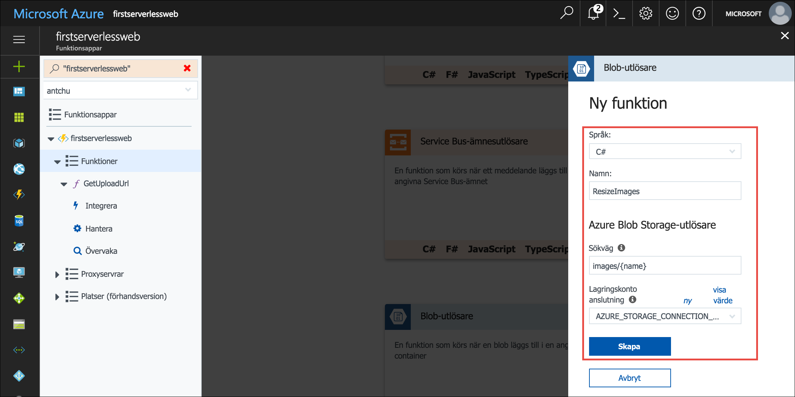
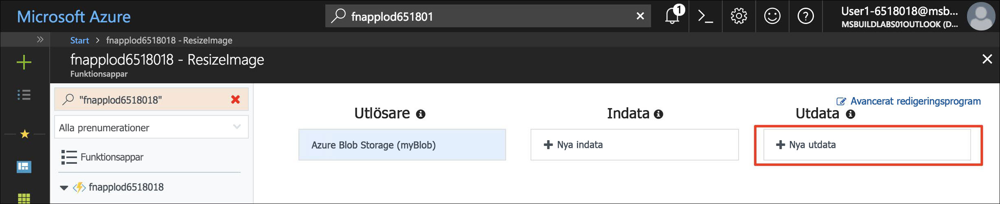
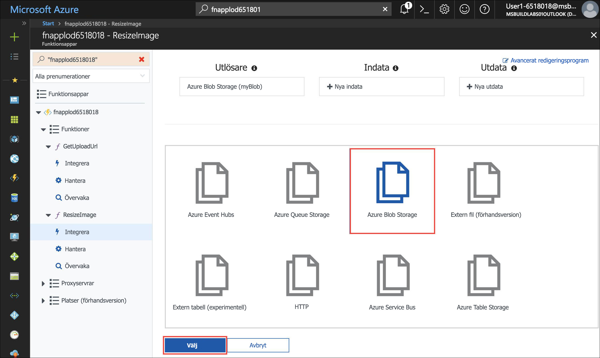
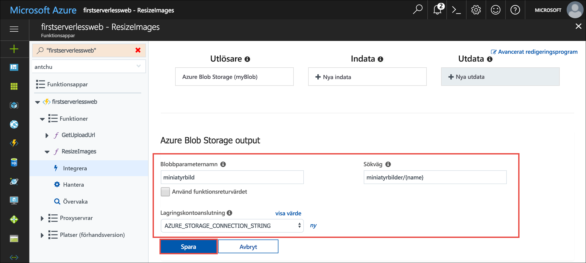
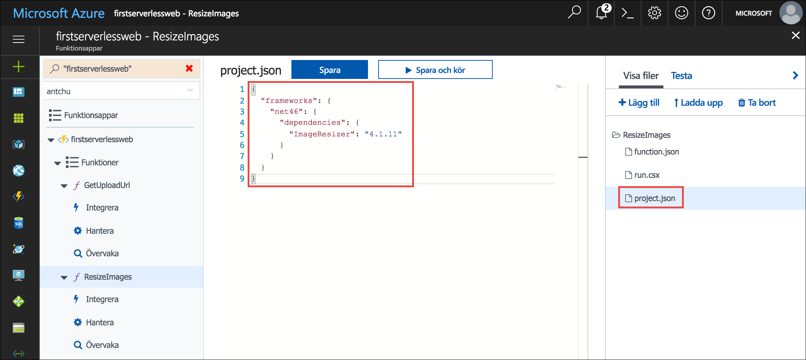

<span data-ttu-id="4eaa4-101">I den föregående delen lärde du dig hur du kan använda en serverlös funktion för att på ett säkert sätt ladda upp bilder till Blob Storage från ett webbprogram.</span><span class="sxs-lookup"><span data-stu-id="4eaa4-101">In the previous unit, you saw how a serverless function can facilitate the secure uploading of images to Blob storage from a web application.</span></span> <span data-ttu-id="4eaa4-102">I den här modulen ska du skapa en annan serverlös funktion för att bevaka uppladdade bilder och skapa miniatyrbilder från dem.</span><span class="sxs-lookup"><span data-stu-id="4eaa4-102">In this module, you create another serverless function to watch for uploaded images and create thumbnails from them.</span></span>

## <a name="create-a-blob-storage-container-for-thumbnails"></a><span data-ttu-id="4eaa4-103">Skapa en Blob Storage-container för miniatyrbilder</span><span class="sxs-lookup"><span data-stu-id="4eaa4-103">Create a Blob storage container for thumbnails</span></span>

<span data-ttu-id="4eaa4-104">Bilderna i fullstorlek lagras i en container med namnet **images** (bilder).</span><span class="sxs-lookup"><span data-stu-id="4eaa4-104">The full-size images are stored in a container named **images**.</span></span> <span data-ttu-id="4eaa4-105">Du behöver en annan container för att lagra miniatyrbilderna för dessa bilder.</span><span class="sxs-lookup"><span data-stu-id="4eaa4-105">You need another container to store thumbnails of those images.</span></span>

1. <span data-ttu-id="4eaa4-106">Kontrollera att du fortfarande är inloggad i Cloud Shell (Bash).</span><span class="sxs-lookup"><span data-stu-id="4eaa4-106">Ensure you're still signed in to Cloud Shell (Bash).</span></span> <span data-ttu-id="4eaa4-107">Om du inte är det väljer du **Enter focus mode** (Växla till fokusläge) för att öppna ett Cloud Shell-fönster.</span><span class="sxs-lookup"><span data-stu-id="4eaa4-107">If you aren't, select **Enter focus mode** to open a Cloud Shell window.</span></span> 

1. <span data-ttu-id="4eaa4-108">Skapa en ny container med namnet **thumbnails** (miniatyrbilder) i ditt lagringskonto med offentlig åtkomst till alla blobar.</span><span class="sxs-lookup"><span data-stu-id="4eaa4-108">Create a new container named **thumbnails** in your Storage account with public access to all blobs.</span></span>

    ```azurecli
    az storage container create -n thumbnails --account-name <storage account name> --public-access blob
    ```


## <a name="create-a-blob-triggered-serverless-function"></a><span data-ttu-id="4eaa4-109">Skapa en blobutlöst serverlös funktion</span><span class="sxs-lookup"><span data-stu-id="4eaa4-109">Create a blob-triggered serverless function</span></span>

<span data-ttu-id="4eaa4-110">En utlösare definierar hur en funktion anropas.</span><span class="sxs-lookup"><span data-stu-id="4eaa4-110">A trigger defines how a function is invoked.</span></span> <span data-ttu-id="4eaa4-111">Funktionen du nu ska skapa använder en blob-utlösare.</span><span class="sxs-lookup"><span data-stu-id="4eaa4-111">The function you create next uses a blob trigger.</span></span> <span data-ttu-id="4eaa4-112">Funktionen anropas automatiskt när en blob (bildfil) laddas upp till containern **images**.</span><span class="sxs-lookup"><span data-stu-id="4eaa4-112">The function is automatically invoked when a blob (image file) is uploaded to the **images** container.</span></span> <span data-ttu-id="4eaa4-113">En funktion måste ha en utlösare.</span><span class="sxs-lookup"><span data-stu-id="4eaa4-113">A function must have one trigger.</span></span> <span data-ttu-id="4eaa4-114">Utlösare har associerade data, vilket vanligtvis är nyttolasten som utlöste funktionen.</span><span class="sxs-lookup"><span data-stu-id="4eaa4-114">Triggers have associated data, which are usually the payload that triggered the function.</span></span>

<span data-ttu-id="4eaa4-115">Bindningar definierar hur en funktion läser och skriver data i Azure eller andra tjänster från tredje part.</span><span class="sxs-lookup"><span data-stu-id="4eaa4-115">Bindings define how a function reads or writes data in Azure or third-party services.</span></span> <span data-ttu-id="4eaa4-116">Den här funktionen skapar en miniatyrbild för bilden som utlöser den och sparar miniatyrbilden i containern *thumbnails*.</span><span class="sxs-lookup"><span data-stu-id="4eaa4-116">This function creates a thumbnail version of the image that triggers it and saves the thumbnail in a *thumbnails* container.</span></span>

1. <span data-ttu-id="4eaa4-117">Öppna din funktionsapp i [Azure Portal](https://portal.azure.com/?azure-portal=true).</span><span class="sxs-lookup"><span data-stu-id="4eaa4-117">Open your Functions app in the [Azure portal](https://portal.azure.com/?azure-portal=true).</span></span>

1. <span data-ttu-id="4eaa4-118">I appens vänstra navigeringsfönster pekar du på **Functions** och klickar på plustecknet (+) för att skapa en ny serverlös funktion.</span><span class="sxs-lookup"><span data-stu-id="4eaa4-118">In the Functions app window's left navigation, point to **Functions** and click the plus sign (+) to create a new serverless function.</span></span> <span data-ttu-id="4eaa4-119">Om en snabbstartssida visas klickar du på **Anpassad funktion** för att visa en lista med funktionsmallar.</span><span class="sxs-lookup"><span data-stu-id="4eaa4-119">If a quickstart page appears, click **Custom function** to see a list of function templates.</span></span>

1. <span data-ttu-id="4eaa4-120">Leta upp och välj mallen **BlobTrigger**.</span><span class="sxs-lookup"><span data-stu-id="4eaa4-120">Find the **BlobTrigger** template and select it.</span></span>

1. <span data-ttu-id="4eaa4-121">Använd dessa värden för att skapa en funktion som genererar miniatyrbilder när bilder laddas upp:</span><span class="sxs-lookup"><span data-stu-id="4eaa4-121">Use these values to create a function that creates thumbnails as images are uploaded:</span></span>

    | <span data-ttu-id="4eaa4-122">Inställning</span><span class="sxs-lookup"><span data-stu-id="4eaa4-122">Setting</span></span>      |  <span data-ttu-id="4eaa4-123">Föreslaget värde</span><span class="sxs-lookup"><span data-stu-id="4eaa4-123">Suggested value</span></span>   | <span data-ttu-id="4eaa4-124">Beskrivning</span><span class="sxs-lookup"><span data-stu-id="4eaa4-124">Description</span></span>                                        |
    | --- | --- | ---|
    | <span data-ttu-id="4eaa4-125">**Språk**</span><span class="sxs-lookup"><span data-stu-id="4eaa4-125">**Language**</span></span> | <span data-ttu-id="4eaa4-126">C# eller JavaScript</span><span class="sxs-lookup"><span data-stu-id="4eaa4-126">C# or JavaScript</span></span> | <span data-ttu-id="4eaa4-127">Välj det språk du föredrar.</span><span class="sxs-lookup"><span data-stu-id="4eaa4-127">Choose your preferred language.</span></span> |
    | <span data-ttu-id="4eaa4-128">**Namnge din funktion**</span><span class="sxs-lookup"><span data-stu-id="4eaa4-128">**Name your function**</span></span> | <span data-ttu-id="4eaa4-129">ResizeImage</span><span class="sxs-lookup"><span data-stu-id="4eaa4-129">ResizeImage</span></span> | <span data-ttu-id="4eaa4-130">Ange det här namnet exakt så som det visas så att programmet kan identifiera funktionen.</span><span class="sxs-lookup"><span data-stu-id="4eaa4-130">Enter this name exactly as shown, so the application can discover the function.</span></span> |
    | <span data-ttu-id="4eaa4-131">**Sökväg**</span><span class="sxs-lookup"><span data-stu-id="4eaa4-131">**Path**</span></span> | <span data-ttu-id="4eaa4-132">images/{name}</span><span class="sxs-lookup"><span data-stu-id="4eaa4-132">images/{name}</span></span> | <span data-ttu-id="4eaa4-133">Kör funktionen när en fil läggs till i containern **images**.</span><span class="sxs-lookup"><span data-stu-id="4eaa4-133">Execute the function when a file appears in the **images** container.</span></span> |
    | <span data-ttu-id="4eaa4-134">**Lagringskontoinformation**</span><span class="sxs-lookup"><span data-stu-id="4eaa4-134">**Storage account information**</span></span> | <span data-ttu-id="4eaa4-135">AZURE_STORAGE_CONNECTION_STRING</span><span class="sxs-lookup"><span data-stu-id="4eaa4-135">AZURE_STORAGE_CONNECTION_STRING</span></span> | <span data-ttu-id="4eaa4-136">Använd miljövariabeln som skapades tidigare med anslutningssträngen.</span><span class="sxs-lookup"><span data-stu-id="4eaa4-136">Use the environment variable previously created with the connection string.</span></span> |

    

1. <span data-ttu-id="4eaa4-138">Skapa funktionen genom att klicka på **Skapa**.</span><span class="sxs-lookup"><span data-stu-id="4eaa4-138">Click **Create** to create the function.</span></span>

1. <span data-ttu-id="4eaa4-139">När funktionen har skapats klickar du på **Integrera** för att visa funktionens utlösare, indata och utdatabindningar.</span><span class="sxs-lookup"><span data-stu-id="4eaa4-139">When the function is created, click **Integrate** to view its trigger, input, and output bindings.</span></span>

1. <span data-ttu-id="4eaa4-140">Klicka på **Nya utdata** för att skapa en ny utdatabindning.</span><span class="sxs-lookup"><span data-stu-id="4eaa4-140">Click **New output** to create a new output binding.</span></span>

    

1. <span data-ttu-id="4eaa4-142">Välj **Azure Blob Storage** och klicka på **Välj**.</span><span class="sxs-lookup"><span data-stu-id="4eaa4-142">Select **Azure Blob Storage** and click **Select**.</span></span> <span data-ttu-id="4eaa4-143">Du kan behöva rulla ned för att se knappen **Välj**.</span><span class="sxs-lookup"><span data-stu-id="4eaa4-143">You may have to scroll down to see the **Select** button.</span></span>

    

1. <span data-ttu-id="4eaa4-145">Ange följande värden:</span><span class="sxs-lookup"><span data-stu-id="4eaa4-145">Enter the following values:</span></span>

    | <span data-ttu-id="4eaa4-146">Inställning</span><span class="sxs-lookup"><span data-stu-id="4eaa4-146">Setting</span></span>      |  <span data-ttu-id="4eaa4-147">Föreslaget värde</span><span class="sxs-lookup"><span data-stu-id="4eaa4-147">Suggested value</span></span>   | <span data-ttu-id="4eaa4-148">Beskrivning</span><span class="sxs-lookup"><span data-stu-id="4eaa4-148">Description</span></span>                                        |
    | --- | --- | ---|
    | <span data-ttu-id="4eaa4-149">**Blobparameternamn**</span><span class="sxs-lookup"><span data-stu-id="4eaa4-149">**Blob parameter name**</span></span> | <span data-ttu-id="4eaa4-150">thumbnail</span><span class="sxs-lookup"><span data-stu-id="4eaa4-150">thumbnail</span></span> | <span data-ttu-id="4eaa4-151">Funktionen använder parametern med det här namnet för att skriva miniatyrbilden.</span><span class="sxs-lookup"><span data-stu-id="4eaa4-151">The function uses the parameter with this name to write the thumbnail.</span></span> |
    | <span data-ttu-id="4eaa4-152">**Använd funktionsreturvärde**</span><span class="sxs-lookup"><span data-stu-id="4eaa4-152">**Use function return value**</span></span> | <span data-ttu-id="4eaa4-153">Nej</span><span class="sxs-lookup"><span data-stu-id="4eaa4-153">No</span></span> |  |
    | <span data-ttu-id="4eaa4-154">**Sökväg**</span><span class="sxs-lookup"><span data-stu-id="4eaa4-154">**Path**</span></span> | <span data-ttu-id="4eaa4-155">thumbnails/{name}</span><span class="sxs-lookup"><span data-stu-id="4eaa4-155">thumbnails/{name}</span></span> | <span data-ttu-id="4eaa4-156">Miniatyrbilderna skrivs till en container med namnet **thumbnails**.</span><span class="sxs-lookup"><span data-stu-id="4eaa4-156">The thumbnails are written to a container named **thumbnails**.</span></span> |
    | <span data-ttu-id="4eaa4-157">**Lagringskontoanslutning**</span><span class="sxs-lookup"><span data-stu-id="4eaa4-157">**Storage account connection**</span></span> | <span data-ttu-id="4eaa4-158">AZURE_STORAGE_CONNECTION_STRING</span><span class="sxs-lookup"><span data-stu-id="4eaa4-158">AZURE_STORAGE_CONNECTION_STRING</span></span> | <span data-ttu-id="4eaa4-159">Använd miljövariabeln som skapades tidigare med anslutningssträngen.</span><span class="sxs-lookup"><span data-stu-id="4eaa4-159">Use the environment variable previously created with the connection string.</span></span> |

    

<span data-ttu-id="4eaa4-161">::: zone pivot="javascript"</span><span class="sxs-lookup"><span data-stu-id="4eaa4-161">::: zone pivot="javascript"</span></span>
1. <span data-ttu-id="4eaa4-162">(JavaScript) Klicka på **Avancerad redigerare** i det övre högra hörnet i fönstret för att visa den JSON som representerar bindningarna.</span><span class="sxs-lookup"><span data-stu-id="4eaa4-162">(JavaScript) Click on **Advanced editor** in the top right corner of the window to reveal the JSON that represents the bindings.</span></span>

1. <span data-ttu-id="4eaa4-163">(JavaScript) Lägg till en egenskap med namnet `dataType` med värdet `binary` i `blobTrigger`-bindningen.</span><span class="sxs-lookup"><span data-stu-id="4eaa4-163">(JavaScript) In the `blobTrigger` binding, add a property named `dataType` with a value of `binary`.</span></span> <span data-ttu-id="4eaa4-164">När du gör det konfigureras bindningen så att blobinnehållet överförs till funktionen som binärdata.</span><span class="sxs-lookup"><span data-stu-id="4eaa4-164">This configures the binding to pass the blob contents to the function as binary data.</span></span>

```json
{
    "name": "myBlob",
    "type": "blobTrigger",
    "direction": "in",
    "path": "images/{name}",
    "connection": "AZURE_STORAGE_CONNECTION_STRING",
    "dataType": "binary"
}
```

<span data-ttu-id="4eaa4-165">::: zone-end</span><span class="sxs-lookup"><span data-stu-id="4eaa4-165">::: zone-end</span></span>

1. <span data-ttu-id="4eaa4-166">Skapa den nya bindningen genom att klicka på **Spara**.</span><span class="sxs-lookup"><span data-stu-id="4eaa4-166">Click **Save** to create the new binding.</span></span>

<span data-ttu-id="4eaa4-167">::: zone pivot="csharp"</span><span class="sxs-lookup"><span data-stu-id="4eaa4-167">::: zone pivot="csharp"</span></span>
1. <span data-ttu-id="4eaa4-168">(C#) Välj funktionsnamnet **ResizeImage** i det vänstra navigeringsfönstret för att öppna källkoden för funktionen.</span><span class="sxs-lookup"><span data-stu-id="4eaa4-168">(C#) Select the **ResizeImage** function name in the left navigation to open the function's source code.</span></span>

1. <span data-ttu-id="4eaa4-169">(C#) Funktionen kräver ett NuGet-paket med namnet **ImageResizer** för att generera miniatyrbilderna.</span><span class="sxs-lookup"><span data-stu-id="4eaa4-169">(C#) The function requires a NuGet package called **ImageResizer** to generate the thumbnails.</span></span> <span data-ttu-id="4eaa4-170">NuGet-paket läggs till i C#-funktioner med hjälp av en **project.json**-fil.</span><span class="sxs-lookup"><span data-stu-id="4eaa4-170">NuGet packages are added to C# functions using a **project.json** file.</span></span> <span data-ttu-id="4eaa4-171">Skapa filen genom att först klicka på **Visa filer** till höger för att visa filerna som funktionen består av.</span><span class="sxs-lookup"><span data-stu-id="4eaa4-171">To create the file, click **View Files** on the right to reveal the files that make up the function.</span></span>

1. <span data-ttu-id="4eaa4-172">(C#) Klicka på **Lägg till** för att lägga till en ny fil med namnet **project.json**.</span><span class="sxs-lookup"><span data-stu-id="4eaa4-172">(C#) Click **Add** to add a new file named **project.json**.</span></span>

1. <span data-ttu-id="4eaa4-173">(C#) Kopiera innehållet i [**/csharp/ResizeImage/project.json**](https://raw.githubusercontent.com/Azure-Samples/functions-first-serverless-web-application/master/csharp/ResizeImage/project.json) till den nya filen som skapats.</span><span class="sxs-lookup"><span data-stu-id="4eaa4-173">(C#) Copy the contents of the [**/csharp/ResizeImage/project.json**](https://raw.githubusercontent.com/Azure-Samples/functions-first-serverless-web-application/master/csharp/ResizeImage/project.json) file into the newly created file.</span></span> <span data-ttu-id="4eaa4-174">Spara filen.</span><span class="sxs-lookup"><span data-stu-id="4eaa4-174">Save the file.</span></span> <span data-ttu-id="4eaa4-175">Paket återställs automatiskt när filen uppdateras.</span><span class="sxs-lookup"><span data-stu-id="4eaa4-175">Packages are automatically restored when the file is updated.</span></span>

    

1. <span data-ttu-id="4eaa4-177">(C#) Under **Visa filer**väljer du **run.csx**.</span><span class="sxs-lookup"><span data-stu-id="4eaa4-177">(C#) Under **View Files**, select **run.csx**.</span></span> <span data-ttu-id="4eaa4-178">Ersätt dess innehåll med innehållet i filen [**/csharp/ResizeImage/run.csx**](https://raw.githubusercontent.com/Azure-Samples/functions-first-serverless-web-application/master/csharp/ResizeImage/run.csx).</span><span class="sxs-lookup"><span data-stu-id="4eaa4-178">Replace its content with the content in the [**/csharp/ResizeImage/run.csx**](https://raw.githubusercontent.com/Azure-Samples/functions-first-serverless-web-application/master/csharp/ResizeImage/run.csx) file.</span></span>

<span data-ttu-id="4eaa4-179">::: zone-end</span><span class="sxs-lookup"><span data-stu-id="4eaa4-179">::: zone-end</span></span>

<span data-ttu-id="4eaa4-180">::: zone pivot="javascript"</span><span class="sxs-lookup"><span data-stu-id="4eaa4-180">::: zone pivot="javascript"</span></span>
1. <span data-ttu-id="4eaa4-181">(JavaScript) I den här funktionen behövs paketet `jimp` från npm till att ändra storlek på fotot.</span><span class="sxs-lookup"><span data-stu-id="4eaa4-181">(JavaScript) This function requires the `jimp` package from npm to resize the photo.</span></span> <span data-ttu-id="4eaa4-182">Du installerar npm-paketet genom att klicka på Funktionsapp-namnet i det vänstra navigeringsfönstret och klicka på **Plattformsfunktioner**.</span><span class="sxs-lookup"><span data-stu-id="4eaa4-182">To install the npm package, click on the Functions app name on the left navigation and click **Platform features**.</span></span>

1. <span data-ttu-id="4eaa4-183">(JavaScript) Öppna ett konsolfönster genom att klicka på **Konsol**.</span><span class="sxs-lookup"><span data-stu-id="4eaa4-183">(JavaScript) Click **Console** to reveal a console window.</span></span>

1. <span data-ttu-id="4eaa4-184">(JavaScript) Kör kommandot `npm install jimp` i konsolen.</span><span class="sxs-lookup"><span data-stu-id="4eaa4-184">(JavaScript) Run the command `npm install jimp` in the console.</span></span> <span data-ttu-id="4eaa4-185">Det kan ta några minuter att slutföra åtgärden.</span><span class="sxs-lookup"><span data-stu-id="4eaa4-185">It may take a few minutes to complete the operation.</span></span>

1. <span data-ttu-id="4eaa4-186">(JavaScript) Klicka på funktionsnamnet **ResizeImage** i det vänstra navigeringsfönstret för att visa funktionen.</span><span class="sxs-lookup"><span data-stu-id="4eaa4-186">(JavaScript) Click on the **ResizeImage** function name in the left navigation to reveal the function.</span></span> <span data-ttu-id="4eaa4-187">Byt ut hela innehållet filen **index.js** mot innehållet i filen [**/javascript/ResizeImage/index.js**](https://raw.githubusercontent.com/Azure-Samples/functions-first-serverless-web-application/master/javascript/ResizeImage/index.js).</span><span class="sxs-lookup"><span data-stu-id="4eaa4-187">Replace all the content in the **index.js** file with the content of the [**/javascript/ResizeImage/index.js**](https://raw.githubusercontent.com/Azure-Samples/functions-first-serverless-web-application/master/javascript/ResizeImage/index.js) file.</span></span>

<span data-ttu-id="4eaa4-188">::: zone-end</span><span class="sxs-lookup"><span data-stu-id="4eaa4-188">::: zone-end</span></span>

1. <span data-ttu-id="4eaa4-189">Expandera loggpanelen genom att klicka på **Loggar** under kodfönstret.</span><span class="sxs-lookup"><span data-stu-id="4eaa4-189">To expand the logs panel, click **Logs** below the code window.</span></span>

1. <span data-ttu-id="4eaa4-190">Klicka på **Spara**.</span><span class="sxs-lookup"><span data-stu-id="4eaa4-190">Click **Save**.</span></span> <span data-ttu-id="4eaa4-191">Kontrollera loggpanelen för att bekräfta att funktionen har sparats och att det inte har uppstått några fel.</span><span class="sxs-lookup"><span data-stu-id="4eaa4-191">Check the Logs panel to ensure the function is successfully saved and there are no errors.</span></span>


## <a name="test-the-serverless-function"></a><span data-ttu-id="4eaa4-192">Testa den serverlösa funktionen</span><span class="sxs-lookup"><span data-stu-id="4eaa4-192">Test the serverless function</span></span>

1. <span data-ttu-id="4eaa4-193">Öppna programmet i en webbläsare.</span><span class="sxs-lookup"><span data-stu-id="4eaa4-193">Open the application in a browser.</span></span> <span data-ttu-id="4eaa4-194">Välj en bildfil och ladda upp den.</span><span class="sxs-lookup"><span data-stu-id="4eaa4-194">Select an image file and upload it.</span></span> <span data-ttu-id="4eaa4-195">Uppladdningen slutförs, men eftersom vi inte har lagt till möjligheten att visa bilder ännu så visar inte appen det uppladdade fotot.</span><span class="sxs-lookup"><span data-stu-id="4eaa4-195">The upload completes, but because we haven't added the ability to display images yet, the app doesn't show the uploaded photo.</span></span>

1. <span data-ttu-id="4eaa4-196">Bekräfta i Cloud Shell att bilden har laddats upp till containern **images**.</span><span class="sxs-lookup"><span data-stu-id="4eaa4-196">In Cloud Shell, confirm the image was uploaded to the **images** container.</span></span>

    ```azurecli
    az storage blob list --account-name <storage account name> -c images -o table
    ```

1. <span data-ttu-id="4eaa4-197">Kontrollera att miniatyrbilden har skapats i en container med namnet **thumbnails**.</span><span class="sxs-lookup"><span data-stu-id="4eaa4-197">Confirm the thumbnail was created in a container named **thumbnails**.</span></span>

    ```azurecli
    az storage blob list --account-name <storage account name> -c thumbnails -o table
    ```

1. <span data-ttu-id="4eaa4-198">Hämta URL:en för miniatyrbilden.</span><span class="sxs-lookup"><span data-stu-id="4eaa4-198">Get the URL for the thumbnail.</span></span>

    ```azurecli
    az storage blob url --account-name <storage account name> -c thumbnails -n <filename> --output tsv
    ```

    <span data-ttu-id="4eaa4-199">Öppna URL:en i en webbläsare och bekräfta att miniatyrbilden har skapats korrekt.</span><span class="sxs-lookup"><span data-stu-id="4eaa4-199">Open the URL in a browser and confirm the thumbnail was properly created.</span></span>

1. <span data-ttu-id="4eaa4-200">Ta bort alla filer i containrarna **images** och **thumbnails** innan du går vidare till nästa självstudie.</span><span class="sxs-lookup"><span data-stu-id="4eaa4-200">Before continuing to the next tutorial, delete all files in the **images** and **thumbnails** containers.</span></span>

    ```azurecli
    az storage blob delete-batch -s images --account-name <storage account name>
    ```

    ```azurecli
    az storage blob delete-batch -s thumbnails --account-name <storage account name>
    ```

## <a name="summary"></a><span data-ttu-id="4eaa4-201">Sammanfattning</span><span class="sxs-lookup"><span data-stu-id="4eaa4-201">Summary</span></span>

<span data-ttu-id="4eaa4-202">I den här delen har du skapat en serverlös funktion som genererar en miniatyrbild varje gång en bild laddas upp till en Blob Storage-container.</span><span class="sxs-lookup"><span data-stu-id="4eaa4-202">In this unit, you created a serverless function to create a thumbnail when an image is uploaded to a Blob storage container.</span></span> <span data-ttu-id="4eaa4-203">I nästa avsnitt får du lära du dig att använda Azure Cosmos DB till att lagra och visa metadata om bilder.</span><span class="sxs-lookup"><span data-stu-id="4eaa4-203">Next, you will learn how to use Azure Cosmos DB to store and list image metadata.</span></span>