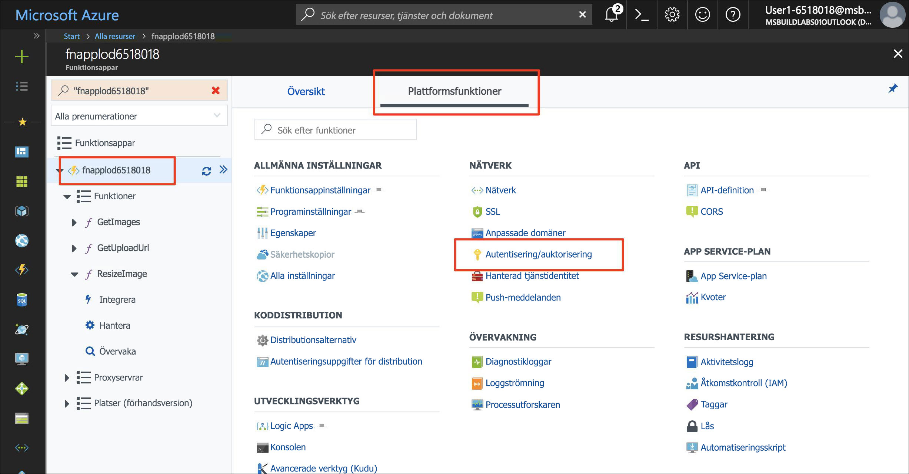
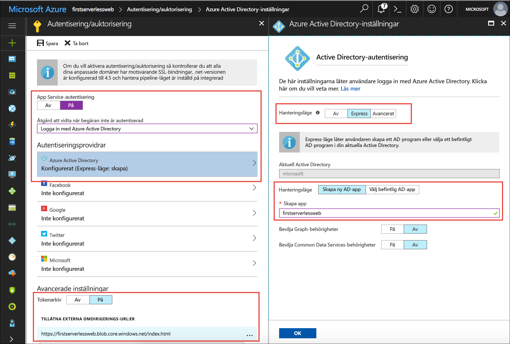
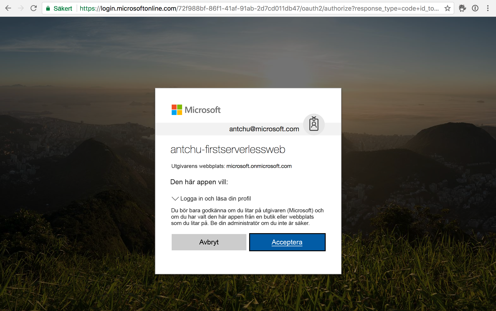

Med Azure App Service-autentisering kan du använda nyckelfärdig autentisering i en Azure Functions-app. Autentiseringen integreras sömlöst med Facebook, Twitter, Microsoft-konton, Google och Azure Active Directory. Du lägger till App Service-autentisering för att skydda serverdels-API:erna för din webbapp.

## <a name="enable-app-service-authentication"></a>Aktivera App Service-autentisering

1. Logga in på [Azure-portalen](https://portal.azure.com/triplecrownlabs.onmicrosoft.com?azure-portal=true) med samma konto som du använde för att aktivera sandbox-miljön.

1. Öppna funktionsappen.

1. Välj **Autentisering/auktorisering** under **Plattformsfunktioner**.

    

1. Välj följande värden:

    | Inställning      |  Föreslaget värde   | Beskrivning                                        |
    | --- | --- | ---|
    | **App Service-autentisering** | På | Aktivera autentisering. |
    | **Åtgärd när begäran inte har autentiserats** | Logga in med Azure Active Directory. | Välj en konfigurerad autentiseringsmetod (se nedan). |
    | **Autentiseringsprovidrar** | Se nedan. | Se nedan. |
    | **Tokenarkiv** | På | Tillåt att App Service lagrar och hanterar token. |
    | **Tillåtna externa omdirigeringswebbadresser** | Webbadressen för ditt program, till exempel https://firstserverlessweb.z4.web.core.windows.net/. | Webbadresser som App Service kan omdirigera till när en användare har autentiserats. |

1. Visa **Azure Active Directory-inställningar** genom att välja **Azure Active Directory**.

    1. Välj **Express** som **Hanteringsläge** och fyll i informationen nedan.

        | Inställning      |  Föreslaget värde   | Beskrivning                                        |
        | --- | --- | ---|
        | **Hanteringsläge** | Express, Skapa ny AD-app | Konfigurera automatiskt ett huvudnamn för tjänsten och Azure Active Directory-autentisering. |
        | **Skapa app** | my-serverless-webapp | Ange ett unikt programnamn. |

    1. Spara Azure Active Directory-inställningarna genom att klicka på **OK**.

    

1. Klicka på **Spara**.

## <a name="modify-the-web-app-to-enable-authentication"></a>Ändra webbappen för att aktivera autentisering

1. Kontrollera i Cloud Shell att mappen **www/dist** är den aktuella katalogen.

    ```azurecli
    cd ~/functions-first-serverless-web-application/www/dist
    ```

1. Du aktiverar autentisering i din funktionsapp genom att ändra **settings.js**. Öppna filen i Cloud Shell-redigeraren.

    ```azurecli
    code settings.js
    ```

1. Lägg till följande rad i filen och spara den.

    ```azurecli
    window.authEnabled = true
    ```

1. Bekräfta att ändringen har gjorts i filen.

    ```azurecli
    cat settings.js
    ```

1. Ladda upp filen till Blob Storage.

    ```azurecli
    az storage blob upload \
        -c \$web \
        --account-name <storage account name> \
        -f settings.js \
        -n settings.js
    ```

## <a name="test-the-application"></a>Testa programmet

1. Öppna programmet i en webbläsare. Klicka på **Logga in** och logga in.

1. Välj en bildfil och ladda upp den.

    

## <a name="summary"></a>Sammanfattning

I den här kursdelen har du lärt dig hur du lägger till autentisering i programmet med hjälp av Azure App Service-autentisering.