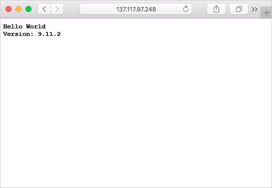

Du kan hämta containeravbildningar från Azure Container Registry med hjälp av flera containerhanteringsplattformar, t.ex. Azure Container Instances, Azure Kubernetes Registry och Docker för Windows eller Mac. När du kör containeravbildningar från Azure Container Registry kan du behöva autentiseringsuppgifter. 

Du bör använda ett huvudnamn för Azure-tjänsten till autentisering i Container Registry. Du bör dessutom skydda autentiseringsuppgifterna för Azure-tjänstens huvudnamn i Azure Key Vault. I den här enheten följer vi den rekommenderade metoden.

I vår övning använder vi dock det inbyggda administratörskonto som kan aktiveras i alla Azure Container-register. Administratörskontot fungerar med kostnadsfria sandbox-resurser.

<!-- Activate the sandbox -->
[!include[](../../../includes/azure-sandbox-activate.md)]

Skapa en variabel med containerregistrets namn med små bokstäver (t.ex. ”minbehållare” istället för ”Minbehållare”). Den här variabeln används i hela utbildningsenheten.

```azurecli
ACR_NAME=<acrName>
```

### <a name="service-principal"></a>Tjänstens huvudnamn

Vi ska skapa ett tjänstens huvudnamn för produktionsprogrammet. Kom ihåg att **detta inte fungerar i vår sandbox-miljö**, men det är bästa praxis att följa i dina egna system. I vår övning kommer du att använda anvisningarna för administratörskontot nedan.

Skapa tjänstens huvudnamn med kommandot `az ad sp create-for-rbac`. Argumentet `--role` konfigurerar huvudnamnet för tjänsten med rollen *läsare*, vilket endast ger hämtningsåtkomst till registret. Om du vill bevilja både push- och hämtningsåtkomst ändrar du argumentet `--role` till *deltagare*.

```azurecli
az ad sp create-for-rbac --scopes $(az acr show --name $ACR_NAME --query id --output tsv) --role reader
```

Så här ser utdata ut när du har skapat tjänsten huvudnamn. Anteckna värdena för `appId` och `password`. De här värdena lagras i Azure-nyckelvalvet.

```output
{
  "appId": "1fa05179-0000-0000-0000-e269a4e97c41",
  "displayName": "azure-cli-2018-08-19-22-35-26",
  "name": "http://azure-cli-2018-08-19-22-35-26",
  "password": "72377509-0000-0000-0000-c8edbcb2d950",
  "tenant": "00000000-0000-0000-0000-000000000000"
}
```

### <a name="admin-account"></a>Administratörskonto

Azure Container-registrer har ett inbyggt administratörskonto. Det här inte är kopplat till Azure AD eller rollbaserade åtkomstkontroller och **bör därför endast användas i testsyfte**. 

1. Aktivera administratörskontot.
    ```azurecli
      az acr update -n $ACR_NAME --admin-enabled true
    ```

2. Skapa en fråga för att hämta ett automatiskt genererat användarnamn och lösenord

    ```azurecli
      az acr credential show --name $ACR_NAME
    ```

Dina utdata ser ut ungefär som nedan. Notera `username` och `value` tillsammans med `name`-lösenordet. Du sparar dem i nyckelvalvet.

```output
{  "passwords": [
    {
      "name": "password",
      "value": "aaaaa"
    },
    {
      "name": "password2",
      "value": "bbbbb"
    }
  ],
  "username": "ccccc"
}
```

### <a name="save-the-username-and-password-to-the-key-vault"></a>Spara användarnamnet och lösenordet i nyckelvalvet

1. Skapa ett Azure Key Vault med kommandot `az keyvault create`.

    ```azurecli
    az keyvault create --resource-group <rgn>[Sandbox resource group name]</rgn> --name $ACR_NAME-keyvault
    ```

1. Spara ACR-användarnamnet i valvet genom att använda kommandot `az keyvault secret set`. Om du använder tjänstens huvudnamn använder du app-ID:t för det här värdet. Eftersom vi använder administratörskontot kan vi spara användarnamnet från frågan ovan. Ange kommandot nedan, och glöm inte att ersätta `<username>`.

    ```azurecli
    az keyvault secret set --vault-name $ACR_NAME-keyvault --name $ACR_NAME-pull-usr --value <username>
    ```

1. Använd kommandot `az keyvault secret set` till att lagra *lösenordet* i valvet. Ersätt `<password>` med `password` från frågan ovan.

    ```azurecli
    az keyvault secret set --vault-name $ACR_NAME-keyvault --name $ACR_NAME-pull-pwd --value <password>
    ```

Du har nu skapat ett Azure-nyckelvalv och lagrat två hemligheter i det:

* `$ACR_NAME-pull-usr`: **användarnamn** för containerregister.
* `$ACR_NAME-pull-pwd`: **lösenord** för containerregister.

Nu kan du referera till de här hemligheterna med namn när du eller dina program och tjänster hämtar avbildningar från registret.

### <a name="deploy-a-container-with-azure-cli"></a>Distribuera en container med Azure CLI

Nu när autentiseringsuppgifterna för tjänstens huvudnamn lagras i Azure Key Vault kan dina program och tjänster använda dem för att få åtkomst till ditt privata register.

Kör kommandot `az container create` för att distribuera en containerinstans. I kommandot används de autentiseringsuppgifter för tjänstens huvudnamn som lagras i Azure Key Vault för autentisering i containerregistret.

```azurecli
az container create \
    --resource-group <rgn>[Sandbox resource group name]</rgn> \
    --name acr-build \
    --image $ACR_NAME.azurecr.io/helloacrbuild:v1 \
    --registry-login-server $ACR_NAME.azurecr.io \
    --ip-address Public \
    --location eastus \
    --registry-username $(az keyvault secret show --vault-name $ACR_NAME-keyvault --name $ACR_NAME-pull-usr --query value -o tsv) \
    --registry-password $(az keyvault secret show --vault-name $ACR_NAME-keyvault --name $ACR_NAME-pull-pwd --query value -o tsv)
```

Hämta Azure-containerinstansens IP-adress.

```azurecli
az container show --resource-group  <rgn>[Sandbox resource group name]</rgn> --name acr-build --query ipAddress.ip --output table
```

Öppna en webbläsare och navigera till containerns IP-adress. Om allt är konfigurerat på rätt sätt bör du se följande resultat:



