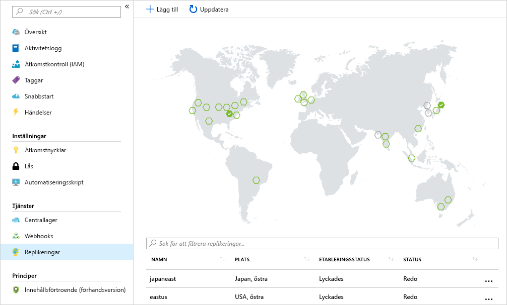

Anta att ditt företag har compute-arbetsbelastningar som distribuerats till flera regioner för att kunna betjäna din distribuerade kundbas med lokal närvaro. 

Ditt mål är att placera ett containerregister i varje region där avbildningar körs. Den här strategin tillåter nätverksnära åtgärder, vilket tillåter snabba, tillförlitliga överföringar av bildlager. 

Med georeplikering kan ett Azure-containerregister fungera som ett enda register för flera regioner, med regionala register som har flera huvudregister.

Ett georeplikerat register ger följande fördelar:

- Namn på register/avbildningar/taggar kan användas i flera regioner
- Nätverksnära registeråtkomst från regionala distributioner
- Inga ytterligare avgifter för utgående trafik eftersom avbildningarna hämtas från ett lokalt, replikerat register i samma region som containervärden
- Enkel hantering av ett register i flera regioner

## <a name="replicate-an-image-to-multiple-locations"></a>Replikera en avbildning till flera platser

Du kommer att använda Azure CLI-kommandot `az acr replication create` för att replikera dina containeravbildningar från en region till en annan. I det här exemplet skapar du en replikering för regionen `japaneast`. Ersätt `<acrName>` med namnet på ditt Container Registry.

```azurecli
az acr replication create --registry <acrName> --location japaneast
```

Dina utdata bör se ut ungefär så här:

```output
{
  "id": "/subscriptions/00000000-0000-0000-0000-000000000000/resourceGroups/myresourcegroup/providers/Microsoft.ContainerRegistry/registries/myACR0007/replications/japaneast",
  "location": "japaneast",
  "name": "japaneast",
  "provisioningState": "Succeeded",
  "resourceGroup": "myresourcegroup",
  "status": {
    "displayStatus": "Syncing",
    "message": null,
    "timestamp": "2018-08-15T20:22:09.275792+00:00"
  },
  "tags": {},
  "type": "Microsoft.ContainerRegistry/registries/replications"
}
```

Som ett sista steg kan du hämta alla containeravbildningsrepliker som skapats. Hämta den här listan med kommandot `az acr replication list`. Ersätt `<acrName>` med namnet på ditt Container Registry.

```azurecli
az acr replication list --registry <acrName> --output table
```

Utdata bör se ut ungefär så här:

```console
NAME       LOCATION    PROVISIONING STATE    STATUS
---------  ----------  --------------------  --------
japaneast  japaneast   Succeeded             Ready
eastus     eastus      Succeeded             Ready
```

Tänk på att du inte är begränsad till Azure CLI för att lista dina avbildningsrepliker. Om du väljer `Replications` inom Azure-portalen för ett Azure Container Registry så visas en karta över aktuella replikeringar. Du kan replikera containeravbildningar till ytterligare regioner genom att välja regionerna på kartan.



<!-- Cleanup sandbox -->
[!include[](../../../includes/azure-sandbox-cleanup.md)]
 

## <a name="summary"></a>Sammanfattning

I den här modulen har du replikerat en containeravbildning till flera Azure-datacenter med Azure CLI. 