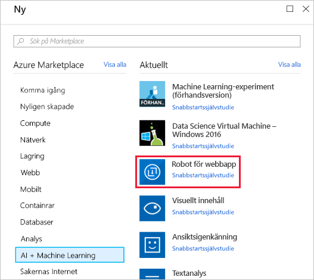
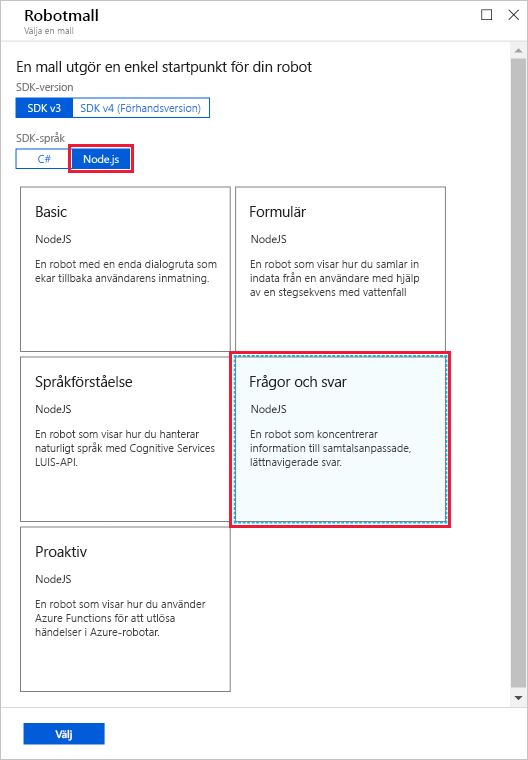
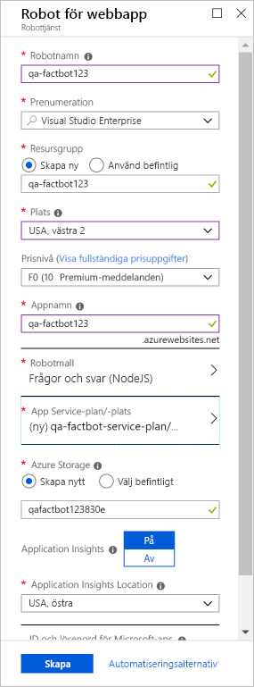

När du ska skapa en robot är det första steget att hitta en lämplig värdplats för roboten i Azure.The first step in creating a bot is to provide a location for the bot to be hosted in Azure. [Web Apps](https://azure.microsoft.com/services/app-service/web/)-funktionen i Azure App Service passar perfekt som värd för robotprogram och Azure Bot Service är specialutformat för att tillhandahålla dem.The [Web Apps](https://azure.microsoft.com/services/app-service/web/) feature of Azure App Service is perfect for hosting bot applications, and the Azure Bot Service is designed to provision them for you. I den här enheten ska du använda Azure-portalen för att tillhandahålla en Azure Web App-robot.In this unit, you will use the Azure portal to provision an Azure web app bot.

<!---TODO: Update for sandbox?--->
1. Öppna [Azure-portalen](https://portal.azure.com/?azure-portal=true) i webbläsaren.Open the [Azure portal](https://portal.azure.com/?azure-portal=true) in your browser. Om du ombeds logga in ska du göra det med autentiseringsuppgifterna för ditt Microsoft-konto.If you are asked to sign in, do so using your Microsoft account.

1. Klicka på **+ Skapa en resurs**, följt av **AI + Machine Learning** och sedan **Robot för webbappar**.Click **+ Create a resource**, followed by **AI + Machine Learning**, and then **Web App Bot**.

    

1. Ange ett namn, till exempel ”qa-factbot”, i rutan **Appnamn**.Enter a name, such as "qa-factbot", into the **App name** box. *Det här namnet måste vara unikt för Azure, så se noga till så att en grön bock visas bredvid det.**This name must be unique within Azure, so make sure a green check mark appears next to it.* Välj **Skapa ny** under **Resursgrupp** och ge resursgruppen namnet ”factbot-rg”.Select **Create new** under **Resource group** and enter the resource group name "factbot-rg." Välj den plats som ligger närmast dig och välj den kostnadsfria prisnivån **F0**.Select the location nearest you and select the free **F0** pricing tier. Klicka sedan på **Bot template** (Robotmall).Then, click **Bot template**.

1. Välj **Node.js** som SDK-språk och **Question and Answer** (Frågor och svar) som malltyp.Select **Node.js** as the SDK language and **Question and Answer** as the template type. Klicka sedan på **Välj** längst ned på bladet.Then, click **Select** at the bottom of the blade.

    

1. Klicka på **App Service-plan/plats** följt av **Skapa ny** och skapa sedan en App Service-plan med namnet ”qa-factbot-service-plan” eller liknande i samma region som du valde i steg 3.Now, click **App service plan/Location**, followed by **Create New**, and then create an App Service plan named "qa-factbot-service-plan" or something similar in the same region that you selected in Step 3. När det är klart klickar du på **Skapa** längst ned på bladet ”Robot för webbapp” för att starta distributionen.Once that's done, click **Create** at the bottom of the "Web App Bot" blade to start the deployment.

    

1. Klicka på **Resursgrupper** i menyfliksområdet som visas till vänster i portalen.Click **Resource groups** in the ribbon on the left side of the portal. Klicka sedan på **factbot-rg** för att öppna resursgruppen som skapades för Azures robot för webbappar.Then, click **factbot-rg** to open the resource group created for the Azure web app bot. Vänta tills statusen ”Distribuerar” ändras till ”Lyckades” högst upp på bladet – detta är en indikation som visar att distributionen av Azures robot för webbappar har slutförts.Wait until "Deploying" changes to "Succeeded" at the top of the blade, which indicates that the Azure web app bot was successfully deployed. Distributionen tar vanligtvis högst två minuter.Deployment generally requires two minutes or less. Du kan klicka på **Uppdatera** överst på bladet ibland för att uppdatera distributionens status.Periodically click **Refresh** at the top of the blade to refresh the deployment status.

Det inträffade mycket bakom kulisserna när Azures robot för webbappar distribuerades.Behind the scenes, a lot happened when the Azure web app bot was deployed. En robot skapades och registrerades, ett [Azure-webbprogram](https://azure.microsoft.com/services/app-service/web/) skapades för att agera värd för roboten och roboten konfigurerades för att fungera tillsammans med [Microsoft QnA Maker](https://www.qnamaker.ai/).A bot was created and registered, an [Azure web app](https://azure.microsoft.com/services/app-service/web/) was created to host it, and the bot was configured to work with [Microsoft QnA Maker](https://www.qnamaker.ai/). Nästa steg är att använda QnA Maker för att skapa en kunskapsbas med frågor och svar som ökar robotens intelligens.The next step is to use QnA Maker to create a knowledge base of questions and answers to infuse the bot with intelligence.
