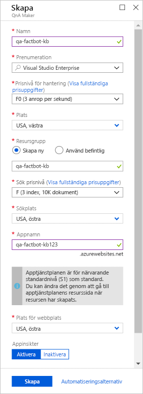
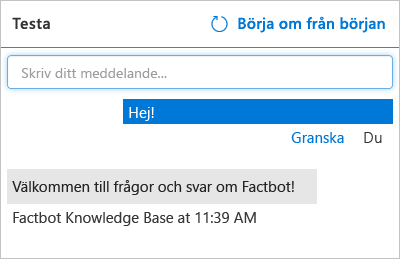

[!INCLUDE [0-vm-note](0-vm-note.md)]

[QnA Maker](https://www.qnamaker.ai/) ingår i [Azure Cognitive Services](https://www.microsoft.com/cognitive-services/), en svit med tjänster och API:er som används för att bygga intelligenta appar med artificiell intelligens (AI) och maskininlärning. Istället för att koda en robot och förutse alla frågor en användare kan ställa med tillhörande svar, kan du ansluta den till en kunskapsbas med frågor och svar som skapats med QnA Maker. Ett vanligt scenario är att man skapar en kunskapsbas utifrån webbadressen från en sida med Vanliga frågor och svar så att roboten kan svara på domänspecifika frågor som ”hur hittar jag min Windows-produktnyckel” eller ”varifrån kan jag ladda ned Visual Studio Code”.

I den här kursdelen ska du använda QnA Maker för att skapa en kunskapsbas med frågor som ”vilka NFL-lag har vunnit Super Bowl flest gånger” och ”vilken är den största staden i hela världen”. Därefter ska du distribuera kunskapsbasen i en Azure-webbapp så att den kan nås via en HTTPS-slutpunkt.

1. Öppna QnA Maker-portalen genom att öppna https://www.qnamaker.ai i VM-webbläsaren och välj **Logga in** för att logga in med samma labbkonto som du använde för att logga in på Azure-portalen. 

1. Välj hamburgermenyn och sedan **Skapa en kunskapsbas**. 

1. Välj **Skapa en QnA-tjänst**.

1. På den nyligen öppnade fliken för Azure-portalen anger du ett namn i rutan **Namn**. Det här namnet måste vara unikt för Azure, så se till att en grön bock visas bredvid namnet *och* i fältet **Appnamn** längre ned på bladet.

1. Välj **Använd befintlig** under **Resursgrupp** och välj den färdiga övningsresursgruppen för den här övningen.

1. Välj en **Plats** i listrutan. 

1. Välj **F0** som **Prisnivå för hantering**. 

1. Välj **F** i **Sök prisnivå**. 

1. Kontrollera att **appnamnet** är unikt för Azure.

1. Välj den plats som ligger närmast dig i de bägge listrutorna för plats och markera sedan knappen **Skapa** längst ned på bladet.

    

1. Klicka på **Resursgrupper** i menyfliksområdet till vänster i portalen. Öppna den färdiga övningsresursgruppen. Vänta tills statusen ”Distribuerar” ändras till ”Lyckades” högst upp på bladet – detta är en indikation som visar att distributionen av QnA och resurserna har slutförts. Om meddelandet försvinner kan du välja klockikonen i verktygsfältet för att visa status. Du kan ven välja **Uppdatera** överst på bladet för att uppdatera distributionens status.

1. Gå tillbaka till **Skapa en kunskapsbas** genom att öppna https://www.qnamaker.ai/Create i VM-webbläsaren och bläddra till **Steg 2** att ansluta till våra frågor och svar.

1. Under **Microsoft Azure Directory-ID** väljer du **Microsoft Learn Hosting** (Microsoft Learn-värd).

1. Välj **Microsoft Learn Hosting** (Microsoft Learn-värd) i listrutan **Azure-prenumerationsnamn**.

1. Under **Azure QnA-tjänst** väljer du det QnA-tjänstnamn du angav tidigare. Om inga tjänster visas i listan kan du behöva uppdatera sidan.

1. Ge sedan kunskapsbasen ett namn, till exempel ”Factbot Knowledge Base”.

1. Du kan mata in frågor och svar i kunskapsbasen i QnA Maker manuellt, eller så kan du importera dem från FAQ-filer (vanliga frågor och svar) online eller lokala filer. Format som stöds är tabbavgränsade textfiler, Microsoft Word-dokument, Excel-kalkylblad och PDF-filer.

    Om du vill visa öppnar du https://github.com/MicrosoftDocs/mslearn-build-chat-bot-with-azure-bot-service/blob/master/Factbot.tsv.zip i VM-webbläsaren och laddar ned filen **Factbot.tsv.zip**. Den här zip-mappen innehåller en textfil med namnet **Factbot.tsv**. Extrahera och kopiera filen till datorn. Rulla nedåt i QnA Maker-portalen i VM-webbläsaren, välj **+ Lägg till fil** och välj **Factbot.tsv**. Den här filen innehåller 20 frågor och svar i tabbavgränsat format.

1. Välj **Skapa din kunskapsbas** längst ned på sidan och vänta tills kunskapsbasen har skapats. Det ska ta mindre än en minut.

1. Kontrollera att de frågor och svar som importerats från **Factbot.tsv** visas i kunskapsbasen. Välj sedan **Spara och träna** och vänta tills träningen har slutförts.

    

1. Välj knappen **Test** till höger om knappen **Spara och träna**. Skriv ”Hi” i meddelanderutan och tryck på **Retur**. Kontrollera att svaret är ”Welcome to the QnA Factbot”, som här nedan.

    

1. Skriv ”What book has sold the most copies?” i meddelanderutan och tryck på **Retur**. Vad är svaret?

1. Välj knappen **Test** igen för att minimera testpanelen. 
1. Välj sedan **Publish** (Publicera) i menyn överst på sidan och välj **Publish** (Publicera) längst ned på sidan för att publicera kunskapsbasen. Efter *publicering* blir kunskapsbasen tillgänglig på en HTTPS-slutpunkt.

Vänta tills publiceringen har slutförts och kontrollera att QnA-tjänsten har distribuerats. Kunskapsbasen finns nu i en egen Azure-webbapp. Nästa steg är att distribuera en robot som kan använda sig av den.
