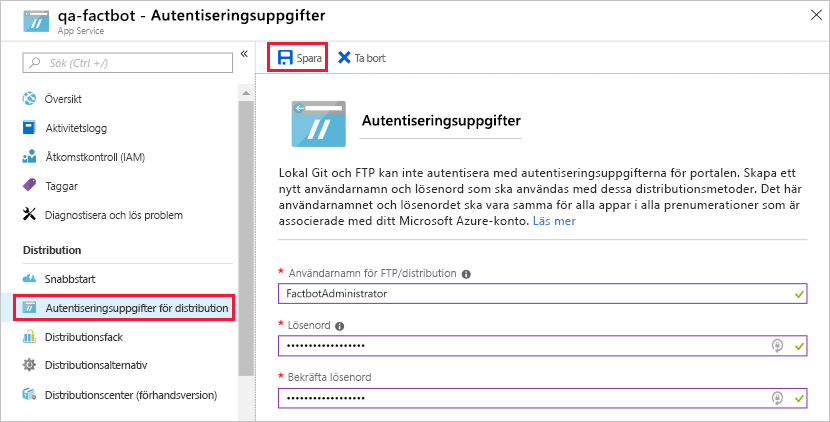

När du skapade en Azure Web App-robot i [övning 1](#Exercise1) distribuerades även en Azure Web App som fungerar som värd. Roboten kräver dock lite en del kodning och den måste även distribueras till Azures webbapp. Som tur är kan har koden redan genererats åt dig av Azure Bot Service. I den här kursdelen ska du använda Visual Studio Code för att placera koden på en lokal Git-lagringsplats och publicera roboten till Azure genom att skicka ändringarna från den lokala lagringsplatsen till en fjärrlagringsplats som är ansluten till den Azure Web App som är värd för roboten – en process som kallas [kontinuerlig intergrering](https://en.wikipedia.org/wiki/Continuous_integration).

1. Om [Git](https://git-scm.com/) är inte installerat på din dator går du till https://git-scm.com/downloads och installerar Git-klienten för ditt operativsystem. Git är ett kostnadsfritt och distribuerat versionskontrollsystem med öppen källkod som integreras sömlöst i Visual Studio Code. Om du inte vet om Git är installerat öppnar du en kommandotolk eller ett terminalfönster och kör följande kommando:

    ```bash
    git --version
    ```

    Om ett versionsnummer visas är Git-klienten installerad.

1. Om Node.js inte finns installerat på datorn går du till https://nodejs.org/ och installerar den senaste LTS-versionen. Du kan fastställa om Node.js har installerats genom att öppna en kommandotolk eller ett terminalfönster och skriva följande kommando:

    ```bash
    node --version
    ```

    Om Node finns installerat visas versionsnumret.

1. Om Visual Studio Code inte finns installerat på din dator går du till https://code.visualstudio.com/ och installerar den nu.

1. Skapa en mapp med namnet ”Factbot” på valfri plats på hårddisken för att rymma robotens källkod.

<!---TODO: Update for sandbox?--->
1. Gå tillbaka till Azure Portal och öppna resursgruppen ”factbot-rg”. Klicka sedan på roboten för webbappen som du skapade i föregående övning.

1. Klicka på **Skapa** i menyn till vänster och klicka sedan på **Hämta som ZIP-fil** för att förbereda en ZIP-fil som innehåller källkoden till roboten. När ZIP-filen är klar klickar du på knappen **Hämta som ZIP-fil** för att ladda ned den. När hämtningen är slutförd kan du kopiera innehållet i ZIP-filen till mappen ”Factbot” som du skapade i steg 4.

1. Stanna kvar på bladet ”Skapa” och klicka på **Konfigurera kontinuerlig distribution**. Klicka på **Konfiguration** högst upp på bladet och sedan på **Välj källa**. Välj **Lokal Git-lagringsplats** som distributionskälla och klicka på **OK**.

1. Stäng bladet ”Distributioner” och klicka på **All App service settings** (Alla apptjänstinställningar) i menyn till vänster.

1. Klicka på **Autentiseringsuppgifter för distribution** och ange ett användarnamn och ett lösenord. Du kommer förmodligen att behöva ange ett annat användarnamn än ”FactbotAdministrator” eftersom namnet måste vara unikt i Azure. Klicka på **Spara** och stäng bladet.

    

1. Starta Visual Studio Code och använd kommandot **File** > **Open Folder...** (Arkiv > Öppna mapp...) för att öppna mappen ”Factbot” som du kopierade robotens källkod till i steg 6.

1. Klicka på knappen **Source Control** (Källkontroll) i aktivitetsfältet på vänster sida av Visual Studio Code och klicka sedan på ikonen **Initialize Repository** (Initiera lagringsplatsen) längst upp. Klicka sedan på knappen **Intialize Repository** (Initiera lagringsplatsen) i följande dialogruta.

1. Skriv ”First commit.” i meddelanderutan och klicka på bockmarkeringen för att bekräfta ändringarna.

1. Välj **Integrated Terminal** (Integrerad terminal) i menyn **View** (Visa) i Visual Studio Code för att öppna den integrerade terminalen. Kör följande kommando i den integrerade terminalen och ersätt BOT_NAME på två platser med robotnamnet som du angav i övning 1, steg 3.

    ```bash
    git remote add qna-factbot https://BOT_NAME.scm.azurewebsites.net:443/BOT_NAME.git
    ```

1. Klicka på ellipsen (tre punkter) längst upp i panelen SOURCE CONTROL (KÄLLKONTROLL) och välj **Publish Branch** (Publicera gren) i menyn för att skicka robotkoden från den lokala lagringsplatsen till Azure. Om du ombeds uppge autentiseringsuppgifter ska du uppge det användarnamn och det lösenord som du angav i steg 9 i den här övningen.

Din robot har nu publicerats till Azure. Men innan du testar den ska vi köra den lokalt. Du ska också få lära dig att felsöka roboten i Visual Studio Code.
