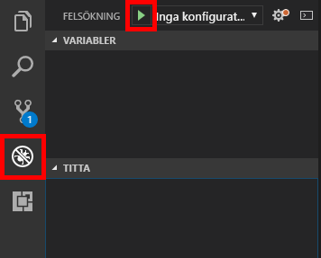

[!INCLUDE [0-vm-note](0-vm-note.md)]

<span data-ttu-id="7675a-101">Som med all annan programkod du skriver måste ändringarna i robotkoden testas och felsökas lokalt innan de distribueras till en produktionsmiljö.</span><span class="sxs-lookup"><span data-stu-id="7675a-101">As with any application code that you write, changes to bot code need to be tested and debugged locally before being deployed to production.</span></span> <span data-ttu-id="7675a-102">Om du vill få hjälp med felsökning av roboten har Microsoft en Bot Framework-emulator.</span><span class="sxs-lookup"><span data-stu-id="7675a-102">To help debug bots, Microsoft offers the Bot Framework Emulator.</span></span> <span data-ttu-id="7675a-103">I den här övningen får du lära dig hur du använder Visual Studio Code och emulatorn för att felsöka robotar.</span><span class="sxs-lookup"><span data-stu-id="7675a-103">In this unit, you will learn how to use Visual Studio Code and the emulator to debug your bots.</span></span>

1. <span data-ttu-id="7675a-104">Kör följande kommando i Visual Studio Codes integrerade terminal för att installera [Restify](http://restify.com/), ett populärt Node.js-paket för att skapa och använda RESTful-webbtjänster:</span><span class="sxs-lookup"><span data-stu-id="7675a-104">Execute the following command in Visual Studio Code's integrated terminal to install [Restify](http://restify.com/), a popular Node.js package for building and consuming RESTful web services:</span></span>

    ```bash
    npm install restify
    ```

1. <span data-ttu-id="7675a-105">Upprepa det här steget för följande kommandon för att installera [Microsoft Bot Framework Bot Builder SDK för Node.js](https://docs.microsoft.com/bot-framework/nodejs/bot-builder-nodejs-quickstart):</span><span class="sxs-lookup"><span data-stu-id="7675a-105">Repeat this step for the following commands to install the [Microsoft Bot Framework Bot Builder SDK for Node.js](https://docs.microsoft.com/bot-framework/nodejs/bot-builder-nodejs-quickstart):</span></span>

    ```bash
    npm install botbuilder
    npm install botbuilder-azure
    npm install botbuilder-cognitiveservices
    ```

1. <span data-ttu-id="7675a-106">Välj knappen **Explorer** i Visual Studio Codes aktivitetsfält.</span><span class="sxs-lookup"><span data-stu-id="7675a-106">Select the **Explorer** button in Visual Studio Code's activity bar.</span></span> 
1. <span data-ttu-id="7675a-107">Därefter **app.js** för att öppna koden i redigeringsprogrammet.</span><span class="sxs-lookup"><span data-stu-id="7675a-107">Select **app.js** to open it in the code editor.</span></span> <span data-ttu-id="7675a-108">Den här filen innehåller koden som styr roboten – kod som har genererats av Azure Bot Service och hämtats från Azure-portalen.</span><span class="sxs-lookup"><span data-stu-id="7675a-108">This file contains the code that drives the bot — code that was generated by the Azure Bot Service and downloaded from the Azure portal.</span></span>

1. <span data-ttu-id="7675a-109">Ersätt innehållet i **app.js** med följande kod och spara sedan filen.</span><span class="sxs-lookup"><span data-stu-id="7675a-109">Replace the contents of **app.js** with the following code, then save the file.</span></span>

    ```JavaScript
    "use strict";
    var builder = require("botbuilder");
    var botbuilder_azure = require("botbuilder-azure");

    var useEmulator = true;
    var userName = "";
    var yearsCoding = "";
    var selectedLanguage = "";

    var connector = useEmulator ? new builder.ChatConnector() : new botbuilder_azure.BotServiceConnector({
        appId: process.env.MicrosoftAppId,
        appPassword: process.env.MicrosoftAppPassword
    });

    var bot = new builder.UniversalBot(connector);

    bot.dialog('/', [

    function (session) {
        builder.Prompts.text(session, "Hello, and welcome to QnA Factbot! What's your name?");
    },

    function (session, results) {
        userName = results.response;
        builder.Prompts.number(session, "Hi " + userName + ", how many years have you been writing code?");
    },

    function (session, results) {
        yearsCoding = results.response;
        builder.Prompts.choice(session, "What language do you love the most?", ["C#", "Python", "Node.js", "Visual FoxPro"]);
    },

    function (session, results) {
        selectedLanguage = results.response.entity;

        session.send("Okay, " + userName + ", I think I've got it:" +
            " You've been writing code for " + yearsCoding + " years," +
            " and prefer to use " + selectedLanguage + ".");
    }]);

    var restify = require('restify');
    var server = restify.createServer();

    server.listen(3978, function() {
        console.log('test bot endpoint at http://localhost:3978/api/messages');
    });

    server.post('/api/messages', connector.listen());
    ```

1. <span data-ttu-id="7675a-110">Ange brytpunkter på raderna 20, 25 och 30 (`builder.Prompts...` anrop) genom att klicka i marginalen till vänster.</span><span class="sxs-lookup"><span data-stu-id="7675a-110">Set breakpoints on lines 20, 25, and 30 (`builder.Prompts...` calls) by selecting in the margin on the left.</span></span>

1. <span data-ttu-id="7675a-111">Välj **Felsök** i aktivitetsfältet och välj sedan den gröna pilknappen **Starta felsökning** för att starta en felsökningssession.</span><span class="sxs-lookup"><span data-stu-id="7675a-111">Select the **Debug** button in the activity bar, then select the green arrow **Start Debugging** button to start a debugging session.</span></span> <span data-ttu-id="7675a-112">Kontrollera att meddelandet ”test bot endpoint at http://localhost:3978/api/messages” visas i felsökningskonsolen.</span><span class="sxs-lookup"><span data-stu-id="7675a-112">Confirm that "test bot endpoint at http://localhost:3978/api/messages" appears in the debug console.</span></span>

    

    <span data-ttu-id="7675a-114">Din robotkod körs nu lokalt.</span><span class="sxs-lookup"><span data-stu-id="7675a-114">Your bot code is now running locally.</span></span>

1. <span data-ttu-id="7675a-115">Starta **Bot Framework Emulator** på Start-menyn.</span><span class="sxs-lookup"><span data-stu-id="7675a-115">Launch the **Bot Framework Emulator** from the Start Menu.</span></span>

1. <span data-ttu-id="7675a-116">Markera fältet för att **ange URL för slutpunkt**.</span><span class="sxs-lookup"><span data-stu-id="7675a-116">Select the **Enter your endpoint URL** field.</span></span> <span data-ttu-id="7675a-117">Ange namnet och URL:en till roboten såsom de visades i felsökningskonsolen i föregående steg.</span><span class="sxs-lookup"><span data-stu-id="7675a-117">Enter the bot name and the bot URL displayed in the debug console in the previous step.</span></span>

1. <span data-ttu-id="7675a-118">Lämna fälten för ID och lösenord för Microsoft-app och fälten för nationella inställningar fälten tomma och välj **ANSLUT**.</span><span class="sxs-lookup"><span data-stu-id="7675a-118">Leave the Microsoft App ID, Microsoft App Password, and Locale fields empty and select **CONNECT**.</span></span>

1. <span data-ttu-id="7675a-119">Välj sedan **Spara och anslut** och spara konfigurationsfilen på valfri plats.</span><span class="sxs-lookup"><span data-stu-id="7675a-119">Then, select **Save and connect** and save the configuration file in the location of your choice.</span></span>

    >[!NOTE]
    > <span data-ttu-id="7675a-120">Hädanefter kan du återansluta roboten genom att helt enkelt välja namnet på roboten under Mina robotar.</span><span class="sxs-lookup"><span data-stu-id="7675a-120">In the future, you can reconnect to the bot simply by selecting the bot name under "My Bots".</span></span>

    

1. <span data-ttu-id="7675a-122">Skriv ”hi” i rutan längst ned i emulatorn och tryck på **Retur**.</span><span class="sxs-lookup"><span data-stu-id="7675a-122">Type "hi" into the box at the bottom of the emulator and press **Enter**.</span></span> <span data-ttu-id="7675a-123">Bekräfta att Visual Studio Code stannar på rad 20 i **app.js**.</span><span class="sxs-lookup"><span data-stu-id="7675a-123">Confirm that Visual Studio Code breaks on line 20 of **app.js**.</span></span> <span data-ttu-id="7675a-124">Välj därefter knappen **Fortsätt** i verktygsfältet för felsökning i Visual Studio Code. Du kommer då tillbaka till emulatorn där du ser robotens svar.</span><span class="sxs-lookup"><span data-stu-id="7675a-124">Then, select the **Continue** button in Visual Studio Code's debugging toolbar, and return to the emulator to see the bot's response.</span></span>

1. <span data-ttu-id="7675a-125">Roboten kommer att ställa ett antal frågor till dig.</span><span class="sxs-lookup"><span data-stu-id="7675a-125">The bot will ask you a series of questions.</span></span> <span data-ttu-id="7675a-126">Besvara dem och välj **Fortsätt** i Visual Studio Code varje gång du kommer till en brytpunkt.</span><span class="sxs-lookup"><span data-stu-id="7675a-126">Answer them and select **Continue** in Visual Studio Code each time a breakpoint is hit.</span></span> <span data-ttu-id="7675a-127">När du är klar väljer du knappen **Stopp** i verktygsfältet för felsökning för att avsluta sessionen.</span><span class="sxs-lookup"><span data-stu-id="7675a-127">When you're done, select the **Stop** button in the debugging toolbar to end the debugging session.</span></span>

<span data-ttu-id="7675a-128">Nu har du en fullt fungerande robot och vet hur man gör för att felsöka den lokalt i Microsoft Frameworks robotemulator.</span><span class="sxs-lookup"><span data-stu-id="7675a-128">At this point, you have a fully functioning bot and know how to debug it by running it locally in the Microsoft Bot Framework Emulator.</span></span> <span data-ttu-id="7675a-129">Nästa steg blir att göra roboten smartare genom att ansluta till den kunskapsbas som du publicerade.</span><span class="sxs-lookup"><span data-stu-id="7675a-129">The next step is to make the bot more intelligent by connecting it to the knowledge base you published.</span></span>