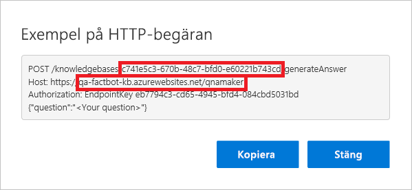

<span data-ttu-id="1bf05-101">I den här övningen ansluter du din chattrobot till QnA Maker-kunskapsbasen du skapade tidigare, så att chattroboten kan föra en intelligent konversation.</span><span class="sxs-lookup"><span data-stu-id="1bf05-101">In this unit, you will connect your bot to the QnA Maker knowledge base you built earlier so the bot can carry on an intelligent conversation.</span></span> <span data-ttu-id="1bf05-102">När du ansluter till kunskapsbasen hämtas en del information från QnA Maker-portalen. Den kopieras till Azure Portal, chattrobotens kod uppdateras och sedan distribueras chattroboten till Azure igen.</span><span class="sxs-lookup"><span data-stu-id="1bf05-102">Connecting to the knowledge base involves retrieving some information from the QnA Maker portal, copying it into the Azure portal, updating the bot code, and then redeploying the bot to Azure.</span></span>

1. <span data-ttu-id="1bf05-103">Gå tillbaka till den [QnA Maker-portalen](https://www.qnamaker.ai/) och klicka på ditt namn i det övre högra hörnet.</span><span class="sxs-lookup"><span data-stu-id="1bf05-103">Return to the [QnA Maker portal](https://www.qnamaker.ai/) and click your name in the upper-right corner.</span></span> <span data-ttu-id="1bf05-104">Välj **Hantera slutpunktsnycklar** från listrutan.</span><span class="sxs-lookup"><span data-stu-id="1bf05-104">Select **Manage endpoint keys** from the menu that drops down.</span></span> <span data-ttu-id="1bf05-105">Klicka på **Visa** för att visa den primära slutpunktsnyckeln och på **Kopiera** för att kopiera den till Urklipp.</span><span class="sxs-lookup"><span data-stu-id="1bf05-105">Click **Show** to show the primary endpoint key, and **Copy** to copy it to the clipboard.</span></span> <span data-ttu-id="1bf05-106">Klistra sedan in den i en textfil så att du enkelt kan få tag på den om en stund.</span><span class="sxs-lookup"><span data-stu-id="1bf05-106">Then, paste it into a text file so you can easily retrieve it in a moment.</span></span>

1. <span data-ttu-id="1bf05-107">Klicka på **Mina kunskapsbaser** i menyn längst upp på sidan.</span><span class="sxs-lookup"><span data-stu-id="1bf05-107">Click **My knowledge bases** in the menu at the top of the page.</span></span> <span data-ttu-id="1bf05-108">Klicka sedan på **Visa kod** för kunskapsbasen du skapade tidigare.</span><span class="sxs-lookup"><span data-stu-id="1bf05-108">Then, click **View Code** for the knowledge base that you created earlier.</span></span>

1. <span data-ttu-id="1bf05-109">Kopiera kunskapsbasens ID från den första raden och värdnamnet från den andra raden.</span><span class="sxs-lookup"><span data-stu-id="1bf05-109">Copy the knowledge base ID from the first line and the host name from the second line.</span></span> <span data-ttu-id="1bf05-110">Klistra in även dem i en textfil.</span><span class="sxs-lookup"><span data-stu-id="1bf05-110">Paste them into a text file, as well.</span></span> <span data-ttu-id="1bf05-111">Stäng sedan dialogrutan.</span><span class="sxs-lookup"><span data-stu-id="1bf05-111">Then, close the dialog.</span></span> <span data-ttu-id="1bf05-112">Ta **inte** med prefixet ”https://” i värdnamnet som du kopierar.</span><span class="sxs-lookup"><span data-stu-id="1bf05-112">**Do not** include the "https://" prefix in the host name that you copy.</span></span>

    

1. <span data-ttu-id="1bf05-114">Återgå till din robot för webbappar i Azure-portalen.</span><span class="sxs-lookup"><span data-stu-id="1bf05-114">Return to the web app bot in the Azure portal.</span></span> <span data-ttu-id="1bf05-115">Klicka på **Programinställningar** i menyn till vänster och rulla nedåt tills du hittar programinställningarna QnAKnowledgebaseId, QnAAuthKey och QnAEndpointHostName.</span><span class="sxs-lookup"><span data-stu-id="1bf05-115">Click **Application settings** in the menu on the left and scroll down until you find application settings named "QnAKnowledgebaseId," "QnAAuthKey," and "QnAEndpointHostName."</span></span> <span data-ttu-id="1bf05-116">Klistra in kunskapsbasens ID och värdnamn från steg 3 och slutpunktsnyckeln från steg 1 i de här fälten.</span><span class="sxs-lookup"><span data-stu-id="1bf05-116">Paste the knowledge base ID and host name obtained in Step 3 and the endpoint key obtained in Step 1 into these fields.</span></span> <span data-ttu-id="1bf05-117">Klicka sedan på **Spara**.</span><span class="sxs-lookup"><span data-stu-id="1bf05-117">Then, click **Save**.</span></span>

    

1. <span data-ttu-id="1bf05-119">Gå tillbaka till Visual Studio Code och ersätt innehållet i **app.js** med koden nedan.</span><span class="sxs-lookup"><span data-stu-id="1bf05-119">Return to Visual Studio Code and replace the contents of **app.js** with the code below.</span></span> <span data-ttu-id="1bf05-120">Spara sedan filen.</span><span class="sxs-lookup"><span data-stu-id="1bf05-120">Then, save the file.</span></span>

    ```JavaScript
    var restify = require('restify');
    var builder = require('botbuilder');
    var botbuilder_azure = require("botbuilder-azure");
    var builder_cognitiveservices = require("botbuilder-cognitiveservices");

    // Setup Restify Server
    var server = restify.createServer();
    server.listen(process.env.port || process.env.PORT || 3978, function () {
        console.log('%s listening to %s', server.name, server.url);
    });

    // Create chat connector for communicating with the Bot Framework Service
    var connector = new builder.ChatConnector({
        appId: process.env.MicrosoftAppId,
        appPassword: process.env.MicrosoftAppPassword
    });

    // Listen for messages from users
    server.post('/api/messages', connector.listen());

    // Create your bot with a function to receive messages from the user
    var bot = new builder.UniversalBot(connector);

    var recognizer = new builder_cognitiveservices.QnAMakerRecognizer({
        knowledgeBaseId: process.env.QnAKnowledgebaseId,
        authKey: process.env.QnAAuthKey,
        endpointHostName: process.env.QnAEndpointHostName
    });

    var basicQnAMakerDialog = new builder_cognitiveservices.QnAMakerDialog({
        recognizers: [recognizer],
        defaultMessage: "I'm not quite sure what you're asking. Please ask your question again.",
        qnaThreshold: 0.3
    });

    bot.dialog('basicQnAMakerDialog', basicQnAMakerDialog);

    bot.dialog('/',
    [
        function (session) {
            session.replaceDialog('basicQnAMakerDialog');
        }
    ]);
    ```

    > [!Note]
    > <span data-ttu-id="1bf05-121">Anrop för att skapa en `QnAMakerDialog`-instans på rad 30.</span><span class="sxs-lookup"><span data-stu-id="1bf05-121">The call to create a `QnAMakerDialog` instance on line 30.</span></span> <span data-ttu-id="1bf05-122">Det här skapar en dialogruta som integrerar en robot som skapats med Azure Bot Service med en kunskapsbas som skapats med Microsoft QnA Maker.</span><span class="sxs-lookup"><span data-stu-id="1bf05-122">This creates a dialog that integrates a bot built with the Azure Bot Service with a knowledge base built Microsoft QnA Maker.</span></span>

1. <span data-ttu-id="1bf05-123">Klicka på knappen **Källkodskontroll** i aktivitetsfältet i Visual Studio Code.</span><span class="sxs-lookup"><span data-stu-id="1bf05-123">Click the **Source Control** button in the activity bar in Visual Studio Code.</span></span> <span data-ttu-id="1bf05-124">Skriv ”Connected to knowledge base” i meddelanderutan och klicka på bockmarkeringen för att bekräfta ändringarna.</span><span class="sxs-lookup"><span data-stu-id="1bf05-124">Type "Connected to knowledge base" into the message box, and click the check mark to commit your changes.</span></span> <span data-ttu-id="1bf05-125">Klicka på ellipsen och använd kommandot **Publicera gren** till att skicka ändringarna till fjärrdatabasen (och därmed</span><span class="sxs-lookup"><span data-stu-id="1bf05-125">Then, click the ellipsis and use the **Publish Branch** command to push these changes to the remote repository (and therefore.</span></span> <span data-ttu-id="1bf05-126">till Azure Web App).</span><span class="sxs-lookup"><span data-stu-id="1bf05-126">to the Azure Web App).</span></span>

1. <span data-ttu-id="1bf05-127">Gå tillbaka till din Web App Bot i Azure-portalen och klicka på **Testa i webbchatt** till vänster för att öppna testkonsolen.</span><span class="sxs-lookup"><span data-stu-id="1bf05-127">Return to the web app bot in the Azure portal and click **Test in Web Chat** on the left to open the test console.</span></span> <span data-ttu-id="1bf05-128">Skriv ”What's the most popular software programming language in the world?”</span><span class="sxs-lookup"><span data-stu-id="1bf05-128">Type "What's the most popular software programming language in the world?"</span></span> <span data-ttu-id="1bf05-129">i fältet längst ned i chattfönstret och tryck på **Retur**.</span><span class="sxs-lookup"><span data-stu-id="1bf05-129">into the box at the bottom of the chat window and press **Enter**.</span></span> <span data-ttu-id="1bf05-130">Kontrollera att roboten svarar.</span><span class="sxs-lookup"><span data-stu-id="1bf05-130">Confirm that the bot responds.</span></span>

<span data-ttu-id="1bf05-131">Nu när roboten är ansluten till kunskapsbasen ska vi slutligen testa den i verkligheten.</span><span class="sxs-lookup"><span data-stu-id="1bf05-131">Now that the bot is connected to the knowledge base, the final step is to test it in the wild.</span></span> <span data-ttu-id="1bf05-132">Och vad kan vara mer verkligt än att testa den med Skype?</span><span class="sxs-lookup"><span data-stu-id="1bf05-132">And what could be wilder than testing it with Skype?</span></span>
