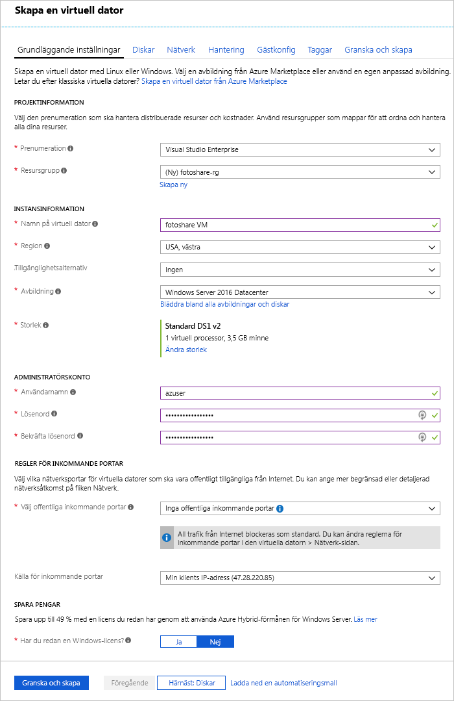

Anta att du har en webbplats för fotodelning med data som lagras på virtuella Azure-datorer (VM) som kör SQL Server och anpassade program. Du vill göra följande justeringar:

- Du behöver ändra inställningarna för diskcache på en virtuell dator.
- Du vill lägga till en ny datadisk till den virtuella datorn med cachelagring aktiverat.

Du har valt att göra dessa ändringar via Azure Portal.

I den här övningen går vi igenom hur du genomför de ändringar av en virtuell dator som beskrevs ovan. Först loggar vi in på portalen och skapar en virtuell dator.

[!include]

## Skapa en virtuell dator

I det här steget skapar vi en virtuell dator med följande egenskaper:

| Egenskap        | Värde   |
|-----------------|---------|
| Avbildning           | **Windows Server 2016 Datacenter** |
| Namn            | **fotoshareVM** |
| Resursgrupp  |   **<rgn>[Sandbox-resursgruppnamn]</rgn>** |
| Plats        | Se nedan. |

1. Logga in på [Azure-portalen](https://portal.azure.com/triplecrownlabs.onmicrosoft.com?azure-portal=true) med samma konto som du har aktiverat sandbox-miljön med.

1. Välj **Skapa en resurs** i sidofältet till vänster.

1. _Windows Server 2016 VM_ ska finnas i listan över **Populära** Marketplace-element. Om inte, försök att söka efter ”Windows Server 2016 DataCenter” med hjälp av sökrutan längst upp.

1. Välj den virtuella Windows-datorn och klicka på **Skapa** för att börja skapa den virtuella datorn.

1. Kontrollera att vald **Prenumeration** i panelen **Grunder** är _Concierge-prenumeration_.

1. Välj **Använd befintlig** under **Resursgrupp** och välj _<rgn>[Sandbox-resursgruppnamn]</rgn>_.

1. Skriv _fotoshareVM_ rutan **Namn på virtuell dator**.

1. Välj regionen som ligger närmast dig i listrutan **Plats** från följande lista.

    [!include]

1. För den virtuella datorns **Storlek** är standardvärdet **DS1 v2**, som ger dig en enskild processor och 3,5 GB minne. Det räcker för det här exemplet.

1. I avsnittet **ADMINISTRATÖRSKONT** ska du ange ett **Användarnamn** och ett **Lösenord**/**Bekräfta lösenord** för ett administratörskonto på den nya virtuella datorn.

1. Följande bild är ett exempel på hur den **Grundläggande** konfigurationen ser ut när den har fyllts i. Lämna standardinställningarna för återstående flikar och fält och klicka på **Granska + skapa**.

    

1. När du har granskat dina nya inställningar för den virtuella datorn klickar du på **Skapa** för att börja distribuera den nya virtuella datorn.

Det tar några minuter att skapa en virtuell dator eftersom man skapar alla olika resurser (lagring, nätverksgränssnitt, etc.) för den virtuella datorn. Vänta tills den virtuella datorn har distribuerats innan du fortsätter med den här övningen.

## Visa status för OS-diskcache i portalen

När vår virtuella dator har distribuerats kan vi bekräfta cachelagringsstatus för OS-disken med följande steg:

1. Välj **fotoshareVM**-resursen för att öppna information om den virtuella datorn i portalen. Du kan också klicka på **Alla resurser** i det vänstra sidofältet och sedan välja din virtuella dator, **fotoshareVM**.

1. Välj **Diskar** under **Inställningar**.

1. I panelen **Diskar** har den virtuella datorn en disk, OS-disken. Dess cachetyp är för närvarande inställd på standardvärdet **Läsa/skriva**.

## Ändra inställningarna för cachelagring för OS-disken i portalen

1. I panelen **Diskar** väljer du **Redigera** i det övre vänstra hörnet på skärmen.

1. Ändra värdet **HOST CACHING** (Cachelagring för värd) för OS-disken till **Read-only** (Skrivskyddad) med hjälp av listrutan och välj sedan **Spara** i det övre vänstra hörnet på skärmen.

1. Uppdateringen kan ta lite tid. Anledningen är att när du ändrar cacheinställningen för en Azure-disk så frånkopplas och återansluts måldisken. Om det är operativsystemdisken startas även den virtuella datorn om. När åtgärden har slutförts får du ett meddelande om att den virtuella datorns diskar har uppdaterats.

1. När det är klart ställs cachetypen för OS-disken in på **Read-only** (Skrivskyddad).

Vi går vidare till konfigurationen av cachelagring för datadisk. För att konfigurera en disk behöver vi först skapa en.

## Lägga till en datadisk till den virtuella datorn och ange cachelagringstyp

1. När du är tillbaka i vyn **Diskar** för den virtuella datorn i portalen ska du klicka på **Lägg till datadisk**. Ett fel visas omedelbart i fältet **Namn**, vilket anger att fältet inte får vara tomt. Vi har inte någon datadisk ännu, så vi tar och skapar en.

1. Klicka på listan **Namn** och klicka sedan på **Skapa disk**.

1. I fönsterrutan **Skapa hanterad disk** går du till rutan **Namn** och skriver **fotosharesVM-data**.

1. Under **Resursgrupp** väljer du **Använd befintlig** och väljer _<rgn>[Sandbox-resursgruppnamn]</rgn>_.

1. Observera standardinställningarna för återstående fält:
    - Premium SSD
    - 1 023 GB i storlek
    - På samma plats som den virtuella datorn (kan inte ändras).
    - IOPS-gräns –5 000
    - Dataflödesgräns (MB/s) – 200

1. Välj **Skapa** längst ned på skärmen. 

    Vänta tills disken har skapats innan du fortsätter.

1. Ändra värdet **HOST CACHING** (Cachelagring för värd) för den nya datadisken till **Read-only** (Skrivskyddad) med hjälp av listrutan (det kan redan ha angetts) och klicka sedan på **Spara** i det övre vänstra hörnet på skärmen.

    Vänta tills den virtuella datorn är klar med uppdateringen av den nya datadisken. När den är klar har du en ny datadisk på den virtuella datorn.

I den här övningen använde vi Azure Portal för att konfigurera cachelagring på en ny virtuell dator, ändra inställningarna för cachelagring på en befintlig disk och konfigurera cachelagring på en ny datadisk. Följande skärmbild visar den slutgiltiga konfigurationen:

