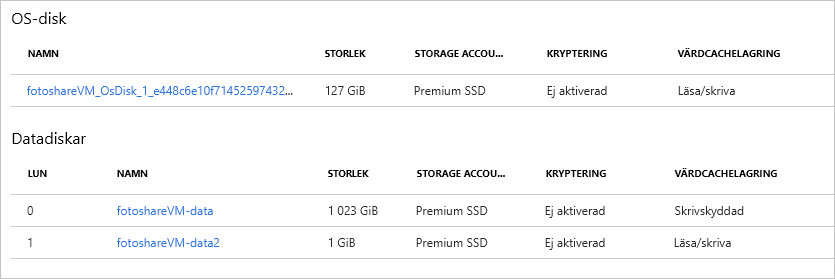

I den föregående övningen utförde vi följande uppgifter med hjälp av Azure-portalen:

- Visa status för OS-diskcache
- Ändra inställningarna för cachelagring för OS-disken
- Lägga till en datadisk i en virtuell dator
- Ändra typ av cachelagring på en ny datadisk

Nu övar vi på dessa åtgärder med hjälp av Azure PowerShell. 

> [!NOTE]
> Vi ska använda Azure PowerShell, men du kan också använda Azure CLI som ger liknande funktionalitet som ett konsolbaserat verktyg. Det kan köras på Mac OS, Linux och Windows. Om du vill veta mer om Azure CLI kan du kolla in modulen **Hantera virtuella datorer med Azure CLI**.

Vi använder den virtuella dator som vi skapade i den föregående övningen. Åtgärderna i den här labben förutsätter att:

- Vår virtuella dator finns och heter **fotoshareVM**
- Vår virtuella dator finns i en resursgrupp som heter **<rgn>[Sandbox-resursgruppnamn]</rgn>**

Om du har använt andra namn ersätter du de här värdena med dina.

Här är det aktuella tillståndet för våra VM-diskar från föregående övning:


Vi har använt portalen för att ange fältet **HOST CACHING** (Cachelagring för värd) för både för OS- och datadiskar. Tänk på detta inledande tillstånd när vi går igenom följande steg.

### <a name="set-up-some-variables"></a>Konfigurera några variabler

Först ska vi lagra vissa resursnamn så att vi kan använda dem senare.

1. Använd Azure Cloud Shell-terminalen till höger för att köra följande PowerShell-kommandon:

    > [!NOTE]
    > Växla Cloud Shell-sessionen till **PowerShell** innan du testar kommandona, om du inte har gjort det redan.
    
    ```powershell
    $myRgName = "<rgn>[Sandbox resource group name]</rgn>"
    $myVMName = "fotoshareVM"
    ```
    
    > [!TIP]
    > Du måste ange dessa variabler igen om tidsgränsen uppnås för Cloud Shell-sessionen. Om möjligt bör du därför gå igenom hela den labben i en enda session.
    
### <a name="get-info-about-our-vm"></a>Få information om vår virtuella dator

1. Kör följande kommando för att hämta egenskaperna för den virtuella datorn:

    ```powershell
    $myVM = Get-AzureRmVM -ResourceGroupName $myRgName -VMName $myVmName
    ```
    
1. Vi lagrar svaret i variabeln `$myVM`. Vi kan skicka utdata till `select-object`-cmdleten för att filtrera visningen efter specifika egenskaper:

    ```powershell
    $myVM | select-object -property ResourceGroupName, Name, Type, Location
    ```
    
1. Du bör få något som liknar följande.

    ```output
    ResourceGroupName Name        Type                              Location
    ----------------- ----        ----                              --------
    <rgn>[Sandbox resource group name]</rgn> fotoshareVM Microsoft.Compute/virtualMachines eastus
    ```
    
### <a name="view-os-disk-cache-status"></a>Visa status för OS-diskcache

1. Vi kan kontrollera inställningen cachelagring via `StorageProfile`-objektet på följande sätt:

    ```powershell
    $myVM.StorageProfile.OsDisk.Caching
    ```

    ```output
    ReadOnly
    ```
   
1. Vi ändrar tillbaka det till standardinställningen för en OS-disk, som är _ReadWrite_.

### <a name="change-the-cache-settings-of-the-os-disk"></a>Ändra inställningarna för cachelagring för OS-disken

1. Vi kan ange värdet för cachelagringstyp med hjälp av samma `StorageProfile`-objekt på följande sätt:

    ```powershell
    $myVM.StorageProfile.OsDisk.Caching = "ReadWrite"
    ```
    
    Det här kommandot körs snabbt, vilket bör innebär att det utför arbete lokalt. Kommandot ändrar bara egenskapen för `myVM`-objektet. Som följande skärmbild visar kommer cachelagringsvärdet inte att ha ändrats på den virtuella datorn om du uppdaterar variabeln `$myVM` genom att tilldela om den med hjälp av `Get-AzureRmVM`-cmdleten.

1. För att göra ändringen i på själva den virtuella datorn anropar du `Update-AzureRmVM` på följande sätt:

    ```powershell
    Update-AzureRmVM -ResourceGroupName $myRGName -VM $myVM
    ```
    
    Observera att det här anropet tar en stund att slutföra. Det beror på att vi uppdaterar den faktiska virtuella datorn, och Azure startar om den virtuella datorn för att göra ändringen.

    ```output
    RequestId IsSuccessStatusCode StatusCode ReasonPhrase
    --------- ------------------- ---------- ------------
                             True         OK OK
    ```
    
1. Om du uppdaterar variabeln `$myVM` igen visas ändringen för objektet. Om du tittar på disken i portalen ser du ändringen även där. 

    ```powershell
    $myVM = Get-AzureRmVM -ResourceGroupName $myRgName -VMName $myVmName
    $myVM.StorageProfile.OsDisk.Caching
    ```
    
    ```output
    ReadWrite
    ```
    
### <a name="list-data-disk-info"></a>Lista information om datadisk

1. För att se vilka datadiskar vi har på den virtuella datorn kör du följande kommando:

    ```powershell
    $myVM.StorageProfile.DataDisks
    ```
    
    ```output
    Name            : fotosharesVM-data
    DiskSizeGB      : 1023
    Lun             : 0
    Caching         : ReadOnly
    CreateOption    : Attach
    SourceImage     :
    VirtualHardDisk :
    ```
    
Vi har endast en datadisk för tillfället. Fältet `Lun` är viktigt. Det är det unika **L**ogical **U**nit **N**umber (LUN). När vi lägger till en till datadisk ger vi den ett unikt `Lun`-värde.

### <a name="add-a-new-data-disk-to-our-vm"></a>Lägga till en ny datadisk till den virtuella datorn

1. För enkelhetens skull sparar vi vårt nya disknamn:

    ```powershell
    $newDiskName = "fotoshareVM-data2"
    ```
    
1. Kör följande `Add-AzureRmVMDataDisk`-kommando för att definiera en ny tom 1 GB-disk:

    ```powershell
    Add-AzureRmVMDataDisk -VM $myVM -Name $newDiskName  -LUN 1  -DiskSizeinGB 1 -CreateOption Empty
    ```
    Du får ett svar som detta:

    ```output
    ResourceGroupName  : xxxxxxxx-xxxx-xxxx-xxxx-xxxxxxxx
    Id                 : /subscriptions/xxxxxxxx-xxxx-xxxx-xxx-xxxxxxx/resourceGroups/<rgn>[Sandbox resource group name]</rgn>/providers/Microsoft.Compute/virtualMachines/fotoshareVM
    VmId               : xxxxxxxx-xxxx-xxxx-xxxx-xxxxxxxxxxx
    Name               : fotoshareVM
    Type               : Microsoft.Compute/virtualMachines
    Location           : eastus
    Tags               : {}
    DiagnosticsProfile : {BootDiagnostics}
    HardwareProfile    : {VmSize}
    NetworkProfile     : {NetworkInterfaces}
    OSProfile          : {ComputerName, AdminUsername, WindowsConfiguration, Secrets}
    ProvisioningState  : Succeeded
    StorageProfile     : {ImageReference, OsDisk, DataDisks}
        ```
    
1. We've given this disk a `Lun` value of `1` because it's not taken. We defined the disk we want to create, so it's time to run `Update-AzureRmVM` to make the actual change:

    ```powershell
    Update-AzureRmVM -ResourceGroupName $myRGName -VM $myVM
    ```
    
1. Vi tar en titt på vår datadiskinfo igen:

    ```powershell
    $myVM.StorageProfile.DataDisks
    ```
    
    ```output
    Name            : fotosharesVM-data
    DiskSizeGB      : 1023
    Lun             : 0
    Caching         : ReadOnly
    CreateOption    : Attach
    SourceImage     :
    VirtualHardDisk :
    
    Name            : fotoshareVM-data2
    DiskSizeGB      : 1
    Lun             : 1
    Caching         : None
    CreateOption    : Empty
    SourceImage     :
    VirtualHardDisk :
    ```

Nu har vi två diskar. Vår nya disk har en `Lun` av `1` och standardvärdet för `Caching` är `None`. Låt oss ändra det värdet.

### <a name="change-cache-settings-of-new-data-disk"></a>Ändra inställningar för cachelagring för en ny datadisk

1. Vi ändrar egenskaperna för en ny virtuell datordatadisk med cmdleten `Set-AzureRmVMDataDisk` enligt följande:

    ```powershell
    Set-AzureRmVMDataDisk -VM $myVM -Lun "1" -Caching ReadWrite
    ```
    
1. Som alltid checkar vi in ändringarna med `Update-AzureRmVM`:

    ```powershell
    Update-AzureRmVM -ResourceGroupName $myRGName -VM $myVM
    ```
    
Här är en vy från portalen för det vi har gjort i den här övningen. Vår virtuella dator har nu två datadiskar, och vi har justerat alla inställningar för **HOST CACHING** (Cachelagring för värd). Vi gjorde allt detta med bara några få kommandon. Det är kraften hos Azure PowerShell.


