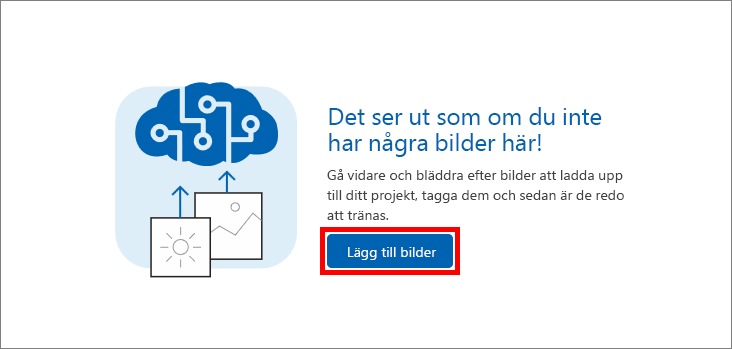
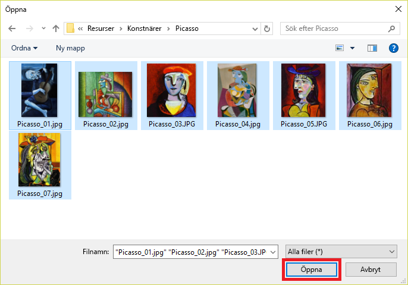
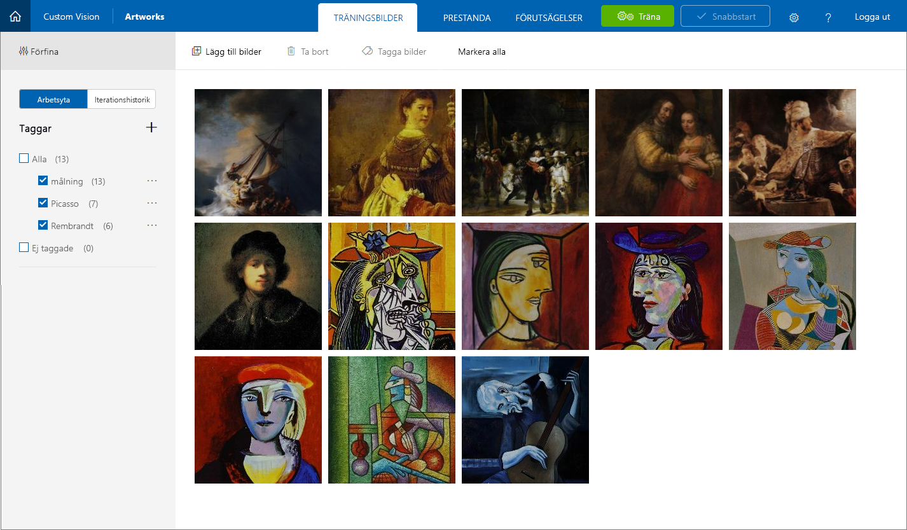

I den här kursdelen får du lägga till bilder av berömda tavlor av Picasso, Pollock och Rembrandt i projektet Artworks. Du taggar bilderna så att Custom Vision Service kan lära sig att skilja en konstnär från en annan.

1. I projektet **Artworks** som vi redan har skapat väljer du plustecknet (**+**) till höger om **Tags** (Taggar) i sidopanelen.

     

1. Dialogrutan **Name the tag** (Namnge taggen) visas. Skriv *painting* i taggnamnsfältet och välj **Save** (Spara). Den här åtgärden skapar taggen *painting* i tagglistan. Vi lägger till lite mer. 

1. Upprepa steg 2 för att lägga till taggar med värdena *Picasso*, *Pollock* och *Rembrandt*. Tagglistan ser ut så här när du är klar.

    

    Som du kan är antalet bilder i projektet som har taggats med var och en av dessa taggar noll. Ni ska vi lägga till några bilder i projektet och tilldela taggar.

1. Ladda ned [cvs-resources.zip](https://github.com/MicrosoftDocs/mslearn-classify-images-with-the-custom-vision-service/raw/master/cvs-resources.zip) som innehåller bildresurser för den här modulen och packa upp den till den lokala datorn. 

1. Välj **Add images** (Lägg till bilder) i portalen för att lägga till bilder i projektet.

    

1. Navigera till mappen ”Artists\Picasso” i mappen **cvs-resurser** som du laddade ned lokalt i steg 4.

1. Markera alla filer i ”Artists\Picasso” och välj sedan **Öppna**.

    

1. Dialogrutan **Image upload** (Bilduppladdning) visas med miniatyrbilder av alla bilder som vi laddar upp. Välj fältet **My Tags** (Mina taggar), som öppnar en listruta med de taggar du kan tilldela de här bilderna. 

    

1. Välj taggarna *painting* och *Picasso* och välj sedan **Upload 7 files** (Ladda upp 7 filer) för att slutföra uppladdningen. 

1. Bekräfta att bilderna du har laddat upp nu finns i Artworks-projektet och att tagglistan har uppdaterats och visar att vi har taggat sju bilder med *Picasso* och *painting*.

    

1. Med sju målningar av Picasso kan Custom Vision Service identifiera konstverk av Picasso ganska bra. Men om du skulle träna modellen nu skulle den bara förstå hur målningar av Picasso ser ut och inte kunna identifiera konstverk av andra konstnärer. Nästa steg är att ladd upp målningar av en annan konstnär. 

1. Klicka på **Add images** (Lägg till bilder) och markera alla bilder i mappen ”Artists\Rembrandt” i modulresurserna. Tagga dem med etiketterna ”painting” och ”Rembrandt” (inte ”Picasso”) och välj **Upload 6 files** (Ladda upp 6 filer) för att ladda upp dem till projektet.

    

1. Kontrollera att Rembrandt-bilderna visas tillsammans med Picasso-bilderna i projektet och att ”Rembrandt” visas i listan med taggar.

    

1. Lägg nu till konstverk av den gåtfulle konstnären Jackson Pollock så att Custom Vision Service även ska kunna identifiera konstverk av Pollock. Välj alla bilder i mappen ”Artists\Pollock” i modulresurserna, tagga dem med termerna ”painting” och ”Pollock” och ladda upp dem till projektet.

När de taggade bilderna är uppladdade är nästa steg att träna modellen med bilderna så att den kan skilja mellan konstverk målade av Picasso, Rembrandt och Pollock, och avgöra om en tavla är målad av någon av de här konstnärerna.