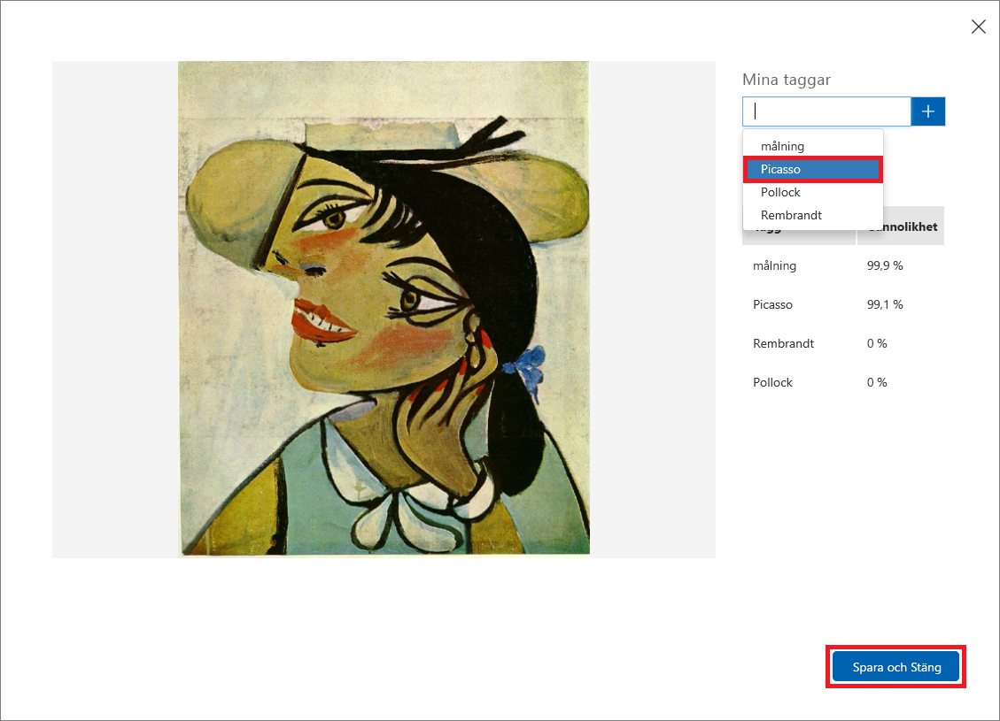

Nu när vi har tränat modellen är det dags att testa den. Vi ger modellen nya bilder och ser hur väl den klassificerar dem.

1. Klicka på **Quick Test** (Snabbtest) högst upp på sidan.

    

1. Klicka på **Bläddra bland lokala filer** och bläddra till mappen Quick Tests (Snabbtest) i mappen för modulresurser som du laddade ner tidigare. Välj **PicassoTest_01.jpg** och klicka på **Öppna**.

    

1. Granska testresultatet i dialogrutan Quick Test (Snabbtest). Vad är sannolikheten för att målningen är en Picasso? Vad är sannolikheten att den målats av Rembrandt eller Pollock?

    

1. Stäng dialogrutan Quick Test (Snabbtest). Klicka sedan på **Predictions** (Förutsägelser) överst på sidan.

    

1. Klicka på den testbild som du laddade upp för att visa detaljer i den. Tagga bilden som en ”Picasso” genom att välja **Picasso** i den nedrullningsbara listan och klicka på **Save and close** (Spara och stäng).

    > Genom att tagga bilder på det här sättet kan du förfina modellen utan att behöva ladda upp fler träningsbilder.

    

1. Kör ännu ett snabbtest, den här gången med filen som heter **FlowersTest.jpg** i mappen Quick Test (Snabbtest). Bekräfta att den här bilden har tilldelats en låg sannolikhet för att vara målad av Picasso, Rembrandt eller Pollock.

Modellen är nu tränad och beredd på att identifiera konstverk av utvalda konstnärer. Vi anropar förutsägelseslutpunkten via HTTP och ser vad som händer.