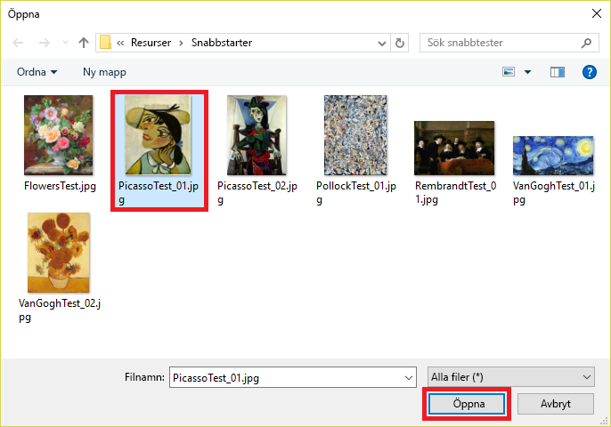

Nu när vi har tränat modellen är det dags att testa den.Now that we've trained our model, it's time to test it. Vi ger modellen nya bilder och ser hur väl den klassificerar dem.We'll give the model new images and see how well it classifies it.

1. Klicka på **Quick Test** (Snabbtest) högst upp på sidan.Click **Quick Test** at the top of the page.

    

1. Klicka på **Bläddra bland lokala filer** och bläddra till mappen Quick Tests (Snabbtest) i mappen för modulresurser som du laddade ner tidigare.Click **Browse local files**, and then browse to the "Quick Tests" folder in the module resources folder you download previously. Välj **PicassoTest_01.jpg** och klicka på **Öppna**.Select **PicassoTest_01.jpg**, and click **Open**.

    

1. Granska testresultatet i dialogrutan Quick Test (Snabbtest).Examine the results of the test in the "Quick Test" dialog. Vad är sannolikheten för att målningen är en Picasso?What is the probability that the painting is a Picasso? Vad är sannolikheten att den målats av Rembrandt eller Pollock?What is the probability that it's a Rembrandt or Pollock?

    

1. Stäng dialogrutan Quick Test (Snabbtest).Close the "Quick Test" dialog. Klicka sedan på **Predictions** (Förutsägelser) överst på sidan.Then click **Predictions** at the top of the page.

    

1. Klicka på den testbild som du laddade upp för att visa detaljer i den.Click the test image that you uploaded to show a detail of it. Tagga bilden som en ”Picasso” genom att välja **Picasso** i den nedrullningsbara listan och klicka på **Save and close** (Spara och stäng).Then tag the image as a "Picasso" by selecting **Picasso** from the drop-down list and clicking **Save and close**.

    > Genom att tagga bilder på det här sättet kan du förfina modellen utan att behöva ladda upp fler träningsbilder.By tagging test images this way, you can refine the model without uploading additional training images.

    

1. Kör ännu ett snabbtest, den här gången med filen som heter **FlowersTest.jpg** i mappen Quick Test (Snabbtest).Run another quick test, this time using the file named **FlowersTest.jpg** in the "Quick Test" folder. Bekräfta att den här bilden har tilldelats en låg sannolikhet för att vara målad av Picasso, Rembrandt eller Pollock.Confirm that this image is assigned a low probability of being a Picasso, a Rembrandt, or a Pollock.

Modellen är nu tränad och beredd på att identifiera konstverk av utvalda konstnärer.The model is trained and ready to go and appears to be skilled at identifying paintings by certain artists. Vi anropar förutsägelseslutpunkten via HTTP och ser vad som händer.Let's call the prediction endpoint over HTTP and see what happens.