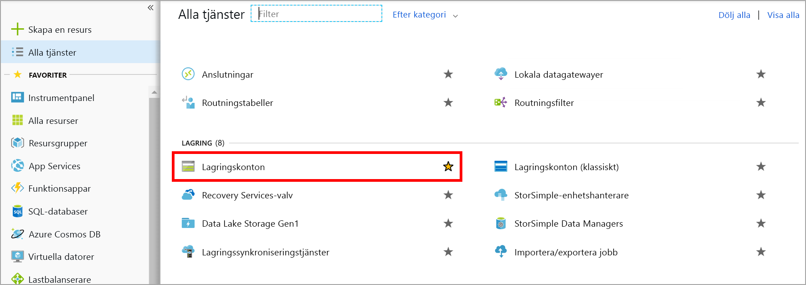
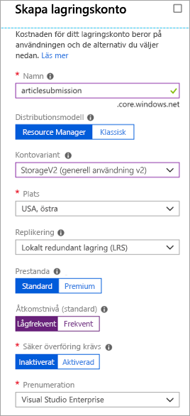

Det kan vara problematiskt med direktkommunikation mellan komponenterna i ett distribuerat program eftersom kommunikationen kan avbrytas när nätverksbandbredden är låg eller när efterfrågan är hög.

Vi har sett det här i vårt system: webbportalen anropar en webbtjänst, och det fungerar bra om tjänsten svarar inom rimlig tid. Stora trafikvolymer leder till problem, så planen att använda en kö för att eliminera direktlänken mellan apparna på klientsidan och din webbtjänst på mellannivå.

## <a name="what-is-azure-queue-storage"></a>Vad är Azure Queue Storage?

Azure Queue Storage är en Azure-tjänst som implementerar molnbaserade köer. Varje kö har en lista med meddelanden. Programkomponenter kommer åt en kö med hjälp av ett REST-API eller ett Azure-tillhandahållet klientbibliotek. Du kommer normalt har en eller flera _avsändarkomponenter_ och en eller flera _mottagarkomponenter_. Avsändarkomponenterna lägger till meddelande i kön. Mottagarkomponenter hämtar meddelanden som ligger först i kön för bearbetning. Följande bild visar flera avsändarappar som lägger till meddelanden i Azure-kön och en mottagarapp som hämtar meddelandena.


Prissättningen baseras på köstorleken och antalet åtgärder. Större meddelandeköer kostar mer än mindre köer. Debitering sker även för varje åtgärd, till exempel att lägga till ett meddelande eller att ta bort ett meddelande. Information om priser finns i [Prissättning för Azure Queue Storage](https://azure.microsoft.com/pricing/details/storage/queues/).

## <a name="why-use-queues"></a>Varför ska jag använda köer?

Köer ökar robustheten genom att tillfälligt lagra väntande meddelanden. När efterfrågan är låg eller normal förblir storleken på kön liten eftersom målkomponenten tar bort meddelanden från kön snabbare än de läggs till. När efterfrågan är hög kan köstorleken öka, men meddelandena går inte förlorade. Målkomponenten kan komma igen och tömma kön när efterfrågan blir normal igen.

En enskild kö kan ha en storlek på upp till **500 TB**, så den kan potentiellt lagra _miljontals_ meddelanden. Måldataflödet för en enskild kö är 2 000 meddelanden per sekund, så den kan hantera stora volymer.

Köer gör att ditt program kan skalas automatiskt och omedelbart när efterfrågan ändras. Det gör att de är användbara för kritiska affärsdata som skulle vara skadliga att förlora. Azure innehåller många andra tjänster som skalar automatiskt. Funktionen **Autoskalning** är till exempel tillgänglig för Azure VM-skalningsuppsättningar, molntjänster, Azure App Service-planer och App Service-miljöer. Den gör att du kan definiera regler som Azure använder för att identifiera perioder med hög efterfrågan och automatiskt lägga till kapacitet utan hjälp från en administratör. Automatisk skalning svarar på efterfrågan snabbt men inte omedelbart. Däremot hanterar Azure Queue Storage hög efterfrågan omedelbart genom att lagra meddelanden tills bearbetningsresurser blir tillgängliga.

## <a name="what-is-a-message"></a>Vad är ett meddelande?

Ett meddelande i en kö är en bytematris på upp till 64 KB. Meddelandeinnehåll tolkas inte alls av Azure-komponenter.

Om du vill skapa ett strukturerat meddelande kan du formatera meddelandeinnehållet med hjälp av XML eller JSON. Din kod ansvarar för att generera och tolka ditt anpassade format. Du kan till exempel skapa ett anpassat JSON-meddelande som ser ut så här:

```json
{
    "Message": {
        "To": "news@contoso.com",
        "From": "writer@contoso.com",
        "Subject": "Support request",
        "Body": "Send me a photographer!"
    }
}
```

## <a name="creating-a-storage-account"></a>Skapa ett lagringskonto

En kö måste ingå i ett lagringskonto. Du kan skapa ett lagringskonto med Azure CLI (eller PowerShell) eller i Azure Portal. Det är enklast att jobba i portalen eftersom processen är guidad och du tillfrågas om all information. 

I följande bild ser du var kategorin Lagringskonton finns.



Du har flera alternativ när du skapar kontot, men du kan använda standardinställningen för de flesta. Vi har gått igenom de här alternativen i en tidigare modul, men du kan hovra över tipset `(i)` för respektive alternativ om du vill få en påminnelse. Här är ett exempel på hur du kan fylla i portalbladet.

I följande skärmbild ser du bladet Skapa lagringskonto och den information du behöver ange för att skapa ett lagringskonto.



### <a name="settings-for-queues"></a>Inställningar för köer
När du skapar ett lagringskonto som ska innehålla köer bör du tänka igenom följande inställningar:

- Köer är bara tillgängliga för Azure-lagringskonton för generell användning (v1 eller v2). Du kan inte lägga till dem för bloblagringskonton.
- Inställningen **Åtkomstnivå** som visas för StoraveV2-konton gäller enbart bloblagring och påverkar inte köer.
- Välj en plats som ligger nära antingen källkomponenterna eller målkomponenterna, men helst nära båda.
- Data replikeras alltid till flera servrar för att skydda mot diskfel och andra maskinvaruproblem. Du kan välja replikeringsstrategi: **lokalt redundant lagring (LRS)** har en låg kostnad men är sårbar för katastrofer som påverkar ett helt datacenter, medan **geo-redundant lagring (GRS)** replikerar data till andra Azure-datacenter. Välj den replikeringsstrategi som passar bäst för dina redundansbehov.
- Prestandanivån avgör hur ditt meddelande lagras: **Standard** använder magnetiska hårddiskar medan **Premium** använder SSD-diskar. Välj Standard om du förväntar dig att toppar i efterfrågan kommer att vara kortvariga. Överväg Premium om kölängden ibland blir lång och om du behöver minimera åtkomsttiden för meddelanden.
- Kräv säker överföring om känslig information kan skickas via kön. Den här inställningen ser till att alla anslutningar till kön krypteras med hjälp av SSL (Secure Sockets Layer).