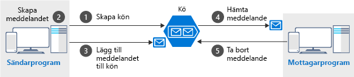

<span data-ttu-id="5d230-101">Köer innehåller meddelanden – datapaket vars form är känd för avsändar- och mottagarappen.</span><span class="sxs-lookup"><span data-stu-id="5d230-101">Queues hold messages - packets of data whose shape is known to the sender application and receiver application.</span></span> <span data-ttu-id="5d230-102">Avsändaren skapar kön och lägger till ett meddelande.</span><span class="sxs-lookup"><span data-stu-id="5d230-102">The sender creates the queue and adds a message.</span></span> <span data-ttu-id="5d230-103">Mottagaren hämtar ett meddelande, bearbetar det och tar sedan bort meddelandet från kön.</span><span class="sxs-lookup"><span data-stu-id="5d230-103">The receiver retrieves a message, processes it, and then deletes the message from the queue.</span></span> <span data-ttu-id="5d230-104">Följande illustration visar en översikt över en vanlig sådan process.</span><span class="sxs-lookup"><span data-stu-id="5d230-104">The following illustration shows a typical flow of this process.</span></span>



<span data-ttu-id="5d230-106">Observera att `get` och `delete` är separata åtgärder.</span><span class="sxs-lookup"><span data-stu-id="5d230-106">Notice that `get` and `delete` are separate operations.</span></span> <span data-ttu-id="5d230-107">Den här strukturen hanterar potentiella fel i mottagaren och implementerar ett begrepp som kallas _leverans minst en gång_.</span><span class="sxs-lookup"><span data-stu-id="5d230-107">This arrangement handles potential failures in the receiver and implements a concept called _at-least-once delivery_.</span></span> <span data-ttu-id="5d230-108">När mottagaren får ett meddelande finns meddelandet kvar i kön men är osynligt i 30 sekunder.</span><span class="sxs-lookup"><span data-stu-id="5d230-108">After the receiver gets a message, that message remains in the queue but is invisible for 30 seconds.</span></span> <span data-ttu-id="5d230-109">Om mottagaren kraschar eller utsätts för ett strömavbrott under bearbetningen tar den aldrig bort meddelandet från kön.</span><span class="sxs-lookup"><span data-stu-id="5d230-109">If the receiver crashes or experiences a power failure during processing, then it will never delete the message from the queue.</span></span> <span data-ttu-id="5d230-110">Efter 30 sekunder visas meddelandet i kön igen, och då kan en annan instans av mottagaren bearbeta det så att det slutförs.</span><span class="sxs-lookup"><span data-stu-id="5d230-110">After 30 seconds, the message will reappear in the queue and another instance of the receiver can process it to completion.</span></span>

## <a name="the-azure-storage-client-library-for-net"></a><span data-ttu-id="5d230-111">Azure Storage-klientbiblioteket för .NET</span><span class="sxs-lookup"><span data-stu-id="5d230-111">The Azure Storage Client Library for .NET</span></span>

<span data-ttu-id="5d230-112">**Azure Storage-klientbiblioteket för .NET** tillhandahåller typer för att representera vart och ett av de objekt som du behöver för att interagera med:</span><span class="sxs-lookup"><span data-stu-id="5d230-112">The **Azure Storage Client Library for .NET** provides types to represent each of the objects you need to interact with:</span></span>

- <span data-ttu-id="5d230-113">`CloudStorageAccount` representerar ditt Azure Storage-konto.</span><span class="sxs-lookup"><span data-stu-id="5d230-113">`CloudStorageAccount` represents your Azure storage account.</span></span>
- <span data-ttu-id="5d230-114">`CloudQueueClient` representerar Azure Queue-lagring.</span><span class="sxs-lookup"><span data-stu-id="5d230-114">`CloudQueueClient` represents Azure Queue storage.</span></span>
- <span data-ttu-id="5d230-115">`CloudQueue` representerar en av dina köinstanser.</span><span class="sxs-lookup"><span data-stu-id="5d230-115">`CloudQueue` represents one of your queue instances.</span></span>
- <span data-ttu-id="5d230-116">`CloudQueueMessage` representerar ett meddelande.</span><span class="sxs-lookup"><span data-stu-id="5d230-116">`CloudQueueMessage` represents a message.</span></span>

<span data-ttu-id="5d230-117">Du använder de här klasserna för att få programmatisk åtkomst till din kö.</span><span class="sxs-lookup"><span data-stu-id="5d230-117">You will use these classes to get programmatic access to your queue.</span></span> <span data-ttu-id="5d230-118">Biblioteket har både synkrona och asynkrona metoder. Du bör använda de asynkrona versionerna för att undvika blockering i klientapparna.</span><span class="sxs-lookup"><span data-stu-id="5d230-118">The library has both synchronous and asynchronous methods; you should prefer to use the asynchronous versions to avoid blocking the client app.</span></span>

> [!NOTE]
> <span data-ttu-id="5d230-119">Azure Storage-klientbiblioteket för .NET finns i **WindowsAzure.Storage** NuGet-paketet.</span><span class="sxs-lookup"><span data-stu-id="5d230-119">The Azure Storage Client Library for .NET is available in the **WindowsAzure.Storage** NuGet package.</span></span> <span data-ttu-id="5d230-120">Du kan installera det via IDE, Azure CLI eller PowerShell `Install-Package WindowsAzure.Storage`.</span><span class="sxs-lookup"><span data-stu-id="5d230-120">You can install it through an IDE, Azure CLI, or through PowerShell `Install-Package WindowsAzure.Storage`.</span></span>

## <a name="how-to-connect-to-a-queue"></a><span data-ttu-id="5d230-121">Ansluta till en kö</span><span class="sxs-lookup"><span data-stu-id="5d230-121">How to connect to a queue</span></span>

<span data-ttu-id="5d230-122">Om du vill ansluta till en kö måste du först skapa ett `CloudStorageAccount` med anslutningssträngen.</span><span class="sxs-lookup"><span data-stu-id="5d230-122">To connect to a queue, you first create a `CloudStorageAccount` with your connection string.</span></span> <span data-ttu-id="5d230-123">Objektet kan sedan skapa en `CloudQueueClient`, vilket i sin tur kan öppna en `CloudQueue`-instans.</span><span class="sxs-lookup"><span data-stu-id="5d230-123">The resulting object can then create a `CloudQueueClient`, which in turn can open a `CloudQueue` instance.</span></span> <span data-ttu-id="5d230-124">Det grundläggande kodflödet visas nedan.</span><span class="sxs-lookup"><span data-stu-id="5d230-124">The basic code flow is shown below.</span></span>

```csharp
CloudStorageAccount account = CloudStorageAccount.Parse(connectionString);

CloudQueueClient client = account.CreateCloudQueueClient();

CloudQueue queue = client.GetQueueReference("myqueue");
```

<span data-ttu-id="5d230-125">Att skapa en `CloudQueue` innebär inte nödvändigtvis att den _faktiska_ lagringskön finns,</span><span class="sxs-lookup"><span data-stu-id="5d230-125">Creating a `CloudQueue` doesn't necessarily mean the _actual_ storage queue exists.</span></span> <span data-ttu-id="5d230-126">men du kan använda det här objektet för att skapa, ta bort och söka efter en befintlig kö.</span><span class="sxs-lookup"><span data-stu-id="5d230-126">However, you can use this object to create, delete, and check for an existing queue.</span></span> <span data-ttu-id="5d230-127">Som nämnts ovan kan alla metoder användas med både synkrona och asynkrona versioner, men vi kommer endast att använda de `Task`-baserade asynkrona versionerna.</span><span class="sxs-lookup"><span data-stu-id="5d230-127">As mentioned above, all methods support both synchronous and asynchronous versions, but we will only be using the `Task`-based asynchronous versions.</span></span>

## <a name="how-to-create-a-queue"></a><span data-ttu-id="5d230-128">Så skapar du en resurs</span><span class="sxs-lookup"><span data-stu-id="5d230-128">How to create a queue</span></span>

<span data-ttu-id="5d230-129">Du ska använda ett vanligt mönster för att skapa en kö: avsändarprogrammet ska alltid ansvara för att skapa kön.</span><span class="sxs-lookup"><span data-stu-id="5d230-129">You will use a common pattern for queue creation: the sender application should always be responsible for creating the queue.</span></span> <span data-ttu-id="5d230-130">Detta gör programmet mer självständigt och mindre beroende av den administrativa strukturen.</span><span class="sxs-lookup"><span data-stu-id="5d230-130">This keeps your application more self-contained and less dependent on administrative set-up.</span></span> 

<span data-ttu-id="5d230-131">Klientbiblioteket underlättar skapandet genom att exponera en `CreateIfNotExistsAsync`-metod som skapar kön om det behövs, eller returnerar `false` om kön redan finns.</span><span class="sxs-lookup"><span data-stu-id="5d230-131">To make the creation simple, the client library exposes a `CreateIfNotExistsAsync` method that will create the queue if necessary, or return `false` if the queue already exists.</span></span> 

<span data-ttu-id="5d230-132">Den typiska koden visas nedan.</span><span class="sxs-lookup"><span data-stu-id="5d230-132">Typical code is shown below.</span></span>

```csharp
CloudQueue queue;
//...

await queue.CreateIfNotExistsAsync();
```

> [!NOTE]
> <span data-ttu-id="5d230-133">Du måste ha `Write`- eller `Create`-behörighet till lagringskontot för att kunna använda detta API.</span><span class="sxs-lookup"><span data-stu-id="5d230-133">You must have `Write` or `Create` permissions for the storage account to use this API.</span></span> <span data-ttu-id="5d230-134">Detta gäller alltid om du använder säkerhetsmodellen med **åtkomstnyckel**, men du kan låsa behörigheterna till kontot med andra metoder som enbart tillåter läsåtgärder mot kön.</span><span class="sxs-lookup"><span data-stu-id="5d230-134">This is always true if you use the **Access Key** security model, but you can lock down permissions to the account with other approaches that will only allow read operations against the queue.</span></span>

## <a name="how-to-send-a-message"></a><span data-ttu-id="5d230-135">Så skickar du ett meddelande</span><span class="sxs-lookup"><span data-stu-id="5d230-135">How to send a message</span></span>

<span data-ttu-id="5d230-136">För att skicka ett meddelande instansierar du ett `CloudQueueMessage`objekt.</span><span class="sxs-lookup"><span data-stu-id="5d230-136">To send a message, you instantiate a `CloudQueueMessage` object.</span></span> <span data-ttu-id="5d230-137">Klassen har några överlagrade konstruktorer som läser in dina data i meddelandet.</span><span class="sxs-lookup"><span data-stu-id="5d230-137">The class has a few overloaded constructors that load your data into the message.</span></span> <span data-ttu-id="5d230-138">Vi använder den konstruktor som tar en `string`.</span><span class="sxs-lookup"><span data-stu-id="5d230-138">We will use the constructor that takes a `string`.</span></span> <span data-ttu-id="5d230-139">När meddelandet har skapats använder du ett `CloudQueue`-objekt för att skicka det.</span><span class="sxs-lookup"><span data-stu-id="5d230-139">After creating the message, you use a `CloudQueue` object to send it.</span></span>

<span data-ttu-id="5d230-140">Här är ett vanligt exempel:</span><span class="sxs-lookup"><span data-stu-id="5d230-140">Here's a typical example:</span></span>

```csharp
var message = new CloudQueueMessage("your message here");

CloudQueue queue;
//...

await queue.AddMessageAsync(message);
```

> [!NOTE]
> <span data-ttu-id="5d230-141">Den totala köstorleken kan vara upp till 500 TB, men enskilda meddelanden i kön kan endast vara upp till 64 kB stora (48 kB om du använder Base64-kodning).</span><span class="sxs-lookup"><span data-stu-id="5d230-141">While the total queue size can be up to 500 TB, the individual messages in it can only be up to 64 KB in size (48 KB when using Base64 encoding).</span></span> <span data-ttu-id="5d230-142">Om du behöver en större nyttolast kan du kombinera köer och blobbar, och skicka webbadressen till de faktiska data (som lagras som en blob) i meddelandet.</span><span class="sxs-lookup"><span data-stu-id="5d230-142">If you need a larger payload you can combine queues and blobs – passing the URL to the actual data (stored as a Blob) in the message.</span></span> <span data-ttu-id="5d230-143">Med den metoden kan du ha upp till 200 GB för ett enskilt objekt i kön.</span><span class="sxs-lookup"><span data-stu-id="5d230-143">This approach would allow you to enqueue up to 200 GB for a single item.</span></span>

## <a name="how-to-receive-and-delete-a-message"></a><span data-ttu-id="5d230-144">Så tar du emot och tar bort ett meddelande</span><span class="sxs-lookup"><span data-stu-id="5d230-144">How to receive and delete a message</span></span>

<span data-ttu-id="5d230-145">I mottagaren tar du emot nästa meddelande, bearbetar det och tar sedan bort det efter att bearbetningen är klar.</span><span class="sxs-lookup"><span data-stu-id="5d230-145">In the receiver, you get the next message, process it, and then delete it after processing succeeds.</span></span> <span data-ttu-id="5d230-146">Här är ett enkelt exempel:</span><span class="sxs-lookup"><span data-stu-id="5d230-146">Here's a simple example:</span></span>

```C#
CloudQueue queue;
//...

CloudQueueMessage message = await queue.GetMessageAsync();

if (message != null)
{
    // Process the message
    //...

    await queue.DeleteMessageAsync(message);
}
```

<span data-ttu-id="5d230-147">Nu ska vi använda de nya kunskaperna på vårt program!</span><span class="sxs-lookup"><span data-stu-id="5d230-147">Let's now apply this new knowledge to our application!</span></span>