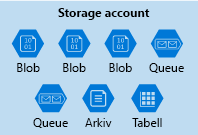
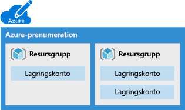
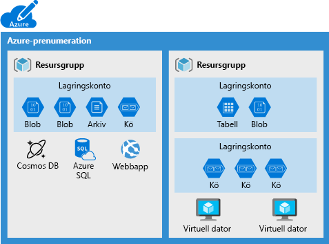
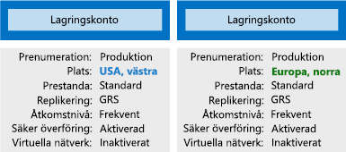

Organisationer har ofta flera lagringskonton så att de kan implementera olika kravuppsättningar.Organizations often have multiple storage accounts to let them implement different sets of requirements. I exemplet med chokladtillverkaren skulle det finnas ett lagringskonto för privata affärsdata och ett för konsumentinriktade filer.In the chocolate-manufacturer example, there would be one storage account for the private business data and one for the consumer-facing files. Här lär du dig om de principfaktorer som styrs av ett lagringskonto och som hjälper dig att avgöra hur många konton du behöver.Here, you will learn the policy factors that are controlled by a storage account, which will help you decide how many accounts you need.

## Vad är Azure Storage?What is Azure Storage?

Azure erbjuder många sätt att lagra data på.Azure provides many ways to store your data. Det finns flera databasalternativ som exempelvis Azure SQL Server, Azure Cosmos DB och Azure Table Storage.There are multiple database options like Azure SQL Server, Azure Cosmos DB, and Azure Table Storage. I Azure kan du lagra och skicka meddelanden på flera sätt, t.ex. med Azure Queues och Event Hubs.Azure offers multiple ways to store and send messages, such as Azure Queues and Event Hubs. Du kan även lagra lösa filer med hjälp av tjänster som Azure Files och Azure Blobs.You can even store loose files using services like Azure Files and Azure Blobs.

Azure har valt fyra av dessa datatjänster och placerat dem tillsammans under namnet _Azure Storage_.Azure selected four of these data services and placed them together under the name _Azure Storage_. De fyra tjänsterna är: Azure Blobs, Azure Files, Azure Queues och Azure Tables.The four services are Azure Blobs, Azure Files, Azure Queues, and Azure Tables. Följande bild visar delarna i Azure Storage.The following illustration shows the elements of Azure Storage.

Dessa fyra gavs särskild behandling eftersom de alla är primitiva, molnbaserade lagringstjänster och ofta används tillsammans i samma program.These four were given special treatment because they are all primitive, cloud-based storage services and are often used together in the same application.

## Vad är ett lagringskonto?What is a storage account?

En _lagringskonto_ är en container som grupperar en uppsättning Azure Storage-tjänster tillsammans.A _storage account_ is a container that groups a set of Azure Storage services together. Endast datatjänster från Azure Storage kan ingå i ett lagringskonto (Azure Blobs, Azure Files, Azure Queues och Azure Tables).Only data services from Azure Storage can be included in a storage account (Azure Blobs, Azure Files, Azure Queues, and Azure Tables). Följande bild visar ett lagringskonto som innehåller flera datatjänster.The following illustration shows a storage account containing several data services.

Genom att kombinera datatjänster i ett lagringskonto kan du hantera dem som en grupp.Combining data services into a storage account lets you manage them as a group. De inställningar du anger när du skapar kontot, eller dem som du ändrar efter skapandet, tillämpas på allt i kontot.The settings you specify when you create the account, or any that you change after creation, are applied to everything in the account. Om du tar bort lagringskontot tas alla data som lagras i det bort.Deleting the storage account deletes all of the data stored inside it.

Ett lagringskonto är en Azure-resurs och ingår i en resursgrupp.A storage account is an Azure resource and is included in a resource group. Följande bild visar en Azure-prenumeration som innehåller flera resursgrupper där varje grupp innehåller ett eller flera lagringskonton.The following illustration shows an Azure subscription containing multiple resource groups, where each group contains one or more storage accounts.

Andra Azure-datatjänster som Azure SQL och Cosmos DB hanteras som oberoende Azure-resurser och kan inte ingå i ett lagringskonto.Other Azure data services like Azure SQL and Cosmos DB are managed as independent Azure resources and cannot be included in a storage account. Följande bild visar ett typiskt arrangemang: blobar, filer, köer och tabeller finns i lagringskonton medan andra tjänster inte gör det.The following illustration shows a typical arrangement: Blobs, Files, Queues, and Tables are inside storage accounts, while other services are not.

## Inställningar för lagringskontoStorage account settings

Ett lagringskonto definierar en princip som gäller för alla lagringstjänster i kontot.A storage account defines a policy that applies to all the storage services in the account. Du kan till exempel ange att alla inneslutna tjänster ska lagras i datacentret i USA, västra, endast kan nås över https och faktureras till försäljningsavdelningens prenumeration.For example, you could specify that all the contained services will be stored in the West US datacenter, accessible only over https, and billed to the sales department's subscription.

De inställningar som styrs av ett lagringskonto är:The settings that are controlled by a storage account are:

- **Prenumeration**: Den Azure-prenumeration som debiteras för tjänster i kontot.**Subscription**: The Azure subscription that will be billed for the services in the account.

- **Plats**: Det datacenter som lagrar tjänsterna i kontot.**Location**: The datacenter that will store the services in the account.

- **Prestanda**: Avgör vilka datatjänster du kan ha på ditt lagringskonto och typen av de hårddiskar som används för att lagra datan.**Performance**: Determines the data services you can have in your storage account and the type of hardware disks used to store the data. **Standard** tillåter alla datatjänster (blob, fil, kö, tabell) och använder magnetiska hårddiskar.**Standard** allows you to have any data service (Blob, File, Queue, Table) and uses magnetic disk drives. **Premium** begränsar dig till en viss typ av blob som kallas en _sidblob_ och använder SSD-diskar för lagring.**Premium** limits you to one specific type of blob called a _page blob_ and uses solid-state drives (SSD) for storage.

- **Replikering**: Avgör vilken strategi som används för att göra kopior av dina data som skydd mot maskinvarufel och naturkatastrofer.**Replication**: Determines the strategy used to make copies of your data to protect against hardware failure or natural disaster. Azure behåller automatiskt minst en kopia av dina data i det datacenter som är associerat med lagringskontot.At a minimum, Azure will automatically maintain a copy of your data within the data center associated with the storage account. Detta kallas lokalt redundant lagring (LRS) och skyddar mot maskinvarufel, men skyddar inte mot händelser som slår ut hela datacentrat.This is called locally-redundant storage (LRS), and guards against hardware failure but does not protect you from an event that incapacitates the entire datacenter. Du kan uppgradera till ett av de andra alternativen, till exempel geo-redundant lagring (GRS), för att få replikering i olika datacentra över hela världen.You can upgrade to one of the other options such as geo-redundant storage (GRS) to get replication at different datacenters across the world.

- **Åtkomstnivå**: Styr hur snabbt du kan komma åt blobbarna på det här lagringskontot.**Access tier**: Controls how quickly you will be able to access the blobs in this storage account. Frekvent ger snabbare åtkomst än Lågfrekvent men till ett högre pris.Hot gives quicker access than Cool, but at increased cost. Detta gäller endast för blobbar och fungerar som standardvärde för nya blobbar.This applies only to blobs, and serves as the default value for new blobs.

- **Säker överföring krävs**: En säkerhetsfunktion som bestämmer vilket protokoll som stöds för åtkomst.**Secure transfer required**: A security feature that determines the supported protocols for access. En aktivering kräver HTTPs, men om det är inaktiverat tillåts HTTP.Enabled requires HTTPs, while disabled allows HTTP.

- **Virtuella nätverk**: En säkerhetsfunktion som endast tillåter inkommande begäranden från de virtuella nätverk som du anger.**Virtual networks**: A security feature that allows inbound access requests only from the virtual network(s) you specify.

## Hur många lagringskonton behöver du?How many storage accounts do you need?

Ett lagringskonto representerar en samling inställningar som exempelvis plats, replikeringsstrategi och prenumerationsägare.A storage account represents a collection of settings like location, replication strategy, and subscription owner. Du behöver ett lagringskonto för varje grupp med inställningar som du vill tillämpa på dina data.You need one storage account for every group of settings that you want to apply to your data. Följande bild visar två lagringskonton som skiljer sig i en inställning; den enstaka skillnaden är tillräcklig för att kräva separata lagringskonton.The following illustration shows two storage accounts that differ in one setting; that one difference is enough to require separate storage accounts.

Det antal lagringskonton som du behöver avgörs vanligtvis av din datamångfald, kostnadskänslighet och tolerans för hanteringsarbete.The number of storage accounts you need is typically determined by your data diversity, cost sensitivity, and tolerance for management overhead.

### DatamångfaldData diversity

Organisationer genererar ofta data som skiljer sig i hur de används, hur känsliga de är, vilken grupp som betalar fakturorna osv. Mångfald längsmed dessa vektorer kan leda till flera lagringskonton.Organizations often generate data that differs in where it is consumed, how sensitive it is, which group pays the bills, etc. Diversity along any of these vectors can lead to multiple storage accounts. Vi tittar på två exempel:Let's consider two examples:

1. Har du data som är specifika för ett land eller en region?Do you have data that is specific to a country or region? I så fall bör du kanske lagra den i ett datacenter i det landet, av prestanda- eller efterlevnadsskäl.If so, you might want to locate it in a data center in that country for performance or compliance reasons. Du behöver ett lagringskonto för varje plats.You will need one storage account for each location.

1. Har du vissa data som är privata och vissa som är avsedda för offentlig användning?Do you have some data that is proprietary and some for public consumption? I så fall kan du aktivera virtuella nätverk för privata data och inte för offentliga data.If so, you could enable virtual networks for the proprietary data and not for the public data. Detta kräver också separata lagringskonton.This will also require separate storage accounts.

I allmänhet innebär ökad mångfald ett större antal lagringskonton.In general, increased diversity means an increased number of storage accounts.

### KostnadskänslighetCost sensitivity

Ett lagringskonto i sig medför ingen ekonomisk kostnad. Däremot påverkar de inställningar du väljer för kontot kostnaden för tjänsterna i kontot.A storage account by itself has no financial cost; however, the settings you choose for the account do influence the cost of services in the account. Geo-redundant lagring kostar mer än lokalt redundant lagring.Geo-redundant storage costs more than locally-redundant storage. Premium-prestanda och frekvent lagringsnivå ökar kostnaden för blobar.Premium performance and the Hot access tier increase the cost of blobs.

Du kan använda flera lagringskonton för att minska kostnaderna.You can use multiple storage accounts to reduce costs. Du kan till exempel partitionera dina data till kritiska och icke-kritiska kategorier.For example, you could partition your data into critical and non-critical categories. Du kan placera dina viktiga data i ett lagringskonto med geo-redundant lagring och placera dina icke-kritiska data i ett annat lagringskonto med lokalt redundant lagring.You could place your critical data into a storage account with geo-redundant storage and put your non-critical data in a different storage account with locally-redundant storage.

### Tolerans för hanteringsarbeteTolerance for management overhead

Varje lagringskonto kräver tid och uppmärksamhet från en administratör i form av skapande och underhåll.Each storage account requires some time and attention from an administrator to create and maintain. Det ökar även komplexiteten för alla som lägger till data i molnlagringen. Alla i den här rollen måste förstå syftet med varje lagringskonto så att de lägger till nya data till rätt konto.It also increases complexity for anyone who adds data to your cloud storage; everyone in this role needs to understand the purpose of each storage account so they add new data to the correct account.

Lagringskonton är ett kraftfullt verktyg som hjälper dig att få de prestanda och den säkerhet du behöver, samtidigt som kostnaderna minimeras.Storage accounts are a powerful tool to help you get the performance and security you need while minimizing costs. En vanlig strategi är att börja med en analys av dina data och skapa partitioner som delar egenskaper som plats, fakturering, replikeringsstrategi osv. och sedan skapa ett lagringskonto för varje partition.A typical strategy is to start with an analysis of your data and create partitions that share characteristics like location, billing, and replication strategy, and then create one storage account for each partition.