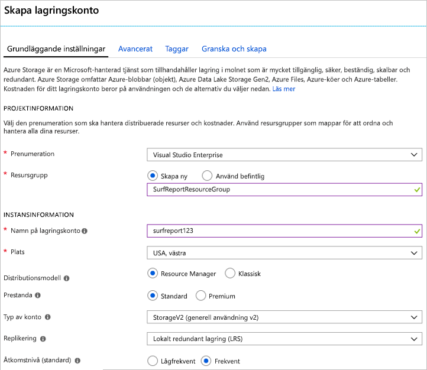
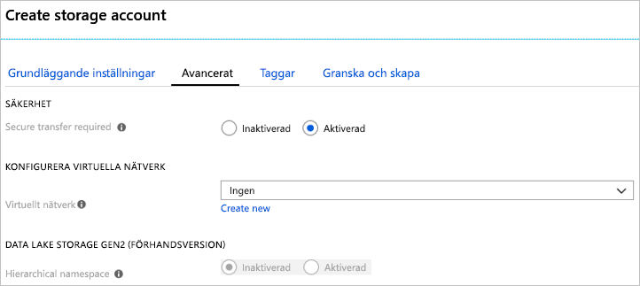

I den här enheten använder du Azure-portalen för att skapa ett lagringskonto som är lämplig för en fiktiv southern California surf rapporten webbapp.

Webbplatsen surf rapporten låter användarna ladda upp foton och videoklipp om sina lokala stranden villkor. Tittarna använder innehållet för att välja den strand som har de bästa surfvillkoren. Din lista över design- och funktionsmål är:

- Videoinnehåll måste läsas in snabbt
- Platsen måste kunna hantera oväntade toppar i uppladdningsvolym
- Inaktuellt innehåll tas bort allteftersom surfvillkoren ändras så att webbplatsen alltid visar aktuella villkor

Du väljer en implementering som buffrar uppladdat innehåll i en Azure-kö för bearbetning och sedan flyttar det till en Azure-blob för lagring. Du behöver ett lagringskonto som kan innehålla både köer och blobbar leverera låg latens till ditt innehåll.

## Använd Azure portal för att skapa ett lagringskonto

[!include]

1. Logga in på [Azure Portal](https://portal.azure.com/?azure-portal=true).

1. Längst upp till vänster på Azure Portal, Välj **skapa en resurs**.

1. I panelen val väljer **Storage**.

1. På höger sida av det här fönstret, väljer **lagringskonto – blob, fil, tabell, kö**.

    

### Konfigurera de grundläggande alternativen

[!include]

Under **PROJEKTINFORMATION**:

1. Välj lämplig **prenumeration**.

1. Välj den befintliga resursgruppen <rgn>[Sandbox resursgruppens namn]</rgn> från den nedrullningsbara listan.

    > [!NOTE]
    > Den här kostnadsfria resursgruppen har angetts av Microsoft som en del av learning-miljö. När du skapar ett konto för ett riktigt program, kommer du att skapa en ny resursgrupp i din prenumeration för att lagra alla resurser för appen.

Under **INSTANSINFORMATION**:

1. Ange en **lagringskontonamn**. Namnet används för att generera en offentlig URL som används för att komma åt data på kontot. Det måste vara unikt inom alla befintliga lagringskontonamn i Azure. Det måste vara 3 och 24 tecken långt och får bara innehålla gemena bokstäver och siffror.

1. Välj en **plats** nära dig. 

1. Lämna den **distributionsmodellen** som _resurshanteraren_. Det här är att föredra för alla resursdistributioner i Azure och kan du gruppera relaterade resurser för din app i en _resursgrupp_ för enklare hantering.

1. Välj _Standard_ för den **prestanda** alternativet. Detta avgör vilken typ av disklagring som används för att lagra data i lagringskontot. Standard använder traditionella hårddiskar och Premium använder solid state-hårddiskar (SSD) för snabbare åtkomst. Men kom ihåg att det endast stöder Premium _sidblobbar_ och du måste blockera BLOB-objekt för dina videor och en kö för buffring - som båda är bara tillgängliga med den _Standard_ alternativet.

1. Välj _StorageV2 (generell användning v2)_ för den **typ av konto**. Det ger åtkomst till de senaste funktionerna och priser. I synnerhet har Blob storage-konton fler alternativ som är tillgängliga med den här kontotypen. Du behöver en blandning av BLOB-objekt och en kö, så den _Blob-lagring_ alternativet inte fungerar. För det här programmet, skulle det finnas några fördelar med att välja en _lagring (generell användning v1)_ konto, eftersom som skulle begränsa funktioner som du kan komma åt och är osannolikt att minska kostnaden för den förväntade arbetsbelastningen.

1. Lämna den **replikering** som _lokalt redundant lagring (LRS)_. Data i Azure storage-konton replikeras alltid för att säkerställa hög tillgänglighet – det här alternativet kan du välja hur långt bort replikering för att matcha dina krav på hög tillförlitlighet. I vårt fall bilder och videor snabbt bli inaktuella och tas bort från platsen. Det innebär att det inte finns någon större poäng med att betala extra för global redundans. I händelse av en katastrof som leder till dataförlust kan du starta om webbplatsen med nytt innehåll från användarna.

1. Ange den **åtkomstnivå** till _frekvent_. Den här inställningen används bara för Blob storage. Den **frekventa åtkomstnivån** är perfekt för data som används ofta och **kalla åtkomstnivåer** är bättre för data som sällan används. Observera att detta endast anger den _standard_ värde – när du skapar en Blob, du kan ange ett annat värde för data. I vårt fall vill vi videor att läsa in snabbt, så att du ska använda alternativet höga prestanda för din BLOB.
   
Följande skärmbild visar slutförda inställningar för fliken **Grundläggande inställningar**. Observera att den resursgrupp, prenumeration och namn har olika värden.

### Konfigurera avancerade alternativ

1. Klicka på den **nästa: Avancerat >** knappen för att flytta till den **Avancerat** fliken eller Välj den **Avancerat** fliken högst upp på skärmen.

1. Den **säker överföring krävs** ställa in kontroller om **HTTP** kan användas för REST API: er används för att komma åt data i lagringskontot. Det här alternativet _aktiverad_ tvingar alla klienter använder SSL (**HTTPS**). I de flesta fall du vill ställa in denna på _aktiverad_ som använder HTTPS via nätverket anses vara bästa praxis.

    > [!WARNING]
    > Om det här alternativet aktiveras framtvingar den vissa ytterligare begränsningar. Azure files-Tjänstanslutningar utan kryptering misslyckas, inklusive scenarier med hjälp av SMB 2.1 eller 3.0 på Linux. Eftersom Azure storage inte stöder SSL för anpassade domännamn, kan det här alternativet inte användas med ett anpassat domännamn.

1. Ange den **virtuella nätverk** alternativet att _ingen_. Det här alternativet kan du isolera storage-konto på Azure-nätverk. Vi vill att använda offentliga Internet-åtkomst. Vårt innehåll är offentligt vända och du måste tillåta åtkomst från offentliga klienter.

1. Lämna den **Data Lake Storage Gen2** beroende på _inaktiverad_. Det här är för stordata-program som inte är relevanta för den här modulen.

Följande skärmbild visar slutförda inställningar för fliken **Avancerat**.

### Skapa

1. Du kan utforska den **taggar** inställningar om du vill. Detta kan du associera nyckel/värde-par till kontot för dina kategorisering och är en funktion som är tillgängliga för alla Azure-resurser.

1. Klicka på **granska + skapa** till granskar du inställningarna. Detta kommer att göra en snabb verifiering av alternativen för att se till att alla obligatoriska fält har valts. Om det finns problem, kommer de att rapporteras här. När du har granskat inställningarna, klickar du på **skapa** att etablera lagringskontot.

Det tar några minuter att distribuera kontot. Medan Azure arbetar med som, låt oss utforska API: er som vi ska använda med det här kontot.

### Verifiera

1. Välj länken **Lagringskonton** i det vänstra sidofältet.

1. Leta upp det nya lagringskontot i listan för att verifiera skapandet.

<!-- Cleanup sandbox -->
[!include]

När du arbetar i din egen prenumeration kan du följande steg i Azure portal för att ta bort resursgruppen och alla associerade resurser.

1. Välj länken **Resursgrupper** i det vänstra sidofältet.

1. Leta upp den resursgrupp du skapade i listan.

1. Högerklicka på posten för resurs-grupp och välj **ta bort resursgrupp** på snabbmenyn. Du kan också klicka på ”...”-menyn elementet på höger sida av posten för att komma till på samma snabbmenyn.

1. Ange resursgruppens namn i bekräftelsefältet.

1. Klicka på knappen **Ta bort**.

## Sammanfattning

Du har skapat ett lagringskonto med inställningar som styrs av dina affärsbehov. Exempelvis kan kanske du har valt ett datacenter för västra USA eftersom dina kunder fanns främst i southern California. Det här är ett typiskt flöde: först analysera dina data och mål och konfigurera alternativ för storage-konton så att de matchar.