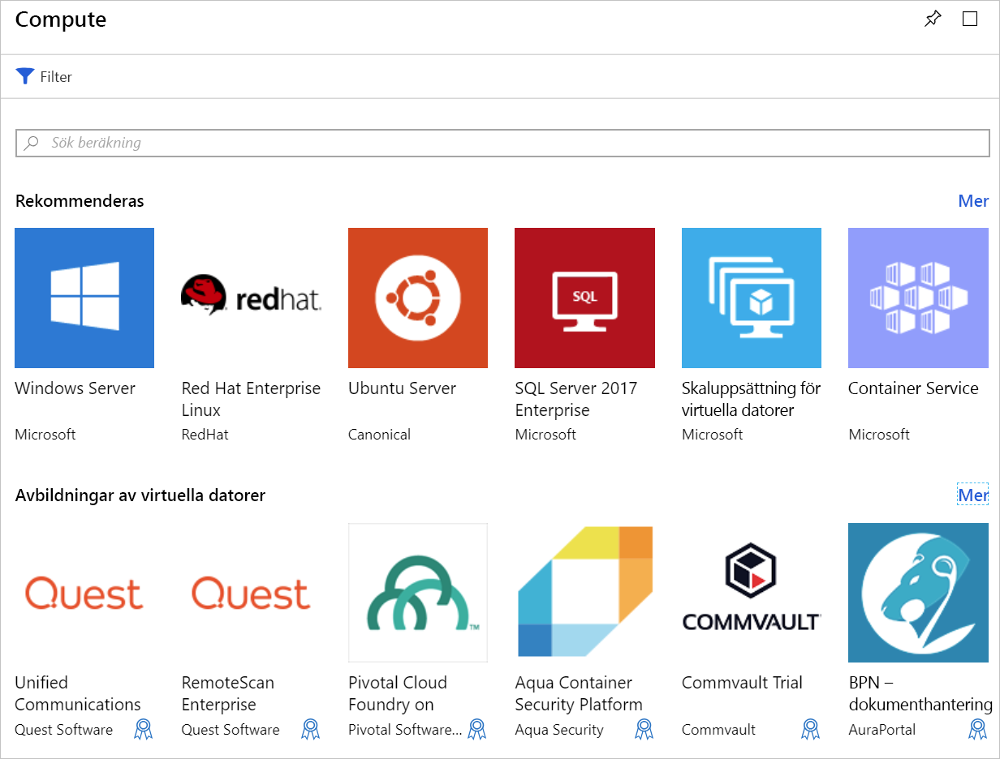

Vi har en befintlig webbplats som körs på en lokal Ubuntu Linux-server. Vårt mål är att skapa en virtuell Azure-dator med den senaste Ubuntu-avbildningen och migrera webbplatsen till molnet. I den här delen lär du dig om de alternativ du behöver för att avgöra när du ska skapa en virtuell dator i Azure.

## Introduktion till Azure Virtual Machines

Virtuella datorer i Azure är databearbetningsresurser som kan skalas om på begäran. De omfattar resurser för processor, minne, lagring och nätverk. Du kan starta och stoppa de virtuella datorerna och hantera dem från Azure Portal eller via Azure CLI. Du kan även använda en fjärr-SSH för att ansluta direkt till den virtuella dator som körs och köra kommandon som om du använder en lokal dator.

### Köra Linux i Azure

Att skapa Linux-baserade virtuella datorer i Azure är enkelt. Microsoft samarbetar med framstående Linux-leverantörer för att säkerställa att deras distributioner optimeras för Azure-plattformen. Du kan skapa virtuella datorer utifrån färdiga avbildningar för olika populära Linux-distributioner som SUSE, Red Hat och Ubuntu, eller skapa din egen Linux-distribution för körning i molnet.

## Skapa en virtuell Azure-dator

Virtuella datorer kan definieras och distribueras i Azure på flera olika sätt: Azure Portal, ett skript (med Azure CLI eller Azure PowerShell) eller via en Azure Resource Manager-mall. I samtliga fall behöver du ange flera typer av information, vilket vi återkommer till strax.

Azure Marketplace har också förkonfigurerade avbildningar som innehåller både ett operativsystem och favoritprogram installerade för specifika scenarier.

## Resurser som används på en virtuell Linux-dator

När du skapar en virtuell Linux-dator i Azure skapar du även resurser för den virtuella datorns värdmiljö. De här resurserna fungerar tillsammans för att virtualisera en dator och köra operativsystemet Linux. Dessa måste redan finnas (och väljas när den virtuella datorn skapas). Annars skapas de samtidigt som den virtuella datorn:

- En virtuell dator som tillhandahåller CPU- och minnesresurser
- Ett Azure Storage-konto för att lagra de virtuella hårddiskarna
- Virtuella diskar med operativsystem, program och data
- Ett virtuellt nätverk för att ansluta den virtuella datorn till andra Azure-tjänster eller din lokala maskinvara
- Ett nätverksgränssnitt för att kommunicera med det virtuella nätverket
- En valfri offentlig IP-adress så att du kommer åt den virtuella datorn

Liksom andra Azure-tjänster behöver du en **resursgrupp** som innehåller den virtuella datorn (och du kan också gruppera resurserna för administration). När du skapar en ny virtuell dator kan du antingen använda en befintlig resursgrupp eller skapa en ny.

## Välja VM-avbildning

Att välja avbildning är ett av de första och viktigaste besluten när du skapar en virtuell dator. En avbildning är mallen som används till att skapa den virtuella datorn. Dessa mallar har ett operativsystem och ofta annan programvara, som utvecklingsverktyg eller värdmiljöer för webben.

Allt som kan installeras på en dator kan ingå i en avbildning. Du kan skapa en virtuell dator som är förkonfigurerade för precis de uppgifter du behöver, till exempel värd för en webbapp på Apache HTTP-servern.

> [!TIP]  
> Du kan också skapa och ladda upp anpassade diskavbildningar. Mer information finns i dokumentationen.

## Ange storlek för den virtuella datorn

En virtuell dator har en viss mängd minne och processorkraft precis som en fysisk dator. Azure erbjuder virtuella datorer i olika storlekar till olika priser. Den storlek du väljer bestämmer den virtuella datorns bearbetningskraft, minne och maximala lagringskapacitet.

> [!WARNING]
> Det finns kvotgränser för varje prenumeration som kan påverka skapandet av den virtuella datorn. Som standard kan du inte ha mer än sammanlagt 20 virtuella _kärnor_ på dina virtuella datorer i en region. Du kan dela upp virtuella datorer i olika regioner eller lämna en [onlinebegäran](https://docs.microsoft.com/azure/azure-supportability/resource-manager-core-quotas-request) om att höja gränsen.

Storlekar på virtuella datorer grupperas i kategorier, från B-serien för grundläggande testning och upp till H-serien för stora databehandlingsuppgifter. Du bör välja storlek av virtuell dator utifrån den arbetsbelastning du vill utföra. Du kan ändra storlek på en virtuell dator när den har skapats men den virtuella datorn måste stoppas först, så det är bäst att välja en lämplig storlek från början, om det är möjligt.

#### Här är några riktlinjer som baseras på det scenario du arbetar med

| Vad gör du? | Överväg de här storlekarna
|-------|------------------|
| **Allmän databearbetning/webb** :Testning och utveckling, små till medelstora databaser eller webbservrar med låg till medelhög trafik. | B, Dsv3, Dv3, DSv2, Dv2 |
| **Tunga databearbetningsuppgifter**: Webbservrar med medelhög trafik, nätverkstillämpningar, batchprocesser och programservrar. | Fsv2, Fs, F |
| **Stor minnesanvändning**: Relationsdatabasservrar, medelstora till stora cacheminnen och minnesinterna analyser. | Esv3, Ev3, M, GS, G, DSv2, Dv2 |
| **Lagring och bearbetning av data**: Stordata, SQL- och NoSQL-databaser som behöver högt diskgenomflöde och I/O. | Ls |
| **Tung grafikrendering** eller videoredigering samt modellträning och inferensjobb (ND) med djupinlärning. | NV, NC, NCv2, NCv3, ND |
| **Databearbetning med höga prestanda (HPC)**: Om du behöver virtuella datorer med de snabbaste och mest kraftfulla processorerna med valfria nätverksgränssnitt för högt genomflöde. | H |

## Välja lagringsalternativ

Nästa uppsättning beslut kretsar kring lagring. Först kan du välja diskteknik. Du kan välja en traditionell skivbaserad hårddisk (HDD) eller en modernare Solid State-hårddisk (SSD). Precis som maskinvara som du köper kostar SSD-lagring mer men ger bättre prestanda.

> [!TIP]
> Det finns två nivåer av SSD-lagring: standard och premium. Välj Standard SSD-diskar om du har normala arbetsbelastningar men vill ha bättre prestanda. Välj Premium SSD-diskar om du har I/O-intensiva arbetsbelastningar eller verksamhetskritiska system som behöver bearbeta data mycket snabbt.

### Mappa lagring till diskar

Azure använder virtuella hårddiskar (VHD) för att representera fysiska diskar för den virtuella datorn. Virtuella hårddiskar replikerar det logiska formatet och data hos en diskenhet men lagras som sidblobbar på ett Azure Storage-konto. För varje disk kan du välja vilken typ av lagring den ska använda (SSD eller HDD). Det gör att du kan kontrollera varje disks prestanda, troligen baserat på den I/O du planerar att utföra på den.

Som standard skapas två virtuella hårddiskar (VHD) för den virtuella Linux-datorn:

1. **Operativsystemdisken**: Detta är din primära enhet med en maxkapacitet på 2 048 GB. Den är märkt `/dev/sda` som standard.

1. En **tillfällig disk**: Tillhandahåller temporär lagring för operativsystem eller appar. På virtuella Linux-datorer är disken `/dev/sdb` och formateras och monteras i `/mnt` av Azure Linux-agenten. Dess storlek baseras på storleken på den virtuella datorn för att lagra växlingsfilen. 

> [!WARNING]
> Den tillfälliga disken är inte beständig. Du ska bara skriva data till den här disken som inte är kritiska för systemet.

#### Hur är det med data?

Du kan lagra data på den primära enheten tillsammans med operativsystemet men det är bättre att skapa dedikerade _datadiskar_. Du kan skapa och koppla ytterligare diskar till den virtuella datorn. Varje disk kan lagra upp till 4 095 GB data, där den maximala mängden lagring bestäms av den VM-storlek du väljer.

> [!NOTE]  
> En intressant funktion är möjligheten att skapa en VHD-avbildning från en riktig disk. Då kan du enkelt migrera _befintlig_ information från en lokal dator till molnet.

### Ohanterade respektive hanterade diskar

Du slutliga lagringsvalet du gör är om du ska använda **ohanterade** eller **hanterade** diskar.

Med ohanterade diskar ansvarar du för lagringskontona som används för att lagra de virtuella hårddiskarna som motsvarar diskarna på din virtuella dator. Du betalar lagringskontoavgifter för den mängd utrymme du använder. Ett lagringskonto har en fast gräns på 20 000 I/O-åtgärder per sekund. Det betyder att ett enda lagringskonto kan hantera 40 virtuella standardhårddiskar vid maxkapacitet. Om du behöver skala ut behöver du fler än ett lagringskonto, något som kan vara komplicerat.

Hanterade diskar är den nyare och rekommenderade disklagringsmodellen. De löser elegant den här komplexiteten genom att lägga hanteringen av lagringskonton på Azure. Du anger disktypen (Premium eller Standard) och storleken på disken, så skapar och hanterar Azure både disken _och_ den lagring som disken använder. Du behöver inte bekymra dig om begränsningar i lagringskontot, vilket gör det lättare att skala ut. De har också andra fördelar:

- **Ökad tillförlitlighet**: Azure ser till att virtuella hårddiskar associerade med virtuella datorer med hög tillförlitlighet placeras i olika delar av Azure Storage för att ge motsvarande återhämtningsnivåer.
- **Bättre säkerhet**: Hanterade diskar är verkliga hanterade resurser i resursgruppen. Det betyder att de kan använda rollbaserad åtkomstkontroll för att begränsa vilka som kan arbeta med VHD-data.
- **Stöd för ögonblicksbilder**: Ögonblicksbilder kan användas för att skapa en skrivskyddad kopia av en VHD. Du måste stänga av den ägande virtuella datorn, men det tar bara några sekunder att skapa ögonblicksbilden. När det är gjort kan du starta den virtuella datorn igen och använda ögonblicksbilden för att skapa en dubblett av den virtuella datorn. Du kan sedan använda dubbletten för att felsöka ett produktionsproblem eller för att återställa den virtuella datorn till tidpunkten då ögonblicksbilden togs.
- **Stöd för säkerhetskopiering**: Hanterade diskar kan automatiskt säkerhetskopieras till olika regioner för haveriberedskap med Azure Backup, utan att driften av den virtuella datorn påverkas.

## Nätverkskommunikation

Virtuella datorer kommunicerar med externa resurser med hjälp av ett virtuellt nätverk. Det virtuella nätverket representerar ett privat nätverk i en region som dina resurser kommunicerar i. Ett virtuellt nätverk är precis som de nätverk du hanterar lokalt. Du kan dela upp dem i undernät för att isolera resurser, ansluta dem till andra nätverk (inklusive dina lokala nätverk) och tillämpa trafikregler för att styra inkommande och utgående anslutningar.

### Planera nätverket

När du skapar en ny virtuell dator har du möjlighet att skapa ett nytt virtuellt nätverk eller använda ett befintligt i din region.

Det är enkelt att låta Azure skapa nätverket tillsammans med den virtuella datorn men det passar troligen inte de flesta scenarier. Det är bättre att planera dina nätverkskrav _direkt_ för alla komponenter i arkitekturen och skapa strukturen för det virtuella nätverket separat. Skapa sedan de virtuella datorerna och placera dem i de redan skapade virtuella nätverken. Vi tittar mer på virtuella nätverk senare i den här modulen.

Innan vi skapar en virtuell dator måste vi bestämma hur vi vill administrera den virtuella datorn. Nu ska vi titta på de olika alternativen.