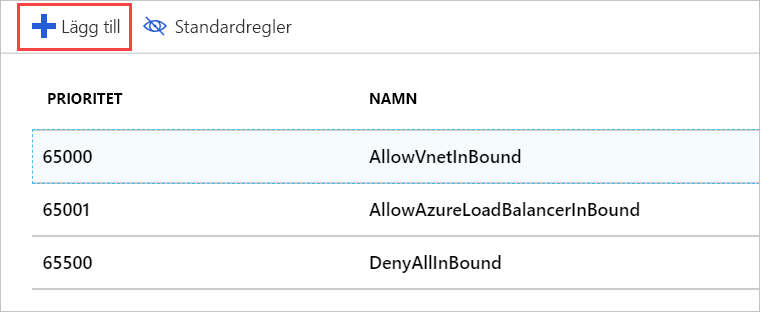
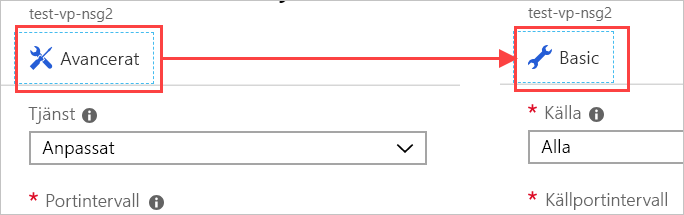

Vi kan lägga till en nätverkssäkerhetsgrupp till vårt nätverk så att vi endast tillåta HTTP-trafik via vår server.

## Skapa en nätverkssäkerhetsgrupp

Azure bör ha skapat en säkerhetsgrupp åt oss eftersom vi angav att vi ville ha SSH-åtkomst. Men nu ska vi skapa en ny säkerhetsgrupp, så du kan gå igenom hela processen. Detta är särskilt viktigt om du bestämmer dig för att skapa det virtuella nätverket _innan_ de virtuella datorerna. Som vi nämnt tidigare är säkerhetsgrupper _valfria_ och skapas inte nödvändigtvis med nätverket.

1. I den [Azure-portalen](https://portal.azure.com?azure-portal=true), klickar du på den **skapa en resurs** knappen i sidopanelen vänstra hörnet att starta en ny resurs har skapats.

1. Typ **nätverkssäkerhetsgrupp** i filterrutan och välj det matchande objektet i listan.

1. Kontrollera att distributionsmodellen **Resource Manager** är vald och klicka på **Skapa**.

1. Ange ett **namn** för säkerhetsgruppen. Igen, namngivningskonventioner är en bra idé. Nu ska vi använda **test-web-eus-nsg1** för **testa Web Network Security Group #1 i USA, östra**. Du kommer troligen vill ändra plats delen av namn för att återspegla placerar du gruppen.

1. Välj rätt **prenumeration** och använd din befintliga **resursgrupp**.

1. Slutligen, placera den i samma **plats** som den virtuella datorn / virtuella nätverk. Obs! Du kan inte använda den här resursen om den finns på en annan plats.

1. Skapa gruppen genom att klicka på **Skapa**.

## Lägga till en ny inkommande regel i vår nätverkssäkerhetsgrupp

Distributionen bör slutföras snabbt. När det är klart kan vi lägga till nya regler till vår säkerhetsgrupp:

1. Leta upp den nya säkerhetsgruppsresursen och välj den på Azure Portal.

1. På översiktssidan ser du att den har några standardregler som låser nätverket.

    På sidan för inkommande trafik:

    - All inkommande trafik från ett virtuellt nätverk till ett annat tillåts. På så sätt kan resurser i det virtuella nätverket prata med varandra.
    - Azure Load Balancer **avsökningen** begäranden till den virtuella datorn är aktiv.
    - All annan inkommande trafik nekas.  

    På sidan för utgående trafik:  
    - All nätverkstrafik i det virtuella nätverket tillåts.
    - All utgående trafik till internet tillåts.
    - All annan utgående trafik nekas.

    > [!NOTE]  
    > Dessa standardregler är inställda med hög prioritet värden, vilket innebär att de får utvärderas _senaste_. De kan inte ändras eller tas bort, men du kan _åsidosätta_ dem genom att skapa mer specifika regler som matchar din trafik med ett lägre prioritetsvärde.

1. Klicka på avsnittet **Inkommande säkerhetsregler** på panelen **Inställningar** för säkerhetsgruppen.

1. Lägg till en ny säkerhetsregel genom att klicka på **+ Lägg till**.

    

    Du kan ange informationen som behövs för en säkerhetsregel med någon av två metoder: grundläggande och avancerat. Du kan växla mellan dem genom att klicka på knappen överst i den **lägga till** panelen.

    

    Avancerat läge ger möjlighet att anpassa regeln helt. Om du vill konfigurera ett kända protokoll är dock grundläggande läge lite enklare att arbeta med.

1. Växla till grundläggande läge.

1. Lägg till information för vår HTTP-regel:

    - Ange HTTP för **Tjänst**. När du gör det anges portintervallet åt dig.
    - Ange den **prioritet** till **1000**. Det måste vara ett lägre värde än för standardregeln **Neka**. Du kan starta intervallet på valfritt värde, men vi rekommenderar att du ger dig själv utrymme om ett undantag måste skapas senare.
    - Ge regeln ett namn. Vi använder **Tillåt-http-trafik**.
    - Ge regeln en beskrivning.

1. Gå tillbaka till läget **Avancerat**. Observera att inställningarna finns kvar. Vi kan använda den här panelen för att skapa mer detaljerade inställningar. Mer specifikt vill vi antagligen begränsa **Källa** till en bestämd IP-adress eller ett intervall med IP-adresser som är specifika för kamerorna. Om du känner till den aktuella IP-adressen för den lokala datorn kan du prova med den. Annars lämnar inställningen som **alla**, så att du kan testa regeln.

1. Klicka på **Lägg till** för att skapa regeln. När du gör det uppdateras listan över regler för inkommande trafik – observera att de visas i prioritetsordning, vilket är den ordning som de kommer att granskas i.

## Tillämpa säkerhetsgruppen

Kom ihåg att vi kan tillämpa gruppen till ett nätverksgränssnitt för att skydda en enskild virtuell dator eller till ett undernät där det skulle gälla för alla resurser i undernätet. Den senare metoden tenderar att vara de vanligaste och mest så Låt oss göra det. Vi kan få till den här resursen i Azure via antingen den virtuella nätverksresursen eller indirekt via den virtuella datorn som använder det virtuella nätverket.

1. Växla till panelen **Översikt** för den virtuella datorn. Du hittar den virtuella datorn under **Alla resurser**.

1. Välj objektet **Nätverk** i avsnittet **Inställningar**.

1. I egenskaperna för nätverk hittar du information om nätverk som tillämpas på den virtuella datorn, inklusive den **virtuella nätverk/undernät**. Det här är en klickbar länk till resursen. Klicka på den för att öppna det virtuella nätverket. Den här länken är _även_ tillgänglig på panelen **Översikt** för den virtuella datorn. Båda länkarna öppnar en **översikt** över det virtuella nätverket.

1. Välj objektet **Undernät** i avsnittet **Inställningar**.

1. Vi bör redan ha ett undernät (standard) sedan tidigare då vi skapade den virtuella datorn och nätverket. Klicka på objektet i listan för att öppna informationen.

1. Klicka på posten **Nätverkssäkerhetsgrupp**.

1. Välj den nya säkerhetsgruppen: **test-web-eus-nsg1**. Det bör också finnas en annan grupp här, som skapades med den virtuella datorn.

1. Spara ändringen genom att klicka på **Spara**. Det tar någon minut att tillämpa ändringen i nätverket.

## Verifiera reglerna

Nu ska vi Verifiera ändringen:

1. Växla tillbaka till panelen **Översikt** för den virtuella datorn. Du hittar den virtuella datorn under **Alla resurser**.

1. Välj objektet **Nätverk** i avsnittet **Inställningar**.

1. I gränssnittet nätverksinformation, det finns en länk för **gällande säkerhetsregler** som snabbt visar dig hur regler ska utvärderas. Klicka på länken för att öppna analysen och kontrollera att du ser din nya regel.

    

1. Det bästa sättet att verifiera att allt fungerar är såklart att skicka en HTTP-begäran till servern. Det bör fungera.

    

## En till sak

Det kan vara knepigt att få till säkerhetsreglerna så att de blir rätt. Vi gjorde ett misstag när vi tillämpade den här nya säkerhetsgruppen – vi förlorar vår SSH-åtkomst! För att åtgärda det här problemet kan du lägga till en annan regel till säkerhetsgruppen som ger stöd för SSH-åtkomst. Se till att begränsa de inkommande TCP/IP-adresserna för regeln till de som du äger.

> [!WARNING]  
> Var alltid noga med att låsa portar som används för administrativ åtkomst. En ännu bättre metod är att skapa ett VPN för att länka det virtuella nätverket till ditt privata nätverk och endast tillåta RDP- eller SSH-begäranden från det adressintervallet. Du kan också ändra den port som används av SSH till något annat än standardvärdet. Kom ihåg att ändra portarna inte är tillräckligt för att stoppa attacker. Det blir bara lite svårare att upptäcka.