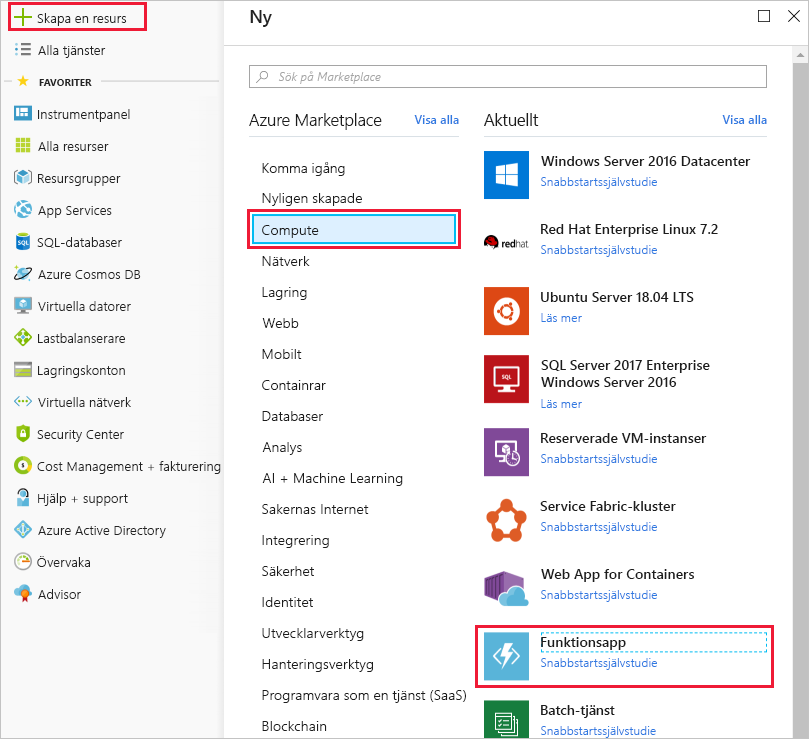
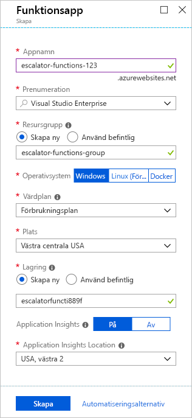
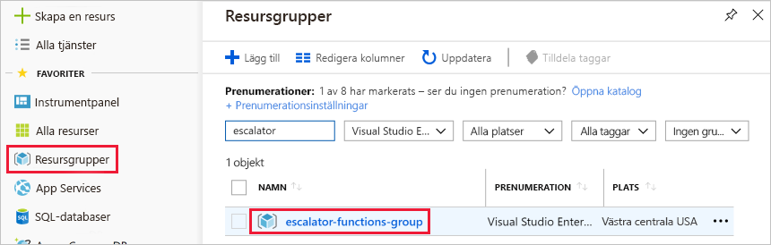
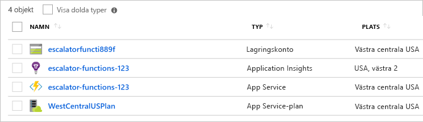

Du är nu redo att börja implementera temperaturtjänsten.You are now ready to start implementing the temperature service. I den föregående delen fastställde du att en lösning utan server skulle passa bäst för dina behov.In the previous unit, you determined that a serverless solution would best fit your needs. Låt oss börja med att skapa en funktionsapp för att lagra våra Azure-funktion.Let's start by creating a function app to hold our Azure Function.

## Vad är en funktionsapp?What is a function app?

Funktioner tillhandahålls i en körningskontext som kallas **funktionsapp**.Functions are hosted in an execution context called a **function app**. Du definierar funktionsappar för att logiskt gruppera och strukturera funktionerna och en beräkningsresurs i Azure.You define function apps to logically group and structure your functions and a compute resource in Azure. I vårt exempel med en hiss skulle en funktionsapp ha skapats som värd för temperaturtjänsten för maskineriets drivhjul.In our elevator example, you would create a function app to host the escalator drive gear temperature service. Det finns några beslut som måste fattas för att skapa en funktionsapp. Du måste välja en tjänstplan och ett kompatibelt lagringskonto.There are a few decisions that need to be made to create the function app; you need to choose a service plan and select a compatible storage account.

### Välja en tjänstplanChoosing a service plan

Funktionsappar kan användas med en av två typer av tjänstplaner.Function apps may use one of two types of service plans. Den första är **förbrukningsplanen**.The first service plan is the **Consumption service plan**. Välj den här planen om du använder Azures programplattform utan server.This is the plan that you choose when using the Azure serverless application platform. Förbrukningsplanen innehåller automatisk skalning, och du debiteras när funktionerna körs.The Consumption service plan provides automatic scaling and bills you when your functions are running. I förbrukningsplanen ingår en konfigurerbar tidsgräns för funktionens körning.The Consumption plan comes with a configurable timeout period for the execution of a function. Den är som standard 5 minuter, men kan konfigureras för upp till 10 minuter.By default, it is 5 minutes, but may be configured to have a timeout as long as 10 minutes.

Den andra planen är **Azure App Service-planen**.The second plan is called the **Azure App Service plan**. Med den här planen kan du undvika tidsgränsperioder genom att funktionen körs kontinuerligt på en virtuell dator som du definierar.This plan allows you to avoid timeout periods by having your function run continuously on a VM that you define. När du använder en App Service-plan ansvarar du för att hantera de appresurser som funktionen körs på, så det är tekniskt sett inte en serverlös plan.When using an App Service plan, you are responsible for managing the app resources the function runs on, so this is technically not a serverless plan. Men det kan vara ett bättre alternativ om dina funktioner används kontinuerligt eller kräver mer processorkraft eller körningstid än vad som ingår i förbrukningsplanen.However, it may be a better choice if your functions are used continuously or if your functions require more processing power or execution time than the Consumption plan can provide.

### Krav för lagringskontoStorage account requirements

När du skapar en funktionsapp måste den kopplas till ett lagringskonto.When you create a function app, it must be linked to a storage account. Du kan välja ett befintligt konto eller skapa ett nytt.You can select an existing account or create a new one. Lagringskontot används av funktionsappen vid interna åtgärder som att logga funktionskörningar och hantera körningsutlösare.The function app uses this storage account for internal operations such as logging function executions and managing execution triggers. Med förbrukningsplanen är det även här som funktionskoden och konfigurationsfilen lagras.On the Consumption service plan, this is also where the function code and configuration file are stored.

## Skapa en funktionsappCreate a function app

Nu ska vi skapa en funktionsapp i Azure Portal.Let's create a function app in the Azure portal.

1. Logga in på [Azure Portal](https://portal.azure.com?azure-portal=true) med ditt Azure-konto.Sign in to the [Azure portal](https://portal.azure.com?azure-portal=true) using your Azure account.

1. Välj knappen **Skapa en resurs** längst upp till vänster på Azure Portal och sedan **Kom igång > Serverlös funktionsapp** för att öppna bladet Funktionsapp *Skapa*.Select the **Create a resource** button found on the upper left-hand corner of the Azure portal, and then select **Get started > Serverless Function App** to open the Function App *Create* blade. Du kan också använda alternativet **Compute > Funktionsapp** då samma blad öppnas.Alternatively, you can use the **Compute > Function App** option, which will open the same blade.

  

1. Välj ett globalt unikt appnamn.Choose a globally unique app name. Det kommer att fungera som bas-URL för din tjänst.This will serve as the base URL of your service. Du kan till exempel kalla den **escalator-functions-xxxxxxx**, där kryssen kan ersättas med dina initialer och ditt födelseår.For example, you can name it **escalator-functions-xxxxxxx**, where the x's can be replaced with your initials and your birth year. Om den ändå inte är globalt unikt kan du testa vilken kombination som helst.If this isn't globally unique, you can try any other combination. Giltiga tecken är a-z, 0-9 och -.Valid characters are a-z, 0-9 and -.

1. Välj den Azure-prenumeration som du vill ska vara värd för funktionsappen.Select the Azure subscription where you would like the function app hosted.

1. Skapa en ny resursgrupp som kallas **escalator-functions-group**.Create a new resource group called **escalator-functions-group**. Genom att använda en resursgrupp för alla resurser som används i den här modulen blir det lättare att rensa senare.Using a resource group to hold all resources used in this module will help with clean-up later.

1. Välj **Windows** som OS.Select **Windows** for OS.

1. För **som är värd för planera**väljer **Standardförbrukningsplanen**, vilket är alternativet utan server som värd.For **Hosting Plan**, select **Consumption Plan**, which is the serverless hosting option.

1. Välj den geografiska plats som är närmast dig (eller dina kunder).Select the geographical location closest to you (or your customers).

1. Skapa ett nytt lagringskonto.Create a new storage account. Azure ger det ett namn baserat på appnamnet.Azure will give it a name based on the app name. Du kan ändra det om du vill, men det måste också vara unikt.You can change it if you like, but it must also be unique.

1. Se till att Azure Application Insights är **På** och välj den region som är närmast dig (eller dina kunder).Make sure that Azure Application Insights is **On** and select the region closest to you (or your customers).
  När du är klar bör konfigurationen se ut som på följande skärmbild.When you're finished, your configuration should look like the config in the following screenshot.

  

1. Välj **Skapa**. Distributionen kan ta några minuter.Select **Create**; deployment will take a few minutes. Du får ett meddelande när den är klar.You'll receive a notification once it's complete.

## Verifiera din Azure-funktionsappVerify your Azure function app

1. Välj **Resursgrupper** i den vänstra menyn i Azure-portalen.From the Azure portal left-hand menu, select **Resource groups**. Du bör se **escalator-functions-group** i listan över tillgängliga grupper.You should then see the **escalator-functions-group** in the list of available groups.

  

1. Välj **escalator-functions-group**.Select the **escalator-functions-group**. Du bör se en lista över resurser som liknar följande lista.You should then see a resource list like the following list.

  

Objektet med blixtikonen, som visas som en App Service, är din nya funktionsapp.The item with the lightning bolt Function icon, listed as an App Service, is your new function app. Du kan klicka på den för att öppna information om den nya funktionen – den har tilldelats en offentlig URL, om du öppnar den i en webbläsare bör du få en standardsida som visar att din funktionsapp körs.You can click on it to open the details about the new function - it has a public URL assigned to it, if you open that in a browser, you should get a default web page that indicates your Function App is running.
