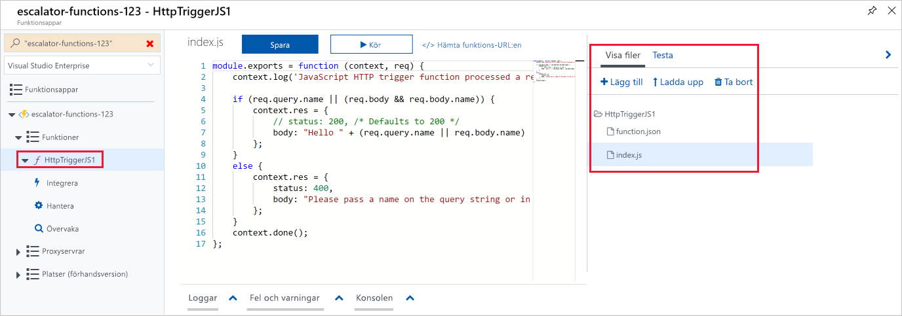
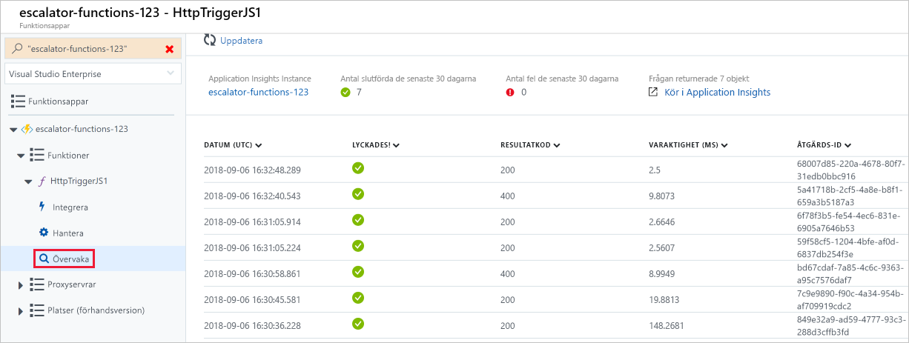

Nu när vi har skapat en funktionsapp ska vi titta på hur du skapar, konfigurerar och kör en funktion.

### <a name="triggers"></a>Utlösare

Funktioner är aktivitetsdrivna, vilket innebär att de körs som svar på en händelse.

Den typ av händelse som initierar funktionen kallas för en **utlösare**. Du måste konfigurera en funktion med exakt en utlösare.

Azure har stöd för utlösare för följande tjänster.

| Tjänst                 | Beskrivning av utlösare  |
|-------------------------|---------|
| Blob Storage            | Starta en funktion när en ny eller uppdaterad blob identifieras.       |
| Cosmos DB               | Starta en funktion när infogningar och uppdateringar identifieras.      |
| Event Grid              | Starta en funktion när en händelse tas emot från Event Grid.       |
| HTTP                    | Starta en funktion med en HTTP-begäran.      |
| Microsoft Graph-händelser  | Starta en funktion som svar på en inkommande webhook från Microsoft Graph. Varje instans av den här utlösaren kan reagera på en resurstyp för Microsoft Graph.       |
| Queue Storage           | Starta en funktion när ett nytt objekt tas emot i en kö. Kömeddelandet anges som indata till funktionen.      |
| Service Bus             | Starta en funktion som svar på meddelanden från en Service Bus-kö.       |
| Timer                   | Starta en funktion efter ett schema.       |

### <a name="bindings"></a>Bindningar

Bindningar är ett deklarativt sätt att koppla data och tjänster till din funktion. Bindningarna vet hur de ska kommunicera med olika tjänster, vilket innebär att du inte behöver skriva kod i din funktion för att ansluta till datakällor och hantera anslutningar. Plattformen tar hand om den komplexiteten som en del av bindningskoden. Varje bindning har en riktning – din kod läser data från *indatabindningar* och skriver data till *utdatabindningar*. Varje funktion kan ha noll eller flera bindningar för att hantera indata och utdata som bearbetas av funktionen.

En utlösare är en särskild typ av indatabindning som har den ytterligare funktionen att kunna initiera en körning.

Azure tillhandahåller ett [stort antal bindningar](https://docs.microsoft.com/azure/azure-functions/functions-triggers-bindings#supported-bindings) för att ansluta till olika lagringsenheter och meddelandetjänster.

### <a name="a-sample-binding-definition"></a>Definition av en exempelbindning

Nu ska vi titta på ett exempel på hur du konfigurerar en funktion med en indatabindning (utlösare) och en utdatabindning. Anta att vi vill läsa data från Blob Storage, bearbeta dem i vår funktion och sedan skriva ett meddelande till en kö. Du konfigurerar en _indatabindning_ av typen *blob* och en _utdatabindning_ av typen *kö*.

Bindningar kan definieras på Azure Portal och lagras som JSON-filer, som du också kan redigera direkt. Följande JSON är en exempeldefinition av en utlösare och en bindning för en funktion.

```json
{
  "bindings": [
    {
      "name": "order",
      "type": "queueTrigger",
      "direction": "in",
      "queueName": "myqueue-items",
      "connection": "MY_STORAGE_ACCT_APP_SETTING"
    },
    {
      "name": "$return",
      "type": "table",
      "direction": "out",
      "tableName": "outTable",
      "connection": "MY_TABLE_STORAGE_ACCT_APP_SETTING"
    }
  ]
}
```

Det här exemplet visar en funktion som utlöses av ett meddelande som läggs till i en kö med namnet **myqueue-items**. Därefter skickas funktionens returvärde till tabellen **outTable** i Azure Table Storage. Det här är ett väldigt enkelt exempel. Vi kan ändra resultatet till ett e-postmeddelande med hjälp av en SendGrid-bindning eller placera en händelse i en Service Bus för att meddela en annan komponent i vår arkitektur. Vi kan till och med använda flera utdatabindningar för att skicka data till olika tjänster.

## <a name="creating-a-function-in-the-azure-portal"></a>Skapa en funktion i Azure Portal

Azure tillhandahåller flera fördefinierade funktionsmallar för vanliga scenarier.

### <a name="quickstart-templates"></a>Snabbstartsmallar

När du lägger till din första funktion visas skärmen Snabbstart. På den här skärmen kan du välja en utlösartyp (HTTP, Timer eller Data) och ett programmeringsspråk (C#, JavaScript, F# eller Java). Baserat på dina val genererar Azure sedan funktionskoden och konfigurationen med exempelkod som visar de indata som tas emot i loggen.

### <a name="custom-function-templates"></a>Anpassade funktionsmallar

Valet av snabbstartsmallar ger enkel åtkomst till de vanligaste scenarierna. Azure tillhandahåller dock 30 ytterligare mallar som du kan börja med. De finns från skärmen med listan över mallar när du skapar efterföljande funktioner eller via alternativet **Anpassad funktion** på skärmen Snabbstart.

- HTTP-utlösare med C#, F# eller JavaScript
- Timerutlösare med C#, F# eller JavaScript
- Köutlösare med C#, F# eller JavaScript
- Service Bus-köutlösare med C#, F# eller JavaScript
- Cosmos DB-utlösare med C# eller JavaScript
- IoT Hub (händelsehubb) med C#, F# eller JavaScript
- ... och många fler

## <a name="navigating-to-your-function-and-files"></a>Navigera till dina funktioner och filer

När du skapar en funktion från en mall skapas flera filer. Om du till exempel väljer att använda snabbstarten Webhook + API med JavaScript skapas en konfigurationsfil, **function.json**, och en källkodsfil, **index.js**. De funktioner som du skapar i en funktionsapp visas under menyalternativet **Funktioner** på portalen för funktionsappen.

När du väljer en funktion i din funktionsapp öppnas en kodredigerare som visar koden för funktionen, som du ser i följande skärmbild.



Som du ser i föregående skärmbild finns det en utfällbar meny till höger som innehåller en flik för **Visa filer**. Om du väljer den här fliken visas filstrukturen bakom din funktion.

## <a name="testing-your-azure-function"></a>Testa Azure-funktionen

När du har skapat en funktion vill du antagligen testa den. Du kan göra på ett par olika sätt: manuell körning eller testning från själva Azure Portal.

### <a name="manual-execution"></a>Manuell körning

Du kan starta en funktion genom att manuellt utlösa den konfigurerade utlösaren. Om du till exempel använder en HTTP-utlösare kan du använda ett verktyg som Postman eller cURL för att initiera en HTTP-begäran till URL:en för funktionens slutpunkt som är tillgänglig från HTTP-utlösarens definition (**Hämta funktionens URL**).

### <a name="testing-in-the-azure-portal"></a>Testa på Azure Portal

Portalen erbjuder även ett bekvämt sätt att testa dina funktioner. På höger sida av kodfönstret finns en utfällbar navigeringsmeny med flikar. Menyn innehåller ett **testobjekt**. Genom att expandera menyn och välja den här fliken får du möjlighet att köra funktionen och visa resultatet på ett annat sätt. När du klickar på **Kör** i det här testfönstret visas resultatet i utdatafönstret, tillsammans med en statuskod.

## <a name="monitoring-dashboard"></a>Instrumentpanel för övervakning

Det är viktigt att kunna övervaka funktionerna både vid utveckling och i produktion. Azure Portal innehåller en övervakningsinstrumentpanel som är tillgänglig om du aktiverar Application Insights-integration. När du expanderar funktionens nod visas ett **skärmmenyalternativ** på funktionsappens navigeringsmeny. På den här övervakningsinstrumentpanelen kan du snabbt visa historik över funktionskörningar liksom tidsstämpeln, resultatkoden, varaktigheten och åtgärds-ID:t som har lagts till av Application Insights.



## <a name="streaming-log-window"></a>Fönster för strömmande loggning

Du kan också lägga till loggningsinstruktioner i en funktion för felsökning på Azure Portal. Ett loggningsobjekt skickas till metoderna som anropas för respektive språk och kan användas för att logga information till loggfönstret som visas på en utfällbar flikmeny längst ned i kodfönstret.

Följande JavaScript-kodstycke visar hur du loggar ett meddelande med hjälp av metoden `context.log` (objektet `context` skickas till hanteraren).

```javascript
  context.log('Enter your logging statement here');
```

Vi kan göra samma sak i C# med hjälp av metoden `log.Info`. I det här fallet skickas objektet `log` till C#-metoden som bearbetar funktionen.

```csharp
  log.Info("Enter your logging statement here");
```

### <a name="errors-and-warnings-window"></a>Fönstret Fel och varningar

Du kan hitta fliken med fönstret för fel och varningar på samma utfällbara meny som den för loggfönstret. Det här fönstret visar kompileringsfel och varningar i din kod.
