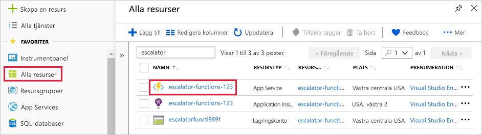
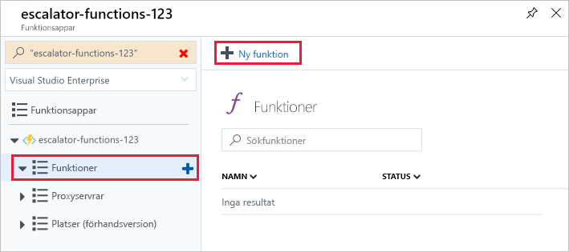
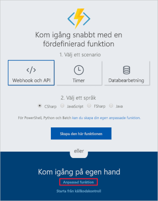
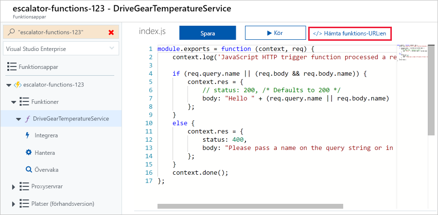
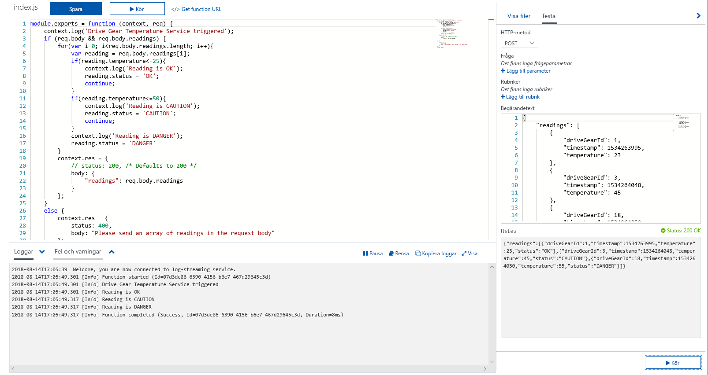
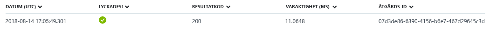

<span data-ttu-id="5a47d-101">Vi fortsätter med vårt exempel om kugghjulsdrift och lägger till logiken för temperaturtjänsten.</span><span class="sxs-lookup"><span data-stu-id="5a47d-101">Let's continue with our gear drive example and add the logic for the temperature service.</span></span> <span data-ttu-id="5a47d-102">Mer specifikt tar vi emot data från en HTTP-begäran.</span><span class="sxs-lookup"><span data-stu-id="5a47d-102">Specifically, we're going to receive data from an HTTP request.</span></span>

## <a name="function-requirements"></a><span data-ttu-id="5a47d-103">Funktionskrav</span><span class="sxs-lookup"><span data-stu-id="5a47d-103">Function requirements</span></span>

<span data-ttu-id="5a47d-104">Först måste vi definiera vissa krav för vår logik:</span><span class="sxs-lookup"><span data-stu-id="5a47d-104">First, we need to define some requirements for our logic:</span></span>

- <span data-ttu-id="5a47d-105">Temperaturer mellan 0–25 ska flaggas som **OK**.</span><span class="sxs-lookup"><span data-stu-id="5a47d-105">Temperatures between 0-25 should be flagged as **OK**.</span></span>
- <span data-ttu-id="5a47d-106">Temperaturer mellan 26–50 ska flaggas som **CAUTION**.</span><span class="sxs-lookup"><span data-stu-id="5a47d-106">Temperatures between 26-50 should be flagged as **CAUTION**.</span></span>
- <span data-ttu-id="5a47d-107">Temperaturer över 50 ska flaggas som **DANGER**.</span><span class="sxs-lookup"><span data-stu-id="5a47d-107">Temperatures above 50 should be flagged as **DANGER**.</span></span>

## <a name="add-a-function-to-our-function-app"></a><span data-ttu-id="5a47d-108">Lägga till en funktion i funktionsappen</span><span class="sxs-lookup"><span data-stu-id="5a47d-108">Add a function to our function app</span></span>

<span data-ttu-id="5a47d-109">Som du såg i föregående kursdel innehåller Azure mallar som hjälper dig att komma igång med att skapa funktioner.</span><span class="sxs-lookup"><span data-stu-id="5a47d-109">As we discussed in the preceding unit, Azure provides templates that help you get started building functions.</span></span> <span data-ttu-id="5a47d-110">I den här övningen använder vi mallen `HttpTrigger` för att implementera temperaturtjänsten.</span><span class="sxs-lookup"><span data-stu-id="5a47d-110">In this unit, we'll use the `HttpTrigger` template to implement the temperature service.</span></span>

1. <span data-ttu-id="5a47d-111">Logga in på [Azure-portalen](https://portal.azure.com/learn.docs.microsoft.com?azure-portal=true).</span><span class="sxs-lookup"><span data-stu-id="5a47d-111">Sign in to the [Azure portal](https://portal.azure.com/learn.docs.microsoft.com?azure-portal=true).</span></span>

1. <span data-ttu-id="5a47d-112">Välj resursgruppen från den första övningen genom att välja **Alla resurser** på menyn till vänster och sedan välja ”**<rgn>[Namn på Sandbox-resursgrupp]</rgn>**”.</span><span class="sxs-lookup"><span data-stu-id="5a47d-112">Select the resource group from the first exercise by choosing **All resources** in the left-hand menu, and then selecting "**<rgn>[sandbox resource group name]</rgn>**".</span></span>

1. <span data-ttu-id="5a47d-113">Gruppens resurser visas.</span><span class="sxs-lookup"><span data-stu-id="5a47d-113">The resources for the group will then be displayed.</span></span> <span data-ttu-id="5a47d-114">Klicka på namnet på den funktionsapp som du skapade i föregående övning genom att välja objektet **escalator-functions-xxxxxxx** (visas med funktionsikonen med en blixt).</span><span class="sxs-lookup"><span data-stu-id="5a47d-114">Click the name of the function app that you created in the previous exercise by selecting the **escalator-functions-xxxxxxx** item (also indicated by the lightning bolt Function icon).</span></span>

    

<!-- Start temporary fix for issue #2498. -->
> [!IMPORTANT]
> <span data-ttu-id="5a47d-116">Övningarna i den här modulen fungerar för närvarande med Azure Functions V1.</span><span class="sxs-lookup"><span data-stu-id="5a47d-116">The exercises in this module currently work with Azure Functions V1.</span></span> <span data-ttu-id="5a47d-117">Följ dessa steg noggrant för att se till att appen använder V1-körningsversionen.</span><span class="sxs-lookup"><span data-stu-id="5a47d-117">Please follow these steps carefully to make sure your function app uses the V1 runtime version.</span></span> 

1. <span data-ttu-id="5a47d-118">Välj funktionsappen i listan **Funktionsappar**.</span><span class="sxs-lookup"><span data-stu-id="5a47d-118">Select your function app in the **Function Apps** list.</span></span>
1. <span data-ttu-id="5a47d-119">Välj **Plattformsfunktioner**.</span><span class="sxs-lookup"><span data-stu-id="5a47d-119">Select **Platform features**.</span></span>
1. <span data-ttu-id="5a47d-120">På skärmen **Plattformsfunktioner** väljer du **Funktionsappinställningar** under **Allmänna inställningar**.</span><span class="sxs-lookup"><span data-stu-id="5a47d-120">In the **Platform features** screen, select **Function app settings** under **General Settings**.</span></span>
1. <span data-ttu-id="5a47d-121">Välj *~1* i **Körningsversion**.</span><span class="sxs-lookup"><span data-stu-id="5a47d-121">Select *~1* in the **Runtime version** .</span></span>
1. <span data-ttu-id="5a47d-122">Stäng **Funktionsappinställningar**.</span><span class="sxs-lookup"><span data-stu-id="5a47d-122">Close **Function app settings**.</span></span>

<span data-ttu-id="5a47d-123">Vår funktionsapp har nu konfigurerats för att använda Azure Functions V1-körning.</span><span class="sxs-lookup"><span data-stu-id="5a47d-123">Our function app is now configured to use the Azure Functions V1 runtime.</span></span> <span data-ttu-id="5a47d-124">Nu kan vi fortsätta att skapa vår första funktion.</span><span class="sxs-lookup"><span data-stu-id="5a47d-124">We can now continue to create our first function.</span></span>
<!-- End temporary fix for issue #2498. --> 

1. <span data-ttu-id="5a47d-125">På menyn till vänster visas funktionsappens namn och en undermeny med tre objekt: *Funktioner*, *Proxyservrar* och *Platser*.</span><span class="sxs-lookup"><span data-stu-id="5a47d-125">The left-side menu displays your function app name and a submenu with three items: *Functions*, *Proxies*, and *Slots*.</span></span>  

1. <span data-ttu-id="5a47d-126">Börja skapa vår första funktion genom att välja **Funktioner** och sedan klicka på knappen **Ny funktion** högst upp på den sida som visas.</span><span class="sxs-lookup"><span data-stu-id="5a47d-126">To start creating our first function, select **Functions** and click  the **New function** button at the top of the resulting page.</span></span>

    

1. <span data-ttu-id="5a47d-128">På skärmen Snabbstart väljer du länken **Anpassad funktion** i avsnittet **Kom igång på egen hand**, som du ser i följande skärmbild.</span><span class="sxs-lookup"><span data-stu-id="5a47d-128">In the Quickstart screen, select the **Custom function** link in the **Get started on your own** section as shown in the following screenshot.</span></span> <span data-ttu-id="5a47d-129">Om du inte ser skärmen Snabbstart klickar du på länken **gå till snabbstarten** längst upp på sidan.</span><span class="sxs-lookup"><span data-stu-id="5a47d-129">If you don't see the Quickstart screen, click on the **go to the quickstart** link at the top of the page.</span></span>

    

1. <span data-ttu-id="5a47d-131">Gå till listan med mallar som visas på skärmen och välj mallen **HTTP-utlösare**, som du ser i följande skärmbild.</span><span class="sxs-lookup"><span data-stu-id="5a47d-131">From the list of templates displayed on the screen, select the **HTTP trigger** template as shown in the following screenshot.</span></span>

1. <span data-ttu-id="5a47d-132">Ange **DriveGearTemperatureService** i namnfältet i dialogrutan **Ny funktion** som visas.</span><span class="sxs-lookup"><span data-stu-id="5a47d-132">Enter **DriveGearTemperatureService** in the name field of the **New Function** dialog that appears.</span></span> <span data-ttu-id="5a47d-133">Lämna Auktoriseringsnivå som ”Funktion” och tryck på knappen **Skapa** för att skapa funktionen.</span><span class="sxs-lookup"><span data-stu-id="5a47d-133">Leave the Authorization level as "Function" and press the **Create** button to create the function.</span></span>

1. <span data-ttu-id="5a47d-134">När funktionen har skapats öppnas kodredigeraren med innehållet i kodfilen *index.js*.</span><span class="sxs-lookup"><span data-stu-id="5a47d-134">When your function creation completes, the code editor opens with the contents of the *index.js* code file.</span></span> <span data-ttu-id="5a47d-135">Standardkoden som mallen har genererat åt oss visas i följande kodavsnitt.</span><span class="sxs-lookup"><span data-stu-id="5a47d-135">The default code that the template generated for us is listed in the following snippet.</span></span>

    ```javascript
    module.exports = function (context, req) {
        context.log('JavaScript HTTP trigger function processed a request.');
    
        if (req.query.name || (req.body && req.body.name)) {
            context.res = {
                // status: 200, /* Defaults to 200 */
                body: "Hello " + (req.query.name || req.body.name)
            };
        }
        else {
            context.res = {
                status: 400,
                body: "Please pass a name on the query string or in the request body"
            };
        }
        context.done();
    };
    ```

    <span data-ttu-id="5a47d-136">Funktionen förväntar sig att ett namn skickas i frågesträngen för HTTP-begäran eller som en del av själva begäran.</span><span class="sxs-lookup"><span data-stu-id="5a47d-136">Our function expects a name to be passed in either through the HTTP request query string or as part of the request body.</span></span> <span data-ttu-id="5a47d-137">Funktionen svarar genom att returnera meddelandet **Hello, {name}**, med namnet som skickades i begäran.</span><span class="sxs-lookup"><span data-stu-id="5a47d-137">The function responds by returning the message  **Hello, {name}**, echoing back the name that was sent in the request.</span></span>

    <span data-ttu-id="5a47d-138">Till höger i källvyn ser du två flikar.</span><span class="sxs-lookup"><span data-stu-id="5a47d-138">On the right-hand side of the source view, you'll find two tabs.</span></span> <span data-ttu-id="5a47d-139">Fliken **Visa fil** visar koden och konfigurationsfilen för funktionen.</span><span class="sxs-lookup"><span data-stu-id="5a47d-139">The **View files** tab lists the code and config file for your function.</span></span>  <span data-ttu-id="5a47d-140">Välj **function.json** för att visa funktionens konfiguration, som bör se ut så här:</span><span class="sxs-lookup"><span data-stu-id="5a47d-140">Select **function.json** to view the configuration of the function, which should look like the following:</span></span>

    ```javascript
    {
        "disabled": false,
        "bindings": [
        {
            "authLevel": "function",
            "type": "httpTrigger",
            "direction": "in",
            "name": "req"
        },
        {
            "type": "http",
            "direction": "out",
            "name": "res"
        }
        ]
    }
    ```

    <span data-ttu-id="5a47d-141">Konfigurationen fastställer att funktionen körs när den får en HTTP-begäran.</span><span class="sxs-lookup"><span data-stu-id="5a47d-141">This configuration declares that the function runs when it receives an HTTP request.</span></span> <span data-ttu-id="5a47d-142">Utdatabindningen deklarerar att svaret skickas som ett HTTP-svar.</span><span class="sxs-lookup"><span data-stu-id="5a47d-142">The output binding declares that the response will be sent as an HTTP response.</span></span>    

## <a name="test-the-function"></a><span data-ttu-id="5a47d-143">Testa funktionen</span><span class="sxs-lookup"><span data-stu-id="5a47d-143">Test the function</span></span>

> [!TIP]
> <span data-ttu-id="5a47d-144">**cURL** är ett kommandoradsverktyg som kan användas för att skicka och ta emot filer.</span><span class="sxs-lookup"><span data-stu-id="5a47d-144">**cURL** is a command line tool that can be used to send or receive files.</span></span> <span data-ttu-id="5a47d-145">Det ingår i Linux, macOS och Windows 10 och kan laddas ned för de flesta andra operativsystem.</span><span class="sxs-lookup"><span data-stu-id="5a47d-145">It's included with Linux, macOS, and Windows 10, and can be downloaded for most other operating systems.</span></span> <span data-ttu-id="5a47d-146">cURL har stöd för en rad protokoll, till exempel HTTP, HTTPS, FTP, FTPS, SFTP, LDAP, TELNET, SMTP och POP3. Mer information finns i länkarna nedan:</span><span class="sxs-lookup"><span data-stu-id="5a47d-146">cURL supports numerous protocols like HTTP, HTTPS, FTP, FTPS, SFTP, LDAP, TELNET, SMTP, POP3, etc. For more information, refer to the links below:</span></span>
>
>- <https://en.wikipedia.org/wiki/CURL>
>- <https://curl.haxx.se/docs/>

<span data-ttu-id="5a47d-147">Om du vill testa funktionen kan du skicka en HTTP-begäran till funktions-URL:en med hjälp av cURL på kommandoraden.</span><span class="sxs-lookup"><span data-stu-id="5a47d-147">To test the function, you can send an HTTP request to the function URL using cURL on the command line.</span></span> <span data-ttu-id="5a47d-148">Du hittar funktionens slutpunktsadress genom att gå tillbaka till funktionskoden och välja länken **Hämta funktionswebbadress**, som du ser i följande skärmbild.</span><span class="sxs-lookup"><span data-stu-id="5a47d-148">To find the endpoint URL of the function, return to your function code and select the **Get function URL** link, as shown in the following screenshot.</span></span> <span data-ttu-id="5a47d-149">Spara den här länken tills vidare.</span><span class="sxs-lookup"><span data-stu-id="5a47d-149">Save this link temporarily.</span></span>



### <a name="securing-http-triggers"></a><span data-ttu-id="5a47d-151">Skydda HTTP-utlösare</span><span class="sxs-lookup"><span data-stu-id="5a47d-151">Securing HTTP triggers</span></span>

<span data-ttu-id="5a47d-152">Med HTTP-utlösare kan du använda API-nycklar för att blockera okända anropare genom att kräva att nyckeln måste finnas i varje begäran.</span><span class="sxs-lookup"><span data-stu-id="5a47d-152">HTTP triggers let you use API keys to block unknown callers by requiring the key to be present on each request.</span></span> <span data-ttu-id="5a47d-153">När du skapar en funktion väljer du _auktoriseringsnivån_.</span><span class="sxs-lookup"><span data-stu-id="5a47d-153">When you create a function, you select the _authorization level_.</span></span> <span data-ttu-id="5a47d-154">Standardinställningen är ”Funktion”, vilket kräver en funktionsspecifik API-nyckel, men den kan också anges till ”Administratör” för användning av en global ”huvudnyckel” eller till ”Anonym” om ingen nyckel krävs.</span><span class="sxs-lookup"><span data-stu-id="5a47d-154">By default, it's set to "Function", which requires a function-specific API key, but it can also be set to "Admin" to use a global "master" key, or "Anonymous" to indicate that no key is required.</span></span> <span data-ttu-id="5a47d-155">Du kan också ändra åtkomstnivån via funktionens egenskaper när du har skapat den.</span><span class="sxs-lookup"><span data-stu-id="5a47d-155">You can also change the authorization level through the function properties after creation.</span></span>

<span data-ttu-id="5a47d-156">Eftersom vi valde ”Funktion” när vi skapade funktionen måste vi ange nyckeln när vi skickar HTTP-begäran.</span><span class="sxs-lookup"><span data-stu-id="5a47d-156">Since we specified "Function" when we created this function, we will need to supply the key when we send the HTTP request.</span></span> <span data-ttu-id="5a47d-157">Du kan skicka den som en frågesträngsparameter med namnet `code`, eller som ett HTTP-huvud (rekommenderas) med namnet `x-functions-key`.</span><span class="sxs-lookup"><span data-stu-id="5a47d-157">You can send it as a query string parameter named `code`, or as an HTTP header (preferred) named `x-functions-key`.</span></span>

<span data-ttu-id="5a47d-158">Funktionen och huvudnycklarna visas i avsnittet **Hantera** när funktionen har expanderats.</span><span class="sxs-lookup"><span data-stu-id="5a47d-158">The function and master keys are found in the **Manage** section when the function is expanded.</span></span> <span data-ttu-id="5a47d-159">De är dolda som standard och du måste uttryckligen visa dem.</span><span class="sxs-lookup"><span data-stu-id="5a47d-159">By default, they are hidden, and you need to display them.</span></span>

1. <span data-ttu-id="5a47d-160">Expandera funktionen och välj avsnittet **Hantera**. Visa standardfunktionsnyckeln och kopiera den till Urklipp.</span><span class="sxs-lookup"><span data-stu-id="5a47d-160">Expand your function and select the **Manage** section, show the default Function Key, and copy it to the clipboard.</span></span>

    

1. <span data-ttu-id="5a47d-162">Därefter, gå till kommandoraden där du installerade verktyget **cURL**, formatera ett cURL-kommando med URL:en för din funktion och funktionsnyckeln.</span><span class="sxs-lookup"><span data-stu-id="5a47d-162">Next, from the command line where you installed the **cURL** tool, format a cURL command with the URL for your function, and the Function key.</span></span>

    - <span data-ttu-id="5a47d-163">Använd en `POST`-begäran.</span><span class="sxs-lookup"><span data-stu-id="5a47d-163">Use a `POST` request.</span></span>
    - <span data-ttu-id="5a47d-164">Lägg till ett `Content-Type`-huvudvärde av typen `application/json`.</span><span class="sxs-lookup"><span data-stu-id="5a47d-164">Add a `Content-Type` header value of type `application/json`.</span></span>
    - <span data-ttu-id="5a47d-165">Ersätt URL:en nedan med din egen.</span><span class="sxs-lookup"><span data-stu-id="5a47d-165">Make sure to replace the URL below with your own.</span></span>
    - <span data-ttu-id="5a47d-166">Skicka funktionsnyckeln som huvudvärdet `x-functions-key`.</span><span class="sxs-lookup"><span data-stu-id="5a47d-166">Pass the Function Key as the header value `x-functions-key`.</span></span>

    ```bash
    curl --header "Content-Type: application/json" --header "x-functions-key: <your-function-key>" --request POST --data "{\"name\": \"Azure Function\"}" https://<your-url-here>/api/DriveGearTemperatureService
    ```

<span data-ttu-id="5a47d-167">Funktionen svarar med texten `"Hello Azure Function"`.</span><span class="sxs-lookup"><span data-stu-id="5a47d-167">The function will respond back with the text `"Hello Azure Function"`.</span></span>

> [!CAUTION]
> <span data-ttu-id="5a47d-168">Om du använder Windows kör du `cURL` från kommandotolken.</span><span class="sxs-lookup"><span data-stu-id="5a47d-168">If you are on Windows, please run  `cURL` from the command prompt.</span></span> <span data-ttu-id="5a47d-169">PowerShell har ett *curl*-kommando, men det är ett alias för Invoke-WebRequest och inte detsamma som `cURL`.</span><span class="sxs-lookup"><span data-stu-id="5a47d-169">PowerShell has a *curl* command, but it's an alias for Invoke-WebRequest and is not the same as `cURL`.</span></span>

> [!NOTE]
> <span data-ttu-id="5a47d-170">Du kan också utföra test från en enskild funktions avsnitt med fliken **Test** vid sidan av den valda funktionen, men du kan inte kontrollera om funktionsnyckelsystemet fungerar, eftersom detta inte krävs här.</span><span class="sxs-lookup"><span data-stu-id="5a47d-170">You can also test from an individual function's section with the **Test** tab on the side of a selected function, though you won't be able to verify the function key system is working, as it is not required here.</span></span> <span data-ttu-id="5a47d-171">Lägg till lämpligt sidhuvud och parametervärden i testgränssnittet och klicka på knappen **Kör** för att visa testets utdata.</span><span class="sxs-lookup"><span data-stu-id="5a47d-171">Add the appropriate header and parameter values in the Test interface and click the **Run** button to see the test output.</span></span>

## <a name="add-business-logic-to-the-function"></a><span data-ttu-id="5a47d-172">Lägga till affärslogik i funktionen</span><span class="sxs-lookup"><span data-stu-id="5a47d-172">Add business logic to the function</span></span>

<span data-ttu-id="5a47d-173">Nu ska vi lägga till logiken till funktionen som kontrollerar temperaturavläsningar som tas emot och som anger en status för var och en.</span><span class="sxs-lookup"><span data-stu-id="5a47d-173">Next, let's add the logic to the function that checks temperature readings that it receives and sets a status for each.</span></span>

<span data-ttu-id="5a47d-174">Funktionen förväntar sig en matris med temperaturavläsningar.</span><span class="sxs-lookup"><span data-stu-id="5a47d-174">Our function is expecting an array of temperature readings.</span></span> <span data-ttu-id="5a47d-175">Följande JSON-kodavsnitt är ett exempel på begäran som vi ska skicka till funktionen.</span><span class="sxs-lookup"><span data-stu-id="5a47d-175">The following JSON snippet is an example of the request body that we'll send to our function.</span></span> <span data-ttu-id="5a47d-176">Varje `reading`-post har ett ID, en tidsstämpel och en temperatur.</span><span class="sxs-lookup"><span data-stu-id="5a47d-176">Each `reading` entry has an ID, timestamp, and temperature.</span></span>

```json
{
    "readings": [
        {
            "driveGearId": 1,
            "timestamp": 1534263995,
            "temperature": 23
        },
        {
            "driveGearId": 3,
            "timestamp": 1534264048,
            "temperature": 45
        },
        {
            "driveGearId": 18,
            "timestamp": 1534264050,
            "temperature": 55
        }
    ]
}
```

<span data-ttu-id="5a47d-177">Nu ska vi ersätta standardkoden i funktionen med följande kod som implementerar vår affärslogik.</span><span class="sxs-lookup"><span data-stu-id="5a47d-177">Next, we'll replace the default code in our function with the following code that implements our business logic.</span></span>

1. <span data-ttu-id="5a47d-178">Öppna filen **index.js** och ersätt den med följande kod.</span><span class="sxs-lookup"><span data-stu-id="5a47d-178">Open the **index.js** file and replace it with the following code.</span></span>

```javascript
module.exports = function (context, req) {
    context.log('Drive Gear Temperature Service triggered');
    if (req.body && req.body.readings) {
        req.body.readings.forEach(function(reading) {

            if(reading.temperature<=25) {
                reading.status = 'OK';
            } else if (reading.temperature<=50) {
                reading.status = 'CAUTION';
            } else {
                reading.status = 'DANGER'
            }
            context.log('Reading is ' + reading.status);
        });

        context.res = {
            // status: 200, /* Defaults to 200 */
            body: {
                "readings": req.body.readings
            }
        };
    }
    else {
        context.res = {
            status: 400,
            body: "Please send an array of readings in the request body"
        };
    }
    context.done();
};
```

<span data-ttu-id="5a47d-179">Logiken som vi lade till är enkel.</span><span class="sxs-lookup"><span data-stu-id="5a47d-179">The logic we added is straightforward.</span></span> <span data-ttu-id="5a47d-180">Vi itererar över matrisen med avläsningar och kontrollerar temperaturfältet.</span><span class="sxs-lookup"><span data-stu-id="5a47d-180">We iterate over the array of readings and check the temperature field.</span></span> <span data-ttu-id="5a47d-181">Beroende på fältets värde anger vi statusen **OK**, **CAUTION** eller **DANGER**.</span><span class="sxs-lookup"><span data-stu-id="5a47d-181">Depending on the value of that field, we set a status of **OK**, **CAUTION**, or **DANGER**.</span></span> <span data-ttu-id="5a47d-182">Sedan skickar vi tillbaka matrisen med avläsningar med ett tillagt statusfält för varje post.</span><span class="sxs-lookup"><span data-stu-id="5a47d-182">We then send back the array of readings with a status field added to each entry.</span></span>

<span data-ttu-id="5a47d-183">Observera `log`-instruktionerna.</span><span class="sxs-lookup"><span data-stu-id="5a47d-183">Notice the `log` statements.</span></span> <span data-ttu-id="5a47d-184">När funktionen körs lägger instruktionerna till meddelanden i loggfönstret.</span><span class="sxs-lookup"><span data-stu-id="5a47d-184">When the function runs, these statements will add messages in the log window.</span></span>

## <a name="test-our-business-logic"></a><span data-ttu-id="5a47d-185">Testa affärslogiken</span><span class="sxs-lookup"><span data-stu-id="5a47d-185">Test our business logic</span></span>

<span data-ttu-id="5a47d-186">I det här fallet ska vi testa funktionen med hjälp av **testfönstret** på portalen.</span><span class="sxs-lookup"><span data-stu-id="5a47d-186">In this case, we're going to use the **Test** pane in the portal to test our function.</span></span>

1. <span data-ttu-id="5a47d-187">Öppna fönstret **Test** från den utfällbara menyn till höger.</span><span class="sxs-lookup"><span data-stu-id="5a47d-187">Open the **Test** window from the right-hand side flyout menu.</span></span>

1. <span data-ttu-id="5a47d-188">Klistra in exempelbegäran i textrutan för begärandetexten.</span><span class="sxs-lookup"><span data-stu-id="5a47d-188">Paste the sample request into the request body text box.</span></span>

    ```json
    {
        "readings": [
            {
                "driveGearId": 1,
                "timestamp": 1534263995,
                "temperature": 23
            },
            {
                "driveGearId": 3,
                "timestamp": 1534264048,
                "temperature": 45
            },
            {
                "driveGearId": 18,
                "timestamp": 1534264050,
                "temperature": 55
            }
        ]
    }
    ```

1. <span data-ttu-id="5a47d-189">Välj **Kör** och visa svaret i utdatafönstret.</span><span class="sxs-lookup"><span data-stu-id="5a47d-189">Select **Run** and view the response in the output pane.</span></span> <span data-ttu-id="5a47d-190">Om du vill visa loggmeddelanden öppnar du fliken **Loggar** på den nedre utfällbara menyn på sidan.</span><span class="sxs-lookup"><span data-stu-id="5a47d-190">To see log messages, open the **Logs** tab in the bottom flyout of the page.</span></span> <span data-ttu-id="5a47d-191">På följande skärmbild visas ett exempelsvar i utdatafönstret och meddelanden i fönstret **Loggar**.</span><span class="sxs-lookup"><span data-stu-id="5a47d-191">The following screenshot shows an example response in the output pane and messages in the  **Logs** pane.</span></span>

    

    <span data-ttu-id="5a47d-194">Du kan se i utdatafönstret att vårt statusfält har lagts till i alla avläsningar.</span><span class="sxs-lookup"><span data-stu-id="5a47d-194">You can see in the output pane that our status field has been correctly added to each of the readings.</span></span>

    <span data-ttu-id="5a47d-195">Om du navigerar till instrumentpanelen **Övervaka** ser du att begäran har loggats i Application Insights.</span><span class="sxs-lookup"><span data-stu-id="5a47d-195">If you navigate to the **Monitor** dashboard, you'll see that the request has been logged to Application Insights.</span></span>

    
