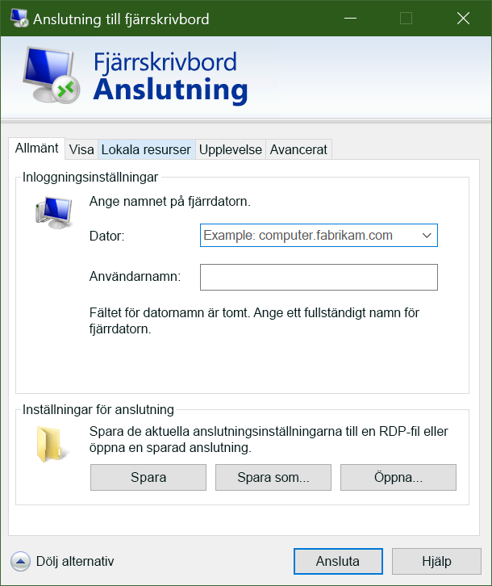

Nu när vi har en virtuell Windows-dator i Azure ska vi placera dina program och data på dessa virtuella datorer för att bearbeta våra trafikvideor.Now that we have a Windows VM in Azure, the next thing you’ll do is put your applications and data on those VMs to process our traffic videos. 

Men om du inte har konfigurerat en plats-till-plats-VPN till Azure kan dina virtuella Azure-datorer inte nås från det lokala nätverket.However, unless you’ve set up a site-to-site VPN to Azure, your Azure VMs won’t be accessible from your local network. Om du precis har kommit igång med Azure har du troligen inte någon fungerande plats-till-plats-VPN.If you’re just getting started with Azure, it’s unlikely that you have a working site-to-site VPN. Så hur ska du då överföra filerna till virtuella Azure-datorer?So how can you transfer files to Azure VMs? Ett enkelt sätt är att använda funktionen Anslutning till fjärrskrivbord i Azure för att dela dina lokala enheter med dina nya virtuella Azure-datorer.One easy way is to use Azure’s Remote Desktop Connections feature to share your local drives with your new Azure VMs.

Nu när vi har en ny virtuell Windows-dator måste vi installera vår egna programvara på den.Now that we have a new Windows virtual machine, we need to install our custom software on to it. Det finns två sätt som vi kan använda:There are two ways we can use:

- Remote Desktop Protocol (RDP)Remote Desktop Protocol (RDP)
- Anpassade skriptCustom scripts
- Anpassade avbildningar av virtuella datorer (med förinstallerad programvara)Custom VM images (with the software preinstalled)

Låt oss titta på den enklaste metoden för Windows-datorer: Fjärrskrivbord.Let's look at the simplest approach for Windows VMs: Remote Desktop.

## Vad är Remote Desktop Protocol?What is the Remote Desktop Protocol?

Med Remote Desktop Protocol (RDP) kan du fjärransluta till användargränssnittet i Windows-baserade datorer.Remote Desktop (RDP) provides remote connectivity to the UI of Windows-based computers. Du kan logga in på en fjärransluten fysisk eller virtuell Windows-dator och styra datorn, precis som när du sitter vid den.RDP enables you to sign in to a remote physical or virtual Windows computer and control that computer as if you were seated at the console. Med en RDP-anslutning kan du utföra merparten av de åtgärder som du kan göra från konsolen på en fysisk dator, med undantag för vissa ström- och maskinvarurelaterade funktioner.An RDP connection enables you to carry out the vast majority of operations that you can do from the console of a physical computer, with the exception of some power and hardware-related functions.

En RDP-anslutning kräver en RDP-klient.An RDP connection requires an RDP client. Microsoft tillhandahåller RDP-klienter för följande operativsystem:Microsoft provides RDP clients for the following operating systems:

- Windows (inbyggt)Windows (built-in)
- MacOSMacOS
- iOSiOS
- AndroidAndroid

Följande skärmbild visar Remote Desktop Protocol-klienten i Windows 10.The following screenshot displays the Remote Desktop Protocol client in Windows 10.

Det finns även Linux-klienter med öppen källkod, till exempel Remmina som gör det möjligt att ansluta till en Windows-dator från en Ubuntu-distribution.There are also open source Linux clients, such as Remmina that enable you to connect to a Windows PC from an Ubuntu distribution.

## Ansluta till en virtuell Azure-datorConnecting to an Azure VM

Som vi såg alldeles nyss kommunicerar virtuella Azure-datorer i ett virtuellt nätverk.As we saw a moment ago, Azure VMs communicate on a virtual network. De kan också ha en valfri offentlig IP-adress som har tilldelats till dem.They can also have an optional public IP address assigned to them. Med en offentlig IP-adress kan vi kommunicera med den virtuella datorn via Internet.With a public IP, we can communicate with the VM over the Internet. Vi kan också konfigurera ett virtuellt privat nätverk (VPN) som ansluter det lokala nätverket till Azure. Då kan vi på ett säkert sätt ansluta till den virtuella datorn utan att exponera en offentlig IP-adress.Alternatively, we can setup a virtual private network (VPN) that connects our on-premises network to Azure - letting us securely connect to the VM without exposing a public IP. Den här metoden beskrivs i en annan modul och är fullständigt dokumenterad om du vill utforska det alternativet.This approach is covered in another module and is fully documented if you are interested in exploring that option.

En sak att tänka på med offentliga IP-adresser i Azure är att de ofta tilldelas dynamiskt.One thing to be aware of with public IP addresses in Azure is they are often dynamically allocated. Det innebär att IP-adressen kan ändras över tid – för virtuella datorer sker det när den virtuella datorn startas om.That means the IP address can change over time - for VMs this happens when the VM is restarted. Du kan betala mer för att tilldela statiska adresser om du vill ansluta direkt till en IP-adress i stället för ett namn och se till att IP-adressen inte ändras.You can pay more to assign static addresses if you want to connect directly to an IP address instead of a name and need to ensure that the IP address will not change.

### Hur ansluter du till en virtuell dator i Azure med RDP?How do you connect to a VM in Azure using RDP?

Det är enkelt att ansluta till en virtuell dator i Azure med RDP.Connecting to a VM in Azure using RDP is a simple process. Gå till egenskaperna för din virtuella dator i Azure Portal och klicka på **Anslut** högst upp.In the Azure portal, you go to the properties of your VM, and at the top, click **Connect**. De IP-adresser som tilldelats till den virtuella datorn visas och du kan ladda ned en förkonfigurerad **.rdp** -fil som Windows sedan öppnar i RDP-klienten.This will show you the IP addresses assigned to the VM and give you the option to download a preconfigured **.rdp** file that Windows then opens in the RDP client. Du kan välja att ansluta via den offentliga IP-adressen till den virtuella datorn i RDP-filen.You can choose to connect over the public IP address of the VM in the RDP file. Om du ansluter via VPN eller ExpressRoute kan du välja den interna IP-adressen.Alternatively, if you're connecting over VPN or ExpressRoute, you can select the internal IP address. Du kan också välja portnumret för anslutningen.You can also select the port number for the connection.

Om du använder en statisk offentlig IP-adress för den virtuella datorn, kan du spara **.rdp**-filen på skrivbordet.If you're using a static public IP address for the VM, you can save the **.rdp** file to your desktop. Om du använder dynamisk IP-adresshantering är **.rdp**-filen endast giltig när den virtuella datorn körs.If you're using dynamic IP addressing, the **.rdp** file only remains valid while the VM is running. Om du stoppar och startar om den virtuella datorn måste du hämta en annan **.rdp**-fil.If you stop and restart the VM, you must download another **.rdp** file.

> [!TIP]
> Du kan också ange den offentliga IP-adressen för den virtuella datorn i Windows RDP-klienten och klicka på **Anslut**.You can also enter the public IP address of the VM into the Windows RDP client and click **Connect**.

När du ansluter får du troligtvis två varningar.When you connect, you will typically receive two warnings. Dessa är:These are:

-**Utgivarvarning** – Orsakas av att **.rdp**-filen inte har signerats offentligt.-**Publisher warning** - caused by the **.rdp** file not being publicly signed.
- **Certifikatvarning** – Orsakas av att datorcertifikatet inte är betrott.**Certificate warning** - caused by the machine certificate not being trusted.

Dessa varningar kan ignoreras i testmiljöer.In test environments, these warnings can be ignored. I produktionsmiljö kan **.rdp**-filen signeras med hjälp av **RDPSIGN. EXE** och datorcertifikatet kan placeras i klientens arkiv för **betrodda rotcertifikatutfärdare**.In production environments, the **.rdp** file can be signed using **RDPSIGN.EXE** and the machine certificate placed in the client's **Trusted Root Certification Authorities** store.

Nu ska vi prova att använda RDP för att ansluta till vår virtuella dator.Let's try using RDP to connect to our VM.