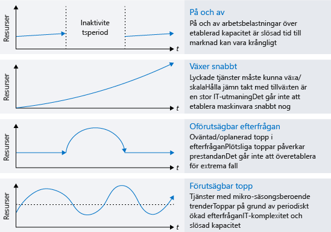
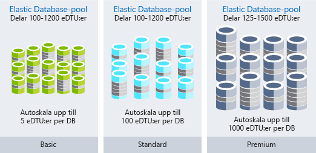

Du är en lösningsarkitekt. Din organisation Lamna Healthcare har flyttat sina arbetsbelastningar till molnet. Kostnaden för dessa resurser och arbetsflöden har nyligen ökat mer än vad Lamna hade förväntat sig. Du har blivit ombedd att avgöra om ökningen är naturlig, beror på effektiv tillväxt eller om du kan minska kostnaderna genom att utnyttja organisationens molnresurser på ett effektivare sätt.

#### Maximera effektiviteten för molnutgifter

> [!VIDEO https://www.microsoft.com/videoplayer/embed/RWjTgy]

## Hur molnet ändrar dina utgifter

En av skillnaderna mellan det offentliga molnet och en lokal infrastruktur är hur du betalar för tjänsterna som du använder. I ett lokalt datacenter tar det tid att köpa in maskinvara, maskinvaran storleksanpassas för att få maximal kapacitet och vissa av kostnaderna, till exempel elförsörjning och utrymme, kan vara dolda från affärsenheten som förbrukar resurserna. Att köpa av fysisk infrastruktur binder upp investeringar i långsiktiga tillgångar och hindrar din förmåga att vara effektiv med dina resurser.

När du flyttar till molnet får du en kostnadsmodell där du betalar per användning för det du använder i stället. Du behöver inte längre binda upp investeringar i tillgångar och om resurskraven ändras kan du svara genom att lägga till, flytta eller ta bort resurser. Arbetsbelastningar varierar mellan och inom tjänster, efterfrågan kan vara oförutsägbar och dina tillväxtmönster ändras över tid. Eftersom du bara betalar för det du använder i molnet, kan din kostnadsstruktur ändras i takt med resursändringarna.

Molninfrastrukturen kan hantera scenarier med varierande resursanvändning. Resurser med längre perioder av inaktivitet kan stängas av när de inte används och orsakar därmed inte några kostnader alls. Du kan utöka resurserna direkt när en framgångsrik tjänst växer, i stället för att vänta till nästa inköpscykel. Fler resurser kan läggas till dynamiskt och tas bort för att svara på förutsägbara och oförutsedda ökningar i efterfrågan. Följande bild visar varför den lokala infrastrukturen inte kan hantera alla dessa varierande scenarier.

I en effektiv arkitektur matchar etablerade resurser behovet av dessa resurser. Om en virtuell dator används mindre än 10 % större delen av tiden slösar du resurser, både i beräkning och kostnad. Omvänt kan en virtuell dator som utnyttjas till 90 % använda det mesta av de tillgängliga resurserna och är en effektiv användning av kostnaden. Att köra ett system med 100 % utnyttjandegrad innebär en risk för prestandaproblem. Det är viktigt att se till att en maximering av effektiviteten inte negativt påverkar systemets prestanda. Efterfrågan är sällan konstant, så att justera resurser när så är möjligt för att matcha efterfrågan är viktigt när man vill säkerställa effektiviteten.

## Spåra dina molnutgifter

Du behöver data för att kunna fatta intelligenta beslut. Genom att ta reda på vart pengarna tar vägen och jämföra det med utnyttjandet, kan du få fram var du kan ha outnyttjade resurser i din miljö.

En export av din faktureringsinformation finns tillgänglig när du vill. Med hjälp av din faktureringsinformation kan du spåra var dina kostnader uppstår och hur de är allokerade till dina resurser. Det svåra är att faktureringsinformationen visar kostnaden, men inte användningen. Du har information som visar att du betalar för en stor virtuell dator, men hur mycket använder du den egentligen?

Med Azure Cost Management kan du se vad du betalar för samt vilka underutnyttjade resurser du har. Azure Cost Management spårar dina totala kostnader, kostnad per tjänst och kostnad över tid. Du kan öka detaljnivån till resurstyper och instanser. Du kan också dela upp dina kostnader per organisation eller kostnadsställe genom taggning av resurser med dessa kategorier.

Azure Advisor innehåller också en kostnadskomponent. Den rekommenderar storleksändringar av virtuella datorer och köp av reserverade instanser, när detta är mer kostnadseffektivt än instanserna som du betalar för per användning. Den identifierar oanvända ExpressRoute-kretsar och inaktiva virtuella nätverksgatewayer. Advisor gör ytterligare rekommendationer för prestanda, hög tillgänglighet och säkerhet.

Det viktiga är att ta sig tid att granska utgifterna och se vart dina pengar tar vägen. Identifiera ineffektiva områden för att säkerställa att allt fungerar så effektivt som möjligt.

## Organisera för att optimera

Att organisera dina resurser kan hjälpa dig spåra var en del av dina kostnader uppstår. Det finns olika sätt att gruppera resurser och upprätta en relation på, för att du ska se hur dina kostnader är relaterade till varandra. Ur ett faktureringsperspektiv kan resurser enkelt grupperas genom att:

- Tilldela resurser till olika prenumerationer.
- Tilldela resurser till olika resursgrupper.
- Tillämpa taggar på resurser.

Att använda prenumerationer och resursgrupper till att organisera resurser är ett enkelt sätt att logiskt gruppera resurser på och kan användas när du går igenom faktureringsdata. Taggar kan användas i resursrelationer som sträcker sig över gränserna för prenumerationer och resursgrupper. Taggar är nyckel/värde-par som kan läggas till i alla resurser och som exponeras i faktureringsdata. Detta innebär att du kan associera en avdelning eller kostnadscenter med din resurs. Med taggar är det enklare att rapportera kostnader, samtidigt som varje avdelning i din organisation får ansvar för sina egna kostnader. Följande bild visar hur du kan använda samma tagg för resurser i olika resursgrupper, och till och med i olika prenumerationer.

Att ordna dina resurser kan vara till stor hjälp och verkligen underlätta din förståelse för var dina kostnader uppstår. Nu ska vi ta en titt på några metoder för att optimera kostnaderna.

## Optimera kostnader för IaaS

Kostnaden för virtuella datorer är ofta den största delen av kostnaderna för organisationer som använder virtuella datorer. Beräkningskostnaderna är vanligtvis den största delen, följt av lagring. Att ta sig tid att optimera resurser där du betalar för det du använder kan ha en stor inverkan på storleken på din månatliga faktura.

Nu ska vi gå igenom några tips för hur du kan sänka dina beräknings- och lagringskostnader.

### Beräkning

Det finns olika alternativ för att uppnå kostnadsbesparingar för virtuella datorer.

- Välj en mindre storlek på instansen för den virtuella datorn.
- Minska antalet timmar som en virtuell dator körs.
- Använd rabatter på beräkningskostnaderna.

#### Rätt storlek på virtuella datorer

Att uppnå rätt storlek på en virtuell dator är en process som matchar storleken på virtuella datorn med det resursbehov som krävs av den. Om en virtuell dator som körs är inaktiv till 25 %, kommer en minskning av storleken på den virtuella datorn sänka dina kostnader omedelbart. Kostnaderna för virtuella datorer är linjära inom en instansfamilj – varje nästa större storlek kommer att fördubbla dina kostnader. Omvänt kommer en minskning av en virtuell dator med en enda instansstorlek halvera dina kostnader. Följande illustration visar en besparing på 50 % som uppnås genom att gå ned en storlek inom samma serie.

Azure Advisor identifierar vilka virtuella datorer som är underutnyttjade. Advisor övervakar din användning av virtuella datorer under 14 dagar och identifierar de datorer som används lite. Virtuella datorer vars processoranvändning är 5 % eller mindre och vars nätverksanvändning är 7 MB eller mindre under minst fyra dagar, anses vara virtuella datorer med låg användning.

#### Implementera avstängningsscheman för virtuella datorer

Om du har arbetsbelastningar i en virtuell dator som endast används ibland men körs kontinuerligt, slösar du pengar. De här virtuella datorerna kan stängas av när de inte används vilket gör att du sparar in på beräkningskostnaderna när den virtuella datorn har frigjorts. En utvecklingsmiljö är exempelvis en bra kandidat eftersom utveckling vanligtvis sker under kontorstid.

Du har flera val för att frigöra en virtuell dator. Du kan använda Azure Automation för att enbart begränsa dina virtuella datorer under de perioder som arbetsbelastningarna kräver. Du kan använda funktionen för automatisk avstängning på en virtuell dator för att schemalägga en automatisk engångsavstängning. Slutligen kan du stoppa en virtuell dator manuellt i Azure-portalen. Du bör alltid använda Azure-kontrollerna för att stoppa dina virtuella datorer. Om du stänger av operativsystemet från inuti en virtuell dator så frigörs inte dess Azure-resurser så du kommer att fortsätta att påföras kostnader.

#### Tillämpa rabatter på beräkningskostnaden

Med Azure Hybrid-förmånen kan du ytterligare optimera dina kostnader för både Windows Server och SQL Server, genom att använda dina lokala Windows Server- eller SQL Server-licenser med Software Assurance. Den används som en rabatt för beräkningskostnaden för dessa virtuella datorer, vilket eliminerar kostnaderna för Windows och SQL Server på aktiverade instanser.

Vissa virtuella datorer måste vara igång hela tiden. Du kanske har en servergrupp för webbprogram i en produktionsarbetsbelastning, eller kanske en domänkontrollant som stöder olika servrar i ett virtuellt nätverk. Om du säkert vet att de virtuella datorerna ska köras under det kommande året eller kanske längre, kan du uppnå ytterligare besparingar genom att köpa en reserverad instans. Azure Reserved Virtual Machine Instances med beräkningskapacitet kan köpas för ett eller tre år, med en rabatt som kan jämföras med beräkningsresurser där du betalar per användning. Azure Reserved Virtual Machine Instances kan avsevärt minska kostnaderna för din virtuella dator. Du kan minska kostnaderna med upp till 72 % (jämfört med användningsbaserad betalning) genom att betala ett eller tre år i förskott. Följande bild visar hur mycket du sparar om du kombinerar din lokala licens med Azure Hybrid-förmånen och om du kombinerar din lokala licens med både Azure RI och Azure Hybrid-förmånen.

### Disklagring och kostnadsoptimering för virtuella datorer

Du kan använda prisreducerad standardlagring för arbetsbelastningar som inte kräver hög tillförlitlighet eller prestandadiskar. Du kan välja att använda standardlagring för utvecklings- och testmiljöer som inte behöver vara en identisk matchning av en produktionsarbetsbelastning.

Se till att det inte finns några överblivna diskar som är kvar i din miljö. Diskar som inte är associerade med en virtuell dator kan fortfarande medföra kostnader för lagringen. Om du har tagit bort en virtuell dator men inte diskarna, kan de överblivna diskarna vara något som minskar lagringskostnaderna.

På samma sätt om du har överblivna ögonblicksbilder bör du ägna en stund åt att rensa dem. Prissättningen för dessa är lägre än själva diskarna, men det är ändå en bra idé att eliminera kostnaderna för onödiga resurser.

## Optimera kostnader för PaaS

PaaS-tjänster är vanligtvis optimerade för kostnader i IaaS-tjänster, men det finns möjligheter att identifiera slöseri och optimera för minimala kostnader. Låt oss ta en titt på olika sätt att minska kostnaderna för Azure SQL Database och Azure Blob Storage.

### Optimera kostnader för Azure SQL Database

När du skapar en Azure SQL-databas måste du välja en Azure SQL Server och en prestandanivå. Varje nivå är en prestandanivå för antingen databastransaktionsenheter (DTU) eller virtuella kärnor. För databasbelastningar som är konstanta är det enkelt att optimera genom att välja rätt storleksnivå för den prestanda som krävs. Men vad händer om din databas råkar ut för oförutsägbara aktivitetsökningar? Elastiska pooler kan sänka kostnaderna vid oförutsägbara arbetsbelastningar.

Elastiska pooler i SQL Database är en enkel och kostnadseffektiv lösning för att hantera och skala flera databaser med varierande och oförutsägbara användningskrav. Databaserna i en elastisk pool finns på en enda Azure SQL Database-server och delar ett bestämt antal resurser till ett fast pris. Pooler lämpar sig väl för ett stort antal databaser med specifika användningsmönster. För en viss databas kännetecknas det här mönstret av låg genomsnittlig användning med relativt ovanliga användningstoppar.
Ju fler databaser du kan lägga till i en pool, desto större blir dina besparingar. Följande bild visar funktionerna i de tre typerna av Elastic Database-pooler: Basic, Standard och Premium.  Basic har automatisk skalning för upp till 5 eDTU:er per databas, Standard har automatisk skalning för upp till 100 eDTU:er per databas och Premium har automatisk skalning för upp till 1 000 eDTU:er per databas.

Elastiska pooler är ett bra sätt att sprida kostnader över flera databaser och kan ha en betydande inverkan på att minska dina kostnader för Azure SQL Database.

### Optimera kostnader för blobblagring

Blobblagring är ett kostnadseffektivt sätt att lagra data på, men när mängden data växer kan du sänka kostnaderna genom att optimera hur datan lagras.

Nu ska vi återgå till Lamna Healthcare. Du har en program för medicinska avbildningar som lagrar avbildningarna i en blobblagring. På grund av antalet och storleken på avbildningarna utgör lagringen en avsevärd del av kostnaden för programmet. När en avbildning har gjorts för en patient är det troligt att den avbildningen kommer att visas flera gånger under den första veckan och prestandan för hämtningen av avbildningen förväntas vara hög. Däremot visas en avbildning som gjordes för två år sedan sällan och den har därför en lägre förväntad hämtningsprestanda. Du kan använda lagringsnivåer till att optimera kostnaden för hämtning av avbildningar, med hänsyn taget till den nedsatta prestanda som krävs när avbildningen blir äldre.

Azure Storage erbjuder tre lagringsnivåer för lagring av blobbobjekt. Azures frekventa lagringsnivå är optimerad för att lagra data som används ofta. Azures lågfrekventa lagringsnivå är optimerad för att lagra data som inte används ofta och som har lagrats i minst 30 dagar. Arkivlagringsnivån i Azure är optimerad för att lagra data som används sällan och som lagrats i minst 180 dagar med flexibla svarstidskrav.

- **Frekvent åtkomstnivå** – De högsta lagringskostnaderna, men de lägsta åtkomstkostnaderna.
- **Lågfrekvent åtkomstnivå** – Lägre lagringskostnader och högre åtkomstkostnader jämfört med frekvent lagring. Den här nivån är avsedd för data som ska finnas kvar på den lågfrekventa nivån i minst 30 dagar.
- **Arkivåtkomstnivå** – Lägst lagringskostnad och högst kostnad för datahämtning, jämfört med frekvent och lågfrekvent lagring. Den här nivån är avsedd för data som kan tolerera flera timmars fördröjning vid hämtning och som finns kvar på arkivnivån i minst 180 dagar.

För Lamna Healthcare är det rimligt att ha nya avbildningar på frekvent åtkomstnivå i en månad, för att kunna visa de senaste avbildningarna så snabbt som möjligt. Du kan sedan flytta avbildningar som är över ett år gamla till arkivnivån, eftersom det är troligt att dessa avbildningar inte kommer att hämtas. Detta minskar kostnaderna för att lagra avbildningarna.

### Utnyttja förbrukningsprismodeller

Om du flyttar till PaaS-tjänster kan du till och med ta den användningsbaserade modellen ett steg längre till en sann förbrukningsprismodell. Tjänster som Azure Functions har möjlighet att använda _förbrukningsplaner_. När du använder en förbrukningsplan läggs instanser av Azure Functions-värden till och tas bort dynamiskt baserat på antalet inkommande händelser. Den här serverlösa planen skalas automatiskt och du debiteras bara för beräkningsresurser när dina funktioner körs. I en förbrukningsplan får en funktions körningstid timeout efter en konfigurerbar tidsperiod.

Fakturering baseras på antalet körningar, körningstid och använt minne. Fakturering slås samman över alla funktioner inom en funktionsapp.

Om du flyttar till tjänster som använder en förbrukningsprismodell så kan du få en ny metod för besparingar i din arkitektur.

## Kostnadsoptimering på Lamna Healthcare

Lamna Healthcare gör framsteg i att minska sina kostnader. De har vidtagit en månatlig granskning av sina kostnader och varje avdelning har åtkomst till Azure Cost Management, där de kan granska sina kostnader under månaden. De har identifierat ett antal platser där reserverade instanser kan användas och har köpt flera stycken för att dra nytta av rabatten. De har implementerat automatiserade processer för att stoppa utvecklingsmiljöer när de inte används, vilket ger lägre kostnader. 

Tillsammans med optimeringen av blobblagring för avbildningar har de kunnat sänka sina kostnader avsevärt under de senaste månaderna.

## Sammanfattning

Att optimera kostnaden för din molninfrastruktur innebär att spåra kostnader och säkerställa att resursanvändningen överensstämmer med kraven för dina arbetsbelastningar. Med rätt kvalitet och prestandanivå för dina resurser optimeras dina molnkostnader ytterligare.