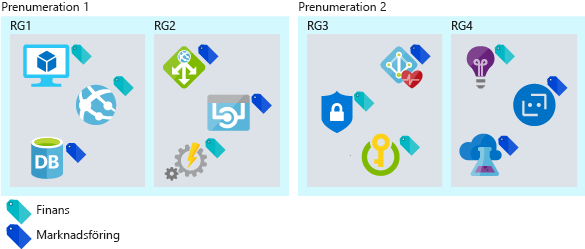
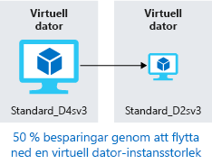
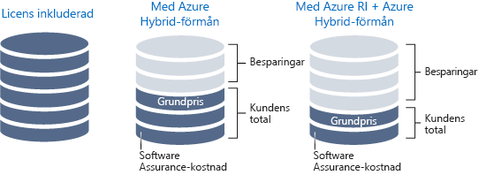

Du är en lösningsarkitekt.You are a solution architect. Din organisation Lamna Healthcare har flyttat sina arbetsbelastningar till molnet.Your organization, Lamna Healthcare has moved its workloads to the cloud. Kostnaden för dessa resurser och arbetsflöden har nyligen ökat mer än vad Lamna hade förväntat sig.Recently, the bill for these resources and workflows has increased more than Lamna had anticipated. Du har blivit ombedd att avgöra om ökningen är naturlig, beror på effektiv tillväxt eller om du kan minska kostnaderna genom att utnyttja organisationens molnresurser på ett effektivare sätt.You have been asked to determine whether the increase is natural, efficient growth, or whether the cost can be reduced by being more efficient with the organization's cloud resources.

#### Maximera effektiviteten för molnutgifterMaximize efficiency of cloud spend

> [!VIDEO https://www.microsoft.com/videoplayer/embed/RWjTgy]

## Hur molnet ändrar dina utgifterHow the cloud changes your expenses

En av skillnaderna mellan det offentliga molnet och en lokal infrastruktur är hur du betalar för tjänsterna som du använder.One of the differences between the public cloud and on-premises infrastructure is how you pay for the services you use. I ett lokalt datacenter tar det tid att köpa in maskinvara, maskinvaran storleksanpassas för att få maximal kapacitet och vissa av kostnaderna, till exempel elförsörjning och utrymme, kan vara dolda från affärsenheten som förbrukar resurserna.In an on-premises datacenter, hardware procurement time is long, hardware is sized for maximum capacity, and some of the costs, such as power and space, can be hidden from the business unit consuming the resources. Att köpa av fysisk infrastruktur binder upp investeringar i långsiktiga tillgångar och hindrar din förmåga att vara effektiv med dina resurser.Purchasing physical infrastructure ties up investments in long-term assets, hindering your ability to be agile with your resources.

När du flyttar till molnet får du en kostnadsmodell där du betalar per användning för det du använder i stället.Shifting to the cloud introduces a pay-for-what-you-use cost model. Du behöver inte längre binda upp investeringar i tillgångar och om resurskraven ändras kan du svara genom att lägga till, flytta eller ta bort resurser.You no longer need to tie up investments in assets, and if your resource requirements change, you can respond by adding, moving, or removing resources. Arbetsbelastningar varierar mellan och inom tjänster, efterfrågan kan vara oförutsägbar och dina tillväxtmönster ändras över tid.Workloads vary between and within services, demand can be unpredictable, and your growth patterns shift over time. Eftersom du bara betalar för det du använder i molnet, kan din kostnadsstruktur ändras i takt med resursändringarna.Since you only pay for what you use in the cloud, your cost structure can move in sync with the changes in resources.

Molninfrastrukturen kan hantera scenarier med varierande resursanvändning.Cloud infrastructure can handle fluctuating resource usage scenarios. Resurser med längre perioder av inaktivitet kan stängas av när de inte används och orsakar därmed inte några kostnader alls.Resources that have significant periods of inactivity can be shut down when not in use and not incur any cost at all. Du kan utöka resurserna direkt när en framgångsrik tjänst växer, i stället för att vänta till nästa inköpscykel.Resources can grow with a successful service as it grows, rather than having to wait for the next procurement cycle. Fler resurser kan läggas till dynamiskt och tas bort för att svara på förutsägbara och oförutsedda ökningar i efterfrågan.More resources can be dynamically added and removed to respond to predictable and unpredictable bursts of demand. Följande bild visar varför den lokala infrastrukturen inte kan hantera alla dessa varierande scenarier.The following illustration shows why the on-premises infrastructure cannot handle all these fluctuating scenarios.

I en effektiv arkitektur matchar etablerade resurser behovet av dessa resurser.In an efficient architecture, provisioned resources match the demand for those resources. Om en virtuell dator används mindre än 10 % större delen av tiden slösar du resurser, både i beräkning och kostnad.If a virtual machine is less than 10% utilized the majority of the time, you are wasting resources, both in compute and cost. Omvänt kan en virtuell dator som utnyttjas till 90 % använda det mesta av de tillgängliga resurserna och är en effektiv användning av kostnaden.Conversely, a virtual machine that is running 90% utilized is using the majority of the available resources and is an efficient use of money. Att köra ett system med 100 % utnyttjandegrad innebär en risk för prestandaproblem.Running a system to 100% utilization runs the risk of introducing performance issues. Det är viktigt att se till att en maximering av effektiviteten inte negativt påverkar systemets prestanda.It is important to ensure that maximizing efficiency doesn't negatively impact the performance of your system. Efterfrågan är sällan konstant, så att justera resurser när så är möjligt för att matcha efterfrågan är viktigt när man vill säkerställa effektiviteten.Demand is rarely constant, so adjusting resources when possible to match demand is important to ensure efficiency.

## Spåra dina molnutgifterTrack your cloud spend

Du behöver data för att kunna fatta intelligenta beslut.In order to make intelligent decisions, you need data. Genom att ta reda på vart pengarna tar vägen och jämföra det med utnyttjandet, kan du få fram var du kan ha outnyttjade resurser i din miljö.By looking at where your money is going, you can start comparing that to utilization to uncover where you may have waste within your environment.

En export av din faktureringsinformation finns tillgänglig när du vill.An export of your billing data is available at any time. Med hjälp av din faktureringsinformation kan du spåra var dina kostnader uppstår och hur de är allokerade till dina resurser.Using your billing data, you can track where your costs are going and how they're allocated across your resources. Det svåra är att faktureringsinformationen visar kostnaden, men inte användningen.The challenge is that the billing data shows cost but not utilization. Du har information som visar att du betalar för en stor virtuell dator, men hur mycket använder du den egentligen?You'll have data that indicates you're paying for that large VM, but how much are you actually using it?

Med Azure Cost Management kan du se vad du betalar för samt vilka underutnyttjade resurser du har.Azure Cost Management gives you insights where your spend is going, as well as underutilized resources. Azure Cost Management spårar dina totala kostnader, kostnad per tjänst och kostnad över tid.Azure Cost Management tracks your total spend, cost by service, and cost over time. Du kan öka detaljnivån till resurstyper och instanser.You can drill down into resource types and instances. Du kan också dela upp dina kostnader per organisation eller kostnadsställe genom taggning av resurser med dessa kategorier.You can also break down your costs by organization or cost center by tagging resources with those categories.

Azure Advisor innehåller också en kostnadskomponent.Azure Advisor also has a cost component. Den rekommenderar storleksändringar av virtuella datorer och köp av reserverade instanser, när detta är mer kostnadseffektivt än instanserna som du betalar för per användning.It recommends VM resizing, buying reserved instances when more cost effective than pay-as-you-go instances. Den identifierar oanvända ExpressRoute-kretsar och inaktiva virtuella nätverksgatewayer.It identifies unused ExpressRoute circuits and idle virtual network gateways. Advisor gör ytterligare rekommendationer för prestanda, hög tillgänglighet och säkerhet.Advisor makes additional recommendations in the areas of performance, high availability, and security.

Det viktiga är att ta sig tid att granska utgifterna och se vart dina pengar tar vägen.The important part is to take time to review your spend and evaluate where your money is going. Identifiera ineffektiva områden för att säkerställa att allt fungerar så effektivt som möjligt.Identify areas of inefficiency to ensure you're operating as efficiently as possible.

## Organisera för att optimeraOrganize to optimize

Att organisera dina resurser kan hjälpa dig spåra var en del av dina kostnader uppstår.Putting some organization to your resources can help track where some of your costs are going. Det finns olika sätt att gruppera resurser och upprätta en relation på, för att du ska se hur dina kostnader är relaterade till varandra.There are ways to group resources together, establishing a relationship so you know where your costs are related. Ur ett faktureringsperspektiv kan resurser enkelt grupperas genom att:From a billing perspective, resources can be easily grouped by:

- Tilldela resurser till olika prenumerationer.Assigning resources to different subscriptions.
- Tilldela resurser till olika resursgrupper.Assigning resources to different resource groups.
- Tillämpa taggar på resurser.Applying tags to resources.

Att använda prenumerationer och resursgrupper till att organisera resurser är ett enkelt sätt att logiskt gruppera resurser på och kan användas när du går igenom faktureringsdata.Using subscriptions and resource groups to organize resources is an easy way to logically group resources and can be leveraged when going through billing data. Taggar kan användas i resursrelationer som sträcker sig över gränserna för prenumerationer och resursgrupper.Tags come into play when resource relationships span the boundaries of subscriptions and resource groups. Taggar är nyckel/värde-par som kan läggas till i alla resurser och som exponeras i faktureringsdata. Detta innebär att du kan associera en avdelning eller kostnadscenter med din resurs.Tags are key/value pairs that can be added to any resource, and are exposed in billing data, allowing you to associate a department or cost center with your resource. Med taggar är det enklare att rapportera kostnader, samtidigt som varje avdelning i din organisation får ansvar för sina egna kostnader.Tags improve your ability to report on cost, as well as giving each department in your organization accountability for their own costs. Följande bild visar hur du kan använda samma tagg för resurser i olika resursgrupper, och till och med i olika prenumerationer.The following illustration shows how you can apply the same tag to resources in different resource groups and even in different subscriptions.

Att ordna dina resurser kan vara till stor hjälp och verkligen underlätta din förståelse för var dina kostnader uppstår.Adding some organization to your resources can go a long way and can really aid in your ability to understand where your costs are going. Nu ska vi ta en titt på några metoder för att optimera kostnaderna.Now let's take a look at some ways to optimize costs.

## Optimera kostnader för IaaSOptimizing IaaS costs

Kostnaden för virtuella datorer är ofta den största delen av kostnaderna för organisationer som använder virtuella datorer.For organizations using virtual machines, the cost associated with virtual machines is often the biggest portion of spend. Beräkningskostnaderna är vanligtvis den största delen, följt av lagring.The compute costs are typically the biggest piece, followed by storage. Att ta sig tid att optimera resurser där du betalar för det du använder kan ha en stor inverkan på storleken på din månatliga faktura.Taking time to optimize pay-for-what-you-use resources can have a large impact on the size of your monthly bill.

Nu ska vi gå igenom några tips för hur du kan sänka dina beräknings- och lagringskostnader.Let's take a look at best practices to reduce your compute and storage costs.

### BeräkningCompute

Det finns olika alternativ för att uppnå kostnadsbesparingar för virtuella datorer.There are different options available to achieve cost savings for virtual machines.

- Välj en mindre storlek på instansen för den virtuella datorn.Choose a smaller virtual machine instance size.
- Minska antalet timmar som en virtuell dator körs.Reduce the number of hours a virtual machine runs.
- Använd rabatter på beräkningskostnaderna.Use discounts for the compute costs.

#### Rätt storlek på virtuella datorerRight size virtual machines

Att uppnå rätt storlek på en virtuell dator är en process som matchar storleken på virtuella datorn med det resursbehov som krävs av den.Right sizing a virtual machine is the process of matching the virtual machine size with the resource demand required of the VM. Om en virtuell dator som körs är inaktiv till 25 %, kommer en minskning av storleken på den virtuella datorn sänka dina kostnader omedelbart.If a VM is running 25% idle, reducing the size of the VM will immediately reduce your cost. Kostnaderna för virtuella datorer är linjära inom en instansfamilj – varje nästa större storlek kommer att fördubbla dina kostnader.Virtual machine costs are linear within an instance family; each next size larger will double your cost. Omvänt kommer en minskning av en virtuell dator med en enda instansstorlek halvera dina kostnader.Conversely, reducing a VM by a single instance size will reduce your cost in half. Följande illustration visar en besparing på 50 % som uppnås genom att gå ned en storlek inom samma serie.The following illustration shows a 50% savings achieved by moving one size down within the same series.

Azure Advisor identifierar vilka virtuella datorer som är underutnyttjade.Azure Advisor identifies which virtual machines are underutilized. Advisor övervakar din användning av virtuella datorer under 14 dagar och identifierar de datorer som används lite.Advisor monitors your virtual machine usage for 14 days and then identifies underutilized virtual machines. Virtuella datorer vars processoranvändning är 5 % eller mindre och vars nätverksanvändning är 7 MB eller mindre under minst fyra dagar, anses vara virtuella datorer med låg användning.Virtual machines whose CPU utilization is 5 percent or less and network usage is 7 MB or less for four or more days are considered underutilized virtual machines.

#### Implementera avstängningsscheman för virtuella datorerImplement shutdown schedules for virtual machines

Om du har arbetsbelastningar i en virtuell dator som endast används ibland men körs kontinuerligt, slösar du pengar.If you have VM workloads that are only used periodically, but are running continuously, you're wasting money. De här virtuella datorerna kan stängas av när de inte används vilket gör att du sparar in på beräkningskostnaderna när den virtuella datorn har frigjorts.These VMs can be shut down when not in use saving you compute costs while the VM is deallocated. En utvecklingsmiljö är exempelvis en bra kandidat eftersom utveckling vanligtvis sker under kontorstid.For example, a development environment is a good candidate because development generally happens only during business hours.

Du har flera val för att frigöra en virtuell dator.You have several options to deallocate a VM. Du kan använda Azure Automation för att enbart begränsa dina virtuella datorer under de perioder som arbetsbelastningarna kräver.You can use Azure Automation to run your VMs only during those times that your workloads require. Du kan använda funktionen för automatisk avstängning på en virtuell dator för att schemalägga en automatisk engångsavstängning.You can use the auto-shutdown feature on a virtual machine to schedule a one-off automated shutdown. Slutligen kan du stoppa en virtuell dator manuellt i Azure-portalen.Finally, you can stop a VM manually in the Azure portal. Du bör alltid använda Azure-kontrollerna för att stoppa dina virtuella datorer. Om du stänger av operativsystemet från inuti en virtuell dator så frigörs inte dess Azure-resurser så du kommer att fortsätta att påföras kostnader.You should always use the Azure controls to stop your VMs; shutting down the OS from inside a VM does not deallocate its Azure resource so you will continue to accrue costs.

#### Tillämpa rabatter på beräkningskostnadenApply compute cost discounts

Med Azure Hybrid-förmånen kan du ytterligare optimera dina kostnader för både Windows Server och SQL Server, genom att använda dina lokala Windows Server- eller SQL Server-licenser med Software Assurance. Den används som en rabatt för beräkningskostnaden för dessa virtuella datorer, vilket eliminerar kostnaderna för Windows och SQL Server på aktiverade instanser.The Azure Hybrid Benefit allows you to further optimize your costs for both Windows Server and SQL Server by allowing you to use your on-premises Windows Server or SQL Server licenses with Software Assurance to be used as a discount toward the compute cost of these VMs, eliminating the costs for Windows and SQL Server on enabled instances.

Vissa virtuella datorer måste vara igång hela tiden.Some virtual machines need to be up and running all the time. Du kanske har en servergrupp för webbprogram i en produktionsarbetsbelastning, eller kanske en domänkontrollant som stöder olika servrar i ett virtuellt nätverk.Maybe you have a web application server farm for a production workload or maybe a domain controller supporting various servers on a virtual network. Om du säkert vet att de virtuella datorerna ska köras under det kommande året eller kanske längre, kan du uppnå ytterligare besparingar genom att köpa en reserverad instans.If you know with certainty that these virtual machines will run over the coming year or maybe longer, you can get further cost savings by purchasing a reserved instance. Azure Reserved Virtual Machine Instances med beräkningskapacitet kan köpas för ett eller tre år, med en rabatt som kan jämföras med beräkningsresurser där du betalar per användning.Azure Reserved Virtual Machine Instances can be purchased for one year or three years of compute capacity, at a discount compared to pay-as-you-go compute resources. Azure Reserved Virtual Machine Instances kan avsevärt minska kostnaderna för din virtuella dator. Du kan minska kostnaderna med upp till 72 % (jämfört med användningsbaserad betalning) genom att betala ett eller tre år i förskott.Azure Reserved Virtual Machine Instances can significantly reduce your virtual machine costs, up to 72 percent on pay-as-you-go prices, with one-year or three-year upfront commitment. Följande bild visar hur mycket du sparar om du kombinerar din lokala licens med Azure Hybrid-förmånen och om du kombinerar din lokala licens med både Azure RI och Azure Hybrid-förmånen.The following illustration shows savings achieved when you combine your on-premises license with the Azure Hybrid Benefit and when you combine your on-premises license with both Azure RI and the Azure Hybrid Benefit.

### Disklagring och kostnadsoptimering för virtuella datorerVirtual machine disk storage cost optimization

Du kan använda prisreducerad standardlagring för arbetsbelastningar som inte kräver hög tillförlitlighet eller prestandadiskar.For workloads that do not require high reliability and performance disks, you can use the reduced-cost standard storage. Du kan välja att använda standardlagring för utvecklings- och testmiljöer som inte behöver vara en identisk matchning av en produktionsarbetsbelastning.You might choose to use standard storage for development and test environments that are not required to be an identical match for a production workload.

Se till att det inte finns några överblivna diskar som är kvar i din miljö.Ensure you don't have any orphaned disks remaining in your environment. Diskar som inte är associerade med en virtuell dator kan fortfarande medföra kostnader för lagringen.Disks that aren't associated with a VM still incur storage costs. Om du har tagit bort en virtuell dator men inte diskarna, kan de överblivna diskarna vara något som minskar lagringskostnaderna.If you've removed a VM but not the disks, the orphaned disks may be a place to reduce your storage cost.

På samma sätt om du har överblivna ögonblicksbilder bör du ägna en stund åt att rensa dem.Similar to orphaned disks, if you have any orphaned snapshots lingering around, take some time to clean them up. Prissättningen för dessa är lägre än själva diskarna, men det är ändå en bra idé att eliminera kostnaderna för onödiga resurser.Pricing for these is lower than the disks themselves, but it's still a good practice to eliminate costs of unnecessary resources.

## Optimera kostnader för PaaSOptimizing PaaS costs

PaaS-tjänster är vanligtvis optimerade för kostnader i IaaS-tjänster, men det finns möjligheter att identifiera slöseri och optimera för minimala kostnader.PaaS services are typically optimized for costs over IaaS services, but there are opportunities to identify waste and optimize for minimal costs. Låt oss ta en titt på olika sätt att minska kostnaderna för Azure SQL Database och Azure Blob Storage.Let's take a look at ways to reduce Azure SQL Database and Azure Blob storage costs.

### Optimera kostnader för Azure SQL DatabaseOptimizing Azure SQL Database costs

När du skapar en Azure SQL-databas måste du välja en Azure SQL Server och en prestandanivå.When creating an Azure SQL database, you have to select an Azure SQL Server and decide on a performance tier. Varje nivå är en prestandanivå för antingen databastransaktionsenheter (DTU) eller virtuella kärnor.Each tier provides a performance level either in database transaction units (DTUs) or virtual cores (vCores). För databasbelastningar som är konstanta är det enkelt att optimera genom att välja rätt storleksnivå för den prestanda som krävs.For database loads that are steady, it's easy to optimize by selecting the properly sized tier for the needed performance. Men vad händer om din databas råkar ut för oförutsägbara aktivitetsökningar?But what if your database has unpredictable bursts or spikes in activity? Elastiska pooler kan sänka kostnaderna vid oförutsägbara arbetsbelastningar.Elastic pools can reduce costs for unpredictable workloads.

Elastiska pooler i SQL Database är en enkel och kostnadseffektiv lösning för att hantera och skala flera databaser med varierande och oförutsägbara användningskrav.SQL Database elastic pools are a simple, cost-effective solution for managing and scaling several databases that have varying and unpredictable usage demands. Databaserna i en elastisk pool finns på en enda Azure SQL Database-server och delar ett bestämt antal resurser till ett fast pris.The databases in an elastic pool are on a single Azure SQL Database server and share a set number of resources at a set price. Pooler lämpar sig väl för ett stort antal databaser med specifika användningsmönster.Pools are well suited for a large number of databases with specific utilization patterns. För en viss databas kännetecknas det här mönstret av låg genomsnittlig användning med relativt ovanliga användningstoppar.For a given database, this pattern is characterized by low average utilization with relatively infrequent utilization spikes.
Ju fler databaser du kan lägga till i en pool, desto större blir dina besparingar.The more databases you can add to a pool, the greater your savings become. Följande bild visar funktionerna i de tre typerna av Elastic Database-pooler: Basic, Standard och Premium.The following illustration shows the capabilities of the three types of Elastic Database Pools: basic, standard, and premium.  Basic har automatisk skalning för upp till 5 eDTU:er per databas, Standard har automatisk skalning för upp till 100 eDTU:er per databas och Premium har automatisk skalning för upp till 1 000 eDTU:er per databas.Basic auto scales up to 5 eDTUs per DB, standard auto scales up to 100 eDTUs per DB, and Premium that auto scales up to 1000 eDTUs per DB.

Elastiska pooler är ett bra sätt att sprida kostnader över flera databaser och kan ha en betydande inverkan på att minska dina kostnader för Azure SQL Database.Elastic pools are a great way to spread costs across multiple databases and can make a significant impact on reducing your Azure SQL Database costs.

### Optimera kostnader för blobblagringOptimizing Blob storage costs

Blobblagring är ett kostnadseffektivt sätt att lagra data på, men när mängden data växer kan du sänka kostnaderna genom att optimera hur datan lagras.Blob storage is a cost-effective way to store data, but as the amount of data grows, your bill can benefit from optimizing how the data is stored.

Nu ska vi återgå till Lamna Healthcare.Let's return to Lamna Healthcare. Du har en program för medicinska avbildningar som lagrar avbildningarna i en blobblagring.You have a medical-imaging application that stores images in blob storage. På grund av antalet och storleken på avbildningarna utgör lagringen en avsevärd del av kostnaden för programmet.Due to the quantity and size of the images, the storage ends up being a notable cost for the application. När en avbildning har gjorts för en patient är det troligt att den avbildningen kommer att visas flera gånger under den första veckan och prestandan för hämtningen av avbildningen förväntas vara hög.When an image has been taken for a patient, it's likely that in the first week, that image will be viewed several times, and the performance of image retrieval is expected to be high. Däremot visas en avbildning som gjordes för två år sedan sällan och den har därför en lägre förväntad hämtningsprestanda.Conversely, an image taken two years ago may be accessed infrequently and has a lower retrieval performance expectation. Du kan använda lagringsnivåer till att optimera kostnaden för hämtning av avbildningar, med hänsyn taget till den nedsatta prestanda som krävs när avbildningen blir äldre.You can use storage tiering to optimize the cost of image retrieval, given the reduced performance required as the image ages.

Azure Storage erbjuder tre lagringsnivåer för lagring av blobbobjekt.Azure Storage offers three storage tiers for blob object storage. Azures frekventa lagringsnivå är optimerad för att lagra data som används ofta.The Azure hot storage tier is optimized for storing data that is accessed frequently. Azures lågfrekventa lagringsnivå är optimerad för att lagra data som inte används ofta och som har lagrats i minst 30 dagar.The Azure cool storage tier is optimized for storing data that is infrequently accessed and stored for at least 30 days. Arkivlagringsnivån i Azure är optimerad för att lagra data som används sällan och som lagrats i minst 180 dagar med flexibla svarstidskrav.The Azure archive storage tier is optimized for storing data that is rarely accessed and stored for at least 180 days with flexible latency requirements.

- **Frekvent åtkomstnivå** – De högsta lagringskostnaderna, men de lägsta åtkomstkostnaderna.**Hot access tier** - Highest storage costs but the lowest access costs.
- **Lågfrekvent åtkomstnivå** – Lägre lagringskostnader och högre åtkomstkostnader jämfört med frekvent lagring.**Cool access tier** - Lower storage costs and higher access costs compared to hot storage. Den här nivån är avsedd för data som ska finnas kvar på den lågfrekventa nivån i minst 30 dagar.This tier is intended for data that will stay in the cool tier for at least 30 days.
- **Arkivåtkomstnivå** – Lägst lagringskostnad och högst kostnad för datahämtning, jämfört med frekvent och lågfrekvent lagring.**Archive access tier** - Lowest storage cost and highest data retrieval costs compared to hot and cool storage. Den här nivån är avsedd för data som kan tolerera flera timmars fördröjning vid hämtning och som finns kvar på arkivnivån i minst 180 dagar.This tier is intended for data that can tolerate several hours of retrieval latency and will stay in the archive tier for at least 180 days.

För Lamna Healthcare är det rimligt att ha nya avbildningar på frekvent åtkomstnivå i en månad, för att kunna visa de senaste avbildningarna så snabbt som möjligt.For Lamna Healthcare, keeping new images on the hot access tier for a month makes sense, so that viewing the most recent images performs as fast as possible. Du kan sedan flytta avbildningar som är över ett år gamla till arkivnivån, eftersom det är troligt att dessa avbildningar inte kommer att hämtas.You could then move images over one year old to the archive tier since it is likely that these images will not be retrieved. Detta minskar kostnaderna för att lagra avbildningarna.This would reduce their costs associated with storing these images.

### Utnyttja förbrukningsprismodellerLeverage consumption pricing models

Om du flyttar till PaaS-tjänster kan du till och med ta den användningsbaserade modellen ett steg längre till en sann förbrukningsprismodell.Moving to PaaS services can also take the pay-as-you-go model even further into a true consumption pricing model. Tjänster som Azure Functions har möjlighet att använda _förbrukningsplaner_.Services such as Azure Functions have the ability to use _Consumption plans_. När du använder en förbrukningsplan läggs instanser av Azure Functions-värden till och tas bort dynamiskt baserat på antalet inkommande händelser.When you're using a Consumption plan, instances of the Azure Functions host are dynamically added and removed based on the number of incoming events. Den här serverlösa planen skalas automatiskt och du debiteras bara för beräkningsresurser när dina funktioner körs.This serverless plan scales automatically, and you're charged for compute resources only when your functions are running. I en förbrukningsplan får en funktions körningstid timeout efter en konfigurerbar tidsperiod.On a Consumption plan, a function execution times out after a configurable period of time.

Fakturering baseras på antalet körningar, körningstid och använt minne.Billing is based on number of executions, execution time, and memory used. Fakturering slås samman över alla funktioner inom en funktionsapp.Billing is aggregated across all functions within a function app.

Om du flyttar till tjänster som använder en förbrukningsprismodell så kan du få en ny metod för besparingar i din arkitektur.Moving to services that use a consumption pricing model can bring a new approach to cost savings into your architecture.

## Kostnadsoptimering på Lamna HealthcareCost optimization at Lamna Healthcare

Lamna Healthcare gör framsteg i att minska sina kostnader.Lamna Healthcare is making strides on reducing their costs. De har vidtagit en månatlig granskning av sina kostnader och varje avdelning har åtkomst till Azure Cost Management, där de kan granska sina kostnader under månaden.They have organized a monthly review of their costs, and each department has access to Azure Cost Management, where they can review their costs throughout the month. De har identifierat ett antal platser där reserverade instanser kan användas och har köpt flera stycken för att dra nytta av rabatten.They've identified a number of places where reserved instances can be used and have purchased several to take advantage of this discount. De har implementerat automatiserade processer för att stoppa utvecklingsmiljöer när de inte används, vilket ger lägre kostnader.They have implemented automated processes to stop development environments in off-hours, saving them additional costs during times when these resources were not being used. 

Tillsammans med optimeringen av blobblagring för avbildningar har de kunnat sänka sina kostnader avsevärt under de senaste månaderna.Along with the optimization of blob storage for their imaging storage, they've managed to drop their bill notably over the past couple of months.

## SammanfattningSummary

Att optimera kostnaden för din molninfrastruktur innebär att spåra kostnader och säkerställa att resursanvändningen överensstämmer med kraven för dina arbetsbelastningar.Optimizing the cost of your cloud infrastructure involves tracking your spend and ensuring that your resource utilization matches the demands of your workloads. Med rätt kvalitet och prestandanivå för dina resurser optimeras dina molnkostnader ytterligare.Using the right quality and performance tier for your resources further optimizes your cloud costs.