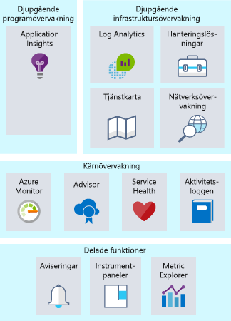
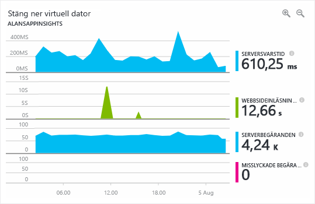

Övervakning syftar till insamling och analys av data för att avgöra prestanda, hälsa och tillgänglighet för affärsprogram och resurser som dessa program är beroende av. Vad händer om du har ett driftsteam som ansvarar för resurser som körs på Azure? Vad skulle du göra för att säkerställa att du hade insikt i hälsan för dina system? Om det händer något, upptäcks det först av ditt team eller av slutanvändarna? En effektiv övervakningsstrategi hjälper dig att fokusera på hälsan för ditt program. Det hjälper dig även att öka drifttiden genom att meddela dig om kritiska förhållanden så att du kan lösa dem innan de hunnit bli problem. 

När det gäller att övervakning och analys i Azure går det att gruppera tjänsterna i tre fokusområden: djupgående programövervakning, djupgående infrastruktursövervakning samt kärnövervakning. I den här enheten tar vi en titt på vart och ett av dessa fokusområden och hur Azure-tjänster möjliggör dessa funktioner för din arkitektur. Även om vi har grupperat ihop dessa tjänster finns det flera integreringspunkter mellan dem, vilket möjliggör delning av viktiga övervakningsdatapunkter. Följande bild visar de tillgängliga övervakningstjänster som har satts samman i logiska grupper.

## Kärnövervakning

Kärnövervakning ger grundläggande nödvändig övervakning för alla Azure-resurser. När vi diskuterar grundläggande övervakning kan du betrakta det som övervakning av det som händer med dina resurser på Azure-plattformsnivån. Med det här fokusområdet får du insikt i till exempel hälsan för Azure-plattformen, ändringar i dina resurser och prestandamått. Genom att använda tjänster i det här området får du möjlighet att övervaka de grundläggande delarna som du behöver för att hålla igång ditt program.

Azure tillhandahåller tjänster som ger dig insyn i fyra nyckelområden för kärnövervakning: aktivitetsloggning, hälsan för tjänster, mått och diagnostik samt rekommendationer om bästa praxis. De här tjänsterna är inbyggda i Azure och behöver liten eller ingen konfiguration för att aktiveras. Vi tar en närmare titt.

### Aktivitetsloggning

Aktivitetsloggning är mycket viktigt för att få information om vad som händer med dina resurser på Azure-plattformsnivån. Varje ändring som skickas till Azure-plattformen loggas i Azure-aktivitetsloggen, vilket ger dig möjlighet att spåra alla åtgärder som vidtas mot dina resurser. Aktivitetsloggen innehåller detaljerad information om aktiviteter som hjälper dig besvara frågor som:

- Vem har kopplat en disk till den här virtuella datorn?
- När stängdes den här datorn av?
- Vem har ändrat lastbalanserarens konfiguration?
- Varför misslyckades autoskalningsåtgärden på min VM-skalningsuppsättning?

Med hjälp av aktivitetsloggen som ger svar på dessa typer av frågor kan du felsöka problem, spåra ändringar och tillhandahålla granskning av det som händer i din Azure-miljö. Aktivitetsloggdata bevaras endast i 90 dagar och kan arkiveras på ett lagringskonto eller skickas till Azure Log Analytics för längre kvarhållning och ytterligare analys.

### Hälsa för molntjänster

Förr eller senare kan vilket system som helst stöta på problem, och det gäller även Azure-tjänster. Att hålla dig informerad om hälsan för Azure-tjänster hjälper dig att förstå om och när ett problem som påverkar en Azure-tjänst även påverkar din miljö. Något som förefaller vara ett lokaliserat problem kan bero på ett mer omfattande problem, och Azure Service Health ger just den insikten. Azure Service Health identifierar eventuella problem med Azure-tjänsterna som kan påverka ditt program. Service Health hjälper dig även att planera för schemalagt underhåll.

### Mått och diagnostik

För problem som är mer lokaliserade är det viktigt att ha insyn i vad som händer i systemet eller serverinstansen. Möjligheten att visa mått och diagnostikinformation är mycket viktigt för att kunna felsöka prestandaproblem och bli varse om något går fel. För att ge den här insynen har Azure-tjänster ett enhetligt sätt att visa hälsa, mått eller diagnostikinformation. Azure-Monitor aktiverar kärnövervakning för Azure-tjänster genom att tillåta insamling, aggregering och visualisering av mått, aktivitetsloggar och diagnostikloggar.

Det finns mått som tillhandahåller prestandastatistik för olika resurser och även för operativsystemet i en virtuell dator. Du kan visa dessa data med någon av utforskarna i Azure-portalen och skapa aviseringar som baseras på måtten. Azure Monitor ger den snabbaste måttpipelinen (från 5 minuter ned till 1 minut), så du bör använda det för tidskritiska aviseringar och meddelanden.

### Rekommendationer om bästa praxis

Med övervakning menar vi oftast den aktuella hälsan för en resurs. Men även om en resurs är felfri kan det finnas justeringar som skulle resultera i ökad tillgänglighet, minskade kostnader eller bättre säkerhet. Azure Advisor kan hjälpa till genom att hålla utkik efter potentiella problem med prestanda, kostnad, hög tillgänglighet eller säkerhet i dina resurser. Advisor skapar personligt anpassade rekommendationer baserat på resurskonfiguration och telemetri för att ge vägledning som de flesta traditionella övervakningsplattformar inte erbjuder.

## Djupgående infrastruktursövervakning

De övervakningskomponenter som vi har gått igenom än så länge är väldigt användbara för att ge insikter, men de ger endast insyn i Azure-plattformen. För vanliga IaaS-arbetsbelastningar finns det flera mått och mer diagnostikinformation att samla in från nätverket eller de faktiska operativsystemen. Exempel på områden där Log Analytics kan ge djupa insikter är att hämta information från SQL Server för att kontrollera att den är korrekt konfigurerad, analysera ledigt diskutrymme på alla servrar i din miljö samt visualisera nätverksberoendena mellan dina system och tjänster.

Vid utformning av en övervakningsstrategi är det viktigt att inkludera alla komponenter i programkedjan så att du kan samordna händelser över tjänster och resurser. För tjänster som stöder Azure Monitor kan de enkelt konfigureras för att skicka sina data till Log Analytics-arbetsytan. Virtuella datorer (både i molnet och lokala) kan ha en agent installerad för att skicka data till Log Analytics. Du kan skicka anpassade data till Log Analytics via Log Analytics-API:et. Bild som visar hur Log Analytics fungerar som ett centralt nav för övervakning av data. Log Analytics tar emot övervakningsdata från dina Azure-resurser och gör dem tillgängliga för konsumenter för analyser och visualisering.

Med dessa data i Log Analytics kan du köra frågor mot rådata för felsöknings-, rotorsaksidentifierings- och granskningsändamål. För flera kända tjänster (SQL Server, Windows Server Active Directory) finns det hanteringslösningar tillgängliga som visualiserar övervakningsdata och visar överensstämmelse med bästa praxis.

Med Log Analytics kan du skapa frågor och interagera med andra system baserat på dessa frågor. Det vanligaste exemplet är en avisering. Du vill kanske få ett e-postmeddelande när ett system får slut på diskutrymme eller när bästa praxis på SQL Server inte längre följs. Log Analytics kan skicka aviseringar, köra igång automatisering och även anslutas till anpassade API:er för ändamål som integrering med hantering av IT-tjänster (ITSM).

## Djupgående programövervakning

Visserligen är det viktigt att förstå hur huvudtjänster och infrastrukturen fungerar, men du kan ta dina övervakningsfunktioner till en ny nivå genom att djupt undersöka programmen för att identifiera prestandaproblem, användningstrender och den övergripande tillgängligheten av tjänster som du utvecklar och förlitar dig på. Genom att använda ett verktyg för hantering av programprestanda kan du bättre identifiera och diagnostisera problem som uppstår i dina webbappar och tjänster.

Det är precis vad du kan göra med Azure Application Insights. Application Insights tillhandahåller funktioner för telemetriinsamling, frågor och visualisering. Det behövs få eller inga kodändringar. Du behöver bara installera ett litet instrumentationspaket i ditt program. Application Insights är plattformsoberoende och har stöd för .NET, Node.js och Java.

Programmets svarstid kan till exempel vara komplicerat att felsöka. Är webbservern överbelastad? Är det en specifik SQL-fråga som inte är optimerad? Fungerar det API som du anropar långsammare än vanligt? Lösningar för övervakning av programprestanda kan hjälpa att upptäcka de faktiska problem som enkel måttövervakning inte upptäcker. Följande skärmbild visar en grafisk representation av ett programs prestandainformation som tillhandahålls av Azure Application Insights.

Med en lösning för övervakning av programprestanda kan du övervaka användning, prestanda och tillgänglighet och därmed åtgärda fel mycket snabbare. Därför bör en sådan finnas med i alla strategier för övervakning.

## Övervakning på Lamna Healthcare

Lamna Healthcare har gjort om sin övervakningsstrategi sedan de flyttade sina resurser till molnet. De använder Monitor för felsökning och aviseringar när prestandaproblem kanske påverkar deras resurser. De har konfigurerat så att alla aviseringar om tjänstehälsa skickas till deras driftsteam så att de kan åtgärdas omedelbart. De har en process för att regelbundet granska Advisor och säkerställa att rekommendationerna implementeras i deras miljö där det är tillämpligt. 

De skickar loggdata från alla Azure-resurser och lokala resurser till en Log Analytics-arbetsyta, så att de kan söka i loggkällor efter händelsekorrelation. De använder även hanteringslösningar för Windows Server Active Directory och SQL Server.

Deras utvecklingsteam har börjat integrera Application Insights i sina program, och de har redan hittat två dittills oidentifierade defekter som påverkade prestandan.

## Sammanfattning

En bra övervakningsstrategi söker i flera lager i en arkitektur, från den stöttande infrastrukturen till djupgående programtelemetri. Det hjälper dig att förstå den detaljerade driften av de olika komponenterna i ditt program. Det ökar drifttiden genom att proaktivt meddela dig om kritiska problem så att du kan lösa dem innan de hunnit bli problem. Det gör även att du kan samordna loggar och telemetri över flera system för att identifiera problem. Vi har tittat på ett antal tjänster på Azure som du kan utnyttja i din övervakningsstrategi.