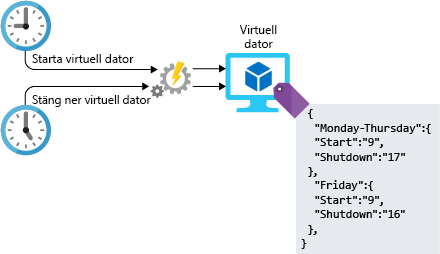

Att hantera infrastrukturen med någon typ av arbetsbelastning innefattar även konfigurationsåtgärder. Den här konfigurationen kan göras manuellt, men manuella steg kan vara arbetskrävande, kan lätt drabbas av fel och vara ineffektiva. Hur gör du om du ska leda ett projekt som kräver distribution av hundratals system i Azure? Hur skulle du skapa och konfigurera de här resurserna? Hur lång tid kommer det att ta? Kan du vara säker på att varje system har konfigurerats korrekt, utan avvikelse mellan dem? Om du använder automatisering i arkitekturutformningen tar du dig förbi dessa svårigheter. Låt oss ta en titt på några av de sätt som du kan automatisera på i Azure.

## <a name="infrastructure-as-code"></a>Infrastruktur som kod

Infrastruktur som kod är hantering av infrastrukturen (nätverk, virtuella datorer, lastbalanserare och anslutningstopologi) i en beskrivande modell, med hjälp av ett system för versionshantering som liknar vad som används för källkod. Precis som principen att samma källkod genererar samma binärfil så skapar en modell för IaC samma miljö varje gång den används. IaC är en viktig DevOps-praxis och används ofta tillsammans med kontinuerlig leverans.

Infrastruktur som kod har utvecklats för att lösa problemet med miljödrift. Utan IaC måste team bibehålla inställningarna för enskilda distributionsmiljöer. Över tid blir varje miljö en snöflinga, det vill säga en unik konfiguration som inte kan reproduceras automatiskt. Inkonsekvens mellan miljöer leder till problem vid distributioner. Med snöflingor, involverar administration och underhåll av infrastruktur manuella processer som är svåra att spåra och bidrar till fel.

När du ska automatisera distributionen av tjänster och infrastruktur finns det två olika metoder som du kan använda: imperativ och deklarativ. I en imperativ metod anger du uttryckligen de kommandon som ska köras för att ge resultatet som du vill ha. I en deklarativ metod anger du vad du vill att resultatet ska bli, i stället för att ange hur du vill att den ska utföras. Båda metoderna är användbara, så det finns inget fel val. Hur ser dessa olika metoder ut i Azure och hur använder du dem?

### <a name="imperative-automation"></a>Imperativ automatisering

Vi börjar med imperativ automatisering. Vid imperativ automatisering anger vi _hur_ saker ska utföras. Detta görs normalt programmatiskt med ett skriptspråk eller en SDK. Vi kan använda Azure CLI eller Azure PowerShell för Azure-resurser. Låt oss ta en titt på ett exempel som använder Azure CLI till att skapa ett lagringskonto.

```azure-cli
az group create --name storage-resource-group \
        --location eastus

az storage account create --name mystorageaccount \
        --resource-group storage-resource-group \
        --kind BlobStorage \
        --access-tier hot
```

I det här exemplet visar vi hur du skapar dessa resurser. Kör ett kommando för att skapa en resursgrupp. Kör ett annat kommando för att skapa ett lagringskonto. Vi talar uttryckligen om för Azure vilka kommandon som ska köras för att generera de utdata som vi behöver.

Med den här metoden kan vi automatisera vår infrastruktur till fullo. Vi kan ange områden för indata och utdata och se till att samma kommandon utförs varje gång. Genom att automatisera våra resurser tar vi bort de manuella stegen från processen, vilket gör resursadministrationen mer effektiv. Det finns dock vissa nackdelar med den här metoden. Skript för att skapa resurser kan snabbt bli komplexa när arkitekturen blir mer komplex. Felhantering och verifiering av indata kan behöva läggas till för att säkerställa en fullständig körning. Kommandon kan ändras, vilket kräver löpande underhåll av skripten.

### <a name="declarative-automation"></a>Deklarativ automatisering

Med deklarativ automatisering anger vi _vad_ vi vill att vårt resultat ska bli och det är upp till systemet att utföra det. I Azure utförs deklarativ automatisering med hjälp av Azure Resource Manager-mallar.

Resource Manager-mallar är JSON-strukturerade filer som anger vad vi vill skapa. I exemplet nedan säger vi till Azure att skapa ett lagringskonto med de namn och egenskaper som vi anger. Vilka faktiska steg som utförs för att skapa lagringskontot är upp till Azure. Mallarna består av fyra delar: parametrar, variabler, resurser och utdata. Parametrarna hanterar de indata som ska användas i mallen. Variabler används till att lagra värden som ska användas i mallen. Resurser är det som skapas och utdatan ger information till användaren om det som har skapats.

```json
{
    "$schema": "https://schema.management.azure.com/schemas/2015-01-01/deploymentTemplate.json#",
    "contentVersion": "1.0.0.0",
    "parameters": {
        "name": {
            "type": "string"
        },
        "location": {
            "type": "string"
        },
        "accountType": {
            "type": "string",
            "defaultValue": "Standard_RAGRS"
        },
        "kind": {
            "type": "string"
        },
        "accessTier": {
            "type": "string"
        },
        "httpsTrafficOnlyEnabled": {
            "type": "bool",
            "defaultValue": true
        }
    },
    "variables": {
    },
    "resources": [
        {
            "apiVersion": "2018-02-01",
            "name": "[parameters('name')]",
            "location": "[parameters('location')]",
            "type": "Microsoft.Storage/storageAccounts",
            "sku": {
                "name": "[parameters('accountType')]"
            },
            "kind": "[parameters('kind')]",
            "properties": {
                "supportsHttpsTrafficOnly": "[parameters('httpsTrafficOnlyEnabled')]",
                "accessTier": "[parameters('accessTier')]",
                "encryption": {
                    "services": {
                        "blob": {
                            "enabled": true
                        },
                        "file": {
                            "enabled": true
                        }
                    },
                    "keySource": "Microsoft.Storage"
                }
            },
            "dependsOn": []
        }
    ],
    "outputs": {
        "storageAccountName": {
            "type": "string",
            "value": "[parameters('name')]"
        }
    }
}
```

Mallar kan användas för att skapa och ändra de flesta tjänster i Azure. De kan lagras i koddatabaser och källkontrolleras samt delas mellan miljöer för att säkerställa att infrastrukturen som utvecklas matchar vad som faktiskt finns i produktion. De är ett bra sätt att automatisera distributioner på och uppnå konsekvens, eliminera felkonfigurationer samt öka den operativa hastigheten.

Att automatisera din distribution av infrastrukturen är ett bra första steg, men när du distribuerar virtuella datorer finns det fortfarande mer arbete som ska göras. Låt oss ta en titt på ett par olika sätt att automatisera konfigurationen på efter distributionen.

## <a name="vm-customization-images-vs-post-deployment-configuration"></a>Anpassning av virtuella datorer: Avbildningar och konfigurationer efter distributionen

I många distributioner av virtuella datorer är jobbet inte slutfört när datorn körs. Det är troligt att det finns fler konfigurationer som behövs innan den virtuella datorn faktiskt kan fungera i avsett syfte. Fler diskar kan behöva formateras, den virtuella datorn kanske måste vara ansluten till en domän, en agent för en hanteringsprogramvara måste kanske vara installerad och troligen kräver även den faktiska arbetsbelastningen att installation och konfiguration utförs.

Det finns två vanliga strategier som används för den konfiguration som anses vara en del av konfigurationen av den virtuella datorn. Båda har dock fördelar och nackdelar:

- Anpassade avbildningar
- Skript efter distributionen

Anpassade avbildningar genereras genom att en virtuell dator distribueras och sedan konfigurerar eller installerar man programvara på den instans som körs. När allt har konfigurerats kan datorn stängas av och en avbildning skapas från den virtuella datorn. Avbildningen kan sedan användas som bas för andra nya virtuella datorer. Att arbeta med anpassade avbildningar kan påskynda den totala tiden för distributionen så snart den virtuella datorn har distribuerats och är igång. Ingen ytterligare konfiguration krävs. Om hastigheten för distributionen är en viktig faktor, är anpassade avbildningar definitivt värda att utforska.

Skript efter distributionen använder vanligtvis en grundläggande basavbildning och förlitar sig sedan på skript eller en hanteringsplattform för konfigurationen till att konfigurera efter att den virtuella datorn har distribuerats. Skript efter distributionen kan utföras genom att köra ett skript på den virtuella datorn via Azure-skripttillägget, eller genom att använda en mer robust lösning som till exempel Azure Automation Desired State Configuration (DSC).

I varje metod finns några saker du bör tänka på. När du använder avbildningar behöver du se till att det finns en process för att hantera uppdateringar av avbildningar, säkerhetsuppdateringar och lagerhantering av själva avbildningarna. Med skript efter distributionen kan byggtiden bli längre, eftersom den virtuella datorn inte kan läggas till i live-arbetsbelastningar förrän bygget har slutförts. Det kanske inte är något stort problem i fristående system, men när man använder tjänster som automatisk skalning (till exempel skalningsuppsättningar för virtuella datorer), kan den här utökade byggtiden påverka hur snabbt du kan skala. Med båda metoderna måste du hantera konfigurationsförändringar. När en ny konfiguration distribueras måste du se till att befintliga system uppdateras.

Att automatisera resursdistributionen kan vara en enorm fördel för din miljö. Den tid som sparas och de fel som minskar kan ta dina operativa funktioner till en annan nivå.

## <a name="automation-of-operational-tasks"></a>Automatisering av operativa uppgifter

När dina lösningar är igång och körs finns det pågående operativa aktiviteter som också kan automatiseras. Att automatisera dessa uppgifter med Azure Automation minskar manuella arbetsbelastningar, möjliggör konfiguration och uppdateringshantering av beräkningsresurser, centraliserar delade resurser som scheman, autentiseringsuppgifter och certifikat, samt tillhandahåller ett ramverk för att köra alla typer av Azure-uppgifter.

För Lamna Healthcare kan detta innebära att man:

- Söker regelbundet efter överblivna diskar.
- Installerar de senaste säkerhetsuppdateringarna på virtuella datorer.
- Söker efter och stänger av virtuella datorer när de inte används.
- Kör dagliga rapporter och skapar en instrumentpanel för att rapportera till ledningen.

Anta, som ett konkret exempel, att du vill köra en virtuell dator endast under kontorstid. Du kan skriva ett skript som startar den virtuella datorn på morgonen och stänger av den på kvällen. Du kan konfigurera Azure Automation så att skriptet körs vid angivna tillfällen. Följande bild visar rollen för Azure Automation i den här processen.



## <a name="automating-development-environments"></a>Automatisera utvecklingsmiljöer

I den andra änden av pipelinen för din molninfrastruktur finns utvecklingsdatorer som används av utvecklare till att skriva de program och tjänster som är kärnan i din verksamhet. Du kan använda Azure DevTest Labs till att utrusta de virtuella datorerna med rätt verktyg och databaser som de behöver. Utvecklare som arbetar med flera tjänster kan växla mellan utvecklingsmiljöerna utan att behöva etablera en ny dator själva. Dessa utvecklingsmiljöer kan stängas av när de inte används och startas om när de behövs igen.

## <a name="automation-at-lamna-healthcare"></a>Automatisering på Lamna Healthcare

Låt oss ta en titt på hur Lamna Healthcare har förbättrats med hjälp av automatisering. När vi började var distributionen av infrastruktur och serverversioner helt manuell. Teknikerna distribuerade allt via portalen. Detta innebar avvikelser och fel mellan test- och produktionsmiljöerna och dessa skillnader försvårade möjligheten att upptäcka problem innan koden nådde produktionen.

De kan nu distribuera all sin infrastruktur via Resource Manager-mallar. Dessa mallar checkas in på en GitHub-lagringsplats och en kodgranskning utförs innan de blir tillgängliga för distribution. De kan också skapa samma infrastruktur mellan utveckling, testning och produktion, för att säkerställa att de har verifierat konfigurationen i alla miljöer.

För de flesta tjänster som använder virtuella datorer finns det en standardbasavbildning och de använder DSC till att konfigurera systemen efter distributionen. Webbservergrupper där de behöver skalbarheten i VM-skalningsuppsättningar har en helt automatiserad process för att checka in kod och skapa en ny avbildning, med all nödvändig konfiguration inbyggd innan den blir tillgänglig i deras skalningsuppsättningar.

De har ett Automation-jobb som stänger av identifierade virtuella datorer när de inte används för att minska kostnaderna och de har även automatiserat uppdateringen av de virtuella datorerna.

Utvecklarna har nu en självbetjäningsmiljö i DevTest Labs där de kan arbeta med de senaste avbildningarna och konfigurationen, för att säkerställa att det de utvecklar mot matchar konfigurationen i produktionen.

Allt detta innebar startkostnader, men fördelarna har betalat sig på lång sikt. Det har avsevärt minskat både fel och det arbete som krävs av teamen för att underhålla sina miljöer. Utvecklarna älskar att de enkelt kan etablera resurser för utvecklingen, vilket eliminerar problemen med att hämta miljöer som skapats.

## <a name="summary"></a>Sammanfattning

Vi har tagit en titt på ett antal sätt att få med funktioner för automatisering i din arkitektur. Det finns en mängd fördelar med att automatisera din miljö – från att distribuera infrastruktur som kod, till att förbättra produktiviteten för utvecklarna med labbmiljöer. Att minska felen, minska avvikelser och spara driftskostnader kan vara en stor fördel för din organisation och hjälper dig att ta molnmiljön till nästa nivå.