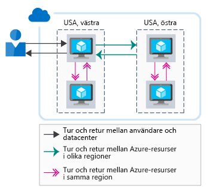
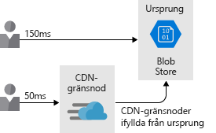

Nätverksprestanda kan ha en enorm påverkan på en användares upplevelse. I komplexa arkitekturer med många olika tjänster kan en minimering av fördröjningen vid varje hopp ha stor inverkan på den övergripande prestandan. I det här avsnittet ska vi tala om betydelsen av svarstider för nätverk och hur du kan minska dem i din arkitektur. Vi kommer även att visa hur Lamna Healthcare använder strategier för att minimera nätverkets svarstider mellan olika Azure-resurser samt mellan användare och Azure.

## Betydelsen av svarstider för nätverk

Svarstiden är ett mått på fördröjning. Svarstider för nätverk är den tid som behövs för att komma från en källa till ett mål i nätverksinfrastrukturen. Den här tidsperioden kallas för tur- och returfördröjning. Det är den tid det tar att hämta från källan till målet och tillbaka igen.

I en traditionell datacentermiljö kan svarstiderna vara minimala eftersom resurserna ofta finns på samma plats och har en gemensam infrastruktur. Den tid det tar att hämta från källan till målet är kortare när resurserna är fysiskt nära varandra.

En molnmiljö är däremot byggd för skalning. Molnbaserade resurser finns kanske inte i samma rack, datacenter eller ens region. Den här distribuerade metoden kan påverka tur- och returtiden för din nätverkskommunikation. Även om alla Azure-regioner är sammankopplade i ett fiberstamnätverk med hög hastighet, är ljusets hastighet fortfarande en fysisk begränsning. Anrop mellan tjänster på olika fysiska platser kommer fortfarande att påverkas av en nätverksfördröjning som är direkt korrelerad till avståndet mellan dem.

Utöver detta ger en högre chattnivå i ett program ett större antal nätverksförfrågningar. Varje tur- och returanrop ökar fördröjningen och ökar den övergripande svarstiden. Följande bild visar hur svarstiden uppfattas av användaren är en kombination av görs som krävs för att hantera begäran.

Nu ska vi ta en titt på hur vi kan förbättra prestanda mellan Azure-resurser och från slutanvändarna till Azure-resurserna.

## Fördröjning mellan flera Azure-resurser

Anta att Lamna Healthcare testkör ett nytt patientbokningssystem med hjälp av en webbserver och en databas i Azure-regionen för Europa, västra. Webbplatsen hämtar statiska medietillgångar (bilder, javascript, formatmallar) från Azure Blob Storage i samma region. Den här arkitekturen minimerar datatiden via kabeln eftersom resurserna befinner sig på samma plats i en Azure-region.

Anta att pilotsystemet föll väl ut och har utökats till användare i Australien. Dessa användare genererar tur- och returtid från Irland till Australien för att visa webbplatsen och slutanvändarens upplevelse är dålig på grund av nätverkets svarstider.

Lamna Healthcare-teamet beslutar sig för att vara värd för ytterligare en instans på klientsidan och ett lagringskonto i regionen Australien, östra för att minska svarstiden för användarna. Den här utformningen hjälper till att minska tiden för webbservern att returnera innehållet till slutanvändarna, men upplevelsen blir fortfarande sämre eftersom det blir längre svarstider i kommunikationen mellan klientwebbservern i Australien, östra och databasen i Europa, västra.

Det finns några olika sätt att minska den återstående svarstiden:

- Skapa en skrivskyddad replik av databasen i Australien, östra. Det skulle innebära att läsning fungerar bra, men att skriva skulle fortfarande medföra fördröjning. Geo-replikering i Azure SQL Database möjliggör skrivskyddade repliker.
- Synkronisera dina data mellan regioner med Azure SQL Data Sync.
- Använd en globalt distribuerad databas som exempelvis Azure Cosmos DB. Detta gör det möjligt att både läsa och skriva oavsett plats.

Avsikten är att minimera nätverksfördröjningen mellan olika lager i programmet. Hur detta kan lösas beror på ditt program och dataarkitekturen, men Azure tillhandahåller mekanismer för att lösa detta för flera tjänster.

## Fördröjning som gäller användare i Azure

Vi har tittat på fördröjningen mellan Azure-resurser, men vi bör också beakta fördröjningen mellan användarna och vårt molnprogram. Vi vill optimera leveransen av slutanvändargränssnittet för våra användare. Låt oss ta en titt på några sätt att förbättra nätverkets prestanda mellan slutanvändare och programmet.

### Använda en DNS-lastbalanserare för sökvägsoptimering för slutpunkt

I exemplet med Lamna Healthcare såg vi att teamet skapade ytterligare en webbnod på klientsidan i Australien, östra. Slutanvändarna måste dock uttryckligen ange vilken slutpunkt på klientsidan som de vill använda. Lamna Healthcare, som utformar lösningen, vill göra upplevelsen så smidig som möjligt för sina användare.

Azure Traffic Manager kan vara till hjälp. Traffic Manager är en DNS-baserad belastningsutjämnare som hjälper dig att distribuera trafik inom och mellan Azure-regioner. I stället för att låta användaren bläddrar du till en specifik instans av vårt frontwebb, kan Traffic Manager dirigera användare baserat på en uppsättning egenskaper:

- **Prioritet** – Du anger en sorterad lista över instanserna på klientsidan. Om den som har högst prioritet inte är tillgänglig dirigerar Traffic Manager användaren till nästa tillgängliga.
- **Viktad** – Du anger en viktning för varje instans på klientsidan. Traffic Manager distribuerar sedan trafiken enligt de definierade förhållandena.
- **Prestanda** – Traffic Manager dirigerar användare till den närmaste appinstansen och frontend baserat på Nätverksfördröjningen.
- **Geografisk** – Du kan konfigurera geografiska regioner för klientdistributioner, vilket dirigerar användarna baserat på regler för datasuveränitet eller lokalisering av innehåll.

Traffic Manager-profiler kan även kapslas. Du kan först dirigera användarna i olika geografiska områden (till exempel Europa och Australien) med hjälp av geografisk routning och sedan dirigera till lokala klientdistributioner med routningsmetoden för prestanda.

Vi ser att Lamna Healthcare har distribuerat en klientdelswebbplats i Europa, västra och Australien. Anta att de har distribuerat Azure SQL Database med den primära distributionen i Europa, västra och en skrivskyddad replik i Australien, östra. Låt oss också anta att programmet kan ansluta till den lokala SQL-instansen för skrivskyddade frågor.

Teamet distribuera en Traffic Manager-instans i läget för prestanda och lägger till två klientdelsinstanserna som Traffic Manager-profiler. Som en slutanvändare navigera till ett anpassat domännamn (till exempel lamnahealthcare.com) som dirigerar till Traffic Manager. Traffic Manager returnerar sedan DNS-namnet för västra Europa eller Australien, östra klientdelen baserat på bästa svarstid nätverksprestanda.

Det är viktigt att observera att belastningsutjämningen endast hanteras via DNS, det sker ingen inbyggd belastningsutjämning eller cachelagring. Traffic Manager returnerar helt enkelt DNS-namnet för den närmaste klientdelen till användaren.

### Använda CDN för att cachelagra innehåll nära användarna

Webbplatsen kommer sannolikt att använda någon form av statiskt innehåll (antingen hela sidor eller tillgångar som bilder och videor). Det här innehållet kan levereras till användarna snabbare genom att använda ett nätverk för innehållsleverans (CDN), till exempel Azure CDN. 

När Lamna distribuerar innehåll till Azure CDN kopieras dessa objekt till flera servrar i hela världen. Anta att ett av dessa objekt är en video som hanteras från Blob Storage: `HowToCompleteYourBillingForms.MP4`. Teamet kan sedan konfigurera webbplatsen så att varje användares länk till videon faktiskt hänvisar till den CDN-kantserver som är närmast – i stället för till Blob Storage. Den här metoden placerar innehållet närmare till målet, vilket minskar svarstiden och förbättrar användarupplevelsen. Följande bild visar hur använda Azure CDN ger dig innehåll närmare till målet som minskar svarstider och förbättrar användarupplevelsen.

Nätverk för innehållsleverans _kan_ också användas som värd för cachelagrat dynamiskt innehåll. Ytterligare överväganden krävs dock eftersom cachelagrat innehåll kan vara inaktuellt jämfört med källan. Upphörande av kontexten kan kontrolleras genom att ange ett TTL-värde (Time to Live). Om TTL-värdet är för högt kan inaktuellt innehåll visas och cachen måste då rensas.

Ett sätt att hantera cachelagrat innehåll är en funktion som kallas **acceleration av dynamisk webbplats**, som kan öka prestanda på webbsidor med dynamiskt innehåll. Acceleration av dynamisk webbplats kan även ge en sökväg med kort svarstid till ytterligare tjänster i din lösning (till exempel en API-slutpunkt).

### Använda ExpressRoute för anslutningar från en lokal plats till Azure

Det är också viktigt att optimera nätverksanslutningarna från din lokala miljö till Azure. För användare som ansluter till program, oavsett om de finns på virtuella datorer eller i PaaS-tjänster som Azure App Service, bör du se till att de har en optimal anslutning till dina program. 

Du kan alltid använda det offentliga Internet för att ansluta användare till dina tjänster, men Internetprestanda kan variera och kan påverkas av utanförliggande problem. Dessutom kanske du inte vill exponera alla dina tjänster via Internet och vill ha en privat anslutning till Azure-resurser.

VPN-anslutning från webbplats till webbplats via Internet är också ett alternativ, men för arkitekturer med stora dataflöden kan VPN-hanteringen och Internetvariationer märkbart öka svarstiden.

Azure ExpressRoute kan vara till hjälp. ExpressRoute är en privat, dedikerad anslutning mellan ditt nätverk och Azure, som ger garanterade prestanda och ser till att slutanvändarna har den bästa sökvägen till alla dina Azure-resurser. Följande bild visar hur ExpressRoute-krets tillhandahåller anslutningen mellan dina lokala program och Azure-resurser.

Vi tittar på Lamnas scenario en gång till. De beslutar sig för att ytterligare förbättra slutanvändarupplevelsen för användare som besöker deras verksamhet genom att etablera en ExpressRoute-krets i både Australien, östra och Europa, västra. Detta ger slutanvändarna en direktanslutning till bokningssystemen och garanterar lägsta möjliga svarstid för programmen.

## Sammanfattning

Det är viktigt att beakta hur svarstiderna påverkar arkitekturen för att garantera att slutanvändarna får bästa möjliga prestanda. Vi har tagit en titt på några alternativ som minskar svarstiderna mellan användarna och Azure och mellan Azure-resurser. Härnäst ska vi tala om hur du optimerar lagringsprestanda.