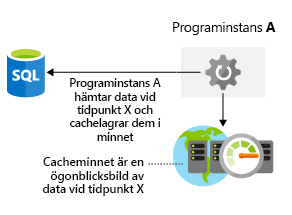

Det är viktigt att du överväger lagringsprestandan i din arkitektur.It's important to include storage performance considerations in your architecture. Dålig prestanda på lagringsnivå kan påverka slutanvändarna precis som långa svarstider i nätverket.Just like network latency, poor performance at the storage layer can impact your end-users' experience. Hur kan du optimera din datalagring?How would you optimize your data storage? Vad behöver du tänka på så att du inte inför flaskhalsar för lagringen i arkitekturen?What things do you need to consider to ensure that you're not introducing storage bottlenecks into your architecture? Nu ska vi gå igenom hur du kan optimera lagringsprestandan i din arkitektur.Here, we'll take a look at how to optimize your storage performance in your architecture.

## Optimera lagringsprestandan för virtuella datorerOptimize virtual machine storage performance

Först tittar vi på att optimera lagringen för virtuella datorer.Let's first look at optimizing storage for virtual machines. Disklagring spelar stor roll för prestandan i dina virtuella datorer, så det är viktigt att välja rätt typ av diskar för appen.Disk storage plays a critical role in the performance of your virtual machines, and selecting the right disk type for your application is an important decision.

Olika appar har olika krav på lagringen.Different applications are going to have different storage requirements. Appen kan vara känslig för svarstider vid läs- och skrivåtgärder, eller så kan den behöva hantera stora IOPS-volymer eller helt enkelt stora dataflöden.Your application may be sensitive to latency of disk reads and writes or it may require the ability to handle a large number of input/output operations per second (IOPS) or greater overall disk throughput.

Vilken typ av disk ska du använda när du skapar en IaaS-arbetsbelastning?When building an IaaS workload, which type of disk should you use? Det finns fyra alternativ:There are four options:

- **Lokal SSD-lagring** – varje virtuell dator har en tillfällig disk som backas upp av lokal SSD-lagring.**Local SSD storage** - Each VM has a temporary disk that is backed by local SSD storage. Storleken på disken varierar beroende på den virtuella datorns storlek.The size of this disk varies depending on the size of the virtual machine. Eftersom den här disken är en lokal SSD-disk har den bra prestanda, men data kan förloras vid underhåll eller om den virtuella datorn distribueras om.Since this disk is local SSD, the performance is high, but data may be lost during a maintenance event or a redeployment of the VM. Den här typen av disk passar endast för tillfällig lagring av data som du inte behöver permanent.This disk is only suitable for temporary storage of data that you do not need permanently. Den här disken är utmärkt för sidor eller växlingsfiler och för exempelvis tempdb i SQL Server.This disk is great for the page or swap file, and for things like tempdb in SQL Server. Den här lagringen är kostnadsfri.There is no charge for this storage. Den ingår i kostnaden för den virtuella datorn.It's included in the cost of the VM.

- **Standard Storage HDD** – Det här är axeldisklagring som kan passa bra när programmet inte är känsligt för varierande svarstider eller lägre dataflöden.**Standard storage HDD** - This is spindle disk storage and may fit well where your application is not bound by inconsistent latency or lower levels of throughput. Ett bra exempel är en arbetsbelastning för utveckling/testning där du inte behöver garanterade prestanda.A dev/test workload where guaranteed performance isn't needed is a great use case for this disk type.

- **Standard Storage SSD** – Det här är SSD-lagring med korta SSD-svarstider, men lägre nivåer för dataflöden.**Standard storage SSD** - This is SSD backed storage and has the low latency of SSD but lower levels of throughput. Den här disktypen kan passa bra för webbservrar utanför produktion.A non-production web server would be a good use case for this disk type.

- **Premium Storage SSD** – Den här SSD-lagringen passar bra till arbetsbelastningar som används i produktion där du behöver bästa möjliga tillförlitlighet, korta svarstider samt stora dataflöden och IOPS-volymer.**Premium storage SSD** - This SSD backed storage is well-suited for those workloads that are going into production, require the greatest reliability and demand consistent low latency, or need high levels of throughput and IOPS. Eftersom de här diskarnas prestanda och tillförlitlighet är bättre, rekommenderas de för alla arbetsbelastningar i produktionen.Since these disks have greater performance and reliability capabilities, they are recommended for all production workloads.

Premium Storage kan bara kopplas till virtuella datorer av viss storlek.Premium storage can attach only to specific virtual machine (VM) sizes. Premium Storage-kompatibla storlekar betecknas med ett ”s” i namnet, till exempel D2**s**_v3 eller Standard_F2**s**_v2.Premium storage capable sizes are designated with an "s" in the name, for example D2**s**_v3 or Standard_F2**s**_v2. Du kan koppla HDD- eller SSD-diskar av standardtyp till valfri virtuell dator (med eller utan ett ”s” i namnet).Any virtual machine type (with or without an "s" in the name) can attach standard storage HDD or SSD drives.

Du kan koppla diskar med en stripeteknik (som Storage Spaces Direct i Windows eller mdadm i Linux) om du behöver hantera större dataflöden och IOPS-volymer, genom att diskaktiviteten sprids ut över flera diskar.Disks can be striped using a striping technology (such as Storage Spaces Direct on Windows or mdadm on Linux) to increase the throughput and IOPS by spreading disk activity across multiple disks. När du stripekopplar diskarna kan du verkligen få ut mesta möjliga av diskarna, och det här är vanligt i avancerade databassystem och andra system med stora lagringskrav.Using disk striping allows you to really push the limits of performance for disks, and is often seen in high-performance database systems and other systems with intensive storage requirements.

När du använder arbetsbelastningar i virtuella datorer måste du utvärdera appens prestandakrav så att du vet hur mycket underliggande lagring du måste etablera för de virtuella datorerna.When relying on virtual machine workloads, you'll need to evaluate the performance requirements of your application to determine the underlying storage you'll provision for your virtual machines.

## Optimera lagringsprestanda för appenOptimize storage performance for your application

Även om du kan använda olika lagringstekniker för att förbättra diskens prestanda kan du även påverka prestandan för dataåtkomsten på programnivå.While you can use differing storage technologies to improve the raw disk performance, you can also address the performance of access to data at the application layer. Nu ska vi gå igenom hur du kan göra det.Let's take a look at a few ways you can do this.

### CachelagringCaching

Ett vanligt sätt att förbättra appars prestanda är att integrera ett cachelager mellan appen och ditt datalager.A common approach to improve application performance is to integrate a caching layer between your application and your data store. Vid cachelagring lagras data normalt i minnet så att de snabbt kan hämtas.A cache typically stores data in memory and allows for fast retrieval. Det här kan vara data som används ofta, data du anger från en databas eller tillfälliga data som exempelvis användartillstånd.This data can be frequently accessed data, data you specify from a database, or temporary data such as user state. Du har kontroll över vilken typ av data som lagras, hur ofta den uppdateras och när den upphör att gälla.You'll have control over the type of data stored, how often it refreshes, and when it expires. Genom att placera den här cachelagringen i samma region som programmet och databasen minskar du svarstiderna mellan dem.By co-locating this cache in the same region as your application and database, you'll reduce the overall latency between the two. Det är nästan alltid snabbare att hämta data från cachelagringen än att hämta samma data från en databas, så med ett cachelager kan du förbättra programmets prestanda avsevärt.Pulling data out of the cache will almost always be faster than retrieving the same data from a database, so by using a caching layer you can substantially improve the overall performance of your application. Följande bild visar hur ett program hämtar data från en databas, lagrar den i ett cacheminne och använder det cachelagrade värdet vid behov.The following illustration shows how an application retrieves data from a database, stores it in a cache, and uses the cached value as needed.

Azure Redis Cache är en cachelagringstjänst i Azure som lagrar data i minnet.Azure Redis Cache is a caching service on Azure that stores data in memory. Den baseras på Redis-cache med öppen källkod och är ett fullständigt hanterat tjänsterbjudande från Microsoft.It's based upon the open-source Redis cache and is a fully managed service offering by Microsoft. Du väljer vilken prestandanivå du behöver och konfigurerar appen för användning av tjänsten.You select the performance tier that you require and configure your application to use the service.

### Flerspråkig persistensPolyglot persistence

Flerspråkig persistens är användningen av olika datalagringstekniker vid hanteringen av olika lagringskrav.Polyglot persistence is the usage of different data storage technologies to handle your storage requirements.

Tänk dig t.ex. en onlinebutik.Consider an e-commerce example. Du kan lagra programresurser i Blob Store, produktrecensioner och rekommendationer i ett NoSQL-lager, samt användarprofiler eller kontouppgifter i en SQL-databas.You may store application assets in a blob store, product reviews and recommendations in a NoSQL store, and user profile or account data in a SQL database. Följande bild visar hur ett program kan använda flera tekniker för datalagring till att lagra olika typer av data.The following illustration shows how an application might use multiple data storage techniques to store different types of data.

Det här är viktigt eftersom olika datalager är utformade för olika användningsfall, och kan vara mer tillgängliga på grund av kostnaderna.This is important, as different data stores are designed for certain use cases or may be more accessible because of cost. Att lagra blobbar i en SQL-databas kan vara både dyrare och leda till längre svarstider än att använda dem direkt från Blob Store.As an example, storing blobs in a SQL database may be costly and slower to access than directly from a blob store.

Att bibehålla datakonsekvens över distribuerade datalager kan vara en stor utmaning.Maintaining data consistency across distributed data stores can be a significant challenge. Problemet är att strategier som serialisering och låsningar bara fungerar bra om alla programinstanser delar samma datalager och programmet har skapats för att säkerställa att låsen är mycket tillfälliga.The issue is that strategies such as serialization and locking only work well if all application instances share the same data store, and the application is designed to ensure that the locks are very short-lived. Men om data är partitionerad eller replikeras över olika datalager, kan låsning och serialisering av dataåtkomst för att upprätthålla konsekvens bli en dyr belastning som påverkar dataflöde, svarstid och skalbarhet för ett system.However, if data is partitioned or replicated across different data stores, locking and serializing data access to maintain consistency can become an expensive overhead that impacts the throughput, response time, and scalability of a system. Därför låser de flesta moderna distribuerade program inte de data som de ändrar och de har en mer avslappnad approach till konsekvens som kallas slutlig konsekvens.Therefore, most modern distributed applications do not lock the data that they modify, and they take a rather more relaxed approach to consistency, known as eventual consistency.

Eventuell konsekvens innebär att replikdatalagren så småningom konvergeras om inga ytterligare skrivningar görs.Eventual consistency means that replica data stores will eventually converge if there are no further writes. Om en skrivning görs till ett av datalagren kan läsningar från ett annat lager visa inaktuella data.If a write is made to one of the data stores, reads from another may provide slightly out-of-date data. Du kan använda eventuell konsekvens i större skala eftersom läsningar och skrivningar har korta svarstider, på grund av att informationens konsekvens inte behöver kontrolleras i alla datalager.Eventual consistency enables higher scale because there is a low latency for reads and writes, rather than waiting to check if information is consistent across all stores.

## Lamna Healthcare-exempelLamna Healthcare example

Bokningssystemet för Lamna Healthcares patienter körs i två Azure-regioner, Europa, västra och Australien, östra.Lamna Healthcare's patient booking system is hosted across two Azure regions, West Europe and Australia East. De använder virtuella datorer som klientnoder när webbplatsen distribueras och de har en Azure SQL-databas distribuerad i regionen Europa, västra som primär lagring samt regionen Australien, östra som ett sekundärt läsbart lager.They're using virtual machines as the front-end nodes to deploy their website, and have Azure SQL DB deployed in West Europe as primary and Australia East as a readable secondary. Klientnoderna behöver inte hantera några stora dataflöden, men de behöver korta svarstider och hög tillförlitlighet, så därför används Premium SSD-lagring.Their front-end nodes don't require high levels of disk throughput, but do require consistent latency performance and production reliability and have used Premium SSD backed storage.

De kör Azure Redis Cache lokalt i respektive Azure-region för att lagra vanliga användarförfrågningar och läkarnas tillgänglighet.They are hosting an Azure Redis Cache locally in each Azure region to store the common user requests and availability of doctors. Cachelagringen är implementerad för att optimera prestandan för de vanligaste dataläsningsåtgärderna i programmet.Caching has been implemented to optimize the performance of the most common data read activities observed on the application.

Vi har gått igenom några exempel på hur du kan förbättra lagringsprestandan på infrastrukturnivån genom att välja rätt diskarkitektur, samt på programnivå med hjälp av cachelagring och att välja rätt dataplattform för dina data.We've covered a few examples of how you can improve storage performance in your infrastructure layer by choosing the right disk architecture and at the application level through the use of caching and selecting the right data platform for your data. När du har rätt arkitektur i din lösning får du bästa möjliga prestanda för dina data.A properly architected solution will ensure that access to data performs as well as possible.