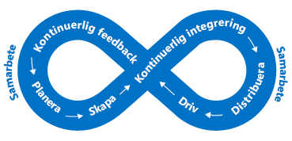

Slutanvändarna förväntar sig mer av sina appar. De vill ha en bättre användarupplevelse och inte påverkas av prestandaproblem. Hur kan du integrera kontroller av flaskhalsar i din arkitektur? I den här enheten går vi igenom både processer och verktyg som kan vara till hjälp när du ska se till att ditt program körs smidigt, och som kan identifiera varför det inte gör det.

## Vikten av att definiera krav

Innan vi pratar om prestanda är det viktigt att ta upp vilka krav som gäller. I teorin kan vi fortsätta att förbättra skalbarhet och prestanda i all evinnerlighet. Förr eller senare blir det dock orimligt dyrt och svårt utan tillräcklig inverkan på verksamheten för att vara värt det. 

Våra **icke-funktionella krav** hjälper oss att hitta när det inträffar. Dessa särskilda krav säger ingenting om vad vår app måste *göra*. De berättar snarare vilka kvalitetsnivåer som måste uppfyllas. Som exempel kan definiera vi dessa icke-funktionella krav som säger följande:

- hur snabbt en transaktion måste returnera ett svar vid en given belastning
- hur många samtidiga anslutningar vi måste kunna hantera innan det börjar genereras fel
- hur länge appen får vara inaktiv innan en säkerhetskopia aktiveras vid ett serverfel.

Det är viktigt att definiera de här kraven innan du skapar din lösning så att appen uppfyller förväntningarna, men inte förbrukar mer arbete eller pengar än nödvändigt. Vi kan också planera regler för övervakning och åtgärder kring dessa icke-funktionella krav. 

Diskutera kraven med dina intressenter eller kunder, dokumentera dem och förmedla dem öppet så att alla är överens om vad bra prestanda innebär.

## DevOps och appars prestanda

Tanken bakom DevOps är att vi inte har silos för utveckling och infrastruktur i vår organisation. De här områdena är snarare integrerade så att du effektivt kan skapa, distribuera, övervaka och hantera dina appar smidigt.

Planering, utveckling, testning och övervakning görs iterativt. En apps prestanda och kvalitet ingår i utvecklingens livscykel snarare än att vara något vi tänker på först när appen distribueras i produktionsmiljö. I följande bild visas olika tillfällen till samarbete i programutvecklingens livscykel.

Det här sättet att tänka liknar ett DevOps-begrepp som kallas för ”shifting left”. Utför med andra ord kvalitetskontrollen tidigare under utvecklingscykeln. Då kan du identifiera problem som påverkar slutanvändarna tidigare. Eftersom vi arbetar i en kontinuerlig cykel begränsar vi mängden manuell interaktion och kan automatisera så mycket som möjligt. 

Ett sätt att göra prestandan till en del av vår DevOps-process är att utföra prestanda- och belastningstester som verifierar att appen uppfyller de icke-funktionella kraven innan den distribueras till produktion.

Det bästa vore att utföra prestanda- och belastningstester i en miljö som är identisk med produktionsmiljön men utan att de faktiska produktionsservrarna påverkas. När du använder dig av molnet kan du göra precis det. Du kan skapa en produktionslik miljö automatiskt, utföra dina tester och sedan ta bort miljön för att spara pengar. Den här automatiseringen kan förvissa dig om att appen kan hantera både den skala du behöver nu och framtida tillväxt.

Övervakningen av appens prestanda är en viktig del i det här. När vi kör prestanda- och belastningstester för appen eller vill hålla koll på prestanda i produktionsmiljön är det viktigt att förstå vilka delar av appen som kanske inte fungerar optimalt. Nu ska vi titta på några sätt att göra det här.

## Alternativ för prestandaövervakning i Azure

Övervakning handlar om att samla in och analysera data för att avgöra prestanda, hälsotillstånd och tillgänglighet för affärsappar och tillhörande resurser.

Vi vill hela tiden veta om våra appar körs utan problem. Proaktiva aviseringar kan användas till att informera om kritiska problem som uppstår. Det finns många övervakningsnivåer att tänka på, men de viktigaste är infrastrukturnivån och programnivån.

### Azure Monitor

I Azure Monitor har du en enda hanteringsplats för loggar på infrastrukturnivå och övervakning av de flesta av dina Azure-tjänster. Här samlas mått, aktivitetsloggar, diagnostikloggar och mycket annat. I Azure Monitor finns bland annat följande funktioner:

- Azure-aviseringar som proaktivt informerar eller kan vidta åtgärder vid onormala mått eller aktiviteter.
- Med Azure-instrumentpaneler kan du kombinera flera övervakningskällor till en enda vy över appen.

Azure Monitor är rätt ställe att börja på när det gäller insikter kring realtidsmått för resurser. Många Azure-resurser börjar generera mått automatiskt när de distribueras. Azure Web App-instanser skickar exempelvis mått kring förfrågningar om beräkningar och appar. Förutom diagnostiska mått för VM-värden samlas även mått från Application Insights här. Diagnostiska mått för VM-gäster visas också om du aktiverar det.

### Log Analytics

Med centraliserad loggning kan du upptäcka dolda problem som kan vara svåra att spåra. Med Log Analytics kan du köra frågor mot och aggregera data från flera loggar. Den här korrelationen mellan flera källor gör det enklare att identifiera problem och flaskhalsar som kanske inte framträder tydligt när du tittar på enskilda loggar eller mått. Bild som visar hur Log Analytics fungerar som ett centralt nav för övervakning av data. Log Analytics tar emot övervakningsdata från dina Azure-resurser och gör dem tillgängliga för konsumenter för analyser och visualisering.

Du kan samla en mängd olika datakällor, säkerhetsloggar, Azure-aktivitetsloggar, serverloggar, nätverksloggar och programloggar. Du kan också skicka lokala System Center Operations Manager-data till Log Analytics om du har en hybriddistribution, och låta Azure SQL Database skicka diagnostisk information direkt till Log Analytics för detaljerad prestandaövervakning.

Centraliserad loggning kan vara mycket användbart när du ska felsöka alla typer av scenarier, även vid prestandaproblem. Det är en viktig del av din övervakningsstrategi oavsett arkitektur.

## Hantering av programprestanda

Djupgående programproblem är ofta svåra att spåra. Det är därför det kan vara bra att integrera telemetri i programmet med hjälp av en hanteringslösning för programprestanda (APM) som spårar programprestanda och beteenden på låg nivå. Den här telemetrin kan innehålla svarstider för enskilda sidor, undantag i programmet och även anpassade mått för spårning av affärslogik. Den här telemetrin kan ge mängder av information om vad som händer i ditt program.

Application Insights en tjänst i Azure som tillhandahåller den här typen av djupgående prestandahantering för dina program. Du installerar ett litet instrumentationspaket i ditt program och konfigurerar en Application Insights-resurs i Microsoft Azure-portalen. Instrumentationen övervakar din app och skickar telemetridata till portalen.

Du kan infoga telemetri från värdmiljöerna som prestandaräknare, Azure-diagnostik och Docker-loggar. Du kan också konfigurera webbtester som regelbundet skickar syntetiska förfrågningar till din webbtjänst. Du kan även konfigurera programmet så att det skickar anpassade händelser och mått som du skriver själv i klient- eller serverkoden. Det kan till exempel vara programspecifika händelser som sålda artiklar eller vunna spel.

Application Insights lagrar data i en vanlig databas och måtten delas med Azure Monitor. Du kan använda dig av delade funktioner som aviseringar, instrumentpaneler och djupanalys med Log Analytics-frågespråket.

Ett vanligt mönster som används till att avgöra tillgängligheten för en webbapp är mönstret Health Endpoint Monitoring (slutpunktsövervakning av tillstånd). Det här mönstret används till att övervaka webbappar och tillhörande tjänster på serversidan för att säkerställa att de är tillgängliga och fungerar korrekt. Mönstret implementeras genom att du kör en fråga mot en viss URI. Slutpunkten kontrollerar statusen för ett flertal komponenter. Inte bara att klientdelen är tillgänglig utan även tjänster på serversidan som appen är beroende av. Det här fungerar som en tillståndskontroll på tjänstnivå och ger en indikation om hela tjänstens övergripande tillstånd.

Använd en APM-lösning som Application Insights när du vill få djupare insikter i ditt program och korrelera aktiviteterna i programmet. Då kan du få bättre förståelse för hur en viss åtgärd fungerar i klientwebbläsaren, på servern och i underordnade tjänster. Du kan också få insikter om trender och få meddelanden om problem, samt identifiera var problemet uppstår och hur du åtgärdar det innan användarna märker någonting.

## Prestandaövervakning på Lamna Healthcare

Lamna Healthcare har implementerat ett webbaserat system för patientbokningar med virtuella datorer och en Azure SQL-databas i två Azure-regioner. De bestämde sig för att övervaka prestanda för klientdelens underliggande virtuella datorer med VM Agent och Log Analytics.

De använder Azure Monitor till att bättre förstå prestandan i Azure SQL-databaserna och fånga upp prestandarelaterade nyckeltal som processoranvändning och låsningar.

Application Insights har konfigurerats för att samla in information om tillgänglighet och telemetri. Teamet har ändrat funktionen för nya bokningar så att anpassad telemetri om händelser skickas till Application Insights. Teamet har nu ett sätt att förstå vilka volymer av affärsrelaterade händelser som inträffar och kan få bättre insikt i vad som händer i programmet.

## Sammanfattning

Vi har tittat på några processer, verktyg och metodtips för att spåra prestandaproblem och se till att ditt program fungerar så bra som möjligt. Låt oss sammanfatta vad vi har lärt oss i den här modulen.
