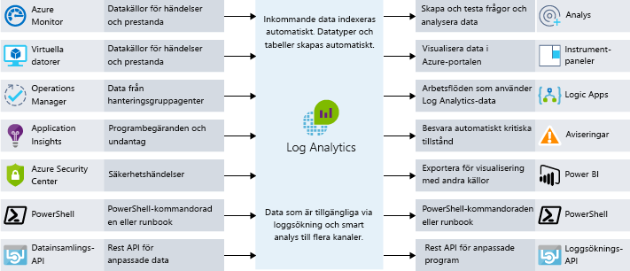

Slutanvändarna förväntar sig mer av sina appar.End users are expecting more from their applications. De vill ha en bättre användarupplevelse och inte påverkas av prestandaproblem.They want to have a great user experience and not be impacted by performance issues. Hur kan du integrera kontroller av flaskhalsar i din arkitektur?How do you integrate performance bottleneck identification into your architecture? I den här enheten går vi igenom både processer och verktyg som kan vara till hjälp när du ska se till att ditt program körs smidigt, och som kan identifiera varför det inte gör det.In this unit, we will look at both processes and tools that can help ensure that your application performs well, and help you track down why if it doesn't.

## Vikten av att definiera kravImportance of requirements

Innan vi pratar om prestanda är det viktigt att ta upp vilka krav som gäller.Before we talk about performance, it's important to talk about requirements. I teorin kan vi fortsätta att förbättra skalbarhet och prestanda i all evinnerlighet.In theory, we could keep improving scalability and performance further and further without end. Förr eller senare blir det dock orimligt dyrt och svårt utan tillräcklig inverkan på verksamheten för att vara värt det.At some point, however, more improvement is prohibitively expensive, difficult, and doesn't have enough business impact to be worthwhile. 

Våra **icke-funktionella krav** hjälper oss att hitta när det inträffar.Our **non-functional requirements** help us find that point. Dessa särskilda krav säger ingenting om vad vår app måste *göra*.These particular requirements don't tell us what our app must *do*. De berättar snarare vilka kvalitetsnivåer som måste uppfyllas.Instead, they tell us what quality levels it must meet. Som exempel kan definiera vi dessa icke-funktionella krav som säger följande:As examples, we can define these non-functional requirements to tell us:

- hur snabbt en transaktion måste returnera ett svar vid en given belastningHow fast a transaction must return under a given load.
- hur många samtidiga anslutningar vi måste kunna hantera innan det börjar genereras felHow many simultaneous connections we need to support before we start returning errors.
- hur länge appen får vara inaktiv innan en säkerhetskopia aktiveras vid ett serverfel.In the event of server failure, what is the maximum amount of time our application is allowed be down before a back-up is online.

Det är viktigt att definiera de här kraven innan du skapar din lösning så att appen uppfyller förväntningarna, men inte förbrukar mer arbete eller pengar än nödvändigt.Defining these requirements in advance of building your solution is critical to ensure that the application meets expectations but doesn't require more effort or expend more money than necessary. Vi kan också planera regler för övervakning och åtgärder kring dessa icke-funktionella krav.We can also plan our monitoring and operations rules around these non-functional requirements. 

Diskutera kraven med dina intressenter eller kunder, dokumentera dem och förmedla dem öppet så att alla är överens om vad bra prestanda innebär.Discuss requirements with your stakeholders or customers, document them, and communicate them broadly to ensure that everyone agrees on what "good performance" means.

## DevOps och appars prestandaDevOps and application performance

Tanken bakom DevOps är att vi inte har silos för utveckling och infrastruktur i vår organisation.The idea behind DevOps is that we don't have development and infrastructure silos in our organization. De här områdena är snarare integrerade så att du effektivt kan skapa, distribuera, övervaka och hantera dina appar smidigt.Instead, they work together to effectively build, deploy, monitor, and maintain apps in streamlined process.

Planering, utveckling, testning och övervakning görs iterativt.The planning, development, testing, and monitoring is carried out in an iterative approach. En apps prestanda och kvalitet ingår snarare i utvecklingens livscykel snarare än att vara något vi tänker på först när appen distribueras i produktionsmiljö.Performance and quality of our application become a part of our software development life cycle, rather than an afterthought as we deploy into a live environment. I följande bild visas olika tillfällen till samarbete i programutvecklingens livscykel.The following illustration shows where opportunities for collaboration exist in the software development lifecycle.

Det här sättet att tänka liknar ett DevOps-begrepp som kallas för ”shifting left”.This approach aligns with a DevOps concept called "shifting left". Utför med andra ord kvalitetskontrollen tidigare under utvecklingscykeln.In other words, bring your quality control checks earlier into your deployment and release process. Då kan du identifiera problem som påverkar slutanvändarna tidigare.This allows you to catch end-user impacting issues earlier in the process. Eftersom vi arbetar i en kontinuerlig cykel begränsar vi mängden manuell interaktion och kan automatisera så mycket som möjligt.As we operate in a continuous cycle, we limit the amount of manual interaction and automate as much as possible. 

Ett sätt att göra prestandan till en del av vår DevOps-process är att utföra prestanda- och belastningstester som verifierar att appen uppfyller de icke-funktionella kraven innan den distribueras till produktion.One way we make performance part of our DevOps process is to carry out performance or load tests to validate that the application meets the non-functional requirements prior to a deployment into production.

Det bästa vore att utföra prestanda- och belastningstester i en miljö som är identisk med produktionsmiljön men utan att de faktiska produktionsservrarna påverkas.Ideally, we could carry out performance and load tests in an environment that is exactly like production while not impacting our actual production servers. När du använder dig av molnet kan du göra precis det.When leveraging the cloud, you fully have this ability. Du kan skapa en produktionslik miljö automatiskt, utföra dina tester och sedan ta bort miljön för att spara pengar.You can automate the creation of a production-like environment, perform testing, and then destroy the environment to minimize cost. Den här automatiseringen kan förvissa dig om att appen kan hantera både den skala du behöver nu och framtida tillväxt.This approach to automation can provide reassurance that your application can handle the scale you require now, as well as respond to future growth.

Övervakningen av appens prestanda är en viktig del i det här.Application performance monitoring becomes a core part of this. När vi kör prestanda- och belastningstester för appen eller vill hålla koll på prestanda i produktionsmiljön är det viktigt att förstå vilka delar av appen som kanske inte fungerar optimalt.If we're running performance and load tests on our application or want to keep our production performance in check, we want to understand what parts of our application may be performing non-optimally. Nu ska vi titta på några sätt att göra det här.Let's take a look at some ways to do this.

## Alternativ för prestandaövervakning i AzurePerformance monitoring options in Azure

Övervakning handlar om att samla in och analysera data för att avgöra prestanda, hälsotillstånd och tillgänglighet för affärsappar och tillhörande resurser.Monitoring is the act of collecting and analyzing data to determine the performance, health, and availability of your business application and associated resources.

Vi vill hela tiden veta om våra appar körs utan problem.We want to be kept informed that our application is running smoothly. Proaktiva aviseringar kan användas till att informera om kritiska problem som uppstår.Proactive notifications can be used to inform about critical issues that arise. Det finns många övervakningsnivåer att tänka på, men de viktigaste är infrastrukturnivån och programnivån.There are many layers of monitoring to consider, mainly the infrastructure layer and the application layer.

### Azure MonitorAzure Monitor

I Azure Monitor har du en enda hanteringsplats för loggar på infrastrukturnivå och övervakning av de flesta av dina Azure-tjänster.Azure Monitor provides a single management point for infrastructure-level logs and monitoring for most of your Azure services. Här samlas mått, aktivitetsloggar, diagnostikloggar och mycket annat.It collects metrics, activity logs, and diagnostic logs and more. I Azure Monitor finns bland annat följande funktioner:Azure Monitor provides us with a range of features including:

- Azure-aviseringar som proaktivt informerar eller kan vidta åtgärder vid onormala mått eller aktiviteter.Azure alerts to proactively notify or take action on any breaches to metrics or activities arising.
- Med Azure-instrumentpaneler kan du kombinera flera övervakningskällor till en enda vy över appen.Use Azure Dashboards to combine many monitoring sources into one view of our application.

Azure Monitor är rätt ställe att börja på när det gäller insikter kring realtidsmått för resurser.Azure Monitor is the place to start for all your near real-time resource metric insights. Många Azure-resurser börjar generera mått automatiskt när de distribueras.Many Azure resources will start outputting metrics automatically once deployed. Azure Web App-instanser skickar exempelvis mått kring förfrågningar om beräkningar och appar.For example, Azure Web App instances will output compute and application request metrics. Förutom diagnostiska mått för VM-värden samlas även mått från Application Insights här.Metrics from Application Insights are also collated here in addition to VM host diagnostic metrics. Diagnostiska mått för VM-gäster visas också om du aktiverar det.VM guest diagnostic metrics will also appear once you opt in.

### Log AnalyticsLog Analytics

Med centraliserad loggning kan du upptäcka dolda problem som kan vara svåra att spåra.Centralized logging can help you uncover hidden issues that may be difficult to track down. Med Log Analytics kan du köra frågor mot och aggregera data från flera loggar.With Log Analytics you can query and aggregate data across logs. Den här korrelationen mellan flera källor gör det enklare att identifiera problem och flaskhalsar som kanske inte framträder tydligt när du tittar på enskilda loggar eller mått.This cross-source correlation can help you identify issues or performance problems that may not be evident when looking at logs or metrics individually. Bild som visar hur Log Analytics fungerar som ett centralt nav för övervakning av data.The following illustration shows how Log Analytics acts as a central hub for monitoring data. Log Analytics tar emot övervakningsdata från dina Azure-resurser och gör dem tillgängliga för konsumenter för analyser och visualisering.Log Analytics receives monitoring data from your Azure resources and makes it available to consumers for analysis or visualization.

Du kan samla en mängd olika datakällor, säkerhetsloggar, Azure-aktivitetsloggar, serverloggar, nätverksloggar och programloggar.You can collate a wide range of data sources, security logs, Azure activity logs, server, network, and application logs. Du kan också skicka lokala System Center Operations Manager-data till Log Analytics om du har en hybriddistribution, och låta Azure SQL Database skicka diagnostisk information direkt till Log Analytics för detaljerad prestandaövervakning.You can also push on-premises System Center Operations Manager data to Log Analytics in hybrid deployment scenarios and have Azure SQL Database send diagnostic information directly into Log Analytics for detailed performance monitoring.

Centraliserad loggning kan vara mycket användbart när du ska felsöka alla typer av scenarier, även vid prestandaproblem.Centralized logging can be massively beneficial for troubleshooting all types of scenarios, including performance issues. Det är en viktig del av din övervakningsstrategi oavsett arkitektur.It's a key part of a good monitoring strategy for any architecture.

## Hantering av programprestandaApplication performance management

Djupgående programproblem är ofta svåra att spåra.Deep application issues are often tricky to track down. Det är därför det kan vara bra att integrera telemetri i programmet med hjälp av en hanteringslösning för programprestanda (APM) som spårar programprestanda och beteenden på låg nivå.This is where integrating telemetry into an application by using an application performance management solution (APM) to track down low-level application performance and behavior can be beneficial. Den här telemetrin kan innehålla svarstider för enskilda sidor, undantag i programmet och även anpassade mått för spårning av affärslogik.This telemetry can include individual page request times, exceptions within your application, and even custom metrics to track business logic. Den här telemetrin kan ge mängder av information om vad som händer i ditt program.This telemetry can provide a wealth of insight into what is going on within your application.

Application Insights en tjänst i Azure som tillhandahåller den här typen av djupgående prestandahantering för dina program.On Azure, Application Insights is a service that provides this deep application performance management. Du installerar ett litet instrumentationspaket i ditt program och konfigurerar en Application Insights-resurs i Microsoft Azure-portalen.You install a small instrumentation package in your application, and set up an Application Insights resource in the Microsoft Azure portal. Instrumentationen övervakar din app och skickar telemetridata till portalen.The instrumentation monitors your app and sends telemetry data to the portal.

Du kan infoga telemetri från värdmiljöerna som prestandaräknare, Azure-diagnostik och Docker-loggar.Telemetry from the host environments, such as performance counters, Azure diagnostics, and Docker logs, can be ingested. Du kan också konfigurera webbtester som regelbundet skickar syntetiska förfrågningar till din webbtjänst.You can also set up web tests that periodically send synthetic requests to your web service. Du kan även konfigurera programmet så att det skickar anpassade händelser och mått som du skriver själv i klient- eller serverkoden.You could even configure your application to send custom events and metrics that you write yourself in the client or server code. Det kan till exempel vara programspecifika händelser som sålda artiklar eller vunna spel.For example, application-specific events such as items sold or games won.

Application Insights lagrar data i en vanlig databas och måtten delas med Azure Monitor.Application Insights stores its data in a common repository, and metrics are shared with Azure Monitor. Du kan använda dig av delade funktioner som aviseringar, instrumentpaneler och djupanalys med Log Analytics-frågespråket.It can take advantage of shared functionality such as alerts, dashboards, and deep analysis with the Log Analytics query language.

Ett vanligt mönster som används till att avgöra tillgängligheten för en webbapp är mönstret Health Endpoint Monitoring (slutpunktsövervakning av tillstånd).A common pattern used in determining the availability of a web application is the health endpoint monitoring pattern. Det här mönstret används till att övervaka webbappar och tillhörande tjänster på serversidan för att säkerställa att de är tillgängliga och fungerar korrekt.This pattern is used to monitor web applications and associated back-end services, to ensure that they're available and performing correctly. Mönstret implementeras genom att du kör en fråga mot en viss URI.The pattern is implemented by querying a particular uri. Slutpunkten kontrollerar statusen för ett flertal komponenter. Inte bara att klientdelen är tillgänglig utan även tjänster på serversidan som appen är beroende av.The endpoint checks on the status of many components, including the back-end services that the app depends on, rather than just the availability of the front end itself. Det här fungerar som en tillståndskontroll på tjänstnivå och ger en indikation om hela tjänstens övergripande tillstånd.This acts as a service-level health check that returns an indication of the overall health of the service.

Använd en APM-lösning som Application Insights när du vill få djupare insikter i ditt program och korrelera aktiviteterna i programmet.Use an APM solution such as Application Insights to gain a deep understanding of your application and correlate activity across your application. Då kan du få bättre förståelse för hur en viss åtgärd fungerar i klientwebbläsaren, på servern och i underordnade tjänster.This can help you understand how a specific action works in the client browser, on the server, and through to downstream services. Du kan också få insikter om trender och få meddelanden om problem, samt identifiera var problemet uppstår och hur du åtgärdar det innan användarna märker någonting.It will also provide insight into trends, provide notifications when there is a problem, and help identify where the problem is and how to fix it, before your users are aware.

## Prestandaövervakning på Lamna HealthcarePerformance monitoring at Lamna Healthcare

Lamna Healthcare har implementerat ett webbaserat system för patientbokningar med virtuella datorer och en Azure SQL-databas i två Azure-regioner.Lamna Healthcare has implemented a web-based patient booking system using virtual machines and an Azure SQL database across two Azure regions. De bestämde sig för att övervaka prestanda för klientdelens underliggande virtuella datorer med VM Agent och Log Analytics.They've decided to use the VM Agent and Log Analytics to monitor the performance of the underlying front-end virtual machines.

De använder Azure Monitor till att bättre förstå prestandan i Azure SQL-databaserna och fånga upp prestandarelaterade nyckeltal som processoranvändning och låsningar.They use Azure Monitor to understand the performance of their Azure SQL databases and capture key performance metrics including CPU % and deadlocks.

Application Insights har konfigurerats för att samla in information om tillgänglighet och telemetri.Application Insights has been configured to capture availability and telemetry information. Teamet har ändrat funktionen för nya bokningar så att anpassad telemetri om händelser skickas till Application Insights.The team has changed their new booking functionality to send custom event telemetry to Application Insights. Teamet har nu ett sätt att förstå vilka volymer av affärsrelaterade händelser som inträffar och kan få bättre insikt i vad som händer i programmet.The team now has an approach to understanding the volume of business-related events taking place, and they can get much better insight into what's going on within their application.

Vi har tittat på några processer, verktyg och metodtips för att spåra prestandaproblem och se till att ditt program fungerar så bra som möjligt.We've looked at some processes, tools, and best practices to help you track down performance issues and ensure that your application is performing at its best.