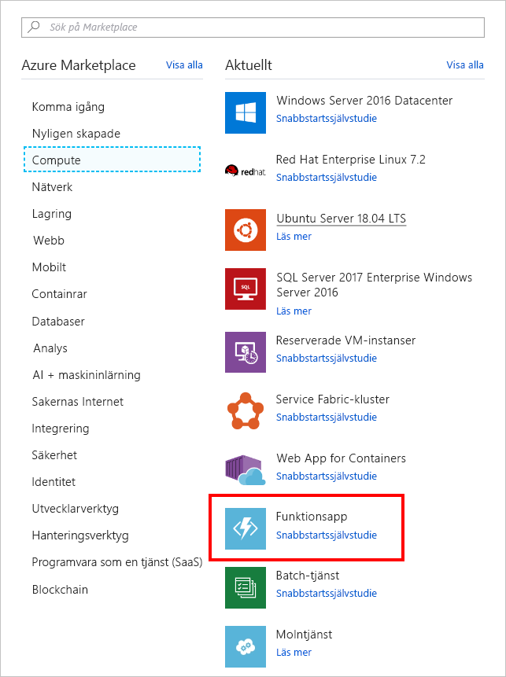

<span data-ttu-id="e6874-101">I den här övningen ska vi skapa en Azure-funktion som anropas var 20:e sekund med hjälp av en timerutlösare.</span><span class="sxs-lookup"><span data-stu-id="e6874-101">In this unit, we create an Azure function that's invoked every 20 seconds using a timer trigger.</span></span>

## <a name="create-an-azure-function"></a><span data-ttu-id="e6874-102">Skapa en Azure-funktion</span><span class="sxs-lookup"><span data-stu-id="e6874-102">Create an Azure function</span></span>

<span data-ttu-id="e6874-103">Vi ska börja med att skapa en Azure-funktion på portalen.</span><span class="sxs-lookup"><span data-stu-id="e6874-103">Let’s start by creating an Azure Function in the portal.</span></span>

1. <span data-ttu-id="e6874-104">Logga in på [Azure-portalen](https://portal.azure.com?azure-portal=true).</span><span class="sxs-lookup"><span data-stu-id="e6874-104">Sign into the [Azure portal](https://portal.azure.com?azure-portal=true).</span></span>

1. <span data-ttu-id="e6874-105">Välj **Skapa en resurs** i det vänstra navigeringsfönstret.</span><span class="sxs-lookup"><span data-stu-id="e6874-105">In the left navigation, select **Create a resource**.</span></span>

1. <span data-ttu-id="e6874-106">Välj **Beräkna**.</span><span class="sxs-lookup"><span data-stu-id="e6874-106">Select **Compute**.</span></span>

1. <span data-ttu-id="e6874-107">Leta upp och välj **Funktionsapp**.</span><span class="sxs-lookup"><span data-stu-id="e6874-107">Locate and select **Function App**.</span></span> <span data-ttu-id="e6874-108">Du kan även använda sökfältet för att hitta mallen.</span><span class="sxs-lookup"><span data-stu-id="e6874-108">You can also optionally use the search bar to locate the template.</span></span>

    

1. <span data-ttu-id="e6874-110">Ange ett unikt **appnamn**.</span><span class="sxs-lookup"><span data-stu-id="e6874-110">Enter a unique **App name**.</span></span>

1. <span data-ttu-id="e6874-111">Välj en **prenumeration**.</span><span class="sxs-lookup"><span data-stu-id="e6874-111">Select a **Subscription**.</span></span>

1. <span data-ttu-id="e6874-112">Skapa en ny **resursgrupp**.</span><span class="sxs-lookup"><span data-stu-id="e6874-112">Create a new **Resource Group**.</span></span>

1. <span data-ttu-id="e6874-113">Välj **Windows** som **operativsystem**.</span><span class="sxs-lookup"><span data-stu-id="e6874-113">Choose **Windows** as your **OS**.</span></span>

1. <span data-ttu-id="e6874-114">Välj **Förbrukningsplan** som **värdplan**.</span><span class="sxs-lookup"><span data-stu-id="e6874-114">Choose **Consumption Plan** for your **Hosting Plan**.</span></span> <span data-ttu-id="e6874-115">Du debiteras för varje körning av funktionen.</span><span class="sxs-lookup"><span data-stu-id="e6874-115">You're charged for each execution of your function.</span></span> <span data-ttu-id="e6874-116">Resurser tilldelas automatiskt baserat på programmets arbetsbelastning.</span><span class="sxs-lookup"><span data-stu-id="e6874-116">Resources are automatically allocated based on your application workload.</span></span>

1. <span data-ttu-id="e6874-117">Välj en **plats**.</span><span class="sxs-lookup"><span data-stu-id="e6874-117">Select a **Location**.</span></span>

1. <span data-ttu-id="e6874-118">Skapa ett nytt **lagringskonto**. Du kan ändra namnet om du vill – standardnamnet är en variant av appnamnet</span><span class="sxs-lookup"><span data-stu-id="e6874-118">Create a new **Storage** account, you can change the name if you like - it will default to a variation of the App name</span></span>

1. <span data-ttu-id="e6874-119">Inaktivera **Application Insights**.</span><span class="sxs-lookup"><span data-stu-id="e6874-119">Turn off **Application Insights**.</span></span>

1. <span data-ttu-id="e6874-120">Välj **Skapa**.</span><span class="sxs-lookup"><span data-stu-id="e6874-120">Select **Create**.</span></span> <span data-ttu-id="e6874-121">Åtgärden tar några minuter. Titta på **meddelandeikonen** i verktygsfältsområdet. När resursen har skapats visas en knapp där som du kan klicka på för att öppna resursen på Azure Portal.</span><span class="sxs-lookup"><span data-stu-id="e6874-121">This will take a few minutes to complete, you can watch the **Notifications** icon in the toolbar area - once it has finished creating the resource it will have a button there to open it in the Azure Portal.</span></span>

## <a name="create-a-timer-trigger"></a><span data-ttu-id="e6874-122">Skapa en timerutlösare</span><span class="sxs-lookup"><span data-stu-id="e6874-122">Create a timer trigger</span></span>

<span data-ttu-id="e6874-123">Nu ska vi skapa en timerutlösare i vår Azure-funktion.</span><span class="sxs-lookup"><span data-stu-id="e6874-123">Now we're going to create a timer trigger inside our Azure function.</span></span>

1. <span data-ttu-id="e6874-124">När Azure-funktionen har skapats väljer du **Alla resurser** i det vänstra navigeringsfönstret.</span><span class="sxs-lookup"><span data-stu-id="e6874-124">After the Azure function is created, select **All resources** from the left navigation.</span></span>

1. <span data-ttu-id="e6874-125">Leta upp och välj din Azure-funktion.</span><span class="sxs-lookup"><span data-stu-id="e6874-125">Locate and select your Azure function.</span></span>

1. <span data-ttu-id="e6874-126">Peka på **Funktioner** och välj plustecknet (+) på det nya bladet.</span><span class="sxs-lookup"><span data-stu-id="e6874-126">On the new blade, point to **Functions** and select the plus (+) icon.</span></span>

    

1. <span data-ttu-id="e6874-128">Välj **Timer**.</span><span class="sxs-lookup"><span data-stu-id="e6874-128">Select **Timer**.</span></span>

1. <span data-ttu-id="e6874-129">Välj **CSharp** som språk.</span><span class="sxs-lookup"><span data-stu-id="e6874-129">Select **CSharp** as the language.</span></span>

1. <span data-ttu-id="e6874-130">Välj **Skapa den här funktionen**.</span><span class="sxs-lookup"><span data-stu-id="e6874-130">Select **Create this function**.</span></span>

## <a name="configure-the-timer-trigger"></a><span data-ttu-id="e6874-131">Konfigurera timerutlösaren</span><span class="sxs-lookup"><span data-stu-id="e6874-131">Configure the timer trigger</span></span>

<span data-ttu-id="e6874-132">Vi har en Azure-funktion med logik som skriver ut ett meddelande till loggfönstret.</span><span class="sxs-lookup"><span data-stu-id="e6874-132">We have an Azure function with logic to print a message to the log window.</span></span> <span data-ttu-id="e6874-133">Vi ska ange timerns schema så att den körs var 20:e sekund.</span><span class="sxs-lookup"><span data-stu-id="e6874-133">We're going to set the schedule of the timer to execute every 20 seconds.</span></span>

1. <span data-ttu-id="e6874-134">Välj **Integrera**.</span><span class="sxs-lookup"><span data-stu-id="e6874-134">Select **Integrate**.</span></span>

1. <span data-ttu-id="e6874-135">Ange följande värde i rutan **Schema**:</span><span class="sxs-lookup"><span data-stu-id="e6874-135">Enter the following value into the **Schedule** box:</span></span>

    ```log
    */20 * * * * *
    ```

1. <span data-ttu-id="e6874-136">Välj **Spara**.</span><span class="sxs-lookup"><span data-stu-id="e6874-136">Select **Save**.</span></span>

## <a name="start-the-timer"></a><span data-ttu-id="e6874-137">Starta timern</span><span class="sxs-lookup"><span data-stu-id="e6874-137">Start the timer</span></span>

<span data-ttu-id="e6874-138">Nu när vi har konfigurerat timern är vi redo att starta den.</span><span class="sxs-lookup"><span data-stu-id="e6874-138">Now that we've configured the timer, we're ready to start it.</span></span>

1. <span data-ttu-id="e6874-139">Välj **TimerTriggerCSharp1**.</span><span class="sxs-lookup"><span data-stu-id="e6874-139">Select **TimerTriggerCSharp1**.</span></span>

    > [!NOTE]
    > <span data-ttu-id="e6874-140">**TimerTriggerCSharp1** är standardnamnet.</span><span class="sxs-lookup"><span data-stu-id="e6874-140">**TimerTriggerCSharp1** is a default name.</span></span> <span data-ttu-id="e6874-141">Det väljs automatiskt när du skapar utlösaren.</span><span class="sxs-lookup"><span data-stu-id="e6874-141">It's automatically selected when you create the trigger.</span></span>

1. <span data-ttu-id="e6874-142">Välj **Kör**.</span><span class="sxs-lookup"><span data-stu-id="e6874-142">Select **Run**.</span></span>

<span data-ttu-id="e6874-143">Du bör nu se ett meddelande i loggfönstret var 20:e sekund.</span><span class="sxs-lookup"><span data-stu-id="e6874-143">At this point, you should see a message every 20 seconds in the log window.</span></span>

## <a name="clean-up"></a><span data-ttu-id="e6874-144">Rensa</span><span class="sxs-lookup"><span data-stu-id="e6874-144">Clean up</span></span>
<!---TODO: Update for sandbox?--->

<span data-ttu-id="e6874-145">För att undvika debitering för den här funktionen väljer du **Pausa** ovanför loggfönstret för att stoppa timern.</span><span class="sxs-lookup"><span data-stu-id="e6874-145">To ensure that you aren't charged for this function, above the log window, select **Pause** to stop the timer.</span></span>


