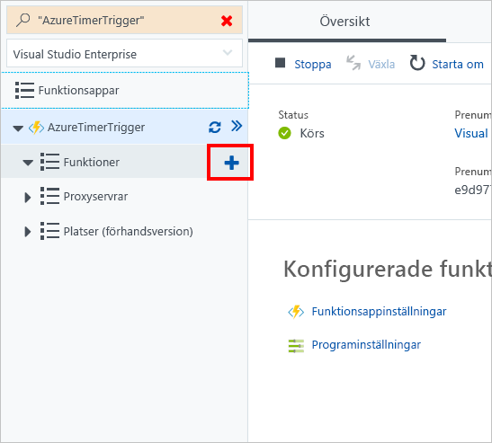

I den här övningen skapar vi en Azure-funktionsapp som anropas var 20:e sekund med hjälp av en timerutlösare.

[!include[](../../../includes/azure-sandbox-activate.md)]

## <a name="create-an-azure-function-app"></a>Skapa en Azure-funktionsapp

Vi börjar med att skapa en Azure-funktionsapp på portalen.

1. Logga in på [Azure-portalen](https://portal.azure.com/learn.docs.microsoft.com?azure-portal=true) med samma konto som du använde för att aktivera sandbox-miljön.

1. Välj **Skapa en resurs** i det vänstra navigeringsfönstret.

1. Välj **Beräkna**.

1. Leta upp och välj **Funktionsapp**. Du kan även använda sökfältet för att hitta mallen.

    

1. Ange ett globalt unikt **appnamn**.

1. Välj en **prenumeration**.

1. Välj den befintliga **resursgruppen** <rgn>[Resursgruppsnamn för sandbox-miljö]</rgn>.

1. Välj **Windows** som **operativsystem**.

1. Välj **Förbrukningsplan** som **värdplan**. Du debiteras för varje körning av funktionen. Resurser tilldelas automatiskt baserat på programmets arbetsbelastning.

1. Välj en **Plats** i listan nedan.

    [!include[](../../../includes/azure-sandbox-regions-first-mention-note-friendly.md)]

1. Skapa ett nytt **lagringskonto**. Du kan ändra namnet om du vill – standardnamnet är en variant av appnamnet.

1. Välj **Skapa**. När funktionsappen har distribuerats går du till **Alla resurser** i portalen. Appen visas i listan med typen **Apptjänst** och har det namn du gav den.

## <a name="create-a-timer-trigger"></a>Skapa en timerutlösare

Nu ska vi skapa en timerutlösare i vår funktion.

1. När funktionen har skapats väljer du **Alla resurser** i det vänstra navigeringsfönstret.

1. Hitta din funktionsapp i listan och välj den.

1. På det nya bladet pekar du på **Funktioner** och väljer plustecknet (+).

    

1. Välj **Timer**.

1. Välj **CSharp** som språk.

1. Välj **Skapa den här funktionen**.

## <a name="configure-the-timer-trigger"></a>Konfigurera timerutlösaren

Vi har en Azure-funktionsapp med logik som skriver ut ett meddelande till loggfönstret. Vi ska ange timerns schema så att den körs var 20:e sekund.

1. Välj **Integrera**.

1. Ange följande värde i rutan **Schema**:

    ```log
    */20 * * * * *
    ```

1. Välj **Spara**.

## <a name="test-the-timer"></a>Testa timern

Nu när vi har konfigurerat timern kommer den anropa funktionen med den intervall som vi definierade.

1. Välj **TimerTriggerCSharp1**.

    > [!NOTE]
    > **TimerTriggerCSharp1** är standardnamnet. Det väljs automatiskt när du skapar utlösaren.

1. Öppna **Loggpanelen** längst ned på skärmen.

1. Lägg märke till att nya meddelanden tas emot var 20:e sekund i loggfönstret.

1. Om du vill stoppa funktionen från att köras, välj **Hantera** och ändra sedan **Funktionstillstånd** till *Inaktiverad*.
