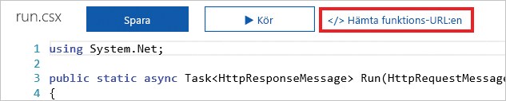

En HTTP-begäran är en vanlig åtgärd på de flesta plattformar och enheter. Oavsett om det är en begäran för att leta upp ett ord i en ordlista eller för att se den lokala väderleksrapporten skickar vi HTTP-begäranden hela tiden. Med Azure Functions kan vi snabbt skapa en del av en logik som körs när en HTTP-begäran tas emot.  

Här lär du dig att skapa och anropa en Azure-funktion med hjälp av en HTTP-utlösare. Du kommer även att utforska några av de anpassningsalternativ som finns tillgängliga.

## Vad är en HTTP-utlösare?

En HTTP-utlösare är en utlösare som utför en funktion när den tar emot en HTTP-begäran. HTTP-utlösare har många funktioner och anpassningar som inkluderar:

- Ge auktoriserad åtkomst genom att tillhandahålla nycklar.
- Begränsa vilka HTTP-verb som stöds.
- Returnera data tillbaka till anroparen.
- Ta emot data via frågesträngsparametrar eller genom begärandetexten.
- Stödja vägmallar för webbadresser för att ändra funktionswebbadressen.

När du skapar en HTTP-utlösare, väljer ett programmeringsspråk, anger ett namn på utlösare och väljer en auktorisationsnivå.

## Vad är en auktorisationsnivå för HTTP-utlösare?

En auktorisationsnivå för HTTP-utlösare är en flagga som anger om en inkommande HTTP-begäran behöver en API-nyckel för att autentisera eller ej.

Det finns tre auktorisationsnivåer:

- Funktion
- Anonym
- Admin

Nivåerna **Funktion** och **Admin** är ”nyckelbaserade”. Du måste ange en nyckel för autentisering för att skicka en HTTP-begäran. Det finns två typer av nycklar: *funktion* och *värd*. Skillnaden mellan dessa två nycklar är dess skala. *Funktionsnycklar* är specifika för en funktion. *Värdnycklar* gäller för alla funktioner i hela Azure Functions-programmet. Om din auktorisationsnivå är inställd på **funktion** kan du använda antingen en *funktionsnyckel* eller en *värdnyckel*. Om din auktorisationsnivå är inställd på **Admin** måste du använda en *värdnyckel*.

Nivån **anonym** innebär att ingen autentisering krävs. Vi använder den här nivån i vår övning.

## Så här skapar du en HTTP-utlösare

Precis som en timerutlösare kan du skapa en HTTP-utlösare via Azure-portalen. I Azure-funktionen väljer du **HTTP-utlösare** från listan över fördefinierade utlösartyper. Sedan anger du logiken som du vill köra och utför eventuella anpassningar som att begränsa användningen av vissa HTTP-verb. 

En inställning som är viktig att förstå är **Parameternamn för förfrågan**. Den här inställningen är en sträng som representerar namnet på den parameter som innehåller information om en inkommande HTTP-begäran. Som standard är namnet på parametern *req*.

## Så här anropar du en HTTP-utlösare

Om du vill anropa en HTTP-utlösare skickar du en HTTP-begäran till webbadressen för din funktion. Gå till sidan med koden för din funktion och välj länken **Hämta funktionswebbadress** för att hämta den här webbadressen.

När du har webbadressen för funktionen kan du skicka HTTP-begäranden. Kom ihåg att du antingen kan använda frågesträngsparametrar eller ange data via begärandetexten om funktionen tar emot data.

## Sammanfattning

En HTTP-utlösare anropar en Azure-funktion när den tar emot en HTTP-begäran till dess funktionswebbadress. Med HTTP-utlösare kan du både ta emot data och returnera data tillbaka till anroparen.
