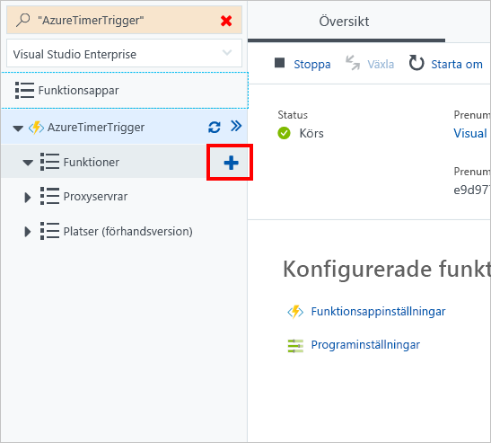

I den här övningen ska vi skapa en Azure-funktion som visar namn och storlek för en blob när den har skapats eller uppdaterats.In this exercise, we're going to create an Azure function that displays the name and size of a blob when it's created or updated. 

> [!NOTE]
> För att kunna slutföra den här övningen måste du vara inloggad på [Azure-portalen](https://portal.azure.com/) med ett giltigt konto.To complete this exercise, make sure you're signed in to the [Azure portal](https://portal.azure.com/) with a valid account.

## Skapa en blob-utlösareCreate a blob trigger

Vi fortsätter använda vårt befintliga Azure Functions-program och lägger nu till en blob-utlösare.Again, let's continue using our existing Azure Functions application and add a blob trigger.

1. Peka på **Functions** och välj plustecknet (+).Point to **Functions** and select the plus (+) icon.

    

1. Välj **Blob-utlösare**.Select **Blob trigger**.

1. Välj **#C** som språk.Select **C#** as the language. 

1. Låt **Namn** vara inställt på standardvärdet.Leave the **Name** set to the default value.

1. Låt **Sökväg** vara inställt på standardvärdet.Leave the **Path** set to the default value.

1. Välj ett befintligt Azure Storage-konto eller välj **Skapa** om du vill att Azure ska skapa ett nytt konto åt dig.Select an existing Azure Storage account, or select **Create** if you want Azure to create a new account for you.

## Hämta LagringsutforskarenDownload Storage explorer

Nu när vi har skapat en blob-utlösare kan vi hämta Lagringsutforskaren, som gör att vi enkelt kan skapa en blob.Now that we've created a blob trigger, let's download Storage explorer, which will allow us to easily create a blob.

- Hämta [Lagringsutforskaren](http://storageexplorer.com).Download [Storage explorer](http://storageexplorer.com).

## Anslut till ditt Azure Storage-kontoConnect to your Azure Storage account

Nu har vi hämtat Lagringsutforskaren.We now have Storage explorer downloaded. Låt oss logga in med de autentiseringsuppgifter som vi har fått.Let's sign in using the credentials that were supplied.

1. Välj plustecknet (+) till vänster i Lagringsutforskaren.In Storage explorer, select the plus (+) icon on the left.

1. Välj **Använd ett kontonamn och en nyckel för lagringen**.Select **Use a storage account name and key**.

1. Välj **Nästa**.Select **Next**.

1. Under blob-utlösaren i Azure väljer du **Integrera**.In Azure, under your blob trigger, select **Integrate**.

1. Välj **Dokumentation** för att expandera vyn.Select **Documentation** to expand the view.

1. Kopiera **Kontonamn** och **Kontonyckel**.Copy the **Account Name** and **Account Key**.

1. Gå tillbaka till Lagringsutforskaren och klistra in **Kontonamn** och **Kontonyckel**.Back in Storage explorer, paste in the **Account Name** and **Account Key**.

1. Ange ett **Visningsnamn**.Enter a **Display name**. Det här värdet är namnet på anslutningen i Lagringsutforskaren.This value is the name of the connection in Storage explorer.

1. Välj **Nästa**.Select **Next**.

1. Välj **Anslut**.Select **Connect**. 

## Skapa en blobcontainerCreate a blob container

Vi är inte anslutna till vårt Azure Storage-konto.We aren't connected to our Azure Storage account. Kom ihåg att vår blob-utlösare endast övervakar den plats som beskrivs i fältet **Sökväg**.Remember that our blob trigger is monitoring only the location described in the **Path** field. Som standard ska vår sökväg vara:By default, our path should be:

> samples-workitems/{namn}samples-workitems/{name}

Vi måste skapa en behållare med namnet **samples-workitems**.We need to create a container called **samples-workitems**.

1. Expandera ditt lagringskonto i Lagringsutforskaren.In Storage explorer, expand your storage account. Namnet ska vara det **Visningsnamn** som du angav vid anslutningen.The name should be the **Display name** that you provided during the connection process.

1. Högerklicka på **Blobbehållare** och välj **Skapa blobbehållare**.Right-click **Blob Containers** and select **Create blob container**.

1. Ange **samples-workitems**.Enter **samples-workitems**.

## Aktivera din blob-utlösareTurn on your blob trigger

Nu när vi har skapat vår behållare som ska övervakas, kör vi vår funktion för att kunna se utdata när en blob skapas.Now that we've created our container to monitor, let's run our function so we can see output when a blob is created.

1. Välj den blob-utlösare som öppnar kodskärmen.Select your blob trigger to open the code screen.

1. Välj **Kör**.Select **Run**.

## Skapa en blobCreate a blob

Vår blob-utlösare är nu igång och lyssnar efter aktivitet.Our blob trigger is now up and listening for activity. Nu ska vi skapa en blob för att se om vi får ett loggmeddelande.Let's create a blob to see if we get a log message.

1. I Lagringsutforskaren väljer du behållaren **samples-workitems**.In Storage explorer, select the **samples-workitems** container.

1. Välj **Överför**.Select **Upload**. 

1. Välj **Överför filer**.Select **Upload Files**.

1. Välj en fil från datorn.Select any file from your computer.

1. Välj **Överför**.Select **Upload**.

1. Gå tillbaka till Azure.Go back to Azure. Titta i dina loggar om det finns något meddelande som visar vilken fil som överfördes.Check your logs for a message that displays what file was uploaded.

## RensaClean up

För att säkerställa att du inte debiteras för den här funktionen, väljer du **Pausa** ovanför loggfönstret.To ensure that you aren't charged for this function, select **Pause** above the log window.

