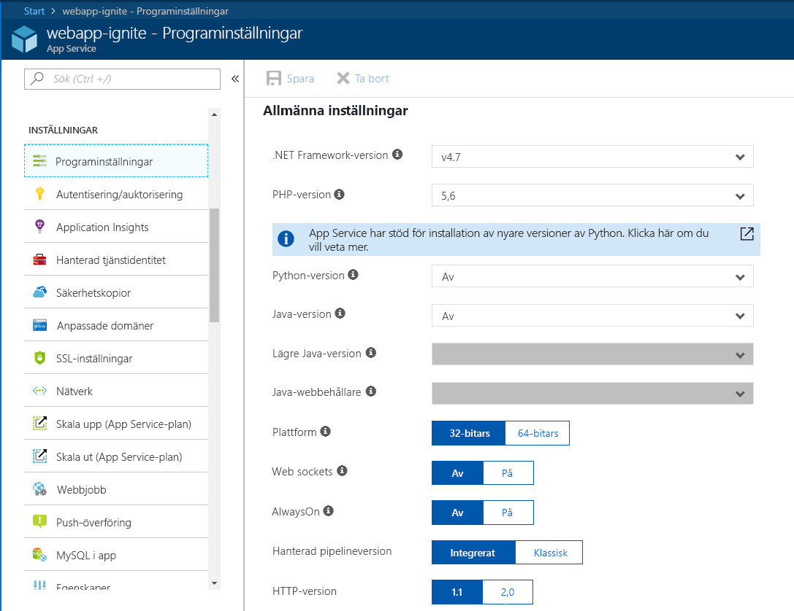
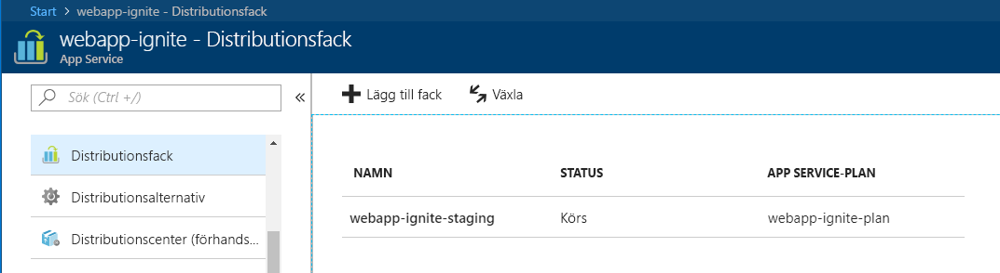
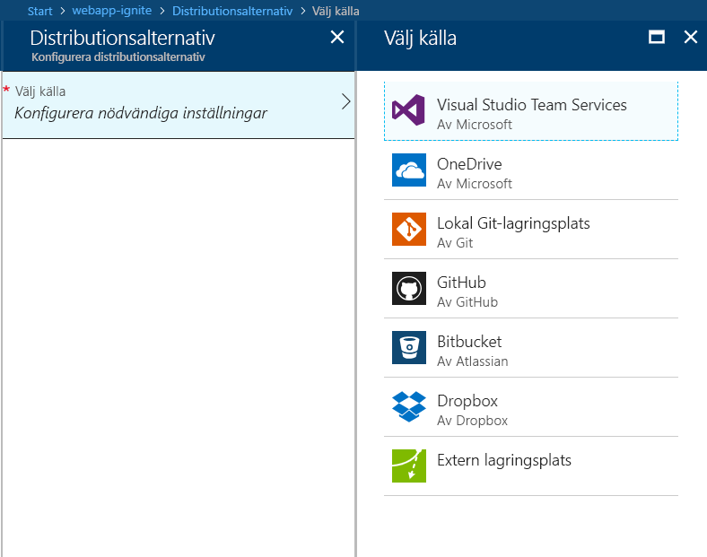

Här lär du dig att skapa en webbapp i Azure App Service med hjälp av Azure-portalen.

## Varför bör jag använda Azure-portalen?

Det första steget i att hantera webbprogrammet är att skapa en webbapp (en App Service-app) i din Azure-prenumeration.

Du kan skapa en webbapp på flera olika sätt. Du kan använda Azure Portal, Azure CLI, ett skript eller en IDE.

Här använder vi portalen eftersom det är en grafisk upplevelse, vilket gör den till ett bra inlärningsverktyg. Portalen hjälper dig att upptäcka tillgängliga funktioner, lägga till ytterligare resurser och anpassa befintliga resurser.

## Vad är Azure App Service?

Azure App Service är en fullständigt hanterad plattform i Azure-miljön som är optimerad för hantering av webbappar, REST-API:er och mobila serverdelar.

Den här plattformen som en tjänst (PaaS) tillhandahålls av Microsoft Azure, så att du kan fokusera på att skapa apparna medan Azure hanterar den infrastruktur som krävs för att köra och skala om dina program.

## Steg för att skapa en webbapp

När det är dags att hantera din egen app går du till Azure Portal och skapar en ny **Webbapp**. Genom att skapa en **Webapp**på Azure-portalen skapar du i själva verket en uppsättning med hanteringsresurser i App Service som du kan använda som värd för alla webbaserade program som stöds av Azure, oavsett om det är ASP.NET Core, Node.js, PHP osv. Bilden nedan visar hur enkelt det är att konfigurera det ramverk/språk som används av appen.

Azure Portal innehåller en mall för att skapa en webbapp. Mallen måste innehålla följande fält:

- **Appnamn**: namnet på webbappen.
- **Prenumeration**: en giltig och aktiv prenumeration.
- **Resursgrupp**: en giltig resursgrupp. Avsnitten nedan förklarar i detalj vad en resursgrupp är.
- **OS**: operativsystemet. Alternativen är: Windows, Linux och Docker-containrar. I Windows kan du köra valfri typ av program med en mängd olika tekniker. Samma gäller för en Linux-värd, på Linux måste alla ASP.NET-appar vara ASP.Net Core på .NET Core-ramverket. Det sista alternativet är Docker-containrar, där du kan distribuera dina containrar direkt via containrar som hanteras och underhålls av Azure. 
- **App Service-plan/plats**: en giltig App Azure Service-plan. Avsnitten nedan förklarar i detalj vad en App Service-plan är.
- **Application Insights**: du kan aktivera alternativet Azure Application Insights och dra nytta av de verktyg för övervakning och mått som Azure Portal tillhandahåller för att hjälpa dig att hålla koll på prestandan för dina appar.

Med Azure Portal får du många kraftfulla verktyg för att hantera, övervaka och styra din webbapp.

### Distributionsfack

Med hjälp av Azure Portal kan du enkelt lägga till **distributionsfack** i en App Service-webbapp. Du kan till exempel skapa ett distributionsfack för **mellanlagring** som du kan skicka koden till för att testa den i Azure. När du är nöjd med koden kan du enkelt **växla** distributionsfacket för mellanlagring med produktionsplatsen. Det här gör du med några enkla musklick i Azure Portal.

### Stöd för kontinuerlig integrering/distribution

Azure-portalen har stöd för direkt och kontinuerlig integrering och distribution med Visual Studio Team Services, GitHub, Bitbucket, Dropbox, OneDrive eller en lokal Git-lagringsplats i en utvecklingsdator. Om du ansluter din webbapp till någon av ovanstående källor så gör App Service resten genom att automatiskt synkronisera koden och eventuella ändringar till webbappen. Med Visual Studio Team Services definierar du dessutom din egen bygg- och lanseringsprocess som avslutas med att din källkod kompileras, testerna körs, en version skapas och slutligen att versionen skickas till en webbapp varje gång du checkar in koden. Allt detta händer implicit utan att du behöver göra någonting.

### Integrerad Visual Studio-publicering och FTP-publicering

Utöver att kunna konfigurera kontinuerlig integrering/distribution för webbappen kan du alltid dra nytta av den nära integreringen med Visual Studio för att publicera webbappen till Azure via WebDeploy-teknik. Dessutom har Azure stöd för FTP, men FTP är inte den optimala lösningen för publicering eftersom det saknar vissa funktioner i Web Deploy för att välja endast de filer som har ändrats eller lagts i stället för att bara publicera alltihop i Azure!

### Inbyggt stöd för automatisk skalning (automatisk utskalning baserat på verklig belastning)

I webbappen ingår möjligheten att skala upp/ned eller skala ut. Beroende på användningen av webbappen kan du skala upp/ned appen genom att öka/minska resurserna för den underliggande datorn som är värd för webbappen. Resurser kan vara antal kärnor eller mängden tillgängligt RAM-minne.

Att skala ut är å andra sidan möjligheten att öka antalet datorinstanser som kör webbappen.

## Vad är en resursgrupp?

En resursgrupp är en metod för att gruppera resurser och tjänster som är beroende av varandra, till exempel virtuella datorer, webbappar, databaser med mera för ett visst program och en miljö. Se den som en **mapp**, en plats för att gruppera element i appen.

Med resursgrupper kan du enkelt hantera och ta bort resurser. De gör det också enklare att övervaka, kontrollera, komma åt, etablera och hantera fakturering för samlingar av resurser som krävs för att köra ett program eller används av en klient.

## Vad är en App Service-plan?

En App Service-plan är en uppsättning fysiska resurser och tillgänglig kapacitet som du kan distribuera dina App Service-appar till.

Azure-portalen innehåller en mall för att skapa en ny App Service-plan. Den här mallen kräver följande grundläggande information:

- Region (USA, västra, USA, centrala, Europa, norra osv.)
- Skalningsantal (en, två, tre instanser osv.)
- Instansstorlek (liten, medel eller stor)
- SKU, eller prisnivå (Kostnadsfri, Delad, Basic, Standard, Premium, PremiumV2 respektive Isolerad)

Webbappar, mobilappar och API-appar i Azure App Service samt Azure Functions körs alla i en App Service-plan. Du kan distribuera ett obegränsat antal program till en App Service-plan, men hur många du använder beror i stor utsträckning på vilka typer av program som distribueras och vilka resurser som krävs för processoranvändning.

Du kan alltid använda din App Service-plan i Azure Portal för att visualisera din CPU- och minnesanvändning så att du kan bestämma ditt behov av att skala eller flytta program till en annan App Service-plan.
