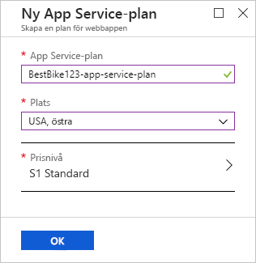
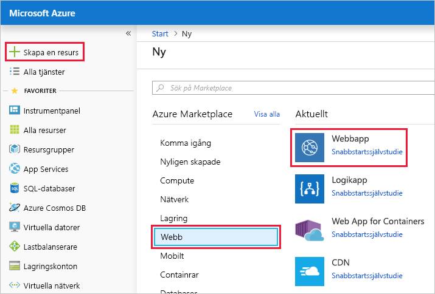
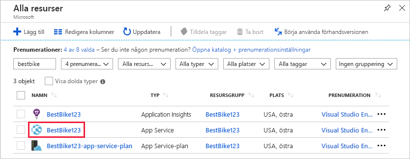
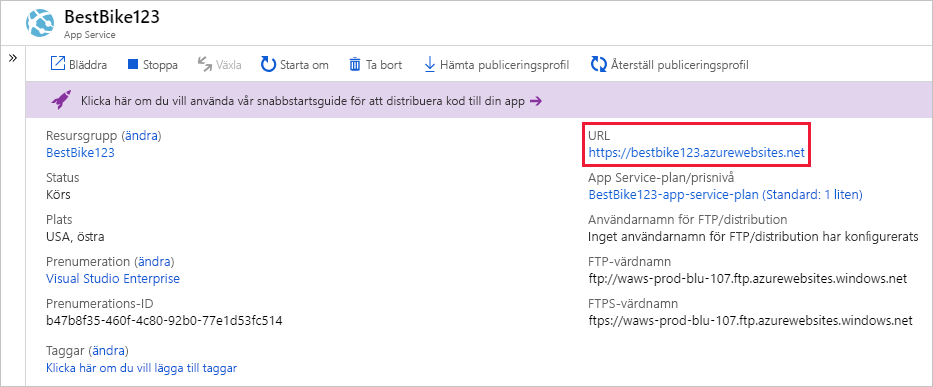

I det här avsnittet kommer du att använda Azure Portal för att skapa en webbapp.

[!include]

## Skapa en webbapp

Logga in på [Azure Portal](https://portal.azure.com/learn.docs.microsoft.com?azure-portal=true) med samma konto som du använde för att aktivera sandbox-miljön.

1. Klicka på länken **Skapa en resurs** överst i det vänstra navigeringsfönstret. Allt som du skapar i Azure är en resurs.

1. Sidan **Marketplace** öppnas i portalen. Härifrån kan du söka efter en resurs som du vill skapa eller välja någon av de populära resurser som du kan skapa i Azure Portal.

1. Klicka på **Webb** > **Webbapp**. Via portalen omdirigeras du till sidan **Skapa ny webbapp**.

1. När du skapar en ny webbapp behöver Azure-portalen en del information för att kunna skapa appen åt dig. I det här avsnittet måste du ange följande grundläggande information:

    1. **Appnamn**: Din kund vill att programmet ska ha namnet `BestBike`. Ange namnet i det här fältet. Det här värdet måste vara globalt unikt för alla andra webbappar som körs på Azure, och portalen ser till att ingen annan har använt appnamnet. För att säkerställa att ditt namn är unikt ska du lägga till ett nummer till appens namn tills du hittar en unik kombination.

    2. **Prenumeration**: I det här fältet måste du välja en aktiv Azure-prenumeration i listrutan. Välj Concierge-prenumerationen.

    3. **Operativsystem**: I det här fältet måste du bestämma om du vill använda **Windows** eller **Linux** som värd för din nya webbapp. Den här inställningen påverkar App Service-planen som du ska välja eller skapa nedan. Som du kanske kommer ihåg påminner en App Service-plan om en virtuell dator, som är ett operativsystem med alla resurser (processor, RAM-minne osv.) som behövs på datorn för att köra ditt program. I det här fallet vill din kund använda en Windows-dator som värd för webbappen. Därför väljer du **Windows**.

    4. **Application Insights**: Azure Application Insights hjälper dig att identifiera och diagnostisera kvalitetsproblem i dina webbappar och webbtjänster och hjälper dig att förstå vad användarna faktiskt gör med dem. Ett av din kunds krav är att få rapporter om trafiken på webbplatsen för att identifiera trender, t.ex. när trafiken är hög och när den är låg. I det här fallet väljer du alternativet **På** för att aktivera Application Insights för webbappen. När du har valt alternativet **På** måste du också välja platsen eller regionen där Application Insights-data ska lagras. Observera att Application Insights endast är tillgängligt i ett begränsat antal regioner. Välj någon av de tillgängliga regionerna för den här demonstrationen.

## Använd resursgrupp för sandbox-miljö

En Azure-webbapp måste vara en del av en resursgrupp. Välj **Använd befintlig** och därefter <rgn>[sandbox-resursgruppnamn]</rgn>.

## Skapa en App Service-plan

I det här fältet måste du välja en App Service-plan för att köra ditt program. Som standard väljer portalen den senaste App Service-plan som du har skapat. Klicka på fältet **App Service-plan/plats** så öppnas sidan **App Service-plan**.

Klicka på länken **Skapa ny** så öppnas sidan **Ny App Service-plan**. Portalen behöver en del information av dig för att kunna skapa den nya App Service-planen.

1. **App Service-plan**: I det här fältet anger du ett namn på den nya App Service-planen. För den här appen skriver du samma webbappsnamn som du valde ovan och lägger till suffixet `-app-service-plan` så att du enkelt kan skilja den här resursen från andra.

2. **Plats**: I det här fältet måste du välja den region som App Service-planen finns i. Det vill säga, välj den geografiska platsen där App Service-planen ska konfigurera virtuella datorer som krävs för att köra ditt program. I det här fallet kan du välja valfritt alternativ i listan nedan.

[!include]

3. **Prisnivå**: I det här fältet väljer du storlek på den virtuella dator som ska vara värd för ditt program. Klicka på **>**-tecknet för att öppna sidan **Prisnivå**.

    Här har du många alternativ att välja mellan. Portalen grupperar alternativen baserat på den arbetsbelastningsnivå som krävs. De tre tillgängliga arbetsbelastningskategorierna är: Utveckling/testning, Produktion och Isolerad. Välj relevant arbetsbelastningskategori beroende på kraven för programmet som ska köras i Azure. Eftersom vi fortfarande håller på att utveckla programmet **BestBike** börjar du med den minsta arbetsbelastningskategorin som passar dig. Kom ihåg att ett av kundens krav var att kunna testa nya ändringar i programmet i realtid. Som du ser i de kommande kursdelarna kräver detta att du lägger till **distributionsplatser**. Distributionsplatser är tillgängliga för en minsta prisnivå motsvarande **S1**. Välj därför prisnivån **S1** under kategorin för **produktionsarbetsbelastningar**. Klicka sedan på **Använd** för att bekräfta prisnivån du valt ovan.

    > [!NOTE]
    > Som du kommer att märka i den här modulen kan du endast lägga till **distributionsplatser** till din webbapp med kategorierna **Produktion** och **Isolerad**.

    Nu är du tillbaka på sidan **Ny App Service-plan**.

    

4. Klicka på knappen **OK** för att använda din nya App Service-plan.

    Du kommer tillbaka till huvudsidan **Skapa webbapp**.

    

5. Klicka på knappen **Skapa** för att börja skapa webbappen.

    > [!NOTE]
    > Det kan ta några sekunder att skapa webbappen och göra den redo för användning.

Du omdirigeras till sidan Instrumentpanel och meddelas när den nya webbappen har skapats.

När appen är klar, går du till den nya appen i Azure-portalen.

1. Klicka på menyn **Alla resurser** i det vänstra navigeringsfönstret. På sidan **Alla resurser** visas en lista över alla resurser som du har skapat i Azure-portalen.

2. Klicka dig igenom BestBike App Service som precis har skapats åt dig.

    > [!NOTE]
    > Om du söker efter din app med namnet ”BestBike” kan du också hitta Application Insights och App Service-planresurser som skapats för din nya webbapp. Försäkra dig om att du klickar dig igenom resursen av typen **App Service**.

    

Portalen öppnas startsidan för webbappstjänsten med avsnittet **Översikt** valt.

Om du vill förhandsgranska din nya webbapps standardinnehåll, klickar du på **URL:en** längst upp till höger i Azure-portalen. Om du ser en platshållarwebbsida innebär det att webbappen fungerar.
