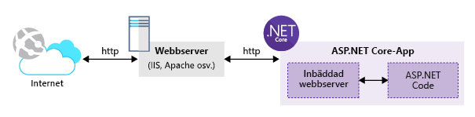

<span data-ttu-id="b5535-101">Du har valt att använda en teknik med öppen källkod för att skapa ditt webbprogram.</span><span class="sxs-lookup"><span data-stu-id="b5535-101">You've decided to use an open-source technology for building your web application.</span></span> <span data-ttu-id="b5535-102">Du vet att ASP.NET Core är ett plattformsoberoende ramverk med öppen källkod.</span><span class="sxs-lookup"><span data-stu-id="b5535-102">You know that ASP.NET Core is a cross-platform and open-source framework.</span></span> <span data-ttu-id="b5535-103">Du bestämmer dig för att utveckla din webbapp i en Linux-utvecklingsmiljö med hjälp av ASP.NET Core!</span><span class="sxs-lookup"><span data-stu-id="b5535-103">You decide to develop your web app in a Linux development environment using ASP.NET Core!</span></span>

<span data-ttu-id="b5535-104">Med Azure App Service kan du använda valfri webbteknik, till exempel Node.js, PHP eller .NET Core.</span><span class="sxs-lookup"><span data-stu-id="b5535-104">Azure App Service allows you to use your favorite web technology, including Node.js, PHP, or .NET Core.</span></span>

<span data-ttu-id="b5535-105">Här lär du dig hur du skapar ett ASP.NET Core-program med hjälp av .NET-kommandoradsgränssnittet.</span><span class="sxs-lookup"><span data-stu-id="b5535-105">Here, you will learn to create an ASP.NET Core application using the .NET command-line interface (CLI).</span></span>

## <a name="what-is-aspnet-core"></a><span data-ttu-id="b5535-106">Vad är ASP.NET Core?</span><span class="sxs-lookup"><span data-stu-id="b5535-106">What is ASP.NET Core?</span></span>

<span data-ttu-id="b5535-107">ASP.NET Core är den senaste utvecklingen av Microsofts populära ASP.NET-webbramverk. Ett plattformsoberoende ramverk med öppen källkod för utveckling av moderna, molnbaserade och internetanslutna program.</span><span class="sxs-lookup"><span data-stu-id="b5535-107">ASP.NET Core is the latest evolution of Microsoft's popular ASP.NET web framework, a cross-platform, open-source framework for building modern, cloud-based, and internet-connected applications.</span></span>

<span data-ttu-id="b5535-108">ASP.NET Core-program kan skrivas mot .NET Core Framework eller det befintliga, fullständiga .NET Framework-ramverket.</span><span class="sxs-lookup"><span data-stu-id="b5535-108">ASP.NET Core applications can be written to target the .NET Core Framework or the existing, full .NET Framework.</span></span>

<span data-ttu-id="b5535-109">Eftersom ASP.NET Core är ett plattformsoberoende ramverk med öppen källkod kan du skapa ASP.NET Core-appar på en rad olika plattformar, inklusive Windows, macOS och Linux.</span><span class="sxs-lookup"><span data-stu-id="b5535-109">Being a cross-platform and open-source framework, you can build ASP.NET Core apps on a variety of platforms, including Windows, macOS, and Linux.</span></span> <span data-ttu-id="b5535-110">Microsoft erbjuder Visual Studio IDE för både Windows- och macOS-miljöer.</span><span class="sxs-lookup"><span data-stu-id="b5535-110">Microsoft offers the Visual Studio IDE for both Windows and macOS environments.</span></span> <span data-ttu-id="b5535-111">Och Visual Studio Code-redigeraren är plattformsoberoende och kompatibel med dessa samt Linux.</span><span class="sxs-lookup"><span data-stu-id="b5535-111">In addition, the Visual Studio Code editor is cross-platform and compatible with those as well as Linux.</span></span>

><span data-ttu-id="b5535-112">För att ge stöd för utveckling av ASP.NET Core-program på olika plattformar introducerade Microsoft .NET Core CLI-verktygen som hjälper dig att bygga, testa och publicera dina program med hjälp av funktionsrika, enhetliga och plattformsoberoende API:er.</span><span class="sxs-lookup"><span data-stu-id="b5535-112">To support building ASP.NET Core applications on different platforms, Microsoft introduced the .NET Core CLI tools to help you build, test, and publish your applications using a rich, consistent, and cross-platform set of APIs.</span></span>

<span data-ttu-id="b5535-113">Med ASP.NET Core kan du skapa webbappar och tjänster, IoT-appar och mobila serverdelar.</span><span class="sxs-lookup"><span data-stu-id="b5535-113">With ASP.NET Core, you can build web apps and services, IoT apps, and mobile back ends.</span></span> <span data-ttu-id="b5535-114">ASP.NET Core-program kan köras antingen i molnet eller lokalt.</span><span class="sxs-lookup"><span data-stu-id="b5535-114">ASP.NET Core applications can be hosted either in the cloud or on-premises.</span></span>

<span data-ttu-id="b5535-115">ASP.NET Core består av en inbäddad webbserver och en körningsmiljö som kör programkoden.</span><span class="sxs-lookup"><span data-stu-id="b5535-115">By design, ASP.NET Core consists of an embedded web server and a runtime environment that runs the application code.</span></span> <span data-ttu-id="b5535-116">Programkoden skrivs med hjälp av ett omarbetat ASP.NET MVC-ramverk, som kräver mindre moduler och paket.</span><span class="sxs-lookup"><span data-stu-id="b5535-116">The application code is written using a reworked ASP.NET MVC framework that relies on smaller modules and packages.</span></span> <span data-ttu-id="b5535-117">Resultatet är en mindre ”skiss”, eller blueprint, av webbprogrammet, som enkelt kan underhållas och hanteras i molnmiljöer.</span><span class="sxs-lookup"><span data-stu-id="b5535-117">The result is a smaller web application blueprint that is easy to maintain and host over cloud environments.</span></span> <span data-ttu-id="b5535-118">Följande bild visar ett ASP.NET Core-program som finns i .NET Core och den externa webbservern som hanterar HTTP-internettrafik.</span><span class="sxs-lookup"><span data-stu-id="b5535-118">The following illustration shows an ASP.NET Core application hosted in .NET Core and the external web server that handles internet http traffic.</span></span>



<span data-ttu-id="b5535-120">ASP.NET Core-program är fristående **konsolprogram** som anropas via **dotnet**-drivrutinsverktyget.</span><span class="sxs-lookup"><span data-stu-id="b5535-120">ASP.NET Core applications are standalone **console** applications invoked through the **dotnet** driver tool.</span></span> <span data-ttu-id="b5535-121">ASP.NET Core-program läses inte in i IIS-arbetsprocessen, utan via en inbyggd IIS-modul med namnet **AspNetCoreModule** som kör det externa konsolprogrammet.</span><span class="sxs-lookup"><span data-stu-id="b5535-121">ASP.NET Core applications are not loaded into the IIS worker process, but rather, are loaded through a native IIS module called **AspNetCoreModule** that executes the external console application.</span></span>

## <a name="how-to-create-an-aspnet-core-web-project"></a><span data-ttu-id="b5535-122">Skapa ett ASP.NET Core-webbprojekt</span><span class="sxs-lookup"><span data-stu-id="b5535-122">How to create an ASP.NET Core web project</span></span>

<span data-ttu-id="b5535-123">Det finns två vanliga alternativ för att skapa ett nytt ASP.NET Core-projekt:</span><span class="sxs-lookup"><span data-stu-id="b5535-123">There are a two common options for creating a new ASP.NET Core project:</span></span>

- <span data-ttu-id="b5535-124">Du kan använda Visual Studio-mallar (Windows- och macOS-versioner) för att generera ett nytt projekt.</span><span class="sxs-lookup"><span data-stu-id="b5535-124">You can use Visual Studio (Windows and macOS versions) templates to generate a new project.</span></span> <span data-ttu-id="b5535-125">Visual Studio innehåller en mängd olika mallar som du kan använda för att skapa webbprojekt.</span><span class="sxs-lookup"><span data-stu-id="b5535-125">Visual Studio offers a variety of templates that you can use to create web projects.</span></span> <span data-ttu-id="b5535-126">Du kan exempelvis använda mallen **Tom** för att skapa ett tomt ASP.NET Core-projekt med baskonfigurationen.</span><span class="sxs-lookup"><span data-stu-id="b5535-126">For instance, you can use the **Empty** template to create a bare-bones ASP.NET Core project with the basic setup.</span></span> <span data-ttu-id="b5535-127">Du kan också använda mallen **Webbprogram (Modal-View-Controller)** för att generera ett fullständigt ASP.NET Core MVC-program med **exempelkontroller** och **exempelvyer**som hjälper dig att börja koda ditt program.</span><span class="sxs-lookup"><span data-stu-id="b5535-127">In addition, you can use the **Web Application (Modal-View-Controller)** template to generate a full-fledged ASP.NET Core MVC application, with sample **controllers** and **views** that can help you start coding your application.</span></span> <span data-ttu-id="b5535-128">Det senaste tillskottet är projektmallen **Webbprogram** som används för att skapa ett ASP.NET Core-projekt baserat på Razor-sidor i stället för den traditionella MVC-projektstrukturen.</span><span class="sxs-lookup"><span data-stu-id="b5535-128">The latest arrival is the **Web Application** project template that is used to create an ASP.NET Core project based on Razor pages and not on the traditional MVC project structure.</span></span>

- <span data-ttu-id="b5535-129">Du kan använda kommandoradsgränssnittsverktygen (CLI) för .NET Core för att generera ett nytt ASP.NET Core-projekt.</span><span class="sxs-lookup"><span data-stu-id="b5535-129">You can use the .NET Core CLI tools to generate a new ASP.NET Core project.</span></span> <span data-ttu-id="b5535-130">Microsoft har en uppsättning ASP.NET Core-projektmallar för CLI-verktyg som är nästan identiska med Visual Studio-mallarna.</span><span class="sxs-lookup"><span data-stu-id="b5535-130">Microsoft maintains a set of ASP.NET Core project templates for the CLI tools that is almost identical to the Visual Studio templates.</span></span> <span data-ttu-id="b5535-131">Den enda skillnaden med CLI-verktygen är att du måste ange kommandon för att skapa ett nytt ASP.NET Core-projekt.</span><span class="sxs-lookup"><span data-stu-id="b5535-131">The only difference with the CLI tools is that you need to type commands to create a new ASP.NET Core project.</span></span>
> <span data-ttu-id="b5535-132">.NET CLI-verktygen använder **mallmotorn** för att skapa stöd för olika projektmallar.</span><span class="sxs-lookup"><span data-stu-id="b5535-132">The .NET CLI tools make use of the **templating engine** to support different project templates.</span></span>  <span data-ttu-id="b5535-133">Mer information finns på GitHub-lagringsplatsen för [mallmotorn](https://github.com/dotnet/templating) som används internt av .NET CLI-verktygen.</span><span class="sxs-lookup"><span data-stu-id="b5535-133">To learn more, visit the GitHub repository for the [templating engine](https://github.com/dotnet/templating) used internally by the .NET CLI tools.</span></span>

<span data-ttu-id="b5535-134">De är de vanligaste verktygen för att skapa ASP.NET Core-projekt.</span><span class="sxs-lookup"><span data-stu-id="b5535-134">These are the most common tools for creating ASP.NET Core projects.</span></span> <span data-ttu-id="b5535-135">Men det finns fler tillgängliga verktyg som du kan söka efter och utforska.</span><span class="sxs-lookup"><span data-stu-id="b5535-135">However, there are more tools out there that you can search for and explore.</span></span>

<span data-ttu-id="b5535-136">Det är värt att nämna att projekten som genereras av de olika verktygen kan skilja sig åt en aning, men alla skapar giltiga och optimerade ASP.NET Core-projekt.</span><span class="sxs-lookup"><span data-stu-id="b5535-136">It's worth mentioning that the projects generated by the different tools can be slightly different, however, they all generate valid and optimized ASP.NET Core projects.</span></span>

## <a name="net-cli-tools"></a><span data-ttu-id="b5535-137">.NET CLI-verktyg</span><span class="sxs-lookup"><span data-stu-id="b5535-137">.NET CLI tools</span></span>

<span data-ttu-id="b5535-138">.NET CLI-verktyget, även kallat .NET Core CLI, är ett plattformsoberoende verktyg som tillhandahåller kommandon för att skapa och återställa paket, och för att utveckla, köra och publicera .NET-program från kommandoraden utan behov av en fullständig IDE-miljö.</span><span class="sxs-lookup"><span data-stu-id="b5535-138">The .NET CLI tools, also known as .NET Core CLI, is a cross-platform tool that provides commands for creating and restoring packages, and for building, running, and publishing .NET applications from the command line without the need for a full-featured IDE.</span></span>

<span data-ttu-id="b5535-139">.NET CLI installeras som en del av .NET Core SDK.</span><span class="sxs-lookup"><span data-stu-id="b5535-139">The .NET CLI is installed as part of the .NET Core SDK.</span></span> <span data-ttu-id="b5535-140">Flera versioner av CLI kan finnas samtidigt på samma dator och köras parallellt.</span><span class="sxs-lookup"><span data-stu-id="b5535-140">Multiple versions of the CLI can coexist on the same machine and run side by side.</span></span>

<span data-ttu-id="b5535-141">Om du utvecklar lokalt behöver du, för att börja använda .NET-CLI, installera relevant .NET Core SDK.</span><span class="sxs-lookup"><span data-stu-id="b5535-141">If you are developing locally, to start using the .NET CLI, you need to install the relevant .NET Core SDK.</span></span> <span data-ttu-id="b5535-142">Azure Cloud Shell har redan .NET CLI-verktyget installerat.</span><span class="sxs-lookup"><span data-stu-id="b5535-142">The Azure Cloud Shell already has the .NET CLI installed.</span></span>

<span data-ttu-id="b5535-143">Öppna kommandotolken och skriv följande:</span><span class="sxs-lookup"><span data-stu-id="b5535-143">Open the command line and type the following:</span></span>

```console
dotnet --version
```

<span data-ttu-id="b5535-144">Det här kommandot visar den version av .NET-CLI som är installerad.</span><span class="sxs-lookup"><span data-stu-id="b5535-144">This command displays the version of the .NET CLI installed.</span></span>

<span data-ttu-id="b5535-145">För denna skrift kommer en körning av Azure Cloud Shell att returnera: `2.0.0`.</span><span class="sxs-lookup"><span data-stu-id="b5535-145">As of this writing, running the command on Azure Cloud Shell returns: `2.0.0`.</span></span> <span data-ttu-id="b5535-146">Det finns nyare versioner och du kan ha en nyare version på den lokala datorn.</span><span class="sxs-lookup"><span data-stu-id="b5535-146">There are newer versions available and you may have a newer version on your local machine.</span></span>

<span data-ttu-id="b5535-147">Låt oss börja med att utforska några av de populära kommandona av .NET-CLI.</span><span class="sxs-lookup"><span data-stu-id="b5535-147">Let us start exploring some of the popular commands of the .NET CLI.</span></span>

<span data-ttu-id="b5535-148">Kommandot *dotnet* har följande allmänna syntax:</span><span class="sxs-lookup"><span data-stu-id="b5535-148">The *dotnet* command has the following general syntax:</span></span>

```console
dotnet [verb] [arguments]
```

<span data-ttu-id="b5535-149">Verbet som representerar åtgärden som ska köra.</span><span class="sxs-lookup"><span data-stu-id="b5535-149">The verb represents the action to execute.</span></span> <span data-ttu-id="b5535-150">Argumenten representerar listan med indataargument som verbet kräver för att kunna köras.</span><span class="sxs-lookup"><span data-stu-id="b5535-150">The arguments represent the list of input arguments that the verb requires in order to execute.</span></span>

<span data-ttu-id="b5535-151">Om du vill ha hjälp med att använda *dotnet* och visa en lista över de tillgängliga *verben* och annan relaterad information, skriver du följande kommando:</span><span class="sxs-lookup"><span data-stu-id="b5535-151">To get help on the *dotnet* usage and list all of the *verbs* available, and other related information, type the following command:</span></span>

```console
dotnet --help
```

<span data-ttu-id="b5535-152">Det här kommandot visar följande:</span><span class="sxs-lookup"><span data-stu-id="b5535-152">This command displays the following:</span></span>

```console
.NET Command Line Tools (2.1.302)
Usage: dotnet [runtime-options] [path-to-application]
Usage: dotnet [sdk-options] [command] [arguments] [command-options]

path-to-application:
  The path to an application .dll file to execute.

SDK commands:
  new              Initialize .NET projects.
  restore          Restore dependencies specified in the .NET project.
  run              Compiles and immediately executes a .NET project.
  build            Builds a .NET project.
  publish          Publishes a .NET project for deployment (including the runtime).
  test             Runs unit tests using the test runner specified in the project.

...
```

<span data-ttu-id="b5535-153">Under **SDK commands** kan du se hela listan med kommandon som du kan köra mot .NET Core SDK.</span><span class="sxs-lookup"><span data-stu-id="b5535-153">Under the **SDK commands**, you can see the entire list of commands that you can execute against the .NET Core SDK.</span></span>

<span data-ttu-id="b5535-154">De mest användbara kommandona som ofta används är följande:</span><span class="sxs-lookup"><span data-stu-id="b5535-154">The most useful commands at all times are the following:</span></span>

- <span data-ttu-id="b5535-155">**dotnet new**: Det här kommandot används för att bygga/generera ett nytt .NET-program.</span><span class="sxs-lookup"><span data-stu-id="b5535-155">**dotnet new**: This command is used to scaffold/generate a new .NET application.</span></span>

- <span data-ttu-id="b5535-156">**dotnet restore**: Det här kommandot används för att återställa/hämta alla paket som programmet refererar till.</span><span class="sxs-lookup"><span data-stu-id="b5535-156">**dotnet restore**: This command is used to restore/download all packages that are referenced by the application.</span></span>

- <span data-ttu-id="b5535-157">**dotnet run**: Det här kommandot används för att köra .NET-programmet.</span><span class="sxs-lookup"><span data-stu-id="b5535-157">**dotnet run**: This command is used to run your .NET application.</span></span>

<span data-ttu-id="b5535-158">Om du vill ha hjälp med att använda ett visst kommando kan du skriva följande:</span><span class="sxs-lookup"><span data-stu-id="b5535-158">Now, to get assistance on how to use a specific command, you can type the following:</span></span>

```console
dotnet new --help
```

<span data-ttu-id="b5535-159">Det här kommandot resulterar i:</span><span class="sxs-lookup"><span data-stu-id="b5535-159">This command results in:</span></span>

```console
Usage: new [options]

Options:
  -h, --help          Displays help for this command.
  -l, --list          Lists templates containing the specified name. If no name is specified, lists all templates.
  -n, --name          The name for the output being created. If no name is specified, the name of the current directory is used.
  -o, --output        Location to place the generated output.
  -i, --install       Installs a source or a template pack.
  -u, --uninstall     Uninstalls a source or a template pack.
  --nuget-source      Specifies a NuGet source to use during install.
  --type              Filters templates based on available types. Predefined values are "project", "item" or "other".
  --force             Forces content to be generated even if it would change existing files.
  -lang, --language   Filters templates based on language and specifies the language of the template to create.


Templates                                         Short Name         Language          Tags
----------------------------------------------------------------------------------------------------------------------------
Console Application                               console            [C#], F#, VB      Common/Console
Class library                                     classlib           [C#], F#, VB      Common/Library
...

Razor Page                                        page               [C#]              Web/ASP.NET
MVC ViewImports                                   viewimports        [C#]              Web/ASP.NET
MVC ViewStart                                     viewstart          [C#]              Web/ASP.NET
ASP.NET Core Empty                                web                [C#], F#          Web/Empty
ASP.NET Core Web App (Model-View-Controller)      mvc                [C#], F#          Web/MVC
ASP.NET Core Web App                              razor              [C#]              Web/MVC/Razor Pages
ASP.NET Core with Angular                         angular            [C#]              Web/MVC/SPA
...

Solution File                                     sln                                  Solution

Examples:
    dotnet new mvc --auth Individual
    dotnet new webapi
    dotnet new --help
```

<span data-ttu-id="b5535-160">Det här kommandot visar de tillgängliga alternativen som du kan använda med kommandot `dotnet new`.</span><span class="sxs-lookup"><span data-stu-id="b5535-160">This command lists all the available options that you can use with the `dotnet new` command.</span></span> <span data-ttu-id="b5535-161">Det visar även alla tillgängliga projektmallar som du kan använda för att skapa ditt .NET-program.</span><span class="sxs-lookup"><span data-stu-id="b5535-161">Also, it lists all the available project templates that you can use to generate your next .NET application.</span></span> <span data-ttu-id="b5535-162">Slutligen finns ett avsnitt som visar exempel på hur du använder kommandot för att skapa ett nytt .NET-program.</span><span class="sxs-lookup"><span data-stu-id="b5535-162">Finally, a section shows examples on how to use the command to generate a new .NET application.</span></span>

<span data-ttu-id="b5535-163">Du kan lära dig mer om resten av kommandona genom att använda argumentet `--help` med valfritt kommando som är tillgängligt i .NET CLI.</span><span class="sxs-lookup"><span data-stu-id="b5535-163">You can learn the rest of the commands by using the `--help` argument for any command available in the .NET CLI.</span></span>

## <a name="summary"></a><span data-ttu-id="b5535-164">Sammanfattning</span><span class="sxs-lookup"><span data-stu-id="b5535-164">Summary</span></span>

<span data-ttu-id="b5535-165">När du har bestämt dig för att skapa ett webbprogram kan du välja mellan flera språk och ramverk.</span><span class="sxs-lookup"><span data-stu-id="b5535-165">When deciding to build a web application, you have a choice of many languages and frameworks.</span></span> <span data-ttu-id="b5535-166">I App Service blir valet enklare eftersom du kan använda olika typer av program, till exempel Node.js, PHP eller .NET Core.</span><span class="sxs-lookup"><span data-stu-id="b5535-166">App Service helps make this choice easier by allowing you to host different types of applications, like Node.js, PHP, or .NET Core.</span></span> <span data-ttu-id="b5535-167">På så sätt kan du använda de språk och ramverk som du är mest bekväm med i stället för att behöva anpassa dig efter webbvärdens krav.</span><span class="sxs-lookup"><span data-stu-id="b5535-167">This allows you to use the languages and frameworks that you're most comfortable with instead of changing to meet the requirements of your web host.</span></span>
