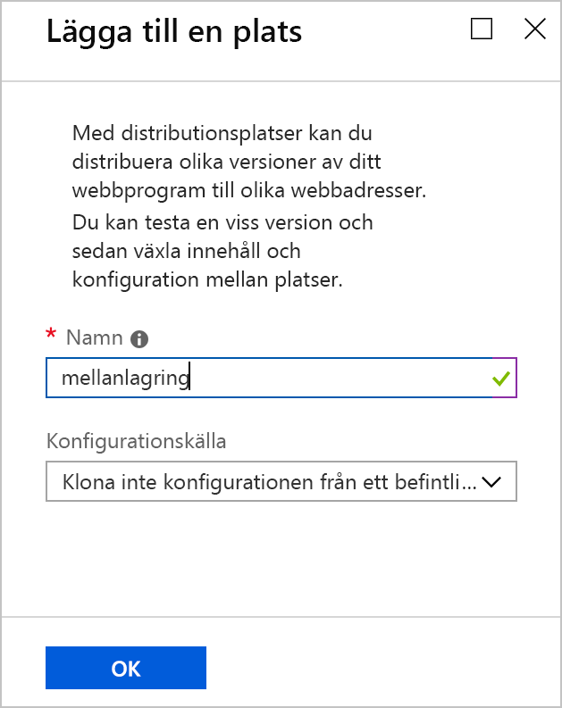
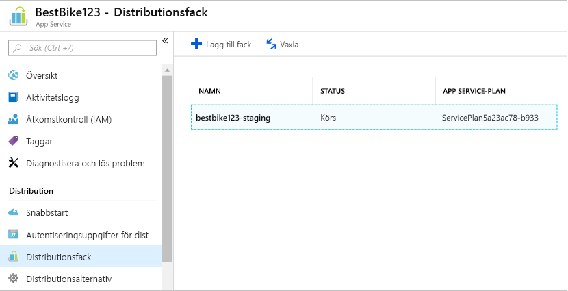
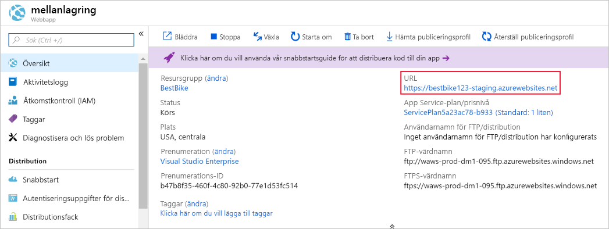
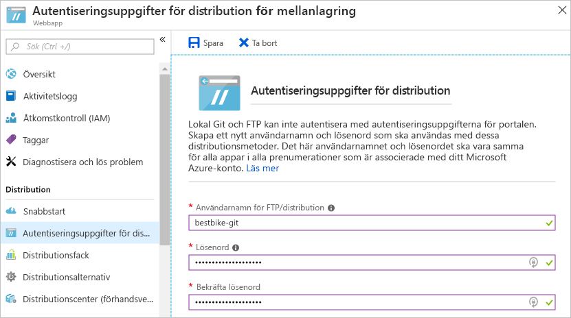
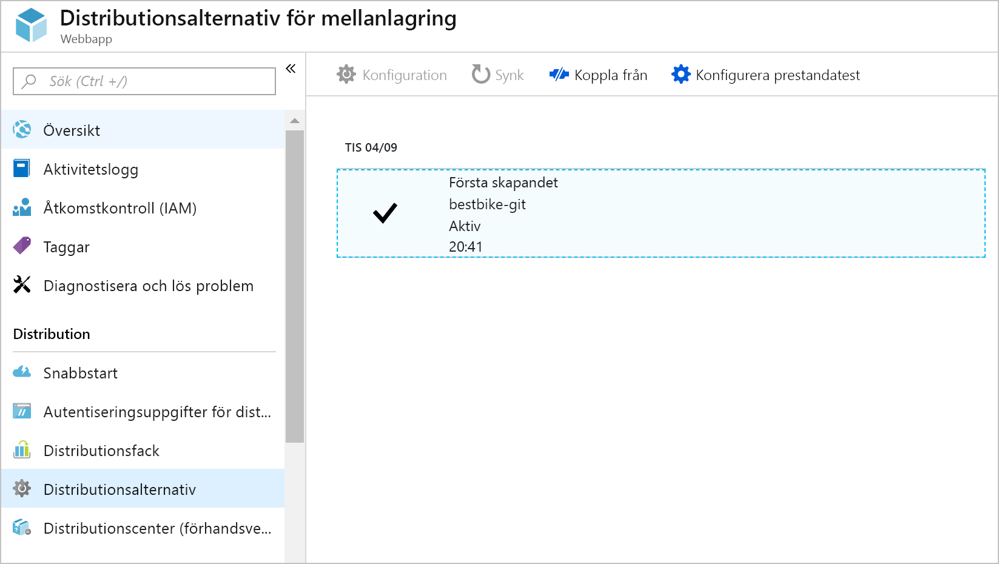
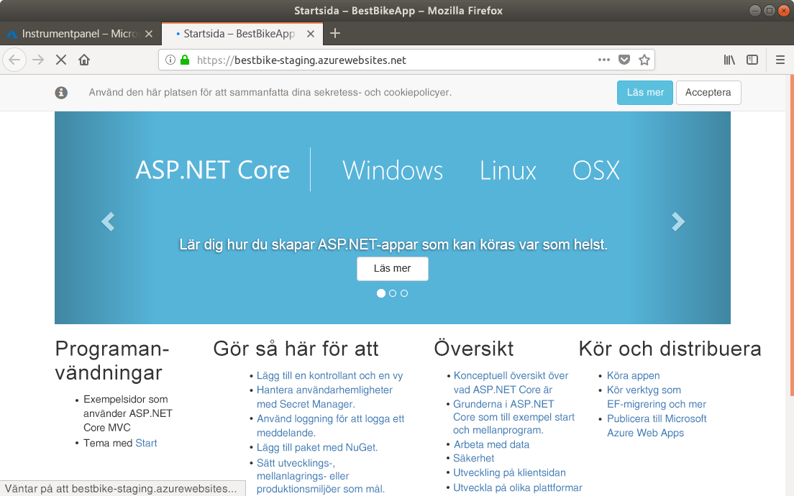
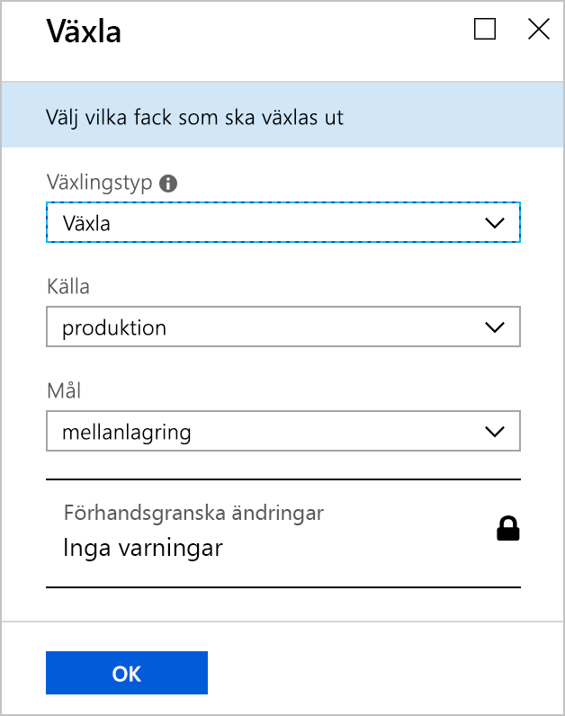
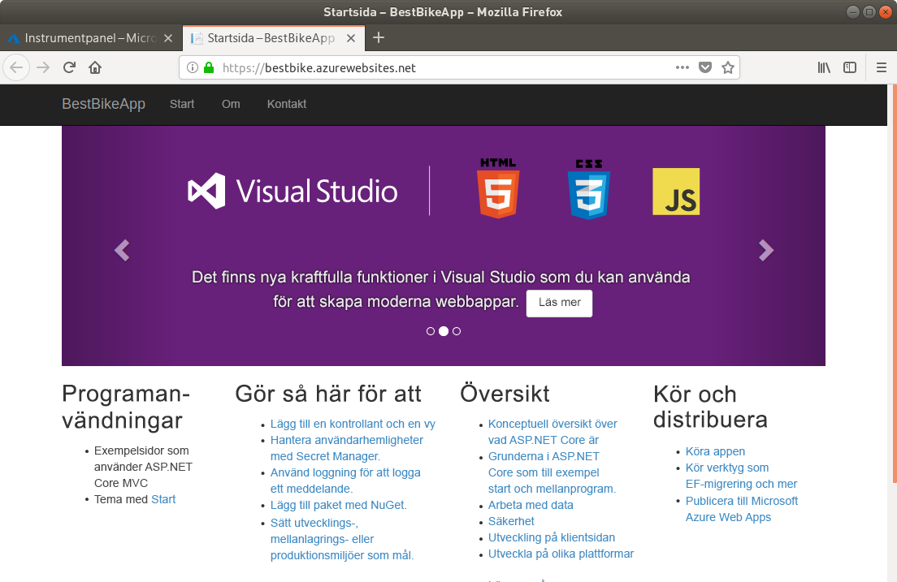
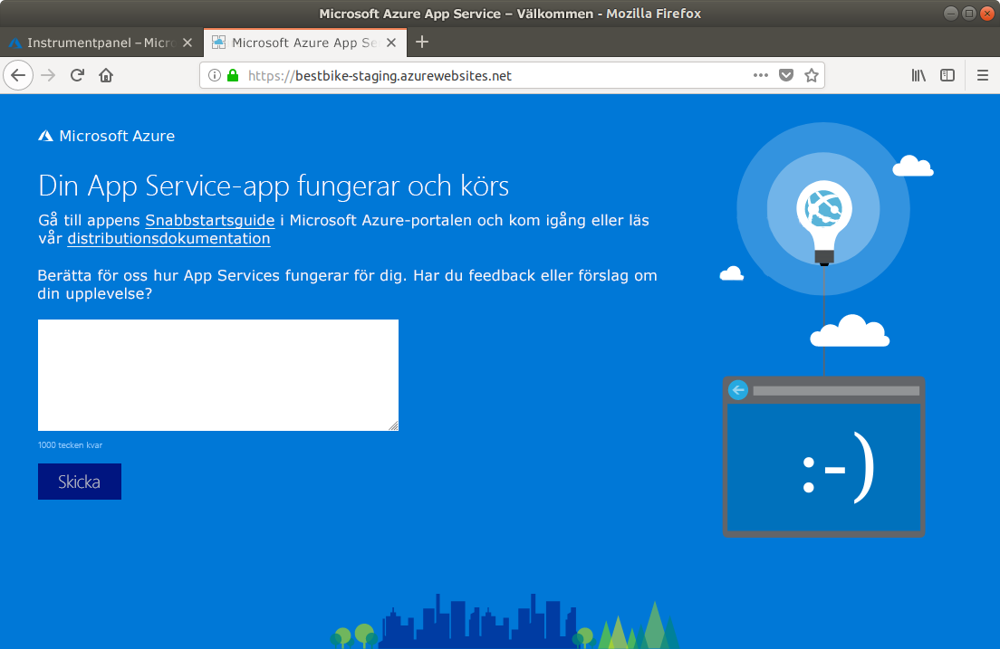

I den här delen överför du ditt ASP.NET Core-program till Azure App Service.

## <a name="create-a-staging-deployment-slot"></a>Skapa ett distributionsfack för mellanlagring

1. Växla tillbaka till [Azure Portal](https://portal.azure.com/learn.docs.microsoft.com?azure-portal=true).

1. Öppna den apptjänsteresurs (webbappen) som du skapade tidigare. Du kan hitta den igen genom att söka efter appen i **Alla resurser** eller den innehållande resursgruppen i **Resursgrupper**.

1. Klicka på menyalternativet **Distributionsfack** i det vänstra navigeringsfönstret.

1. På sidan **Distributionsfack** klickar du på knappen**Lägg till fack** i det övre navigationsfältet på sidan för distributionsfack.

1. Azure-portalen öppnar sidan **Lägg till ett fack** på det sätt som visas nedan.

    1. Namnge ditt distributionsfack. I det här fallet använder du `staging`.

    2. När du väljer **Konfigurationskälla** har du två alternativ.

        * Du kan välja att klona konfigurationselementen från ett befintligt distributionsfack eller en App Service-app.
        * Eller så kan du välja att inte klona några konfigurationselement. Välj alternativet **Klona inte konfigurationen från ett befintligt fack**.

        För det här distributionsfacket, väljer du det andra alternativet **Klona inte konfigurationen från ett befintligt fack**. Du kommer att konfigurera det direkt.

    

1. Klicka på **OK** längst ned på sidan så skapas ditt nya distributionsfack.

1. När distributionsfacket har skapats navigerar Azure-portalen tillbaka till sidan **Distributionsfack** för din webbapp.

    Du kan nu se det nya distributionsfack som du just skapade.

    

1. Välj det nya distributionsfacket.

1. Azure-portalen navigerar till **Översikt**-sidan för det nyligen skapade distributionsfacket.

    

    Observera **URL** för distributionsfacket för mellanlagring. Det är en annan URL än den du såg tidigare, med facknamnet sist.

    Ett distributionsfack behandlas som en fullvärdig App Service-app i Azure. Det är dock en särskild typ som är underordnad den ursprungliga appen och kan växlas med den ursprungliga appen.

    Om du klickar på **webbadressen** visas samma standardsida som Azure skapade för ”appen” till distributionsfacket första gången vi skapade den i Azure-portalen.

Nu när distributionsfacket för mellanlagring har skapats måste du konfigurera **autentiseringsuppgifter för distributionen**.

## <a name="create-deployment-credentials"></a>Skapa autentiseringsuppgifter för distribution

I Azure måste du ställa in autentiseringsuppgifter för distribution innan du kan börja den faktiska distributionsprocessen. Därför kommer du att lära dig hur du skapar dina egna autentiseringsuppgifter för distribution.

1. Klicka på menykommandot **Autentiseringsuppgifter för distribution** i det vänstra navigeringsfönstret.

1. Azure Portal navigerar till sidan **Autentiseringsuppgifter för distribution** enligt nedan.

    Ange ett **användarnamn** och ett **lösenord** och bekräfta sedan lösenordet igen.

    > [!NOTE]
    > Se till att du inte glömmer ditt användarnamn och lösenord! Du kommer att behöva dem senare när vi börjar ladda upp och distribuera koden till Azure.

    

1. Klicka på **Spara** längst upp på sidan **Autentiseringsuppgifter för distribution**.

Nu när autentiseringsuppgifterna för distribution har skapats behöver du konfigurera övriga distributionsalternativ.

## <a name="use-a-local-git-repository-as-your-deployment-option"></a>Använda en lokal Git-lagringsplats som distributionsalternativ

Därefter skapar vi en lokal Git-lagringsplats i Azure så att du kan börja ladda upp din kod.

1. I appen till distributionsfacket för **mellanlagring** klickar du på menyalternativet **Distributionsalternativ** i det vänstra navigeringsfönstret.

1. Azure-portalen navigerar till sidan **Distributionsalternativ**.

1. Klicka på **Välj källa** för att konfigurera de nödvändiga inställningarna.

1. Azure-portalen visar de tillgängliga alternativen som du kan konfigurera och använda. I vårt fall väljer du alternativet **Lokal Git-lagringsplats**.

1. Du kommer tillbaka till sidan **Distributionsalternativ**. Klicka på **OK** längst ned på sidan för att konfigurera distributionskällan.

1. Navigera nu till avsnittet **Översikt** i navigeringen till vänster.

    Den viktiga informationen att notera här är **URI för Git Clone** som är den lokala Git-lagringsplatsens URL, och som du kommer att använda som en **fjärranslutning** för din lokala programkodslagringsplats.

Det är nu dags att börja ladda upp koden till ett distributionsfack för mellanlagring.

## <a name="set-up-git-on-cloud-shell"></a>Ställ in git i Cloud Shell

Git är redan installerat i Azure Cloud Shell, men du vill ställa in ditt användarnamn och din e-post för ditt cloud shell-konto.

1. I Cloud Shell till höger skriver du följande kommandon, där du ersätter platshållarna `[your name]` och `[your email]` med ditt eget namn och e-postadress (utan klammerparanteserna):

    ```bash
    git config --global user.name "[your name]"
    git config --global user.email "[your email]"
    ```

1. För att verifiera att din information har registrerats av Git anger du följande kommando:

    ```bash
    cat ~/.gitconfig
    ```

   Du bör se följande utdata med ditt namn och din e-postadress:

    ```output
    [user]
        name = {your name}
        email = {your email}
    ```

## <a name="initialize-a-local-git-repository-for-your-code"></a>Initiera en lokal Git-lagringsplats för koden

När du ska börja använda Git behöver du initiera en lokal Git-lagringsplats för din .NET Core-programkod.

1. Kontrollera att du är i projektmappen som du skapade tidigare.

    ```bash
    cd ~/BestBikeApp/
    ```

1. Initiera en ny Git-lagringsplats genom att ange följande kommando:

    ```bash
    git init
    ```

    Om kommandot lyckas visas ett meddelande som ser ut så här:

    ```output
    Initialized empty Git repository in /home/{your-user}/BestBikeApp/.git/
    ```

1. Mellanlagra alla programfiler till Git.

   Nästa steg är att informera Git om dina programfiler. Det gör du genom att lägga till alla filer i arbetskatalogen så att de **mellanlagras** av Git. Ange följande kommando:

    ```bash
    git add .
    ```

    När du anger ”.” i kommandot ovan läggs alla filer till för mellanlagring i Git.

1. Nu behöver du checka in ändringarna i Git.

   När du mellanlagrar filerna med Git behöver du checka in filerna i den lokala **Git-incheckningshistoriken**. Det gör du med följande kommando:

    ```bash
   git commit -m "Initial create"
    ```

   Kommandot `commit` kan ta argumentet `-m` med ett meddelande om incheckningen du skapar. När du senare överför koden till Azure kan du se samma meddelande för just den här incheckningen.

## <a name="add-a-remote-for-the-local-git-repository"></a>Lägga till en fjärranslutning till den lokala Git-lagringsplatsen

Hittills har du initierat en ny lokal Git-lagringsplats. Du har dessutom skickat alla dina programfiler till Git. Det som återstår är att lägga till en **fjärranslutning** som ansluter din lokala Git-lagringsplats till den som hanteras i Azure.

För att göra det behöver du:

1. Kopiera den **Git-klon-URL** som du såg ovan.

1. När den har kopierats går du tillbaka till **terminalfönstret** och anger följande Git-kommando med din URL:

    ```bash
    git remote add origin https://BESTBIKE-git@BESTBIKE-staging.scm.azurewebsites.net:443/BESTBIKE.git
    ```

    Git-kommandot ovan kopplar din lokala Git-lagringsplats till den som hanteras i Azure. Nu kan du börja skicka och hämta mellan den lokala och den fjärranslutna Git-lagringsplatsen!

1. Verifiera ovanstående kommando genom att ange följande Git-kommando:

    ```bash
    git remote -v
    ```

    Ovanstående kommando genererar följande utdata:

    ```output
    origin  https://BESTBIKE-git@BESTBIKE-staging.scm.azurewebsites.net:443/BESTBIKE.git (fetch)
    origin  https://BESTBIKE-git@BESTBIKE-staging.scm.azurewebsites.net:443/BESTBIKE.git (push)
    ```

## <a name="push-your-code-to-azure"></a>Skicka koden till Azure

Nu när du har kopplat din lokala Git-lagringsplats till den fjärranslutna Git-lagringsplatsen i Azure kommer du att utveckla och kompilera appen och sedan skicka programkoden till Azure.

1. Skriv följande Git-kommando för att skicka din **huvudgren** till den fjärranslutna Git-lagringsplatsen i Azure:

    ```bash
    git push origin master
    ```

1. Du får ange lösenordet du konfigurerade i avsnittet **Autentiseringsuppgifter för distribution** ovan. Ange lösenordet och tryck på Retur. Git börjar överföra dina incheckade filer till den fjärranslutna Git-lagringsplatsen i Azure som konfigurerats under distributionsfacket för mellanlagring.

## <a name="verify-the-code-is-uploaded-to-azure"></a>Verifiera att koden har överförts till Azure

1. Växla tillbaka till Azure Portal.

1. Klicka på menykommandot **Alla resurser** i det vänstra navigeringsfönstret.

1. Azure-portalen navigerar till listan över alla resurser som skapats på Azure hittills.

1. Klicka på det mellanlagringsfack som skapades ovan. Kom ihåg att ett distributionsfack ses som en app och därför visas som webbappsresurser under **Alla resurser**.

1. När du kommer till sidan distributionsfack för mellanlagring går du till **Distributionsalternativ**.

    Du kommer att se att din första incheckning som du har lokalt på datorn nu har laddats upp till Azure-portalen.

    När du har överfört din kod lokalt till Git-fjärrlagringsplatsen i App Service registrerar Azure den här åtgärden.

    Varje gång du skickar kod till Azure så visas en ny post tillsammans med meddelandet du angav när du checkade in ändringarna lokalt på datorn.

    

1. Vi går till webbadressen för **mellanlagringsfacket**. URL:en nämndes ovan, men om du glömmer den så kan du alltid gå till sidan **Översikt** i distributionsfacket för mellanlagring och hämta URL:en.

1. Ange följande URL i webbläsarens adressfält: [https://BESTBIKE-staging.azurewebsites.net/](https://BESTBIKE-staging.azurewebsites.net/).

    

Du har nu laddat upp dina lokala programfiler till distributionsfacket för mellanlagring i Azure.

## <a name="swapping-the-staging-and-production-deployment-slots"></a>Växla mellan distributionsfacken för mellanlagring och produktion

Nu när programmet är igång och körs i distributionsfacket för mellanlagring som hanteras i Azure är det dags att växla till produktionsfacket. Det gör du så här:

1. Gå till den ursprungliga appsida som skapades tidigare. Du hittar den ursprungliga webbappen från sidan **Alla resurser**.

1. Klicka på menyalternativet **Distributionsfack** i det vänstra navigeringsfönstret.

1. Klicka på knappen **Växla** längst upp på sidan.

1. Azure Portal tar dig till sidan **Växla**.

1. I fältet **Växla** väljer du **Växla**.

1. I fältet **Källa** väljer du **Mellanlagring**.

1. I fältet **Mål** väljer du **Produktion**.

    

1. Klicka på knappen **OK** längst ned på sidan.

1. Azure startar växlingsprocessen. Den här åtgärden tar vanligtvis några sekunder beroende på hur stor webbappen som växlas är.

1. När åtgärden avslutas, gå till webbappens URL. Du hittar den på översiktssidan för apptjänsten i portalen: [https://bestbike.azurewebsites.net/](https://bestbike.azurewebsites.net/).

    

    Växlingsåtgärden är nu klar! Du kan nu se att den kod som du överförde till distributionsfacket för mellanlagring även finns på produktionsfacket.

1. Besök nu URL:en för mellanlagringsfacket: [https://bestbike-staging.azurewebsites.net/](https://bestbike-staging.azurewebsites.net/).

    

    Distributionsfacket för mellanlagring innehåller nu HTML-filernas ursprungliga standardfiler som tidigare hanterades i produktionsfacket.

Grattis! Du har överfört din programkod till Azure och växlat distributionsfack.
