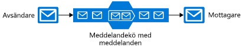
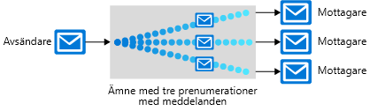

Det finns många kommunikationsplattformar som kan hjälpa till att förbättra tillförlitligheten i ett distribuerat program, däribland flera i Azure. Varje verktyg har ett eget syfte. Vi tar en titt på varje verktyg i Azure för att välja rätt.

Arkitekturen i vårt program för pizzabeställning och beställningsspårning kräver flera komponenter: en webbplats, datalagring, serverdelstjänst osv. Vi kan binda ihop programmets komponenter på många olika sätt, och ett enda program kan dra nytta av flera tekniker. 

Vi behöver bestämma vilka tekniker som ska användas i programmet Contoso Slices. Det första steget är att utvärdera varje plats där det finns kommunikation mellan flera delar. Vissa komponenter _måste_ köras i rätt tid för att programmet ska göra jobbet alls. Vissa kan vara viktiga men inte tidskritiska. Slutligen är övriga komponenter, som mobilappens meddelanden, lite mer valfria.

Här får du lära dig om kommunikationsplattformarna som är tillgängliga i Azure, så att du kan välja rätt för varje krav i programmet.

## Välja mellan meddelanden och händelser

Meddelanden och händelser är båda **datagram**: datapaket som skickas från en komponent till en annan. De är olika på sätt som först verkar subtila men som kan innebära stora skillnader i hur du skapar programmet.

### Meddelanden

I termer av distribuerade program är ett meddelandes definierande egenskaper att programmets övergripande integritet kan förlita sig på meddelanden som tas emot. Du kan föreställa dig att när du skickar ett meddelande till en komponent skickas stafettpinnen från ett arbetsflöde vidare till en annan komponent. Hela arbetsflödet kan vara en viktig affärsprocess, och meddelandet är murbruket som håller ihop komponenterna.

Ett meddelande innehåller vanligtvis själva informationen, inte bara en referens (som ett ID eller en webbadress) till data. Det är mindre känsligt att skicka data som en del av datagrammet jämfört med att skicka en referens. Meddelandearkitekturen garanterar leverans av meddelandet, och eftersom inga ytterligare sökningar krävs hanteras meddelandet på ett tillförlitligt sätt. Men sändningsprogrammet måste veta exakt vilka data som ska ingå för att undvika att skicka för mycket data (för mycket data innebär onödigt arbete för den mottagande komponenten). I det här avseendet är sändaren och mottagaren av ett meddelande ofta kopplade av ett strikt datakontrakt.

I Contoso Slices nya arkitektur är det sannolikt att de skulle använda meddelanden när en pizzabeställning kommer. Webbklienten eller mobilappen skulle skicka ett meddelande till serverdelens aktiva komponenter. I serverdelen utförs steg som dirigering till butiken närmast kunden och debitering av kreditkortet.

### Händelser

En händelse utlöser ett meddelande om att något har skett. Händelser är ”enklare” än meddelanden och används oftast för sändningskommunikation.

Händelser har följande egenskaper:

* Händelsen kan skickas till flera mottagare eller inte till någon alls
* Händelser är ofta avsedda att ”förgrenas” eller har ett stort antal prenumeranter för varje utgivare
* Utgivaren av händelsen har ingen förväntan på åtgärder från den mottagande komponenten

Vår pizzakedja skulle sannolikt använda händelser för meddelanden till användare om statusändringar. Statusändringshändelser skulle kunna skickas till Azure Event Grid, och därefter till Azure Notification Hub för en helt _serverlös_ lösning.

Den här skillnaden mellan händelser och meddelanden är grundläggande eftersom kommunikationsplattformar vanligen är utformade för att hantera det ena eller det andra. Service Bus är utformat för att hantera meddelanden. Om du vill skicka händelser ska du troligen välja Event Grid.

Azure har även Azure Event Hubs, men det används oftast för en särskild typ av ström med högt kommunikationsflöde som används för analys. Om vi till exempel hade nätverksanslutna sensorer på våra pizzaugnar skulle vi kunna skicka Event Hub kopplat till Azure Stream Analytics för att hålla koll på mönster i temperaturändringarna som kan vara ett tecken på brand eller komponentslitage.

## Service Bus-ämnen, -köer och -reläer

Azure Service Bus kan utbyta meddelanden på tre olika sätt: via köer, ämnen och reläer.

### Vad är en kö?

En **kö** är en enkel temporär lagringsplats för meddelanden. En sändande komponent lägger till ett meddelande till kön. En målkomponent hämtar det meddelande som ligger först i kön. Under normala förhållanden tas varje meddelande emot av endast en mottagare.

Köer frikopplar käll- och målkomponenterna för att isolera målkomponenter från hög efterfrågan. 

Under perioder med hög belastning kan meddelanden komma in snabbare än vad målkomponenterna kan hantera. Eftersom källkomponenter inte har någon direkt anslutning till målet påverkas inte källan, och kön växer. Målkomponenter tar bort meddelanden från kön eftersom de kan hantera dem. När efterfrågan sjunker kan målkomponenter komma ikapp så att kön förkortas.

En kö motsvarar hög efterfrågan som här utan att lägga till resurser i systemet. Men för meddelanden som behöver hanteras relativt snabbt kan de dela belastningen om du lägger till ytterligare instanser av din målkomponent. Varje meddelande hanteras av endast en instans. Det är ett effektivt sätt att skala hela programmet, samtidigt som du bara lägger till resurser till komponenterna som verkligen behöver dem.

### Vad är ett ämne?

Ett **ämne** liknar en kö men kan ha flera prenumerationer. Det innebär att flera målkomponenter kan prenumerera på ett ämne, så att varje meddelande levereras till flera mottagare. Prenumerationer kan även filtrera meddelandena i ämnet för att bara ta emot relevanta meddelanden. Prenumerationer erbjuder samma frikopplade kommunikation som köer och svarar på hög efterfrågan på samma sätt. Använd ett ämne om du vill att varje meddelande ska levereras till mer än en målkomponent.

Ämne kan inte användas på Basic-prisnivån.

### Vad är ett relä?

Ett **relä** är ett objekt som erbjuder synkron, dubbelriktad kommunikation mellan program. Det är ingen temporär lagringsplats för meddelanden som köer och ämnen. Istället erbjuder det dubbelriktade, obuffrade anslutningar över nätverksgränser som brandväggar. Använd ett relä om du vill dirigera kommunikation mellan komponenter som om de fanns i samma nätverkssegment men åtskiljs av nätverkssäkerhetsenheter.

> [!NOTE]
> Trots att reläer ingår i Azure Service Bus implementerar de inte löst kopplade arbetsflöden för meddelanden och tas inte upp mer i den här modulen.

## Service Bus-köer och Storage-köer

Det finns två funktioner i Azure som innehåller meddelandeköer: Service Bus- och Azure Storage-konton. En allmän riktlinje är att lagringsköer är lättare att använda med mindre avancerade och flexibla än Service Bus-köer.

Viktiga fördelar med Service Bus-köer är:

* Stöder större meddelandestorlek (256 KB per meddelande jämfört med 64 KB)
* Stöder både leverans minst en gång och leverans högst en gång – välj mellan en mycket liten risk för att ett meddelande försvinner eller en mycket liten risk för att det hanteras två gånger
* Garanterar **FIFO-beställning (först in först ut)**  – meddelanden hanteras i samma ordning som de läggs till (även om FIFO är den normala driften för en kö garanteras det inte för varje meddelande)
* Kan gruppera flera meddelanden till en transaktion – om ett meddelande i transaktionen inte skickas levereras inga meddelanden i transaktionen
* Stöder rollbaserad säkerhet
* Kräver inga målkomponenter för att kontinuerligt avsöka kön

Fördelar med Storage-köer:

* Stöder obegränsad köstorlek (jämfört med högst 80 GB för Service Bus-köer)
* Innehåller en logg över alla meddelanden

## Så här väljer du en kommunikationsteknik

Vi har sett de olika begreppen och implementeringarna som Azure tillhandahåller. Vi ska diskutera hur vår beslutsprocess ska se ut för varje kommunikation.

#### Överväg följande frågor:

1. Är kommunikationen en händelse? I så fall bör du överväga att använda Event Grid eller Event Hub.

1. Ska ett enda meddelande levereras till mer en ett mål? Om det ska det använder du ett Service Bus-ämne. Använd annars en kö.

Om du bestämmer dig för att du behöver en kö:

#### Välj Service Bus-köer om:

* Du behöver en garanti om leverans högst en gång
* Du behöver en FIFO-garanti
* Du behöver gruppera meddelanden i transaktioner
* Du vill ta emot meddelanden utan att avsöka kön
* Du behöver ange rollbaserad åtkomst till köerna
* Du behöver hantera meddelanden som är större än 64 KB men mindre än 256 KB
* Storleken på din kö inte kommer att bli större än 80 GB
* Du vill kunna publicera och använda batchar av meddelanden

#### Välj kölagring om:

* Du behöver en enkel kö utan några specifika ytterligare krav
* Du behöver en spårningslogg för alla meddelanden som skickas via kön
* Du förväntar dig att kön kommer att överskrida 80 GB i storlek
* Du vill följa förloppet för bearbetning av ett meddelande i kön

Även om komponenterna i ett distribuerat program kan kommunicera direkt kan du ofta öka kommunikationens tillförlitlighet genom att använda en mellanliggande kommunikationsplattform som Azure Service Bus eller Azure Event Grid.

Event Grid är utformat för händelser och meddelar endast mottagarna om en händelse. Det innehåller inte rådata som är associerade med den händelsen. Azure Event Hubs är utformat för ett högt flöde av händelser av analystyp. Azure Service Bus- och Storage-köer är för meddelanden, vilka kan användas för att binda ihop grunddelarna i ett programs arbetsflöde.

Om dina krav är enkla, om du endast vill skicka varje meddelande till ett mål eller om du vill skriva kod så snabbt som möjligt, kan en Storage-kö vara det bästa alternativet. I annat fall erbjuder Service Bus-köer många fler alternativ och större flexibilitet.

Om du vill skicka meddelanden till flera prenumeranter kan du använda ett Service Bus-ämne.
