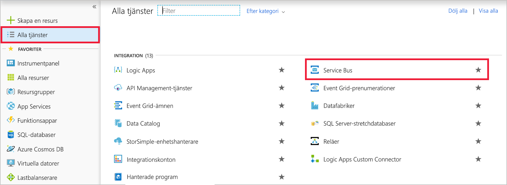
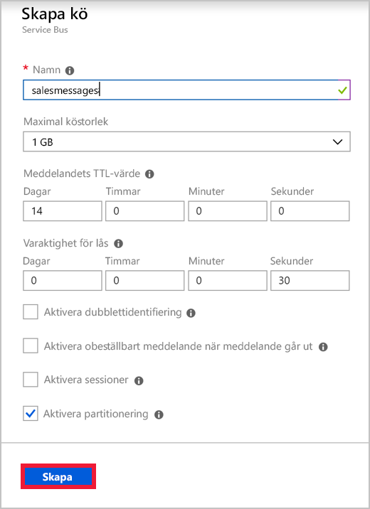
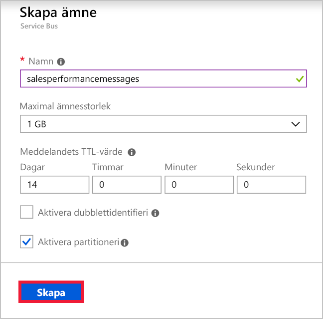

Anta att du har ett program för säljteamet i ditt globala företag. Varje teammedlem har en mobiltelefon där din app ska installeras. En webbtjänst på Azure implementerar affärslogiken för ditt program och lagrar information i Azure SQL Database. Det finns en instans av webbtjänsten för varje geografisk region. Du har identifierat följande syften för att skicka meddelanden mellan mobilappen och webbtjänsten:

- Meddelanden som är relaterade till enskilda försäljningar måste skickas endast till webbtjänstinstansen i användarens region.
- Meddelanden som är relaterade till försäljningsresultat måste skickas till alla instanser av webbtjänsten.

Du har valt att implementera en Service Bus-kö för det första användningsfallet och Service Bus-ämnet för det andra.

I den här övningen skapar du ett Service Bus-namnområde som innehåller både en kö och ett ämne med prenumerationer.

## Skapa ett namnområde för Service Bus

[!include]

[!include]

I Azure Service Bus är ett namnområde en container med ett unikt fullständigt kvalificerat domännamn för köer, ämnen och reläer. Du börjar med att skapa namnområdet.

Varje namnområde har också primära och sekundära krypteringsnycklar för signatur för delad åtkomst. En skickande eller mottagande komponent måste ange dessa nycklar när den ansluter för att få åtkomst till objekten inom namnområdet.

Om du vill skapa en Service Bus-namnrymd med hjälp av Azure Portal gör du så här:

1. Logga in på [Azure Portal](https://portal.azure.com/?azure-portal=true).

1. I det vänstra navigeringsfönstret klickar du på **Alla tjänster**.

1. I bladet **Alla tjänster** bläddrar du ned till avsnittet **Integrering** och klickar sedan på **Service Bus**.

    

1. Längst upp till vänster på bladet **Service Bus** klickar du på **Lägg till**.

1. Ange ett unikt namn för namnrymden i textrutan **Namn**. Exempel: salesteamapp + *dina initialer* + *aktuellt datum*.

1. I listrutan **Prisnivå**, väljer du **Standard**.

1. I listrutan **Prenumeration** väljer du din prenumeration.

1. Under **resursgrupp**väljer **Använd befintlig** och välj <rgn>[Sandbox resursgruppens namn]</rgn>.

1. I listrutan **Plats** väljer du en plats nära dig och klickar sedan på **Skapa**. Azure skapar det nya Service Bus-namnområdet.

    

## Skapa en Service Bus-kö

Nu när du har ett namnområde, kan du skapa en kö för meddelanden om enskild försäljning. Det gör du genom att följa dessa steg:

1. På bladet **Service Bus** klickar du på **Uppdatera**. Det namnområde som du nyss skapade visas.

1. Klicka på det namnområde som du nyss skapade.

1. Längst upp till vänster på namnområdesbladet klickar du på **+ Kö**.

1. Skriv **salesmessages** i textrutan **Namn** på bladet **Skapa kö** och klicka sedan på **Skapa**. Azure skapar kön i ditt namnområde.

    

## Skapa ett Service Bus-ämne och prenumerationer

Du bör också skapa ett ämne som ska användas för meddelanden som är relaterade till försäljningsresultat. Flera instanser av webbtjänsten för affärslogik kommer att prenumerera på det här ämnet från olika länder. Varje meddelande levereras till flera instanser.

Följ de här stegen:

1. På bladet **Service Bus-namnområde** klickar du på **+ Ämne**.

1. Skriv **salesperformancemessages** i textrutan **Namn** på bladet **Skapa ämne** och klicka sedan på **Skapa**. Azure skapar ämnet i ditt namnområde.

    

1. Klicka på **Ämnen** under **Entiteter** på bladet **Service Bus-namnrymd** när ämnet har skapats.

1. Klicka på **salesperformancemessages** i listan med ämnen och klicka sedan på **+ Prenumeration**.

1. Skriv **Americas** i textrutan **Namn** och klicka sedan på **Skapa**.

1. Klicka på **+ Prenumeration**.

1. Skriv **EuropeAndAfrica** i textrutan **Namn** och klicka sedan på **Skapa**.

Du har skapat den infrastruktur som krävs för att använda Service Bus för att öka flexibiliteten för din säljstyrkas distribuerade program. Du har skapat en kö för meddelanden om enskild försäljning och ett ämne för meddelanden om försäljningsresultat. Avsnittet innehåller flera prenumerationer eftersom meddelanden som skickas till detta ämne kan levereras till flera mottagande webbtjänster över hela världen.
